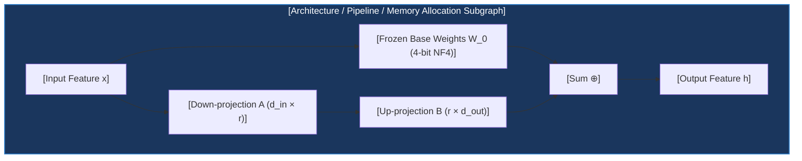

# Architecture Blueprint & Evolution Reference

This document provides architectural, historical, and editorial context on the evolution of the DeepAgents interactive learning platform and details the **Post-Training Track 7-Pillar Chapter Authoring Blueprint**.

---

## 1. External Design & Layout References

- **Pedagogical & Content Gold Standard**:
  Established by the **Post-Training Track** (`rlvr/tutorials/` & `frontend/src/entities/chapter/data/rlvr/`):
  - **Mathematical Rigor**: Theoretical formulation before equations; rigorous continuous relaxations; closed-form LaTeX derivations; parameter boundary analyses ($\tau \to 0$ vs $\tau \to \infty$); dual-objective relaxed surrogate vs discrete accuracy tracking; formal academic citations.
  - **Frontier AI Lab Engineering Practices (OpenAI / DeepMind / Anthropic / Meta / Apple)**:
    - *Key Takeaways*: Vivid intuitive mental models and physical analogies; Mermaid visual memory and pipeline architectures; 4-dimensional telemetry signal tables; production emergency triage runbooks; interview defense STAR playbooks.
- **ReadTheDocs / Technical Documentation UI/UX Reference**:
  - *Key Takeaways*: Hierarchical breadcrumb navigation, clean notebook cell styling, sticky table of contents, and responsive reading canvas.

---

## 2. Platform Architecture Evolution

The platform evolved across three distinct architectural epochs:

| Dimension | 1. Vanilla Prototype (Deprecated) | 2. React 19 / FSD Migration | 3. Post-Training Track Transformation (Current Standard) |
| :--- | :--- | :--- | :--- |
| **Directory** | `interactive-guide/` | `frontend/` | `frontend/` + `rlvr/` + `rl/` + `tutorials/` |
| **Framework** | Vanilla JS, CDN KaTeX | React 19, TypeScript, Vite 6 | React 19, TypeScript, Vite 6, Tailwind CSS v4 |
| **Architecture** | Flat controller (`app.js`) | Feature-Sliced Design (FSD) | Feature-Sliced Design (`shared`, `entities`, `widgets`, `pages`, `app`) |
| **Curriculum Tracks** | Single static track | 3 tracks (DeepAgents, RL, RLVR) | 3 tracks: **DeepAgents**, **RL Track**, **Post-Train (MLE Handbook)** |
| **Code Presentation** | External CodeInspector pane | CodeInspector line-by-line | **Notebook-Style Markdown Code Cells** (CodeInspector retired from ReaderCanvas; `codeLines: []`) |
| **Pedagogy** | Basic lecture notes | Progressive 6-stage | **Post-Training Track 7-Pillar Standard** (Mental Models, Mermaid, Math, Code, Telemetry, Runbooks, Interview Defense) |
| **Simulations** | Ad-hoc HTML5 canvas | Static modal prototypes | **18 Interactive Parameter Simulators** (`labCatalog.ts`, dedicated React components) |
| **Career Assets** | None | Prototype milestone cards | **4-Step Kaggle Practice + STAR Playbook + 1-Click Resume Generator** |
| **Language & Terms** | Mixed Simplified Chinese | Mixed / English | **Fluent Traditional Chinese (繁體中文)** with international English ML terms |

---

## 3. Post-Training Track Chapter Authoring Blueprint

When authoring or updating curriculum chapters for the interactive platform, follow this exact structure:

```markdown
# Chapter [Number]: [Chapter Title] ([English Technical Term])

> *「[Inspiring Epigraph / Quote emphasizing systems thinking and engineering trade-offs over brute force.]」*

---

## 核心心智模型：[Metaphorical Question, e.g. 16GB 單卡如何撬動大模型強化學習？]

[Provide an intuitive mental model using a vivid real-world metaphor (e.g. 大廚備料, 開卷考試裁判, 同儕相互激勵, 透明描圖紙, 抽獎不放回, 水庫調洪). Explain what physical, algorithmic, or systems bottleneck this resolves before presenting mathematical formalism.]



---

## [X].1 [System Design / Hardware & Memory Matrix]

[Break down system trade-offs, hardware specifications, and memory allocations in a clean table.]

| 模型架構 / 配置 | 總參數量 | 靜態權重顯存 | 推薦單卡運行能力 | 推理能力與特性 |
|---|---|---|---|---|
| **[Model A]** | 1.5B | ~1.2 GB | ✅ 黃金推薦選型 | 長思維鏈反思能力優秀 |
| **[Model B]** | 7.0B | ~4.5 GB | ⚠️ 需特定優化 | 競賽級競品實力 |

> [!IMPORTANT]
> **[Critical Hardware / Engineering Alert]**: [Highlight critical compatibility, CUDA version, or compilation prerequisites].

---

## [X].2 嚴密數學推導與演算法步驟 (Mathematical Derivations & Algorithmic Steps)

[State the formal objective function, loss function, or probabilistic derivation with complete KaTeX notation.]

$$\mathcal{L}_{\text{Objective}}(\theta) = -\mathbb{E} \left[ \log \sigma \left( \beta \log \frac{\pi_\theta(y_w|x)}{\pi_{\text{ref}}(y_w|x)} - \beta \log \frac{\pi_\theta(y_l|x)}{\pi_{\text{ref}}(y_l|x)} \right) \right]$$

### 演算法核心步驟 (Algorithmic Steps)
1. **[Step 1]**: [Formal description].
2. **[Step 2]**: [Formal description].
3. **[Step 3]**: [Formal description].

---

## [X].3 漸進式可執行代碼實驗室 (Progressive Executable Notebook Laboratory)

> 嚴格遵循漸進式實驗室規範：嚴禁單一孤立代碼片段。以 5-Stage 漸進式流程展開，且每段代碼必配真實終端輸出。

### 階段 1: 合成數據與批次管道 (Synthetic Batch Pipeline & Tensors)
```python
# 構建合成輸入、因果標籤遮蔽與 Attention Mask
batch = prepare_batch(...)
```
```text
[Execution Output / Batch Diagnostics]
✓ Synthetic batch generated: shape=(4, 16), target_tokens=10
```

### 階段 2: 核心因果張量前向與對數機率抽取 (Causal Log-Prob Gathering Module)
```python
# 自回歸位移切片 [:, :-1] 對齊 [:, 1:]，torch.gather 抽取
logps = get_batch_logps(logits, labels)
```
```text
[Execution Output / Causal Logps Diagnostic]
✓ Causal Log-Prob extraction verified: finite=True
```

### 階段 3: 向量化損失引擎與即時遙測字典 (Vectorized Loss Engine & Telemetry Signals)
```python
loss, metrics = compute_loss(...)
```
```text
[Execution Output / Step 0 Telemetry]
✓ Step 0 Forward Telemetry: loss=0.6548, margin=0.1000, accuracy=0.7500
```

### 階段 4: 病態曲率與致命失效邊界模擬 (Pathological Stress Tests & Failure Simulations)
```python
# 復現工業現場災難（如 Likelihood Displacement 概率塌陷、Verbosity Bias 長度作弊）
simulate_pathological_failure(...)
```
```text
[Execution Output / Pathological Simulation]
🚨 [Stress Test] Likelihood displacement observed: chosen_logp dropped by -22.8%!
```

### 階段 5: 工業級急救處方與對比消融實驗 (Production Remediation & Comparative Ablation)
```python
# 注入 SFT 正則或 SimPO 長度歸一化，橫向對比消融驗證
remediation_metrics = run_ablation(...)
```
```text
[Execution Output / Remediation Comparative Ablation]
🔬 [Ablation Benchmark] SFT anchor restored logp stability; SimPO defeated verbosity fluff!
```

---

## [X].4 訓練健康度的四維遙測監控指標 (Four-Dimensional Telemetry Signals)

| 遙測信號 (Telemetry Signal) | 健康趨勢形態 | 異常警報與失效原因 |
|---|---|---|
| `reward/mean` | 單調平穩爬升 ($0.2 \to 1.4$) | 停滯在 $0.0$（獎勵稀疏）或瞬間垂直飆至滿分（格式作弊刷分） |
| `reward/std` | 保持健康方差 ($0.2 \le \sigma \le 0.7$) | 驟降至 $\approx 0.0$（組內同質化／策略坍塌／全對或全錯） |
| `objective/kl` | 平滑緩步微增 ($0.05 \to 0.8$) | 突破 $> 5.0$（策略嚴重飄移／語言能力破碎發瘋） |
| `completion_length` | 自然緩慢延伸（學會自我檢驗） | 幾十步內頂到上限截斷 512（死循環作弊） |

---

## [X].5 工業級急救錦囊 (Industrial Emergency Runbook)

若在訓練中遇到異常事故：
1. **顯存爆炸 (CUDA OOM)**: 調降 `max_completion_length`，縮小 Group Size $G$，並開啟 FlashAttention-2 與 PagedAdamW 8-bit。
2. **思維鏈長度爆炸 (Length Gaming)**: 注入軟性長度懲罰項 $R_{\text{len}} = -\lambda \cdot \max(0, L - L_{\text{target}})$。
3. **梯度范數劇烈震盪 (Grad Spike)**: 強制截斷 `max_grad_norm = 1.0`，並檢查優化器主權重是否維持 FP32 精度。

---

## 🤔 面試深度思辨與工業界陷阱 (Interview Insight & Production Pitfalls)

> [!IMPORTANT]
> **Frontier Lab 核心考點 (DeepMind / OpenAI / Anthropic / Meta MLE)**:
> - **陷阱與對策 (Failure Mode & Fix)**:
>   1. **[Failure Mode Title]**: [Explanation of real-world production trap].  
>      *工業界對策*: [Battle-tested mitigation and engineering remedy].
> - **高頻面試追問 (Interview Question)**:
>   *Q: [In-depth conceptual/architectural interview question testing fundamental understanding]*  
>   *A: [Rigorous, high-impact model answer covering mathematical rationale, system bottlenecks, and practical trade-offs]*

---

## 前沿文獻與權威參考資料 (References)

- **[Author, A., Author, B. (Year)]**. *[Paper Title]*. [arXiv:XXXX.XXXXX](https://arxiv.org/).
- **[Organization / Lab]**. *[Canonical Repository Title]*. [GitHub](https://github.com/).
```
