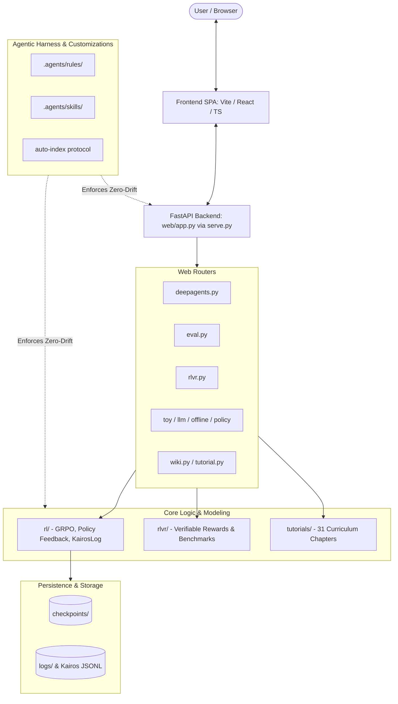

# DeepAgents System Architecture (`docs/ARCHITECTURE.md`)

> Auto-maintained by Agent. Do not edit manually.

This document describes the high-level architecture, module boundaries, subsystem relationships, and data flows of the **DeepAgents** platform.

---

## 1. System Overview

DeepAgents is a comprehensive platform bridging modern AI Agent Harness Engineering and Reinforcement Learning (RL / RLVR / in-context policy optimization).

---

## 2. Subsystem Boundaries & Responsibilities

### 2.1 RL & In-Context Policy Learning (`rl/`)
- **GRPO Implementations**:
  - `grpo_toy.py`: Minimal pedagogical group relative policy optimization.
  - `grpo_llm_char.py`: Character-level generative model with reward-guided GRPO.
  - `grpo_play_core.py`: Game playing and reasoning environment mechanics and reward state for live demo endpoints.
- **In-Context Policy Adaptation**:
  - `policy_feedback.py`: Feedback event aggregation, anomaly detection, in-context prompt updates.
  - `kairos_log.py`: Append-only dual-view trajectory memory logging for persistent agent state.
  - `memory_selector.py`: Dynamic retrieval and compression of historical interaction traces.
- **Offline Pipelines**:
  - `training_pipeline.py`: Production-grade training orchestration, checkpoint management, and offline training logic.

### 2.2 Verifiable Rewards & Research (`rlvr/`)
- **RLVR Curriculum & Code**: Implementation of verifiable environments where ground truth can be checked deterministically (math proofs, code execution, unit tests).
- **Showcases & Notebooks**: Kaggle grandmaster workflows and reproducible research notebooks.

### 2.3 API Service & Web Backend (`web/` & `serve.py`)
- **`serve.py`**: Unified dev server entrypoint launching Uvicorn with auto-reload, path resolution, and fallback HTTP static serving.
- **`web/app.py`**: FastAPI entrypoint configuring CORS, static asset mounting (`web/dist`), and routing.
- **`web/routers/`**:
  - `deepagents.py`: Agent harness configuration and status.
  - `eval.py`: Evaluation benchmarks, trajectory scoring, and rubric feedback.
  - `rlvr.py`: Post-training RLVR curriculums and challenges.
  - `toy.py`, `llm.py`, `offline.py`, `policy.py`: RL model training and inference APIs.
  - `tutorial.py`, `wiki.py`: Interactive curriculum documentation endpoints.

### 2.4 Web Frontend (`frontend/`)
- Modern Single Page Application (SPA) built with Vite, TypeScript, React 19, and Tailwind CSS v4.
- Consumes the FastAPI backend over REST endpoints at `/api/*` and bundles static markdown modules for client-side GitHub Pages deployment.
- **Progressive Notebook Presentation**: Renders curriculum markdown cells with alternating executable code blocks and labeled console output blocks (`[Execution Output / Telemetry Log]`).
- Embeds 18 interactive parameter simulation labs (`labCatalog.ts`) and 4-step Kaggle milestone career defense workbenches with STAR playbooks.

### 2.5 Educational Curriculum (`tutorials/` & `rlvr/tutorials/`)
- **DeepAgents Track (`tutorials/`)**: 31 sequentially structured markdown tutorials covering harness engineering, trajectory evaluation, observability, and self-improving loops.
- **Post-Training MLE Handbook (`rlvr/tutorials/`)**: 18-part curriculum adhering to the Post-Training Track 7-Pillar standard, featuring the progressive 5-stage code laboratory (Synthetic Batch $\to$ Causal Gathering $\to$ Vectorized Engine $\to$ Pathological Stress Tests $\to$ Remediation & Ablation).

### 2.6 Agent Customizations (`.agents/`)
- **Rules (`.agents/rules/`)**: Persistent behavioral contracts loaded in agent sessions (e.g. `auto-index.md` zero-drift mandate).
- **Skills (`.agents/skills/`)**: Workspace-scoped on-demand workflow recipes (`auto-index`, `excalidraw-skill`, `interactive-learning-platform`, `rubric-evaluation`). Obsolete legacy page-mutation skills have been decommissioned.

---

## 3. Data Flow & Inter-Directory Invariants

1. **Import Boundaries**:
   - `web/` imports from `rl/` and `rlvr/` via `sys.path` bootstrapping in `serve.py` and `web/app.py`.
   - `rl/` and `rlvr/` must remain independent of `web/` (core modeling scripts can run purely via CLI or headless jobs without FastAPI).
2. **Persistence Isolation**:
   - Runtime outputs, weights, and logs must be stored in `checkpoints/` or `logs/` and never committed or tracked in distributed `INDEX.md` files.
3. **Autonomous Documentation**:
   - Any architectural modification (new routers, changed schemas, new directories) must update both local `INDEX.md` and this document.
