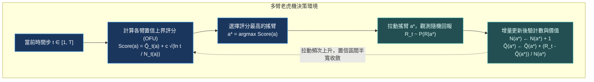

# Chapter 2: 多臂老虎機·探索與利用平衡 (Bandit Exploration & UCB1)

> *「所有智慧系統在未知環境中的根本矛盾，均可收斂為一個問題：你是應該堅持眼前已知回報最高的選擇，還是冒著風險去探索可能隱藏著更大回報的新路徑？」*

---

## 核心心智模型：面對不確定性保持樂觀 (OFU 原則)

在強化學習的最簡形式——多臂老虎機（Multi-Armed Bandit, MAB）中，狀態轉移退化為單步（即無狀態轉移 $\mathcal{S} = \{s_0\}$）。智能體面對 $K$ 個可選動作（搖臂），每個搖臂 $a \in \{1, \dots, K\}$ 遵循一個未知的回報概率分佈 $P(R | a)$，其真實期望回報為 $\mu(a) = \mathbb{E}[R | a]$。



### 為什麼純粹的 $\epsilon$-Greedy 策略次優？
- **$\epsilon$-Greedy**：以 $1-\epsilon$ 的概率選擇當前經驗均值最高的搖臂，以 $\epsilon$ 的固定概率均勻隨機探索任意搖臂。
- **致命缺陷**：它在探索時是「盲目的」——無論某個搖臂已被證實回報極差（例如拉了 1000 次均值僅為 0.01），還是某個新搖臂從未被訪問過，$\epsilon$-Greedy 賦予它們相同的探索概率。更嚴重的是，只要 $\epsilon > 0$ 固定，智能體每一輪都有固定的概率選錯，其**累積遺憾將隨時間步呈線性增長 $\mathcal{O}(T)$**。

---

## 2.1 霍夫丁不等式與 UCB1 數學推導

為了實現「知性探索（Informed Exploration）」，Auer 等人基於**霍夫丁不等式（Hoeffding's Inequality）**構建了 UCB1（Upper Confidence Bound 1）演算法。

### 霍夫丁不等式回顧
設 $X_1, X_2, \dots, X_n$ 為獨立同分佈的隨機變量，且取值嚴格落在有界區間 $[0, 1]$ 內，真實期望為 $\mu$。經驗均值 $\bar{X} = \frac{1}{n} \sum_{i=1}^n X_i$。則對於任意正數 $U > 0$，經驗均值偏離真實期望的概率上界滿足：
$$P\left( \mu > \bar{X} + U \right) \le \exp\left( -2 n U^2 \right)$$

### 構建置信上界
我們希望真實期望 $\mu(a)$ 超出估計置信區間 $\hat{Q}(a) + U(a)$ 的概率極低，設此失效率為 $p = t^{-4}$（隨著總步數 $t$ 增長，置信度迅速趨近於 100%）：
$$\exp\left( -2 N_t(a) U_t(a)^2 \right) = t^{-4}$$
兩邊取自然對數：
$$-2 N_t(a) U_t(a)^2 = -4 \ln t \implies U_t(a) = \sqrt{\frac{2 \ln t}{N_t(a)}}$$

因此，UCB1 的動作選擇準則形式化為：
$$a_t^* = \arg\max_{a=1,\dots,K} \left[ \hat{Q}_t(a) + c \sqrt{\frac{\ln t}{N_t(a)}} \right]$$
其中理論探索強度 $c = \sqrt{2}$。

> [!NOTE]
> **置信上界的雙重調節作用**：
> 1. 第一項 $\hat{Q}_t(a)$ 代表**利用（Exploitation）**：偏好當前歷史表現優異的動作。
> 2. 第二項 $c \sqrt{\frac{\ln t}{N_t(a)}}$ 代表**探索（Exploration）**：若某個搖臂被拉動次數 $N_t(a)$ 很少，分母極小，整個置信半寬暴增，迫使 Agent 優先去驗證未知搖臂。

---

## 2.2 累積遺憾 (Cumulative Regret) 與 Lai-Robbins 理論下界

定義最優搖臂的期望回報為 $\mu^* = \max_{a} \mu(a)$。次優搖臂 $a$ 與最優搖臂的回報差距為：
$$\Delta_a = \mu^* - \mu(a)$$

$T$ 步內的**累積期望遺憾（Cumulative Regret）**定義為：
$$R_T = T \mu^* - \sum_{t=1}^T \mathbb{E}[R_t] = \sum_{a: \Delta_a > 0} \Delta_a \mathbb{E}[N_T(a)]$$

### Lai & Robbins (1985) 定理
在任何無記憶的多臂老虎機環境中，任何一致最優策略的累積遺憾下界為對數級：
$$\lim_{t \to \infty} \inf \frac{R_t}{\ln t} \ge \sum_{a: \Delta_a > 0} \frac{\Delta_a}{\text{KL}(P_a \parallel P^*)}$$

UCB1 算法證明了其次優臂訪問次數期望滿足：
$$\mathbb{E}[N_T(a)] \le \frac{8 \ln T}{\Delta_a^2} + \left( 1 + \frac{\pi^2}{3} \right)$$
因此，UCB1 達到了理論漸近最優的 **$\mathcal{O}(\ln T)$ 對數遺憾界**！

> [!TIP]
> <button class="deep-link-btn" data-target="viz">🔬 啟動多臂老虎機實驗室</button>，可以直觀對比 $\epsilon$-Greedy 的線性發散遺憾曲線與 UCB1 的對數平撫收斂曲線。

---

## 2.3 可執行的 Python/PyTorch UCB1 與 Thompson 採樣基準

```python
import numpy as np
import matplotlib.pyplot as plt

class BernoulliBanditEnvironment:
    """多臂伯努利老虎機環境"""
    def __init__(self, probabilities: list[float]):
        self.probs = np.array(probabilities)
        self.k = len(probabilities)
        self.optimal_arm = np.argmax(self.probs)
        self.max_prob = self.probs[self.optimal_arm]

    def pull(self, arm: int) -> float:
        return 1.0 if np.random.rand() < self.probs[arm] else 0.0

class UCB1Agent:
    """UCB1 知性探索 Agent"""
    def __init__(self, k_arms: int, c: float = np.sqrt(2)):
        self.k = k_arms
        self.c = c
        self.counts = np.zeros(k_arms, dtype=np.int32)
        self.values = np.zeros(k_arms, dtype=np.float64)
        self.total_steps = 0

    def select_arm(self) -> int:
        self.total_steps += 1
        # 冷啟動：每個搖臂至少先嘗試一次
        for arm in range(self.k):
            if self.counts[arm] == 0:
                return arm
        
        # 計算 UCB 置信上界得分
        bonus = self.c * np.sqrt(np.log(self.total_steps) / self.counts)
        ucb_scores = self.values + bonus
        return int(np.argmax(ucb_scores))

    def update(self, arm: int, reward: float):
        self.counts[arm] += 1
        # 增量平均公式: Q_new = Q_old + (1/N) * (R - Q_old)
        self.values[arm] += (reward - self.values[arm]) / self.counts[arm]

def evaluate_bandit():
    arms_probs = [0.10, 0.25, 0.35, 0.65, 0.70] # 5 臂，最優臂為 arm 4 (0.70)
    env = BernoulliBanditEnvironment(arms_probs)
    agent = UCB1Agent(k_arms=len(arms_probs))
    
    T = 2000
    cumulative_regret = []
    regret_sum = 0.0
    
    for t in range(1, T + 1):
        arm = agent.select_arm()
        reward = env.pull(arm)
        agent.update(arm, reward)
        
        # 當步遺憾
        regret = env.max_prob - env.probs[arm]
        regret_sum += regret
        cumulative_regret.append(regret_sum)
        
    print(f"2000 步後總累積遺憾: {regret_sum:.2f} (最優臂選擇佔比: {agent.counts[4]/T * 100:.1f}%)")
    return cumulative_regret

if __name__ == "__main__":
    evaluate_bandit()
```

---

## 2.4 主流探索策略全景對比

| 演算法 | 探索機制 | 累積遺憾界限 | 計算複雜度 | 核心超參數 | 工業界首選場景 |
|---|---|---|---|---|---|
| **$\epsilon$-Greedy** | 均勻隨機拋硬幣 | 線性 $\mathcal{O}(T)$ | $\mathcal{O}(1)$ | $\epsilon$ (通常 0.05~0.1) | 快速原型驗證、超高並發低延遲推薦系統 |
| **UCB1** | 確定性置信區間上界 (OFU) | 對數 $\mathcal{O}(\ln T)$ | $\mathcal{O}(K)$ | 探索系數 $c$ | 臨床試驗動態分配、MCTS 蒙特卡洛樹搜索子節點擴展 |
| **Thompson Sampling** | 貝葉斯共軛後驗採樣 | 對數 $\mathcal{O}(\ln T)$（常數更小） | $\mathcal{O}(K)$ | Beta 分佈先驗 $\alpha, \beta$ | 計算廣告點擊率 (CTR) 實時預估、A/B 測試動態流量切分 |
| **LinUCB** | 結合特徵向量的嶺回歸上下文預測 | 次線性 $\mathcal{O}(\sqrt{d T \ln T})$ | $\mathcal{O}(d^3)$ 矩陣求逆 | 正則項 $\alpha$ | 推薦系統 Contextual Bandit（結合用戶肖像向量） |

---

## 🤔 架構深度思辨與工業界陷阱 (Architectural Insight & Production Pitfalls)

### 問題 1：在新聞推薦或電商廣告中，點擊率分佈是高度「非平穩（Non-Stationary）」的（今天爆紅的新聞明天乏人問津），直接套用標準 UCB1 會產生什麼嚴重災難？
- **解答**：
  1. **方差收縮鎖死陷阱**：標準 UCB1 的探索獎勵項為 $\sqrt{\frac{\ln t}{N_t(a)}}$。當一個舊熱門新聞被點擊了 10,000 次後，$N_t(a)$ 極大，置信區間半寬收縮至近乎為 0。當其內容過期導致真實 CTR 驟降為 0 時，由于歷史累積均值 $\hat{Q}(a)$ 依然很高，算法仍然會持續推薦該失效項目數千次，直到均值被拉低。
  2. **工業界解決方案**：
     - **滑動窗口 UCB（Sliding-Window UCB）**：只保留最近 $\tau$ 個時間步內的數據計算經驗均值與拉動計數。
     - **指數衰減折現 UCB（Discounted UCB）**：引入折扣因子 $\gamma \in (0.95, 0.99)$，對歷史回報與計數進行幾何衰減 $N_t(\gamma, a) = \sum_{s=1}^t \gamma^{t-s} \mathbb{I}(a_s = a)$。

### 問題 2：AlphaGo 與大模型推理樹搜索（MCTS）中採用的 PUCT（Polynomial Upper Confidence Trees）與標準 UCB1 有何本質不同？
- **解答**：
  在標準 UCB1 中，所有動作在未被探索時的先驗概率是平等的（uniform）。但在樹搜索空間巨大的圍棋或思維鏈展開中，盲目均勻探索會導致搜索樹維度災難。
  DeepMind 在 AlphaGo 中提出了 **PUCT 公式**：
  $$a^* = \arg\max_a \left[ Q(s, a) + c_{\text{puct}} \cdot P(s, a) \cdot \frac{\sqrt{\sum_b N(s, b)}}{1 + N(s, a)} \right]$$
  其核心改進在於引入了**策略網絡的先驗概率 $P(s, a)$**：
  - 即使某個節點訪問計數 $N(s, a)$ 為 0，如果大模型策略網絡評估該分支的先驗概率 $P(s, a)$ 極高，它會被優先展開！
  - 隨著訪問次數 $N(s, a) \to \infty$，先驗 $P(s, a)$ 的影響逐漸衰減，主導權回歸為真實蒙特卡洛模擬回傳的價值均值 $Q(s, a)$。這實現了「先驗直覺引導」與「真實價值檢驗」的完美統一。

---

## 參考文獻與經典論文

1. **Auer, P., Cesa-Bianchi, N., & Fischer, P. (2002).** *Finite-time analysis of the multiarmed bandit problem.* Machine Learning, 47(2), 235-256.
2. **Lai, T. L., & Robbins, H. (1985).** *Asymptotically efficient adaptive allocation rules.* Advances in Applied Mathematics, 6(1), 4-22.
3. **Silver, D., et al. (2016).** *Mastering the game of Go with deep neural networks and tree search.* Nature, 529(7587), 484-489.
