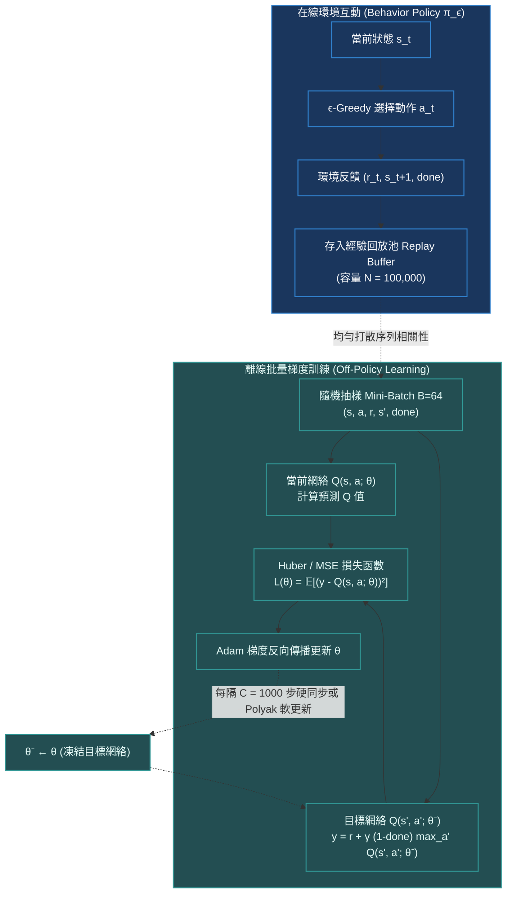

# Chapter 3: 深度 Q 網絡·經驗回放與目標網絡 (DQN & Stability)

> *「神經網絡在非凸空間中本質上是個記憶擬合器，而強化學習的自舉更新（Bootstrapping）卻是一場追逐自己尾巴的動態博弈——DQN 通過經驗回放與目標網絡這兩大穩定錨點，首次馴服了數值發散的致命三要素。」*

---

## 核心心智模型：馴服「致命三要素 (Deadly Triad)」

在 2015 年 DeepMind 於 *Nature* 發表 DQN 之前，學術界普遍認為利用深度神經網絡直接擬合 Q 函數在數學上必然發散。Sutton 與 Barto 在強化學習聖經中將此現象總結為**致命三要素（The Deadly Triad）**：

1. **函數逼近（Function Approximation）**：使用神經網絡替代查表法（Tabular），以泛化高維狀態空間。
2. **自舉更新（Bootstrapping）**：使用後繼狀態的估計值更新當前狀態（如 $r + \gamma \max_{a'} Q(s', a')$），而非等待真實全軌跡回報。
3. **離策略學習（Off-Policy Learning）**：訓練數據的分佈來自歷史策略或回放緩衝區，而非當前最新優化策略。



---

## 3.1 貝爾曼最優方程與目標網絡 (Target Network) 穩定性

貝爾曼最優方程保證了最優動作價值函數 $Q^*(s, a)$ 的不動點存在性：
$$Q^*(s, a) = \mathbb{E}_{s'} \left[ r + \gamma \max_{a' \in \mathcal{A}} Q^*(s', a') \;\middle|\; s, a \right]$$

如果直接使用同一組神經網絡參數 $\theta$ 計算目標：
$$y_t = r_t + \gamma \max_{a'} Q(s_{t+1}, a'; \theta)$$
損失函數的梯度將同時拉扯預測項與目標項：
$$\nabla_\theta \mathcal{L}(\theta) = \mathbb{E} \left[ \left( Q(s_t, a_t; \theta) - y_t \right) \nabla_\theta Q(s_t, a_t; \theta) \right]$$
**致命問題：追逐移動目標（Moving Target Problem）**。每一次更新參數 $\theta$，目標 $y_t$ 本身也在非線性劇烈移動，這相當於訓練監督學習模型時，標籤（Label）每一輪迭代都在隨意跳變，極易引發 Q 值的共振發散。

### 解法：解耦目標網絡參數 $\theta^-$
DQN 引入了獨立的目標網絡 $\theta^-$，其參數在若干步內保持凍結：
$$y_t^{\text{DQN}} = r_t + \gamma (1 - d_t) \max_{a'} Q(s_{t+1}, a'; \theta^-)$$
- **硬同步（Hard Update）**：每隔 $C$ 個訓練步（例如 $C=1000$），執行一次完整參數複製：$\theta^- \leftarrow \theta$。
- **軟更新（Polyak Averaging / Soft Update）**：在每個時間步進行滑動平滑：$\theta^- \leftarrow \tau \theta + (1-\tau) \theta^-$，其中 $\tau \approx 0.005$。

> [!TIP]
> <button class="deep-link-btn" data-target="viz">🔬 啟動 DQN 實驗室</button>，可以拖動目標網絡同步週期 $C$ 與回放池大小，實時觀察 TD 誤差振盪與發散邊界。

---

## 3.2 Double DQN：消除 Q 值的系統性高估 (Overestimation Bias)

在標準 DQN 中，目標構建採用了 $\max_{a'} Q(s', a'; \theta^-)$。
根據簡森不等式（Jensen's Inequality），**最大化算子本質上是個凸函數**。當 Q 網絡的估計值存在隨機噪聲 $\epsilon \sim \mathcal{N}(0, \sigma^2)$ 時：
$$\mathbb{E} \left[ \max_{a'} \left( Q(s', a') + \epsilon_{a'} \right) \right] \ge \max_{a'} Q(s', a')$$
這導致標準 DQN **不可避免地高估未來的期望回報**。隨著自舉迭代，這種高估偏差層層累積，導致策略盲目自信並收斂到極差的局部最優。

### Double DQN 的解耦設計 (van Hasselt, 2015)
Double DQN 將「**動作選取**」與「**價值評估**」兩大步驟徹底解耦：
1. **動作選取**：由主在線網絡 $\theta$ 決定最優動作 $a^* = \arg\max_{a'} Q(s', a'; \theta)$。
2. **價值評估**：由目標網絡 $\theta^-$ 評估該動作的真實價值 $Q(s', a^*; \theta^-)$。

$$y_t^{\text{Double}} = r_t + \gamma (1 - d_t) Q\left( s_{t+1}, \arg\max_{a'} Q(s_{t+1}, a'; \theta) ;\; \theta^- \right)$$

---

## 3.3 可執行的 PyTorch DQN / Double DQN 核心模組

```python
import random
import torch
import torch.nn as nn
import torch.nn.functional as F
from collections import deque

class ReplayBuffer:
    """高效循環緩衝區"""
    def __init__(self, capacity: int):
        self.buffer = deque(maxlen=capacity)

    def push(self, state, action, reward, next_state, done):
        self.buffer.append((state, action, reward, next_state, done))

    def sample(self, batch_size: int, device: torch.device):
        batch = random.sample(self.buffer, batch_size)
        states, actions, rewards, next_states, dones = zip(*batch)
        return (
            torch.tensor(states, dtype=torch.float32, device=device),
            torch.tensor(actions, dtype=torch.int64, device=device).unsqueeze(1),
            torch.tensor(rewards, dtype=torch.float32, device=device).unsqueeze(1),
            torch.tensor(next_states, dtype=torch.float32, device=device),
            torch.tensor(dones, dtype=torch.float32, device=device).unsqueeze(1)
        )

    def __len__(self):
        return len(self.buffer)

class QNetwork(nn.Module):
    """標準 MLP Q 函數擬合器"""
    def __init__(self, state_dim: int, action_dim: int, hidden_dim: int = 128):
        super().__init__()
        self.net = nn.Sequential(
            nn.Linear(state_dim, hidden_dim),
            nn.LayerNorm(hidden_dim),
            nn.ReLU(),
            nn.Linear(hidden_dim, hidden_dim),
            nn.LayerNorm(hidden_dim),
            nn.ReLU(),
            nn.Linear(hidden_dim, action_dim)
        )

    def forward(self, state: torch.Tensor) -> torch.Tensor:
        return self.net(state)

def compute_double_dqn_loss(
    q_net: QNetwork,
    target_net: QNetwork,
    batch: tuple,
    gamma: float = 0.99
) -> torch.Tensor:
    states, actions, rewards, next_states, dones = batch
    
    # 1. 預測當前動作的 Q 值: Q(s, a; θ)
    q_values = q_net(states).gather(1, actions)
    
    # 2. Double DQN 目標計算
    with torch.no_grad():
        # 在線網絡選出最佳動作索引
        best_actions = q_net(next_states).argmax(dim=1, keepdim=True)
        # 目標網絡計算該動作的評估價值
        next_q_values = target_net(next_states).gather(1, best_actions)
        target_q_values = rewards + gamma * (1.0 - dones) * next_q_values

    # 3. 使用 Smooth L1 (Huber Loss) 防範異常值梯度爆炸
    loss = F.smooth_l1_loss(q_values, target_q_values)
    return loss
```

---

## 3.4 DQN 演進家族關鍵技術規格對比

| 變體名稱 | 核心創新機制 | 解決的致命痛點 | 採樣效率與回報提升 |
|---|---|---|---|
| **Nature DQN (2015)** | 經驗回放池 + 凍結目標網絡 | 打散樣本自相關性、消除移動目標震盪 | 首次在 Atari 57 款遊戲達到人類水準 |
| **Double DQN (2015)** | 主網絡選動作、目標網絡給定價 | 徹底消除最大化算子引發的數值過度高估 | 價值估計偏差降低 80%，策略更穩健 |
| **Prioritized Replay (2016)** | 基於 TD-Error 絕對值 $|\delta_i|^\alpha$ 優先級抽樣 | 克服均勻抽樣中「簡單樣本反覆訓練」的低效 | 收斂速度提升 2x，引入重要性採樣權重修正 |
| **Dueling DQN (2016)** | 解耦狀態價值 $V(s)$ 與動作優勢 $A(s, a)$ | 當所有動作影響甚微時，精準學習狀態固有價值 | 在狀態冗餘度高的環境中顯著提升泛化力 |

---

## 🤔 架構深度思辨與工業界陷阱 (Architectural Insight & Production Pitfalls)

### 問題 1：在優先級經驗回放（Prioritized Experience Replay, PER）中，為什麼必須引入重要性採樣權重（Importance Sampling Weights, $w_i$）？若忽視它會引發什麼數學災難？
- **解答**：
  1. **分佈偏移災難**：標準隨機梯度下降假設訓練樣本服從環境的真實平穩分佈 $P(s)$。當採用非均勻抽樣（$P(i) = \frac{p_i^\alpha}{\sum_k p_k^\alpha}$）後，高 TD 誤差的困難樣本被頻繁抽中，改變了損失函數的期望分佈：
     $$\mathbb{E}_{i \sim P}[\nabla_\theta L_i] \ne \mathbb{E}_{i \sim U}[\nabla_\theta L_i]$$
     這將破壞隨機梯度下降的無偏估計性質，導致模型嚴重過擬合特定的異常極端邊緣案例（Outliers）。
  2. **重要性採樣權重修復**：引入權重 $w_i = \left( \frac{1}{N} \cdot \frac{1}{P(i)} \right)^\beta$，在計算梯度時對每個樣本的損失加權 $w_i \cdot \mathcal{L}_i$。在訓練初期設 $\beta=0.4$，隨訓練逐漸退火至 $\beta=1.0$，完全恢復無偏估計。

### 問題 2：在大語言模型（LLM）的 RL 對齊中，為什麼幾乎從不使用 Q-learning，而是清一色採用 Policy Gradient（PPO / GRPO）？
- **解答**：
  1. **超巨大的動作空間**：Q-learning 的自舉核心在於計算 $\max_{a'} Q(s', a')$。在傳統遊戲中，動作空間 $|\mathcal{A}| \le 20$；但在 LLM 中，每一個 Token 的生成均為一次動作選擇，詞表大小通常為 $|\mathcal{V}| = 32,000 \sim 152,000$（甚至 20 萬）。在每一步對數十萬個詞進行前向推理求 $\max$，計算複雜度與顯存無法承受。
  2. **連續生成序列的維度詛咒**：一個長度為 $L$ 的思維鏈（如 2048 Tokens），其全空間動作組合高達 $|\mathcal{V}|^L$。值函數逼近器在如此巨大的離散空間中，根本無法覆蓋未見狀態的 Q 估計，極易遭遇嚴重的分佈外（OOD）外推崩潰。因此，基於策略梯度的 Policy Optimization（直接在概率分佈空間調整對數似然）成為大模型後訓練的唯一可行路徑。

---

## 參考文獻與經典論文

1. **Mnih, V., et al. (2015).** *Human-level control through deep reinforcement learning.* Nature, 518(7540), 529-533.
2. **van Hasselt, H., Guez, A., & Silver, D. (2016).** *Deep reinforcement learning with double Q-learning.* In Proceedings of the AAAI Conference on Artificial Intelligence (Vol. 30, No. 1).
3. **Schaul, T., et al. (2015).** *Prioritized experience replay.* arXiv preprint arXiv:1511.05952.
