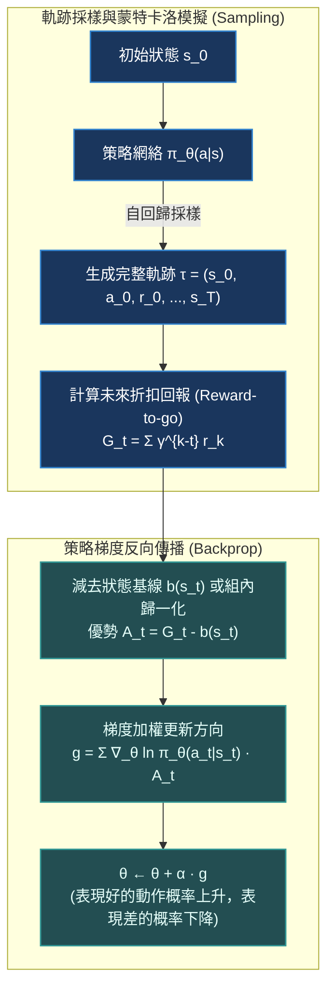

# Chapter 4: 策略梯度·REINFORCE 與方差縮減 (Policy Gradient Theorem)

> *「不同於 Q-Learning 試圖先計算出每個動作的精確數值定價，策略梯度（Policy Gradient）直截了當地向概率分佈開火——它直接沿著能最大化期望累積回報的方向調整神經網絡參數，是現代大模型對齊（RLHF/GRPO）的真正數學始祖。」*

---

## 核心心智模型：似然率技巧與信用加權

在值函數方法（DQN）中，策略是間接通過 $\arg\max_a Q(s, a)$ 產生的。但對於連續動作控制、隨機性博弈、或擁有上萬詞表的語言模型，直接將策略參數化為神經網絡 $\pi_\theta(a | s) = P(A_t = a | S_t = s; \theta)$ 具備不可替代的優勢。

目標函數定義為在策略 $\pi_\theta$ 生成的軌跡 $\tau = (s_0, a_0, r_0, s_1, a_1, \dots, s_T)$ 上的**期望累積回報**：
$$J(\theta) = \mathbb{E}_{\tau \sim \pi_\theta} [R(\tau)] = \int P(\tau; \theta) R(\tau) d\tau$$



### 對數導數技巧 (Log-Derivative Trick)
我們想要對期望求導 $\nabla_\theta J(\theta)$。但注意：**參數 $\theta$ 隱藏在採樣分佈 $P(\tau; \theta)$ 本身之中**！
利用微積分基礎技巧 $\nabla f(x) = f(x) \nabla \ln f(x)$：
$$\nabla_\theta P(\tau; \theta) = P(\tau; \theta) \frac{\nabla_\theta P(\tau; \theta)}{P(\tau; \theta)} = P(\tau; \theta) \nabla_\theta \ln P(\tau; \theta)$$

代入目標函數梯度：
$$\nabla_\theta J(\theta) = \int \nabla_\theta P(\tau; \theta) R(\tau) d\tau = \int P(\tau; \theta) \nabla_\theta \ln P(\tau; \theta) R(\tau) d\tau = \mathbb{E}_{\tau \sim \pi_\theta} \left[ \nabla_\theta \ln P(\tau; \theta) R(\tau) \right]$$
這個優雅的變換允許我們**將不可直接求導的分佈期望，轉化為可以通過蒙特卡洛採樣平均來估計的經驗均值**！

---

## 4.1 策略梯度定理 (Policy Gradient Theorem) 的嚴密推導

一條完整軌跡的聯合概率展開為：
$$P(\tau; \theta) = \rho_0(s_0) \prod_{t=0}^{T-1} \pi_\theta(a_t | s_t) \mathcal{P}(s_{t+1} | s_t, a_t)$$
兩邊取自然對數：
$$\ln P(\tau; \theta) = \ln \rho_0(s_0) + \sum_{t=0}^{T-1} \ln \pi_\theta(a_t | s_t) + \sum_{t=0}^{T-1} \ln \mathcal{P}(s_{t+1} | s_t, a_t)$$

當對參數 $\theta$ 求偏導時，**環境初始分佈 $\rho_0$ 與未知的物理狀態轉移矩陣 $\mathcal{P}$ 完全不依賴於 $\theta$**，因此梯度為 0：
$$\nabla_\theta \ln P(\tau; \theta) = \sum_{t=0}^{T-1} \nabla_\theta \ln \pi_\theta(a_t | s_t)$$

### 因果性原理 (Causality) 與 Reward-to-Go
在時間步 $t$ 採取的動作 $a_t$，在物理上**絕不可能影響過去的回報**（$r_0, \dots, r_{t-1}$）。因此，我們可以將整條軌跡的總回報 $R(\tau)$ 嚴格縮減為未來的折扣回報 $G_t$：
$$\nabla_\theta J(\theta) = \mathbb{E}_{\tau \sim \pi_\theta} \left[ \sum_{t=0}^T \nabla_\theta \ln \pi_\theta(a_t | s_t) G_t \right], \quad \text{其中 } G_t = \sum_{k=t}^T \gamma^{k-t} r_k$$

---

## 4.2 Baseline 零偏差減方差數學證明

原始 REINFORCE 演算法最致命的缺點是**蒙特卡洛方差極其巨大**。若所有軌跡的回報均為正（如 CartPole 的 $r_t \ge 0$），則所有被採樣到的動作概率都會被無差別推高，只是增加幅度不同，這導致探索效率極低。

### 引入狀態基線 $b(s_t)$
若我們在回報項中減去一個僅依賴於狀態的基準函數 $b(s_t)$：
$$\nabla_\theta J(\theta) = \mathbb{E} \left[ \sum_{t=0}^T \nabla_\theta \ln \pi_\theta(a_t | s_t) (G_t - b(s_t)) \right]$$

### 零偏差證明（Why Zero Bias?）
我們證明減去基線項的期望嚴格為 0：
$$\mathbb{E}_{a_t \sim \pi_\theta} \left[ \nabla_\theta \ln \pi_\theta(a_t | s_t) b(s_t) \right] = \sum_{a \in \mathcal{A}} \pi_\theta(a | s_t) \frac{\nabla_\theta \pi_\theta(a | s_t)}{\pi_\theta(a | s_t)} b(s_t) = b(s_t) \sum_{a \in \mathcal{A}} \nabla_\theta \pi_\theta(a | s_t)$$
因為全概率和恆為 1（$\sum_a \pi_\theta(a | s_t) = 1$），對參數求導為零常數：
$$b(s_t) \nabla_\theta \left( \sum_{a \in \mathcal{A}} \pi_\theta(a | s_t) \right) = b(s_t) \nabla_\theta (1) = 0$$

> [!NOTE]
> **物理直覺**：減去基線 $b(s_t)$ 絕不改變梯度的理論數學期望（**無偏性**），但極大地縮小了被加權數值的離散跨度，從而**幾何級數般降低了梯度估計的方差**！通常最優基線選為狀態價值估計 $b(s_t) = V_\phi(s_t)$。

> [!TIP]
> <button class="deep-link-btn" data-target="viz">🔬 啟動策略梯度實驗室</button>，可以切換是否有 Baseline，對比相同學習率下權重收斂軌跡的抖動程度。

---

## 4.3 可執行的 PyTorch REINFORCE 帶 Baseline 演算法模組

```python
import torch
import torch.nn as nn
import torch.optim as optim
import torch.distributions as distributions
import numpy as np

class PolicyNetwork(nn.Module):
    """離散動作空間的 Softmax 策略網絡"""
    def __init__(self, obs_dim: int, act_dim: int, hidden_dim: int = 128):
        super().__init__()
        self.net = nn.Sequential(
            nn.Linear(obs_dim, hidden_dim),
            nn.Tanh(),
            nn.Linear(hidden_dim, act_dim)
        )

    def forward(self, x: torch.Tensor) -> distributions.Categorical:
        logits = self.net(x)
        return distributions.Categorical(logits=logits)

def train_reinforce_step(
    policy: PolicyNetwork,
    optimizer: optim.Optimizer,
    states: list[np.ndarray],
    actions: list[int],
    rewards: list[float],
    gamma: float = 0.99
) -> float:
    # 1. 計算折扣累積回報 G_t (從後向前逆序計算)
    discounted_returns = []
    G = 0.0
    for r in reversed(rewards):
        G = r + gamma * G
        discounted_returns.insert(0, G)
        
    returns_tensor = torch.tensor(discounted_returns, dtype=torch.float32)
    
    # 2. 批次標準化 (Batch Normalization as a simple baseline)
    returns_tensor = (returns_tensor - returns_tensor.mean()) / (returns_tensor.std() + 1e-8)
    
    states_tensor = torch.tensor(np.array(states), dtype=torch.float32)
    actions_tensor = torch.tensor(actions, dtype=torch.int64)
    
    # 3. 計算對數概率 log π_θ(a_t | s_t)
    dist = policy(states_tensor)
    log_probs = dist.log_prob(actions_tensor)
    
    # 4. 構建策略梯度損失函數 (PyTorch 默認做梯度下降，因此加負號)
    policy_loss = -(log_probs * returns_tensor).sum()
    
    optimizer.zero_grad()
    policy_loss.backward()
    # 梯度截斷防止極端回報導致梯度爆炸
    torch.nn.utils.clip_grad_norm_(policy.parameters(), max_norm=1.0)
    optimizer.step()
    
    return policy_loss.item()
```

---

## 4.4 REINFORCE 與其他範式核心特性對比

| 特性維度 | Q-Learning / DQN | REINFORCE (原始策略梯度) | Actor-Critic (A2C/PPO) |
|---|---|---|---|
| **策略形式** | 確定性 $\epsilon$-Greedy 隱式策略 | 顯式參數化隨機策略 $\pi_\theta(a|s)$ | 顯式參數化隨機/確定性策略 |
| **動作空間支持** | 僅支持離散低維動作 | 支持離散與高維連續空間 | 支持任意維度離散/連續空間 |
| **方差與偏差** | 高偏差（自舉截斷誤差），低方差 | **零偏差（無偏估計），極高方差** | 偏差-方差最優平衡（GAE 權衡） |
| **更新時機** | 單步即時更新（Online / TD） | **必須等待整條軌跡結束（Episodic MC）** | 每個時間步或固定小批次（N-step） |
| **收斂保證** | 在非線性函數逼近下可能發散 | 局部極小值必定漸近收斂 | 局域最優收斂速度顯著快於 MC |

---

## 🤔 架構深度思辨與工業界陷阱 (Architectural Insight & Production Pitfalls)

### 問題 1：在數學形式上，監督微調（SFT, 交叉熵）與策略梯度（REINFORCE）只有一個符號的差別，這個「符號」在物理意義上如何顛覆了模型的學習行為？
- **解答**：
  回顧兩者的損失函數梯度公式：
  $$\nabla_\theta \mathcal{L}_{\text{SFT}} = - \sum_{t=1}^T \nabla_\theta \ln \pi_\theta(y_t^* \mid x, y_{<t}^*)$$
  $$\nabla_\theta \mathcal{L}_{\text{RL}} = - \sum_{t=1}^T \nabla_\theta \ln \pi_\theta(a_t \mid s_t) \cdot \mathbf{A_t}$$
  1. **優勢權重標量 $A_t$**：SFT 的權重恆等於 1，強迫模型無差別背誦人類專家的標註答案 $y^*$；而 RL 引入了有正有負的純量優勢 $A_t = G_t - b$。如果模型生成了一個糟糕的死循環，優勢為負數（$A_t < 0$），梯度將**主動壓低該序列的生成概率**！
  2. **分佈支持空間（Distribution Support）**：SFT 永遠在離線靜態分佈 $P_{\text{human}}$ 上訓練；RL 則是在**模型當前策略自身採樣生成的分佈 $P_{\pi_\theta}$ 上自發探索**。這使得模型能夠發現超越人類標註上限的超長思維鏈與反思模式（Extended Reasoning）。

### 問題 2：在長文本或多步 Agent 任務中，若一條軌跡長達 $T=4096$ 步，原始 REINFORCE 會遭遇什麼災難？為什麼必須使用廣義優勢估計（GAE）？
- **解答**：
  1. **方差隨時間步呈指數爆炸**：蒙特卡洛回報 $G_t = \sum_{k=t}^T \gamma^{k-t} r_k$ 是 $4000$ 多個隨機變量的線性組合。其方差 $\text{Var}(G_t)$ 將隨步長急劇膨脹。在有限的 Batch 採樣下，梯度估計值在正負數萬之間劇烈震盪，導致網絡權重完全無法穩定收斂。
  2. **延遲回報的責任無法歸因**：在 4000 步的對話中，可能只有第 12 步做出了關鍵工具調用，其餘 3900 步均在輸出普通解釋。REINFORCE 用同一個標量 $G_0$ 對所有 4000 個 Token 施加相同強度的梯度拉扯，造成了嚴重的「無辜 Token 被懲罰/獎勵」現象。
  3. **破局**：必須將蒙特卡洛全軌跡替換為帶有價值自舉的時序差分（TD），即引入 Critic 網絡構成 **Actor-Critic** 架構。

---

## 參考文獻與經典論文

1. **Williams, R. J. (1992).** *Simple statistical gradient-following algorithms for connectionist reinforcement learning.* Machine Learning, 8(3), 229-256.
2. **Sutton, R. S., et al. (1999).** *Policy gradient methods for reinforcement learning with function approximation.* Advances in Neural Information Processing Systems (NeurIPS 12).
3. **Schulman, J., et al. (2015).** *High-dimensional continuous control using generalized advantage estimation.* arXiv preprint arXiv:1506.02438.
