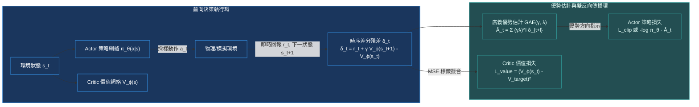

# Chapter 5: Actor-Critic 架構與廣義優勢估計 (Actor-Critic & GAE)

> *「REINFORCE 的蒙特卡洛全軌跡採樣帶來了無法承受的高方差，而 Q-Learning 的單步自舉又飽受函數逼近偏差的折磨——Actor-Critic 架構將策略決策與價值評估精妙解耦，並由 GAE($\gamma, \lambda$) 構造出一條連續可調的偏差-方差帕累托最優前沿。」*

---

## 核心心智模型：策略與價值的雙網絡交響

在強化學習中，**Actor（演員）**與 **Critic（評論家）**形成了一對動態互補的協同關係：
- **Actor 策略網絡 $\pi_\theta(a|s)$**：負責與環境互動並生成動作。它的學習目標是朝著「評估認為更好」的方向調整參數。
- **Critic 價值網絡 $V_\phi(s)$**：負責充當冷靜的裁判，預測狀態的長期折現期望回報。它為 Actor 提供低方差的即時反饋信號。



---

## 5.1 時序差分殘差 (TD Error) 作為優勢估計的無偏性

定義狀態價值函數 $V^\pi(s)$ 與動作價值函數 $Q^\pi(s, a)$。**優勢函數（Advantage Function）**衡量了在狀態 $s$ 下採取特定動作 $a$ 相比於隨機盲選策略的相對超額收益：
$$A^\pi(s, a) = Q^\pi(s, a) - V^\pi(s)$$

考慮單步時序差分殘差（1-step TD Error）：
$$\delta_t^V = r_t + \gamma V(s_{t+1}) - V(s_t)$$

當 Critic 的價值函數完全準確（$V = V^\pi$）時，對後繼狀態 $s_{t+1}$ 求條件期望：
$$\mathbb{E}_{s_{t+1} \sim \mathcal{P}} \left[ \delta_t^V \;\middle|\; s_t, a_t \right] = \mathbb{E} \left[ r_t + \gamma V^\pi(s_{t+1}) \;\middle|\; s_t, a_t \right] - V^\pi(s_t) = Q^\pi(s_t, a_t) - V^\pi(s_t) = A^\pi(s_t, a_t)$$
這意味著：**單步 TD 誤差 $\delta_t^V$ 是真實優勢函數 $A(s_t, a_t)$ 的嚴格無偏估計量**！

---

## 5.2 廣義優勢估計 GAE($\gamma, \lambda$) 的數學證明

儘管單步 TD 誤差 $\delta_t$ 方差極低，但如果 Critic 網絡在初期存在估計偏差（$V_\phi \ne V^\pi$），該偏差會直接污染 Actor 的更新方向。
為了在 **Critic 單步偏差（Bias）** 與 **MC 全軌跡方差（Variance）** 之間取得最優平衡，Schulman 等人在 2015 年提出了 GAE($\gamma, \lambda$)。

定義 $k$-步優勢估計量：
$$\hat{A}_t^{(1)} = \delta_t^V = r_t + \gamma V(s_{t+1}) - V(s_t)$$
$$\hat{A}_t^{(2)} = \delta_t^V + \gamma \delta_{t+1}^V = r_t + \gamma r_{t+1} + \gamma^2 V(s_{t+2}) - V(s_t)$$
$$\hat{A}_t^{(k)} = \sum_{l=0}^{k-1} \gamma^l \delta_{t+l}^V = -V(s_t) + r_t + \gamma r_{t+1} + \dots + \gamma^{k-1} r_{t+k-1} + \gamma^k V(s_{t+k})$$

GAE($\gamma, \lambda$) 定義為各階 $k$-步優勢的**指數加權滑動平均（EWMA）**：
$$\hat{A}_t^{\text{GAE}(\gamma, \lambda)} = (1 - \lambda) \sum_{k=1}^\infty \lambda^{k-1} \hat{A}_t^{(k)}$$

展開代數整理，得到極其簡潔的級數表達式：
$$\hat{A}_t^{\text{GAE}(\gamma, \lambda)} = \sum_{l=0}^\infty (\gamma \lambda)^l \delta_{t+l}^V = \delta_t^V + \gamma \lambda \hat{A}_{t+1}^{\text{GAE}(\gamma, \lambda)}$$

### 兩大極限邊界分析
1. **當 $\lambda = 0$ 時**：
   $$\hat{A}_t^{\text{GAE}(\gamma, 0)} = \delta_t^V = r_t + \gamma V(s_{t+1}) - V(s_t)$$
   退化為純粹的單步自舉 TD 估計：**最低方差，但受限於 Critic 網絡的最高偏差**。
2. **當 $\lambda = 1$ 時**：
   $$\hat{A}_t^{\text{GAE}(\gamma, 1)} = \sum_{l=0}^\infty \gamma^l \delta_{t+l}^V = \sum_{l=0}^\infty \gamma^l r_{t+l} - V(s_t) = G_t - V(s_t)$$
   退化為蒙特卡洛經驗回報減去基線：**完全無偏差，但承受全軌跡最高方差**。

> [!NOTE]
> 在標準工業實踐（如 OpenAI Baselines、CleanRL 與 Ray RLlib）中，超參數黃金組合通常設定為 $\gamma = 0.99, \lambda = 0.95$。此時 $(\gamma \lambda) \approx 0.94$，在回溯幾十步後權重自然衰減，實現了近乎最優的採樣信噪比。

> [!TIP]
> <button class="deep-link-btn" data-target="viz">🔬 啟動 Actor-Critic 實驗室</button>，可以實時滑動調節 $\lambda \in [0, 1]$，觀察方差震盪與收斂穩定性的動態對比。

---

## 5.3 高效向量化 GAE 遞推計算實現 (PyTorch)

```python
import torch

def compute_gae(
    rewards: torch.Tensor,
    values: torch.Tensor,
    dones: torch.Tensor,
    next_value: torch.Tensor,
    gamma: float = 0.99,
    lam: float = 0.95
) -> tuple[torch.Tensor, torch.Tensor]:
    """
    向量化遞推計算 GAE 優勢與 Returns
    Args:
        rewards: [T, B] 軌跡回報
        values: [T, B] Critic 估計值 V(s_t)
        dones: [T, B] 終止標誌
        next_value: [B] 軌跡外最後一步估計值 V(s_T)
        gamma: 折扣因子
        lam: GAE 平滑衰減因子
    Returns:
        advantages: [T, B] 廣義優勢估計
        returns: [T, B] 價值網絡的擬合標籤目標
    """
    T, B = rewards.shape
    advantages = torch.zeros_like(rewards)
    last_gae_lam = torch.zeros(B, device=rewards.device)
    
    # 從後向前逆序遞推 (Backwards recursion)
    for t in reversed(range(T)):
        if t == T - 1:
            next_non_terminal = 1.0 - dones[t]
            next_val = next_value
        else:
            next_non_terminal = 1.0 - dones[t]
            next_val = values[t + 1]
            
        # 1. 單步 TD 殘差: δ_t = r_t + γ V(s_t+1) (1-done) - V(s_t)
        delta = rewards[t] + gamma * next_val * next_non_terminal - values[t]
        
        # 2. GAE 遞推公式: A_t = δ_t + γ λ (1-done) A_{t+1}
        advantages[t] = last_gae_lam = delta + gamma * lam * next_non_terminal * last_gae_lam
        
    # 計算真實回報目標: Returns = Advantages + Values
    returns = advantages + values
    return advantages, returns
```

---

## 5.4 各階優勢估計方法綜合評估矩陣

| 方法名稱 | 形式化定義 | 偏差程度 (Bias) | 方差程度 (Variance) | 記憶體與計算開銷 | 適用場景 |
|---|---|---|---|---|---|
| **MC Advantage** | $G_t - V(s_t)$ | 0（嚴格無偏） | 極高（軌跡隨機性疊加） | 需存儲全軌跡直至 episode 結束 | 棋類等回合制短步長博弈 |
| **1-Step TD** | $r_t + \gamma V(s') - V(s)$ | 高（完全受制於 $V_\phi$ 質量） | 極低（僅依賴單步隨機噪聲） | 僅需單步轉移，支持在線流式更新 | 純在線連續控制系統 |
| **N-Step TD** | $\sum_{i=0}^{N-1} \gamma^i r_{t+i} + \gamma^N V(s') - V(s)$ | 中等（窗口內無偏） | 中等（隨 $N$ 增大而上升） | 需維護長度為 $N$ 的滑動窗口 | A3C 多線程異步強化學習 |
| **GAE($\gamma, \lambda$)** | $\sum_{l=0}^\infty (\gamma \lambda)^l \delta_{t+l}$ | **帕累托最優平衡** | **帕累托最優平衡** | 需整段 rollout 反向傳播回溯 | PPO、TRPO、現代大模型對齊標準配備 |

---

## 🤔 架構深度思辨與工業界陷阱 (Architectural Insight & Production Pitfalls)

### 問題 1：在 PPO 的標準實現中，計算出 GAE 優勢值後，通常都會執行一步 `adv = (adv - adv.mean()) / (adv.std() + 1e-8)`。這步歸一化操作在數學上破壞了什麼？為什麼工程上依然必須執行？
- **解答**：
  1. **破壞的數學嚴謹性**：嚴格來說，優勢的定義是 $A(s, a) = Q(s, a) - V(s)$，其在當前策略下的理論期望必須滿足 $\mathbb{E}_{a \sim \pi}[A(s, a)] = 0$。如果直接對整批樣本執行 `(adv - mean) / std`，人為將均值強行扣至 0，會使得在所有人都答對的批次中，一部分本來是正優勢的動作被迫變成了負優勢（被懲罰），這引入了人為的目標函數畸變。
  2. **工程上的不可替代價值**：
     - **穩定重要性採樣比率**：PPO 的梯度為 $\frac{\pi_\theta}{\pi_{\text{old}}} \hat{A}$。如果未經歸一化，優勢量綱可能從 0.01 到 1000 隨環境各異，導致策略梯度的步長不可控，極易觸發策略發散。
     - **跨節點與批次自適應**：歸一化確保了無論回報量綱如何變化，優勢估計始終服從標準高斯分佈（均值 0，方差 1），讓超參數（如學習率、Clip 閾值 $\epsilon=0.2$）具備了跨任務遷移的普適通用性。

### 問題 2：DeepSeek-R1 提出的 GRPO（Group Relative Policy Optimization）為什麼要徹底廢除 Critic 網絡？GAE 在大模型時代遇到了什麼系統級死穴？
- **解答**：
  1. **超巨大的顯存與通訊瓶頸**：在傳統 PPO 中，Actor 與 Critic 往往是同等量級的基礎語言模型（例如 70B 模型）。訓練 PPO 需要同時加載 Actor、Critic、Reference Model 和 Reward Model 四大模型實例，顯存消耗倍增，且每個時間步都需要同步四套跨卡並行張量。
  2. **Value 網絡擬合長文本的崩潰**：在長達 8K~16K Tokens 的推理鏈中，Token 級別的 Critic 根本無法給予精準的中間評估——Critic 自身預測的噪聲往往大於真實優勢信號。
  3. **GRPO 的降維打擊**：GRPO 針對同一個問題採樣一組候選回答（Group of $G$ rollouts），**直接計算組內標準差進行 Z-Score 歸一化**：
     $$A_i = \frac{r_i - \text{mean}(\{r\})}{\text{std}(\{r\})}$$
     它用純粹的組內相對比較，零額外顯存、零 Critic 網絡開銷，完全替代了 GAE 的功能！

---

## 參考文獻與經典論文

1. **Schulman, J., et al. (2015).** *High-dimensional continuous control using generalized advantage estimation.* arXiv preprint arXiv:1506.02438.
2. **Schulman, J., et al. (2017).** *Proximal policy optimization algorithms.* arXiv preprint arXiv:1707.06347.
3. **DeepSeek-AI. (2025).** *DeepSeek-R1: Incentivizing reasoning capability in LLMs via reinforcement learning.* arXiv preprint arXiv:2501.12948.
