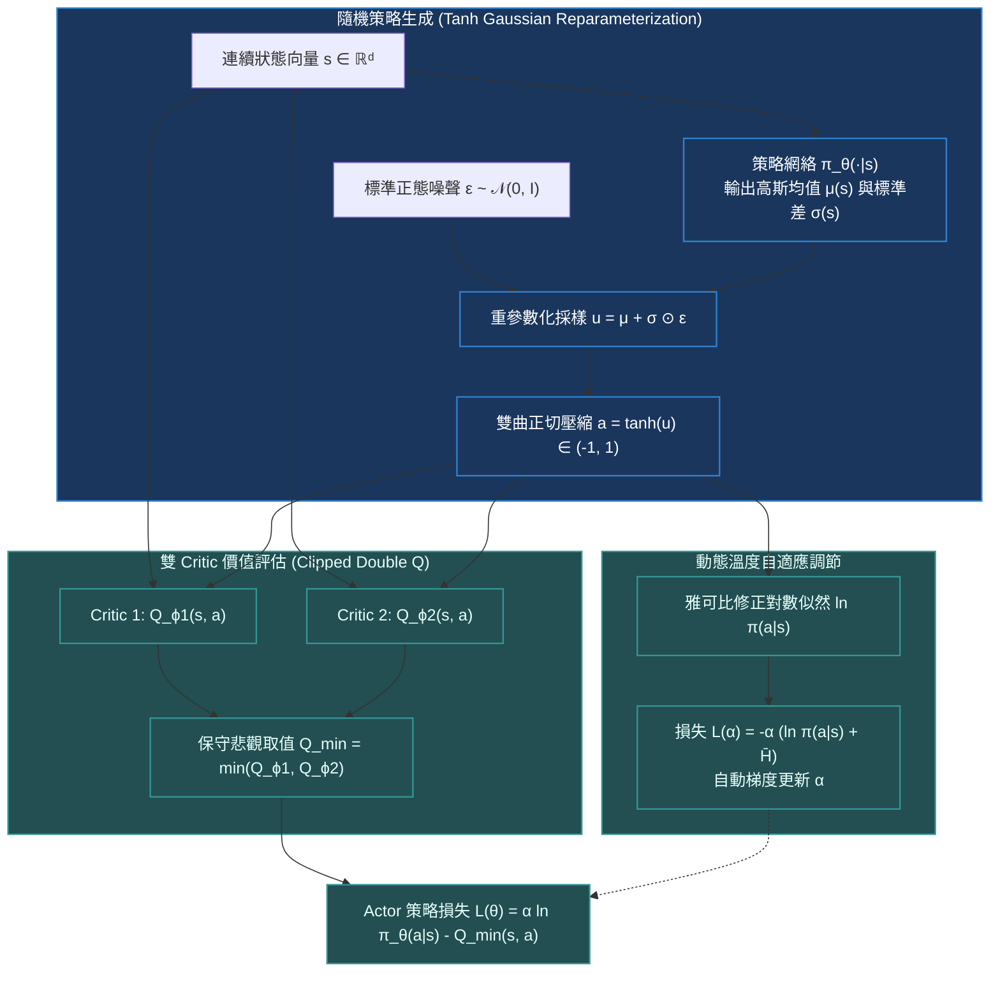

# Chapter 6: 連續動作控制·Soft Actor-Critic (SAC & MaxEnt RL)

> *「傳統強化學習只試圖尋找一條通往終點的最優獨木橋，而最大熵強化學習（Maximum Entropy RL）要求智能體學會『條條大路通羅馬』——在獲取最高獎勵的同時，保持行為的最大隨機性與多樣性，從而賦予了機器人在真實物理世界中不可思議的抗擾動韌性。」*

---

## 核心心智模型：最大熵強化學習框架 (MaxEnt RL)

在機械臂控制、自駕車軌跡規劃或無人機特技飛行中，動作空間是高維且連續的（例如 7 自由度關節力矩 $\boldsymbol{a} \in [-1, 1]^7$）。傳統確定性策略梯度（如 DDPG）極其脆弱，容易因超參數微小變動而崩潰陷入局部最優。

Haarnoja 等人在 2018 年提出的 **Soft Actor-Critic (SAC)** 引入了**信息熵正則化（Entropy Regularization）**：
$$J(\pi) = \sum_{t=0}^T \mathbb{E}_{(s_t, a_t) \sim \rho_\pi} \left[ r(s_t, a_t) + \alpha \mathcal{H}\left( \pi(\cdot \mid s_t) \right) \right]$$
其中香農熵定義為 $\mathcal{H}(\pi(\cdot | s_t)) = \mathbb{E}_{a \sim \pi} [-\ln \pi(a | s_t)]$，溫度係數 $\alpha > 0$ 決定了對多樣性探索的獎勵權重。



### 為什麼最大熵能抵禦現實世界的物理擾動？
1. **主動探索所有等效最優解**：如果機器人有兩種姿態都能抓取杯子，標準 RL 會隨機塌縮到其中一種極端姿態；而 SAC 會賦予兩種姿態相同的概率分佈。
2. **極強的抗噪聲魯棒性**：若環境突然施加未知橫風或摩擦力突變，由於策略原本就探索過寬廣的狀態分佈，策略不會輕易脫軌失效。

---

## 6.1 Tanh 高斯重參數化與雅可比修正公式

為了使連續動作嚴格約束在安全物理邊界 $[-1, 1]$ 內，SAC 先採樣無界高斯變量 $u \sim \mathcal{N}(\mu_\theta(s), \sigma_\theta^2(s))$，然後應用雙曲正切函數壓縮：
$$a = \tanh(u)$$

### 為什麼反向傳播必須使用重參數化技巧 (Reparameterization Trick)？
直接從隨機分佈中採樣操作不可導。引入獨立噪聲 $\epsilon \sim \mathcal{N}(0, I)$：
$$u = f_\theta(s, \epsilon) = \mu_\theta(s) + \sigma_\theta(s) \odot \epsilon$$
這樣，隨機性被轉移到了輸入葉子節點 $\epsilon$ 上，網絡參數 $\theta$ 可以直接通過鏈式法則接收反向傳播梯度！

### 概率密度雅可比變換修正（Critical Jacobian Derivation）
因為 $a = \tanh(u)$ 是一個非線性雙射變換，根據多元概率微積分定理：
$$P_a(a) = P_u(u) \cdot \left| \det \left( \frac{da}{du} \right) \right|^{-1}$$

對各獨立分量求導：
$$\frac{da_i}{du_i} = 1 - \tanh^2(u_i) = 1 - a_i^2$$

兩邊取自然對數：
$$\ln \pi(a \mid s) = \ln \mathcal{N}(u; \mu_\theta(s), \sigma_\theta(s)) - \sum_{i=1}^D \ln \left( 1 - \tanh^2(u_i) + \epsilon_{\text{eps}} \right)$$

> [!WARNING]
> 在 PyTorch 實現中，當 $|u_i| > 10$ 時，$\tanh^2(u_i) \to 1.0$，分母項 $1 - \tanh^2(u_i)$ 會下溢為 0，引發 $\ln(0) = -\infty$ 的梯度爆炸災難！工程上必須嚴格加入 $\epsilon_{\text{eps}} = 10^{-6}$ 防禦數值崩潰。

---

## 6.2 雙 Q 網絡與目標計算公式

SAC 借鑒了 TD3 的 **Clipped Double-Q 技巧**，維持兩個獨立的 Critic 網絡 $Q_{\phi_1}, Q_{\phi_2}$，並在目標計算時取較小者以抑制過度高估：
$$y_t = r_t + \gamma (1 - d_t) \left( \min_{j=1,2} Q_{\phi_j^{\text{targ}}}(s_{t+1}, \tilde{a}_{t+1}) - \alpha \ln \pi_\theta(\tilde{a}_{t+1} \mid s_{t+1}) \right)$$
其中下一狀態動作 $\tilde{a}_{t+1} \sim \pi_\theta(\cdot \mid s_{t+1})$ 為當前最新策略重採樣產生的動作。

### 溫度係數 $\alpha$ 的自動對偶凸優化調節
手動調節超參數 $\alpha$ 極其痛苦。SAC 提出了將熵作為一個硬約束的凸優化問題：
$$\max_{\pi} \mathbb{E} \left[ \sum_t r_t \right] \quad \text{s.t.} \quad \mathcal{H}(\pi(\cdot \mid s_t)) \ge \bar{\mathcal{H}}$$
其中目標目標熵通常設定為動作空間維度的負值：$\bar{\mathcal{H}} = - \dim(\mathcal{A})$。其對偶變量 $\alpha$ 的梯度更新損失為：
$$\mathcal{L}(\alpha) = \mathbb{E}_{a_t \sim \pi_t} \left[ -\alpha \left( \ln \pi_\theta(a_t \mid s_t) + \bar{\mathcal{H}} \right) \right]$$

> [!TIP]
> <button class="deep-link-btn" data-target="viz">🔬 啟動連續控制實驗室</button>，可以拖動溫度係數 $\alpha$ 與重參數化標準差，實時觀察動作分佈在高斯多峰與極值探索間的平滑過渡。

---

## 6.3 可執行的 PyTorch Squashed Gaussian Actor 實現

```python
import torch
import torch.nn as nn
import torch.nn.functional as F
from torch.distributions import Normal

class SquashedGaussianActor(nn.Module):
    """SAC 核心重參數化連續動作 Actor"""
    def __init__(self, state_dim: int, action_dim: int, hidden_dim: int = 256, log_std_bounds=(-20, 2)):
        super().__init__()
        self.log_std_min, self.log_std_max = log_std_bounds
        
        self.net = nn.Sequential(
            nn.Linear(state_dim, hidden_dim),
            nn.LayerNorm(hidden_dim),
            nn.ReLU(),
            nn.Linear(hidden_dim, hidden_dim),
            nn.LayerNorm(hidden_dim),
            nn.ReLU(),
        )
        self.mu_layer = nn.Linear(hidden_dim, action_dim)
        self.log_std_layer = nn.Linear(hidden_dim, action_dim)

    def forward(self, state: torch.Tensor, deterministic: bool = False) -> tuple[torch.Tensor, torch.Tensor]:
        features = self.net(state)
        mu = self.mu_layer(features)
        # 限制 log_std 範圍防止數值下溢或方差爆炸
        log_std = self.log_std_layer(features)
        log_std = torch.clamp(log_std, self.log_std_min, self.log_std_max)
        std = torch.exp(log_std)

        dist = Normal(mu, std)
        if deterministic:
            u = mu
        else:
            # 重參數化採樣: u = mu + std * eps
            u = dist.rsample()

        # 雙曲正切壓縮
        action = torch.tanh(u)

        # 雅可比修正對數似然
        log_prob = dist.log_prob(u).sum(dim=-1, keepdim=True)
        # 嚴密數值保護: 1 - action^2 + 1e-6
        jacobian_correction = torch.log(1.0 - action.pow(2) + 1e-6).sum(dim=-1, keepdim=True)
        log_prob -= jacobian_correction

        return action, log_prob
```

---

## 6.4 連續控制經典演算法多維橫向比較

| 演算法維度 | DDPG (2015) | PPO (連續模式, 2017) | TD3 (2018) | SAC (2018) |
|---|---|---|---|---|
| **策略類型** | 確定性策略 $\mu_\theta(s)$ | 隨機對角高斯策略 | 確定性策略 $\mu_\theta(s)$ | **最大熵隨機策略 (Tanh)** |
| **在線 / 離線** | Off-Policy (回放池) | On-Policy (整段拋棄) | Off-Policy (回放池) | **Off-Policy (回放池)** |
| **採樣效率** | 中等（易發散崩潰） | 較低（需數百萬環境步） | 高（雙 Q 網絡穩定） | **極高（採樣效率約為 PPO 的 10x）** |
| **過度高估緩解** | 無（單 Q 網絡高估） | 依賴 Critic GAE | Clipped Double-Q | **Clipped Double-Q** |
| **真實機器人適用** | 極差（抗噪聲差） | 良好但耗費昂貴實機時間 | 良好 | **工業機器人控制唯一王者** |

---

## 🤔 架構深度思辨與工業界陷阱 (Architectural Insight & Production Pitfalls)

### 問題 1：在評估（Evaluation / Inference）階段，SAC 應該使用確定性動作 $a = \tanh(\mu)$ 還是繼續隨機採樣 $a \sim \pi$？為什麼在少數迷宮障礙環境中，隨機採樣的回報反而顯著高於確定性動作？
- **解答**：
  1. **標準工業做法**：通常在評估時設 `deterministic=True`，直接輸出均值壓縮點 $a = \tanh(\mu(s))$。因為最大熵訓練保證了 $\mu(s)$ 已經落在回報最安全平坦的吸引盆地中心。
  2. **非凸迷宮中的隨機性優勢**：如果環境中存在局部極小值的陷阱（如對稱障礙物），確定性策略可能會因為初始微小誤差完全撞死在牆角；而隨機策略的連續微小抖動（Jitter）具備了布朗運動效應，能夠自發跳出局部死鎖，成功繞開障礙抵達終點。

### 問題 2：若將經驗回放池的容量從 $10^6$ 縮減到 $10^3$，SAC 的表現會發生什麼變化？為什麼？
- **解答**：
  1. **策略迅速退化與過擬合**：SAC 是離策略（Off-Policy）算法，其 Critic 必須覆蓋廣泛的狀態-動作空間以維持貝爾曼算子的收縮性。若回放池過小（$10^3$），緩衝區內全是剛收集的近乎相同的短期軌跡，破壞了 i.i.d 獨立同分佈假設。
  2. **自舉崩潰**：Critic 會迅速過擬合這段小區間內的樣本，對稍微偏離當前軌跡的動作給出荒謬的 Q 值預測，進而導致 Actor 盲目朝錯誤方向更新，引發策略崩潰（Policy Collapse）。

---

## 參考文獻與經典論文

1. **Haarnoja, T., et al. (2018).** *Soft actor-critic: Off-policy maximum entropy deep reinforcement learning with a stochastic actor.* International Conference on Machine Learning (ICML).
2. **Haarnoja, T., et al. (2018).** *Soft actor-critic algorithms and applications.* arXiv preprint arXiv:1812.05905.
3. **Fujimoto, S., van Hoof, H., & Meger, D. (2018).** *Addressing function approximation error in actor-critic methods.* International Conference on Machine Learning (ICML).
