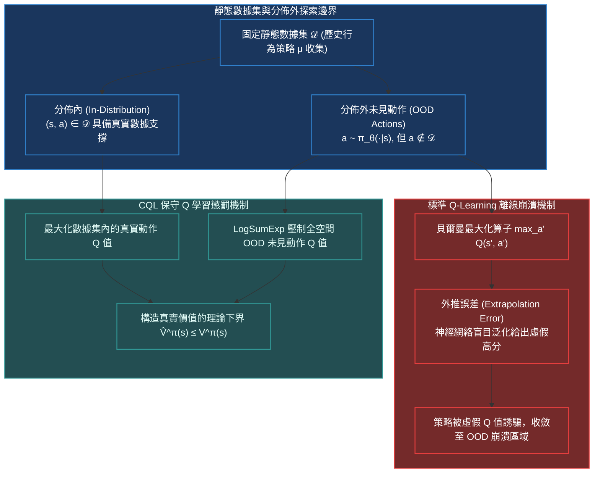

# Chapter 7: 離線強化學習·Conservative Q-Learning (CQL Offline RL)

> *「在真實工業界——無論是自動駕駛、醫療診斷還是核聚變控制中，你永遠不可能讓未經訓練的隨機策略在實體環境中肆意探索崩潰百萬次。離線強化學習（Offline RL）致力於在完全靜態的歷史數據集上榨取超級智能，而保守價值估計（CQL）則是驅逐分佈外虛假幻想的唯一戒尺。」*

---

## 核心心智模型：分佈偏移與分佈外動作 (OOD) 的價值膨脹

在在線強化學習中，若智能體對某個錯誤動作抱有過高估計，它會在下一步探索中親自踩雷，獲得極低回報，從而在真實反饋中修正 Q 值。
但在**離線強化學習（Offline RL / Batch RL）**中，環境交互被徹底切斷，智能體只能訪問一個固定的靜態歷史數據集 $\mathcal{D} = \{(s, a, r, s')\}$：



### 為什麼直接在離線數據上運行 SAC 或 DQN 會徹底暴斃？
當離線訓練計算目標 $y = r + \gamma \max_{a'} Q(s', a')$ 時，神經網絡需要評估數據集中從未出現過的 $a'$。由於深度神經網絡是高度非線性的外推器，對於分佈外（OOD）的動作，神經網絡往往會給出匪夷所思的超高 Q 值。在迭代自舉的作用下，這個虛假的高估偏差像滾雪球一樣擴散至整個狀態空間，導致策略完全走向崩潰。

---

## 7.1 保守價值估計 (CQL) 的數學形式與下界保證

Kumar 等人在 NeurIPS 2020 提出了 **Conservative Q-Learning (CQL)**。其核心思想是：**在常規的貝爾曼誤差之外，人為引入一個正則項——主動壓制所有策略可能選出的動作的 Q 值，同時拉高數據集中真實存在動作的 Q 值**。

### CQL 核心目標函數
$$\min_Q \alpha \cdot \left( \mathbb{E}_{s \sim \mathcal{D}, a \sim \mu(a|s)} [Q(s, a)] - \mathbb{E}_{(s, a) \sim \mathcal{D}} [Q(s, a)] \right) + \frac{1}{2} \mathbb{E}_{(s, a, s') \sim \mathcal{D}} \left[ \left( Q(s, a) - \hat{\mathcal{B}}^\pi \hat{Q}(s, a) \right)^2 \right]$$

### LogSumExp 凸鬆弛 (CQL-H)
為了讓算法對全空間內所有可能的危險 OOD 動作進行徹底的悲觀防禦，我們令壓制分佈 $\mu(a|s)$ 主動去逼近當前 Q 網絡估計最高的動作。當 $\mu(a|s) \propto \exp(Q(s, a))$ 時，第一項自然轉化為 **LogSumExp（平滑最大值算子）**：
$$\min_Q \alpha \cdot \mathbb{E}_{s \sim \mathcal{D}} \left[ \ln \sum_{a \in \mathcal{A}} \exp(Q(s, a)) - \mathbb{E}_{a \sim \hat{\pi}_\beta(a|s)} [Q(s, a)] \right] + \frac{1}{2} \mathcal{L}_{\text{Bellman}}(Q)$$

### 理論保證：真實價值的嚴格下界 (Pessimistic Lower Bound)
Kumar 等人從理論上嚴格證明：當正則化係數 $\alpha$ 滿足足夠大的閾值時，學得的價值函數在點態意義或期望意義下，嚴格滿足保守下界：
$$\hat{V}^\pi(s) \le V^\pi(s), \quad \forall s \in \mathcal{D}$$
這意味著：**CQL 寧可保守地看低自己，也絕不被任何未見動作的虛幻高估所誘惑！**

> [!TIP]
> <button class="deep-link-btn" data-target="viz">🔬 啟動離線強化學習實驗室</button>，可以拖動數據集質量滑塊（從隨機軌跡到專家軌跡）與 CQL 保守懲罰強度 $\alpha$，實時觀察 Q 函數外推爆炸的抑制過程。

---

## 7.2 可執行的 PyTorch 離散/連續動作 CQL 損失計算

```python
import torch
import torch.nn.functional as F

def compute_cql_discrete_loss(
    q_net: torch.nn.Module,
    target_q_net: torch.nn.Module,
    states: torch.Tensor,
    actions: torch.Tensor,
    rewards: torch.Tensor,
    next_states: torch.Tensor,
    dones: torch.Tensor,
    gamma: float = 0.99,
    cql_alpha: float = 1.0
) -> tuple[torch.Tensor, dict]:
    """
    離散動作空間 CQL 損失計算 (適用於 Atari / 離線文本分類)
    """
    # 1. 預測當前狀態所有動作的 Q 值: [B, act_dim]
    q_all = q_net(states)
    q_dataset = q_all.gather(1, actions) # 數據集中真實動作的 Q 值: [B, 1]

    # 2. 標準貝爾曼目標
    with torch.no_grad():
        next_q_all = target_q_net(next_states)
        next_q_max = next_q_all.max(dim=1, keepdim=True)[0]
        target_q = rewards + gamma * (1.0 - dones) * next_q_max

    bellman_loss = F.mse_loss(q_dataset, target_q)

    # 3. CQL 保守壓制項: logsumexp(Q(s, ·)) - Q(s, a_dataset)
    # logsumexp 計算全動作空間的軟上限
    cql_logsumexp = torch.logsumexp(q_all, dim=1, keepdim=True)
    cql_penalty = (cql_logsumexp - q_dataset).mean()

    # 4. 總損失加權
    total_loss = bellman_loss + cql_alpha * cql_penalty

    metrics = {
        "bellman_loss": bellman_loss.item(),
        "cql_penalty": cql_penalty.item(),
        "mean_q": q_dataset.mean().item()
    }
    return total_loss, metrics
```

---

## 7.3 離線強化學習核心範式全景對比

| 演算法範式 | 代表演算法 | 核心思想與機制 | 對數據集質量的依賴 | 外推探索能力 |
|---|---|---|---|---|
| **行為克隆 (BC)** | Behavior Cloning | 純監督學習交叉熵，直接模仿數據集動作 | 必須是高水平專家數據 | 零（完全無法超越數據集最高水平） |
| **策略約束 (Policy Constraint)** | BCQ / BEAR | 限制學習策略與行為策略的 KL 散度或 MMD 距離 | 中等到高等數據集 | 弱（嚴格限制在數據集支持區間內） |
| **保守價值 (Pessimistic Value)** | **CQL (2020)** | 在 Q 空間直接壓制 OOD 價值，構造理論下界 | **極強（支持混合嘈雜甚至是隨機數據）** | **強（可從次優軌跡中拼湊出最優決策）** |
| **隱式 Q 學習 (Implicit Q-Learning)** | IQL (2022) | 使用 Expectile 回歸，徹底避免在自舉時評估 OOD 動作 | 極強（計算極其穩定，訓練速度最快） | 強 |
| **條件生成建模** | Decision Transformer | 將 RL 建模為序列自回歸生成：$P(a_t \mid s_{\le t}, R_{\text{target}})$ | 依賴大數據預訓練規模 | 依賴條件提示詞引導 |

---

## 🤔 架構深度思辨與工業界陷阱 (Architectural Insight & Production Pitfalls)

### 問題 1：在自動駕駛（如 Wayve / Tesla）或醫療處方中，我們擁有海量的人類駕駛/醫生開藥日誌，為什麼單純使用行為克隆（Behavior Cloning, BC）是致命的？CQL 如何在離線數據中「超越」寫數據的普通人類？
- **解答**：
  1. **復合誤差引發的死局（Covariate Shift）**：BC 只做單步監督模仿。在實車上路時，只要 Agent 產生了 $1\text{cm}$ 的位置微小偏移（這在訓練集中從未出現過），BC 就不知道如何回正，誤差隨時間二次方複合膨脹 $\mathcal{O}(T^2)$，最終直接衝出車道。
  2. **縫合最優軌跡的能力（Stitching Property）**：假設數據集裡有兩位司機：司機 A 擅長走前半段但後半段堵車，司機 B 前半段繞路但後半段暢通。BC 只能全盤模仿司機 A 或 B；而 CQL 依靠貝爾曼動態規劃的跨軌跡反向傳播，能夠自動識別出「司機 A 的前半段」與「司機 B 的後半段」的超高價值，從而**動態縫合出一條在歷史數據中從未有人完整跑過的全新全球最優軌跡**！

### 問題 2：若將 CQL 的保守係數 $\alpha$ 設置得過大（例如 $\alpha = 100$），算法會退化成什麼？這在工程診斷中會出現什麼症狀？
- **解答**：
  1. **退化為保守死鎖（Severe Underestimation & Freezing）**：當 $\alpha \to \infty$ 時，損失函數中貝爾曼方程的權重被完全淹沒，網絡的唯一任務變成了不顧一切地壓低所有動作的 Q 值。
  2. **工程症狀**：
     - 在控制環境中，智能體會產生「極度厭惡風險」的自閉怠速行為（如自動駕駛汽車無論如何給油門都不敢啟動，死死停在原地）。
     - 診斷指標：監控訓練曲線中的 `mean_q`，若其持續跌為負數數百萬，且與真實累積回報嚴重脫節，說明 $\alpha$ 設置過大，應引入拉格朗日自適應調節機制（Dual Gradient Descent on $\alpha$）。

---

## 參考文獻與經典論文

1. **Kumar, A., et al. (2020).** *Conservative Q-learning for offline reinforcement learning.* Advances in Neural Information Processing Systems (NeurIPS 33).
2. **Levine, S., et al. (2020).** *Offline reinforcement learning: Tutorial, review, and perspectives on open problems.* arXiv preprint arXiv:2005.01643.
3. **Kostrikov, I., Nair, A., & Levine, S. (2021).** *Offline reinforcement learning with implicit q-learning.* arXiv preprint arXiv:2110.06169.
