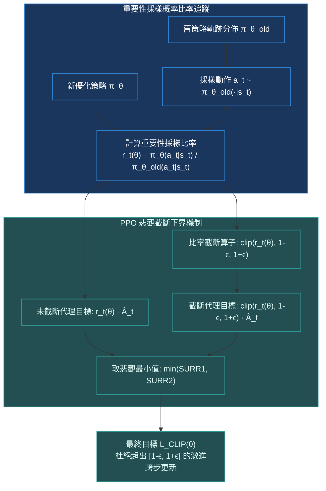

# Chapter 8: 近端策略優化·PPO 截斷目標與重要性採樣 (PPO Clipped Objective)

> *「在深度強化學習的早期，策略更新就像在懸崖邊緣走鋼絲——學習率稍微偏大一點點，一次災難性的更新就會讓神經網絡徹底忘卻所有已學能力，且永遠無法自我復原。PPO 通過簡潔至極的剪裁目標，給狂奔的梯度戴上了最優雅的信任域韁繩。」*

---

## 核心心智模型：信任域與重要性採樣比率

在標準策略梯度中，每次採樣完一批數據後，策略參數 $\theta$ 只能做**極其微小的一步更新**，隨後該批數據必須全盤拋棄（On-Policy 特性），採樣效率低下。如果試圖用同一批歷史數據多做幾步梯度下降，新舊策略分佈就會發生漂移，導致更新方向徹底失效。

為此，OpenAI 的 Schulman 等人在 2017 年提出了 **PPO (Proximal Policy Optimization)**。其核心載體是**重要性採樣比率（Importance Sampling Ratio）**：
$$r_t(\theta) = \frac{\pi_\theta(a_t \mid s_t)}{\pi_{\theta_{\text{old}}}(a_t \mid s_t)}$$
- 當 $r_t(\theta) = 1.0$ 時，代表當前策略與採樣軌跡時的舊策略完全一致。
- 當 $r_t(\theta) > 1.0$ 時，代表當前策略增大了採取該動作的概率；反之 $r_t(\theta) < 1.0$ 則代表概率被壓縮。



---

## 8.1 截斷代理目標函數 (Clipped Surrogate Objective) 的幾何構造

PPO-Clip 的核心損失函數定義為：
$$\mathcal{L}^{\text{CLIP}}(\theta) = \hat{\mathbb{E}}_t \left[ \min\left( r_t(\theta) \hat{A}_t, \;\text{clip}(r_t(\theta), 1 - \epsilon, 1 + \epsilon) \hat{A}_t \right) \right]$$
其中超參數通常取 $\epsilon = 0.2$。

### 為什麼必須在未截斷項與截斷項之間取「悲觀最小值（$\min$）」？
我們分為優勢為正與為負兩種情形深入剖析：

```
情形一：正優勢 (Â_t > 0，該動作表現優秀)
  L^CLIP
    │          未截斷目標 r_t · Â_t (斜直線)
    │           /
    │          /
(1+ϵ)A ───────/═════════════════════ 截斷目標 (梯度為 0)
    │        /
    │       /
    │      /
────┴─────┼────────────┼───────────── r_t
         1.0         1+ϵ
```
- 當動作很好（$\hat{A}_t > 0$）時，策略希望增大 $r_t$。若 $r_t > 1 + \epsilon$（概率已經提升超過 20%），截斷機制生效，**目標值封頂，梯度歸零**！這阻止了策略過於貪婪地過擬合單一有利動作。

```
情形二：負優勢 (Â_t < 0，該動作表現糟糕)
  L^CLIP
    │
────┼─────┼────────────┼───────────── r_t
    │    1-ϵ          1.0
    │      \
    │       \
(1-ϵ)A ══════\─────────────────────── 截斷目標 (取 min 後保留陡峭懲罰)
    │         \
    │          \  未截斷目標 r_t · Â_t
```
- 當動作糟糕（$\hat{A}_t < 0$）時，策略希望壓低 $r_t$。若概率已經降至 $r_t < 1 - \epsilon$，截斷值為 $(1-\epsilon)\hat{A}_t$，但未截斷項 $r_t \hat{A}_t$ 是更小（更悲觀）的負數！取 $\min$ 使得**當策略把糟糕動作的概率進一步壓低時，依然保留負向懲罰梯度，但杜絕過大步長的數值發散**。

> [!NOTE]
> 取 $\min$ 的本質是構造一個**悲觀的保守下界（Pessimistic Lower Bound）**。只要我們最大化這個下界，真實策略的性能就受到嚴格的數學保障！

> [!TIP]
> <button class="deep-link-btn" data-target="viz">🔬 啟動 PPO 剪裁動力學實驗室</button>，可以手動滑動調節比率 $r_t$、優勢 $A_t$ 與剪裁邊界 $\epsilon$，動態觀察截斷激活區與有效梯度信號。

---

## 8.2 完整 PPO 聯合損失函數

在實際的大模型訓練（如 InstructGPT / LLaMA-RLHF）中，PPO 的總目標函數通常包含三項：
$$\mathcal{L}^{\text{PPO}}(\theta) = \hat{\mathbb{E}}_t \left[ \mathcal{L}_t^{\text{CLIP}}(\theta) - c_1 \mathcal{L}_t^{\text{VF}}(\theta) + c_2 \mathcal{S}[\pi_\theta](s_t) \right]$$

1. **策略截斷項 $\mathcal{L}^{\text{CLIP}}$**：主導策略沿優勢方向前進。
2. **價值函數均方誤差項 $\mathcal{L}^{\text{VF}} = (V_\phi(s_t) - V_t^{\text{targ}})^2$**：擬合 Critic 網絡。在現代實踐中，價值損失同樣會採用類似的 Clip 截斷機制。
3. **熵獎勵項 $\mathcal{S}[\pi_\theta] = -\sum_a \pi(a|s) \ln \pi(a|s)$**：防止策略過早塌縮為單一確定性輸出。

---

## 8.3 可執行的 PyTorch 向量化 PPO 損失計算模組

```python
import torch
import torch.nn as nn
import torch.nn.functional as F

def compute_ppo_policy_loss(
    log_probs_new: torch.Tensor,
    log_probs_old: torch.Tensor,
    advantages: torch.Tensor,
    clip_epsilon: float = 0.2
) -> tuple[torch.Tensor, dict]:
    """
    向量化計算 PPO-Clip 策略損失
    Args:
        log_probs_new: [B, L] 當前模型計算出的對數概率
        log_probs_old: [B, L] 採樣時凍結的舊模型對數概率
        advantages:    [B, L] 歸一化後的 GAE 優勢值
        clip_epsilon:  截斷係數 (通常 0.2)
    """
    # 1. 數值穩定性計算重要性採樣比率: r = exp(log_p_new - log_p_old)
    log_ratio = log_probs_new - log_probs_old
    ratio = torch.exp(log_ratio)

    # 2. 未截斷與截斷目標
    surr1 = ratio * advantages
    surr2 = torch.clamp(ratio, 1.0 - clip_epsilon, 1.0 + clip_epsilon) * advantages

    # 3. 取悲觀最小值 (PyTorch 梯度下降需取負號)
    policy_loss = -torch.min(surr1, surr2).mean()

    # 4. 監控指標：Clip 觸發頻率與近似 KL 散度 (Schulman 近似)
    with torch.no_grad():
        clip_fraction = ((ratio - 1.0).abs() > clip_epsilon).float().mean()
        # 近似 KL: KL ≈ (ratio - 1) - log(ratio)
        approx_kl = ((ratio - 1.0) - log_ratio).mean()

    metrics = {
        "policy_loss": policy_loss.item(),
        "clip_fraction": clip_fraction.item(),
        "approx_kl": approx_kl.item(),
        "mean_ratio": ratio.mean().item()
    }
    return policy_loss, metrics
```

---

## 8.4 PPO 與前代架構多維度特性對比

| 指標維度 | 原始策略梯度 (REINFORCE) | 自然策略梯度 (NPG) | 信任域策略優化 (TRPO) | 近端策略優化 (PPO-Clip) |
|---|---|---|---|---|
| **優化階數** | 一階梯度下降 | 二階費雪信息矩陣 (Fisher) | 二階共軛梯度 + 線搜索 | **純一階隨機梯度下降 (SGD/Adam)** |
| **約束機制** | 無（學習率手動調試） | 顯式 KL 散度硬約束 | 顯式 KL 散度二次約束 | **剪裁目標隱式軟約束** |
| **多輪 Epoch 訓練** | 不可（必須單步拋棄） | 支持小批量多步 | 支持多步共軛優化 | **支持同一批數據訓練 3~10 個 Epoch** |
| **代碼實現複雜度** | 極簡 (~50 行) | 極高 (涉及海森矩陣逆) | 極高 (難以適配分佈式與大模型) | **極簡 (~30 行核心代碼)** |
| **工業界主流地位** | 理論教學 | 學術過渡 | 早期 Mujoco 基線 | **大模型對齊與機器人絕對工業標準** |

---

## 🤔 架構深度思辨與工業界陷阱 (Architectural Insight & Production Pitfalls)

### 問題 1：在利用 PPO 微調 70B 語言模型時，為什麼經常觀測到 `approx_kl` 突然暴增（例如從 0.01 飆升到 5.0），隨後模型輸出亂碼（Policy Collapse）？根本誘因與防護策略是什麼？
- **解答**：
  1. **比率指數爆炸（Ratio Explosion）**：在低溫採樣（Temperature $\le 0.7$）時，對於某些罕見的 Out-of-Vocabulary 或冷僻 Token，$\pi_{\text{old}}$ 的預測概率極低（如 $10^{-6}$）。若在新策略更新中，該 Token 的概率被稍微推高到 $10^{-3}$，比率 $r_t = \frac{10^{-3}}{10^{-6}} = 1000$！儘管有剪裁保護，但只要優勢為負，大批次的累積梯度依然會引發網絡權重的災難性漂移。
  2. **工業界三大防禦防線**：
     - **Early Stopping on KL**：監控每個 Mini-Batch 的 `approx_kl`，一旦超過閾值（如 $1.5 \times \text{target\_kl}$），立即提前中斷當前 Epoch 的訓練。
     - **顯式參考模型 KL 懲罰（Reference KL Penalty）**：在獎勵項中加入 $r'_t = r_t - \beta \mathbb{D}_{\text{KL}}(\pi_\theta \parallel \pi_{\text{ref}})$，從源頭鎖定模型漂移空間。
     - **對數比率硬截斷（Log-Ratio Clamping）**：在計算 `ratio = torch.exp(log_ratio)` 之前，強制執行 `log_ratio = torch.clamp(log_ratio, -10.0, 10.0)`。

### 問題 2：TRPO 嚴格求解了約束優化問題 $\max_\theta L(\theta) \text{ s.t. } \mathbb{D}_{\text{KL}}(\pi_{\text{old}} \parallel \pi_\theta) \le \delta$，為什麼在當前的大模型後訓練中沒有任何人使用 TRPO？
- **解答**：
  1. **二階求逆不可承受的顯存開銷**：TRPO 需要計算或逼近費雪信息矩陣（Fisher Information Matrix, $F \in \mathbb{R}^{d \times d}$）的逆矩陣 $F^{-1} g$。對於一個 7B 參數模型，$d = 7 \times 10^9$，存儲其海森矩陣需要數十 EB 顯存；即使使用共軛梯度法（Conjugate Gradient），每一次矩陣-向量積（HVP）都需要額外做一次完整的二階圖反向傳播。
  2. **無法適配現代 3D 混合並行**：現代大模型依賴 Tensor Parallelism (TP)、Pipeline Parallelism (PP) 和 ZeRO-3 顯存切分。在高度切分的集群上實現共軛梯度線搜索和反向回退（Backtracking Line Search），通訊開銷將使 GPU 利用率（MFU）暴跌至 5% 以下。PPO-Clip 完美兼容標準 AdamW 一階優化器，是工程規模化（Scaling）的唯一生存解。

---

## 參考文獻與經典論文

1. **Schulman, J., et al. (2017).** *Proximal policy optimization algorithms.* arXiv preprint arXiv:1707.06347.
2. **Schulman, J., et al. (2015).** *Trust region policy optimization.* International Conference on Machine Learning (ICML).
3. **Ouyang, L., et al. (2022).** *Training language models to follow instructions with human feedback.* Advances in Neural Information Processing Systems (NeurIPS 35).
