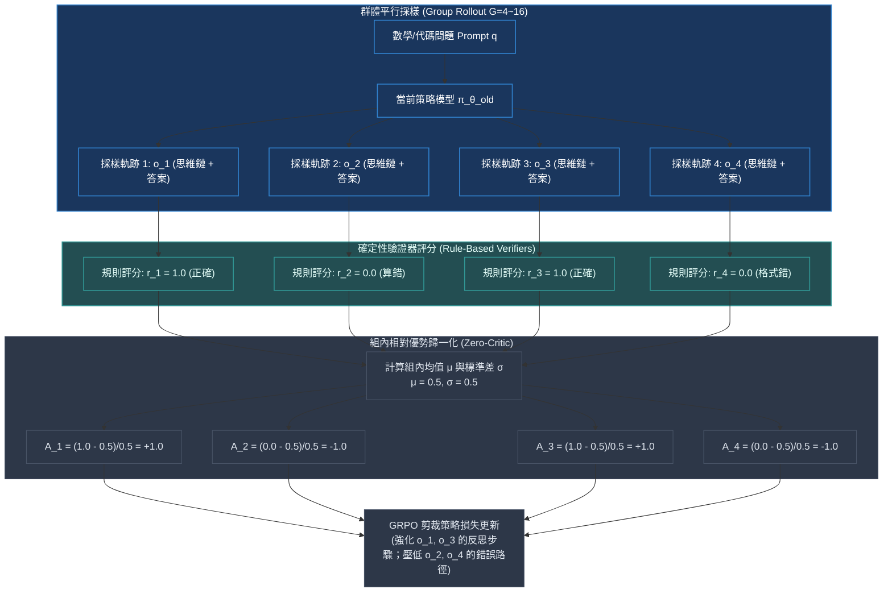

# Chapter 10: 群體相對策略優化·GRPO 組間歸一化 (DeepSeek R1 GRPO)

> *「2025 年初，DeepSeek-R1 震撼全球 AI 界，其背後最核心的演算法引擎正是 GRPO——它大膽拋棄了自強化學習誕生數十年來被奉為圭臬的 Critic 網絡，以極簡的組內相對比較與確定性驗證器，驅動大模型湧現出自發反思、思維鏈延伸與自我糾錯的『Aha Moment』。」*

---

## 核心心智模型：徹底廢除 Critic 網絡的輕量化革命

在大語言模型推理訓練中，傳統 PPO 遭遇了無法逾越的系統架構瓶頸：為了給 Token 級別提供基線，必須額外訓練一個同等尺寸的 Critic 網絡（例如 70B 模型對應 70B Critic）。這不僅佔用了 **50% 以上的寶貴 GPU 顯存**，而且在長達數千步的推導鏈條中，Critic 網絡自身估計的噪聲往往淹沒了真實的學習信號。

DeepSeek 團隊在 2024 年提出、並在 **DeepSeek-R1** 中發揚光大的 **GRPO (Group Relative Policy Optimization)** 顛覆了這一範式：
**對每一個輸入問題 $q$，模型平行採樣生成一組 $G$ 個候選答案 $\{o_1, o_2, \dots, o_G\}$。直接以這組候選回答的組內平均分作為基線，進行 Z-Score 標準化，作為優勢估計！**



---

## 10.1 GRPO 目標函數與組內相對優勢公式

設對於提示詞 $q \sim \mathcal{D}$，舊策略 $\pi_{\theta_{\text{old}}}$ 採樣輸出 $G$ 個候選答案 $\{o_i\}_{i=1}^G$，驗證器回傳對應獎勵 $\{r_i\}_{i=1}^G$。

### 組內相對優勢計算 (Group Relative Advantage)
組內均值與無偏標準差為：
$$\mu = \frac{1}{G} \sum_{i=1}^G r_i, \quad \sigma = \sqrt{\frac{1}{G} \sum_{i=1}^G (r_i - \mu)^2}$$

各軌跡的純量優勢值為 Z-Score 標量：
$$\hat{A}_i = \frac{r_i - \mu}{\sigma + \epsilon_{\text{eps}}}$$

### 完整 GRPO 截斷目標函數
$$\mathcal{J}_{\text{GRPO}}(\theta) = \mathbb{E} \left[ \frac{1}{G} \sum_{i=1}^G \frac{1}{|o_i|} \sum_{t=1}^{|o_i|} \left( \min\left( \frac{\pi_\theta(o_{i,t} \mid q, o_{i,<t})}{\pi_{\theta_{\text{old}}}(o_{i,t} \mid q, o_{i,<t})} \hat{A}_i, \;\text{clip}\left( \frac{\pi_\theta}{\pi_{\theta_{\text{old}}}}, 1 - \epsilon, 1 + \epsilon \right) \hat{A}_i \right) - \beta \mathbb{D}_{\text{KL}}(\pi_\theta \parallel \pi_{\text{ref}}) \right) \right]$$

### 顯式 KL 散度的封閉解析近似
不同於 PPO 通常將 KL 散度作為獎勵懲罰（Reward Shaping），GRPO 在目標函數中顯式扣除無偏非負 KL 散度近似（Schulman 2020）：
$$\mathbb{D}_{\text{KL}}(\pi_\theta \parallel \pi_{\text{ref}}) = \frac{\pi_{\text{ref}}(o_{i,t})}{\pi_\theta(o_{i,t})} - \ln \frac{\pi_{\text{ref}}(o_{i,t})}{\pi_\theta(o_{i,t})} - 1$$
這個公式保證了 KL 近似值恆 $\ge 0$，徹底杜絕了傳統 $\ln(\pi/\pi_{\text{ref}})$ 在離散採樣時可能為負數引發的數值欺騙。

> [!TIP]
> <button class="deep-link-btn" data-target="viz">🔬 啟動 GRPO 組內優勢模擬器</button>，可以自由設置組大小 $G$、隨機調整獎勵分佈，實時觀察零 Critic 下優勢歸一化對梯度信噪比的巨大增益。

---

## 10.2 可執行的 PyTorch 向量化 GRPO 損失實現

```python
import torch
import torch.nn as nn
import torch.nn.functional as F

def compute_grpo_loss(
    logps: torch.Tensor,             # [B * G, L] 新策略對數概率
    old_logps: torch.Tensor,         # [B * G, L] 舊採樣對數概率
    ref_logps: torch.Tensor,         # [B * G, L] 參考模型對數概率
    rewards: torch.Tensor,           # [B, G] 每個問題 G 個採樣的獎勵得分
    attention_mask: torch.Tensor,    # [B * G, L] 答案部分有效掩碼
    epsilon: float = 0.2,
    beta: float = 0.04
) -> tuple[torch.Tensor, dict]:
    B, G = rewards.shape
    
    # 1. 組內優勢計算: [B, G]
    mean_r = rewards.mean(dim=-1, keepdim=True)
    std_r = rewards.std(dim=-1, keepdim=True)
    # 若標準差全為 0 (全對或全錯)，加 1e-8 保護
    advantages = (rewards - mean_r) / (std_r + 1e-8)
    advantages = advantages.view(-1, 1) # 展平為 [B * G, 1]

    # 2. 計算重要性採樣比率
    # 注意: logps 為每 Token 的概率
    log_ratio = logps - old_logps
    ratio = torch.exp(log_ratio)

    # 3. PPO-Clip 代理目標
    surr1 = ratio * advantages
    surr2 = torch.clamp(ratio, 1.0 - epsilon, 1.0 + epsilon) * advantages
    policy_loss = -torch.min(surr1, surr2)

    # 4. 嚴密無偏 KL 懲罰 (Schulman 近似): ref/pi - ln(ref/pi) - 1
    # 令 x = pi / ref => ref / pi = exp(ref_logps - logps)
    ratio_ref = torch.exp(ref_logps - logps)
    kl_div = ratio_ref - (ref_logps - logps) - 1.0

    # 5. 總損失: 僅在答案 Token 上掩碼求平均
    total_loss_per_token = policy_loss + beta * kl_div
    masked_loss = (total_loss_per_token * attention_mask).sum() / (attention_mask.sum() + 1e-8)

    metrics = {
        "grpo_loss": masked_loss.item(),
        "mean_advantage": advantages.mean().item(),
        "mean_kl": (kl_div * attention_mask).sum().item() / (attention_mask.sum() + 1e-8),
        "mean_reward": rewards.mean().item()
    }
    return masked_loss, metrics
```

---

## 10.3 PPO vs GRPO 在大模型後訓練中的終極對比

| 對比維度 | 經典 PPO-RLHF (InstructGPT) | GRPO (DeepSeek-Math / R1) |
|---|---|---|
| **常駐神經網絡數量** | 4 個 (Actor, Critic, Reference, Reward) | **1~2 個 (僅 Actor + 可選的 Ref/vLLM)** |
| **GPU 顯存消耗** | 超大（70B 需多節點 3D 並行支撐 Critic） | **減少 50% 顯存，單機 8 卡即可訓練 14B/32B** |
| **Token 長度擴展上限** | 2K~4K（Critic 顯存限制長度擴展） | **支持 16K~64K 超長思維鏈生成** |
| **獎勵信號類型** | 顯式神經網絡打分 $r_\psi(x, y)$（易被攻擊） | **確定性規則驗證器（Regex, SymPy, Python AST）** |
| **探索能力與反思湧現** | 易被 Critic 牽引收斂到局部平庸答案 | **自發探索長思維鏈，湧現 "Wait, let me rethink"** |

---

## 🤔 架構深度思辨與工業界陷阱 (Architectural Insight & Production Pitfalls)

### 問題 1：在 GRPO 訓練初期，經常出現某道難題在組內 $G=8$ 個採樣全部算錯（$r_i = 0, \forall i$），此時組內標準差 $\text{std} = 0$，優勢被除以 $\epsilon_{\text{eps}}$ 會引發什麼後果？工業界如何處理「全零組」？
- **解答**：
  1. **數值災難**：若直接計算 $\frac{0 - 0}{0 + 10^{-8}} = 0$。此時該題目對策略梯度的貢獻完全為 0，浪費了珍貴的推理卡時。若標準差保護常數寫成 `std + 1e-4`，則全零組優勢全為 0。
  2. **工業界標準防禦：過濾或回退**：
     - **跳過全零組（Zero-Gradient Skip）**：在計算損失前，檢測 $\text{std}(r_1, \dots, r_G) < 10^{-6}$，直接將該 Group 的梯度屏蔽，避免將全錯的噪聲納入統計。
     - **動態難度數據配比（Goldilocks Filtering）**：在數據進入訓練管線前，使用離線採樣進行 Pass@8 探測，徹底剔除 Pass@8 為 0% 的超難題與 Pass@8 為 100% 的超簡單題，**只保留有對有錯、存在組內梯度方差的「甜蜜區」題目**！

### 問題 2：組大小（Group Size $G$）對 GRPO 的收斂穩定性有何影響？為什麼不能設置 $G=2$？為什麼很少大於 $G=32$？
- **解答**：
  1. **當 $G=2$ 時的巨大方差**：若組內只有 2 個樣本，一個答對一個答錯，優勢只有 $+1$ 和 $-1$ 兩種可能。只要採樣偶發隨機噪聲，梯度方向就會劇烈擺動，近似效果極差。
  2. **當 $G > 32$ 時的吞吐瓶頸**：組大小 $G$ 每增加一倍，Rollout 前向推理的時間就翻倍，KV Cache 顯存暴增。實驗表明：當 $G \ge 8 \sim 16$ 時，優勢均值與標準差的估計已經高度平穩，進一步增大 $G$ 帶來的邊際效益極低，反而拖垮了訓練整體的序列吞吐量（Tokens/sec/GPU）。因此，$G=8$ 或 $G=16$ 是目前工業界最佳的平衡點。

---

## 參考文獻與經典論文

1. **Shao, Z., et al. (2024).** *DeepSeekMath: Pushing the limits of mathematical reasoning in open language models.* arXiv preprint arXiv:2402.03300.
2. **DeepSeek-AI. (2025).** *DeepSeek-R1: Incentivizing reasoning capability in LLMs via reinforcement learning.* arXiv preprint arXiv:2501.12948.
3. **Schulman, J. (2020).** *Approximating KL divergence.* OpenAI Technical Blog.
