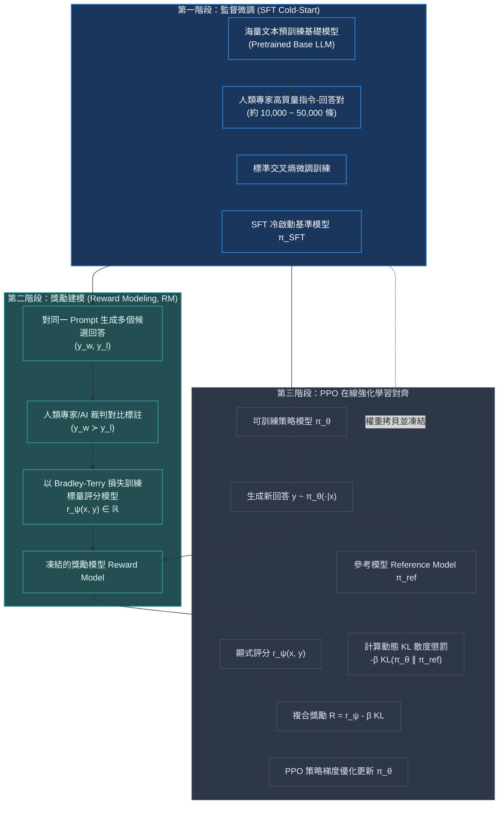

# Chapter 11: 三階段對齊·RLHF 獎勵建模與邊界 (3-Stage RLHF Pipeline)

> *「讓大語言模型擁有驚豔推理與對話能力的，從來不是十萬億 Tokens 的無監督預訓練，而是預訓練結束後那區區數萬步的 RLHF——它是雕刻巨石的刻刀，將冷酷的概率分佈接龍器馴化為符合人類價值觀與工程意圖的智能助手。」*

---

## 核心心智模型：經典 3 階段對齊流水線

自 OpenAI 在 2022 年發布 InstructGPT / ChatGPT 以來，**RLHF（Reinforcement Learning from Human Feedback）**的三階段流水線成為了全球前沿 AI 實驗室的標準工業規範：



---

## 11.1 獎勵模型 (Reward Model) 的訓練目標與 Pairwise Ranking 損失

人類很難對單一文本給出絕對精確的浮點數打分（例如：很難評判某個回答是 8.32 分還是 8.41 分），但人類極其擅長**相對排序（Pairwise Comparison）**：在兩個回答中快速挑出更好的那一個。

獎勵網絡 $r_\psi(x, y)$ 通常由 SFT 模型去掉最後的 LM Head，替換為一個輸出單個純量標量的線性投影層（$d_{\text{model}} \to 1$）。

### Pairwise 排名二元交叉熵損失
給定提示詞 $x$ 與人類標記的一對回答，其中 $y_w$ 勝過 $y_l$（$y_w \succ y_l$）：
$$\mathcal{L}_{\text{RM}}(\psi) = - \mathbb{E}_{(x, y_w, y_l) \sim \mathcal{D}} \left[ \ln \sigma\left( r_\psi(x, y_w) - r_\psi(x, y_l) \right) \right]$$

- 若 $r_\psi(x, y_w) \gg r_\psi(x, y_l)$，差值極大，$\sigma(\dots) \to 1$，損失趨近於 0。
- 若模型給差回答打了高分（$r_\psi(y_l) > r_\psi(y_w)$），差值為負，$\sigma \to 0$，損失激增，回傳強大的懲罰梯度。

---

## 11.2 為什麼必須加入 KL 散度約束？古德哈特定律與策略漂移

若直接讓 PPO 最大化獎勵模型評分 $\max_\theta \mathbb{E}[r_\psi(x, y)]$，模型將在短短幾十步內觸發**古德哈特定律（Goodhart's Law）**：
> *「當一個指標變成了目標，它就不再是一個好指標。」*

神經網絡獎勵模型 $r_\psi$ 只是真實人類偏好的不完美代理（Surrogate）。在未見過的狀態邊界，它必然存在對抗盲區（Adversarial Blindspots）。若無拘束，PPO 策略將學會生成荒謬的**對抗性亂碼串**或**無限重複的討好話術**，在獎勵模型上刷出 $+999$ 的虛假天文數字，而模型真實智商徹底崩潰。

### 複合獎勵函數構造
PPO 在每一步生成的 Token 上施加動態 KL 懲罰：
$$R(x, y) = r_\psi(x, y) - \beta \mathbb{D}_{\text{KL}}\left( \pi_\theta(y \mid x) \parallel \pi_{\text{SFT}}(y \mid x) \right)$$
其中單 Token 級別的 KL 散度近似為：
$$\mathbb{D}_{\text{KL}} \approx \ln \frac{\pi_\theta(y_t \mid x, y_{<t})}{\pi_{\text{SFT}}(y_t \mid x, y_{<t})}$$

### 自適應動態 KL 控制器 (Adaptive KL Controller)
手動設置固定的 $\beta$ 很難適應整個訓練週期。工業界通常採用比例積分自適應控制器：
$$\beta_{k+1} = \beta_k \cdot \left( 1 + K_p \cdot (d_k - d_{\text{target}}) \right)$$
- 當前策略漂移過大（$d_k > d_{\text{target}}$）時，自動拉高 $\beta$，嚴厲約束模型回歸原廠分佈；
- 當策略過於保守拘謹（$d_k < d_{\text{target}}$）時，主動調低 $\beta$，釋放策略的探索自由度。

> [!TIP]
> <button class="deep-link-btn" data-target="viz">🔬 啟動 3 階段對齊實驗室</button>，可以拖動 KL 散度係數 $\beta$ 與獎勵模型評分，直觀觀察有效回報邊界與策略坍塌區。

---

## 11.3 可執行的 PyTorch 獎勵模型 Pairwise 訓練模組

```python
import torch
import torch.nn as nn
import torch.nn.functional as F

class RewardModel(nn.Module):
    """基於 Transformer 骨幹的標量打分獎勵模型"""
    def __init__(self, base_transformer: nn.Module, hidden_dim: int):
        super().__init__()
        self.backbone = base_transformer
        # 標量分數投影頭
        self.value_head = nn.Linear(hidden_dim, 1, bias=False)

    def forward(self, input_ids: torch.Tensor, attention_mask: torch.Tensor) -> torch.Tensor:
        outputs = self.backbone(input_ids=input_ids, attention_mask=attention_mask)
        last_hidden_state = outputs.last_hidden_state # [B, L, D]
        rewards = self.value_head(last_hidden_state).squeeze(-1) # [B, L]
        
        # 提取每個序列最後一個有效 Token 的分數作為整句評分
        sequence_lengths = attention_mask.sum(dim=-1) - 1
        pooled_rewards = rewards.gather(1, sequence_lengths.unsqueeze(1)).squeeze(1)
        return pooled_rewards

def compute_reward_loss(
    chosen_scores: torch.Tensor,   # [B] 勝者回答評分 r(x, y_w)
    rejected_scores: torch.Tensor  # [B] 敗者回答評分 r(x, y_l)
) -> tuple[torch.Tensor, dict]:
    """
    Bradley-Terry Pairwise 交叉熵損失
    """
    logits = chosen_scores - rejected_scores
    # 損失: -log(sigmoid(chosen - rejected))
    loss = -F.logsigmoid(logits).mean()

    with torch.no_grad():
        accuracy = (chosen_scores > rejected_scores).float().mean()
        margin = logits.mean()

    metrics = {
        "rm_loss": loss.item(),
        "accuracy": accuracy.item(),
        "score_margin": margin.item(),
        "chosen_mean": chosen_scores.mean().item(),
        "rejected_mean": rejected_scores.mean().item()
    }
    return loss, metrics
```

---

## 11.4 RLHF 核心階段關鍵工程指標監控清單

| 階段 | 關鍵監控指標 | 正常健康範圍 | 異常警報與工程對策 |
|---|---|---|---|
| **Stage 1 (SFT)** | 驗證集 Perplexity (PPL) | 平滑下降至 2.0~4.0 | PPL 突然反彈：發生過擬合，需降低學習率或增強權重衰減 |
| **Stage 2 (RM)** | 驗證集 Pairwise Accuracy | 65% ~ 78% | Accuracy 超過 85% 通常意味著基準數據洩漏或評分過擬合表面字數 |
| **Stage 3 (PPO)** | 平均 KL 散度 (`approx_kl`) | 0.01 ~ 0.05 | KL > 0.1 甚至發散：立即觸發 Early-stop，增大 $\beta$ |
| **Stage 3 (PPO)** | 生成長度分佈 (Token Length) | 圍繞基準長度微增 10~20% | 長度爆炸性膨脹翻倍：觸發長度欺騙，加入長度懲罰因子 |

---

## 🤔 架構深度思辨與工業界陷阱 (Architectural Insight & Production Pitfalls)

### 問題 1：在訓練獎勵模型時，如果數據集中 $y_w$ 的平均長度顯著大於 $y_l$（例如人類普遍覺得寫得多的回答更認真），獎勵模型會學到什麼致命投機特徵？工業界在數據工程層面如何防範？
- **解答**：
  1. **長度偏見黑客（Verbosity Bias / Length Hacking）**：獎勵神經網絡極其善於走捷徑。它會直接在底層卷積或注意力層中，統計標點符號與長度計數，發現「只要回答超過 500 字就給高分，短回答直接給低分」，完全無視中間邏輯是否存在事實性胡說八道（Hallucination）。
  2. **工業界三大防禦措施**：
     - **反向長度對（Negative Length Pairs）**：在數據集中主動構造「言簡意賅的精準回答為勝者，廢話連篇的長回答為敗者」的反向樣本，打破長度與勝率的正相關性。
     - **長度邊界正則化**：在損失函數中加入長度懲罰項，或強制在同等長度區間內進行成對排序。
     - **Margin 懲罰**：$\mathcal{L} = -\ln \sigma(r(y_w) - r(y_l) - \alpha (|y_w| - |y_l|))$。

### 問題 2：OpenAI 在 InstructGPT 論文中提出了「RLHF 的對齊稅（Alignment Tax）」現象——模型經過 RLHF 後，在某些常規學術基準（如 SQuAD QA、CodeX 或語言建模困惑度）上的客觀指標反而出現了顯著下降。這背後的根本機制是什麼？
- **解答**：
  1. **模式塌縮與熵減（Mode Collapse）**：預訓練模型本質上覆蓋了整個互聯網多樣化的語言概率分佈；而 RLHF 的獎勵引導會強制策略向「人類審核員最滿意的單一高分模式」聚集。模型喪失了探索邊緣概率空間的能力，詞彙多樣性大幅縮水。
  2. **過度謹慎與拒絕回答（Over-Refusal）**：為了在安全與拒絕有害提問（Red-teaming）上拿滿分，模型會出現自相矛盾的泛化過度——將無害的學術提問（如「請解釋黑客帝國電影情節」）誤判為黑客攻擊而直接拒絕回答。
  3. **緩解方案**：在 PPO 的目標中加入**預訓練交叉熵梯度混合（PPO-ptx）**：
     $$\mathcal{L} = \mathcal{L}_{\text{PPO}} + \gamma_{\text{ptx}} \mathbb{E}_{x \sim \mathcal{D}_{\text{pretrain}}} [\ln \pi_\theta(x)]$$
     強迫模型在對齊人類的同時，依然保留底層通用語言建模能力。

---

## 參考文獻與經典論文

1. **Christiano, P. F., et al. (2017).** *Deep reinforcement learning from human preferences.* Advances in Neural Information Processing Systems (NeurIPS 30).
2. **Ouyang, L., et al. (2022).** *Training language models to follow instructions with human feedback.* Advances in Neural Information Processing Systems (NeurIPS 35).
3. **Bai, Y., et al. (2022).** *Training a helpful and harmless assistant with reinforcement learning from human feedback.* arXiv preprint arXiv:2204.05862.
