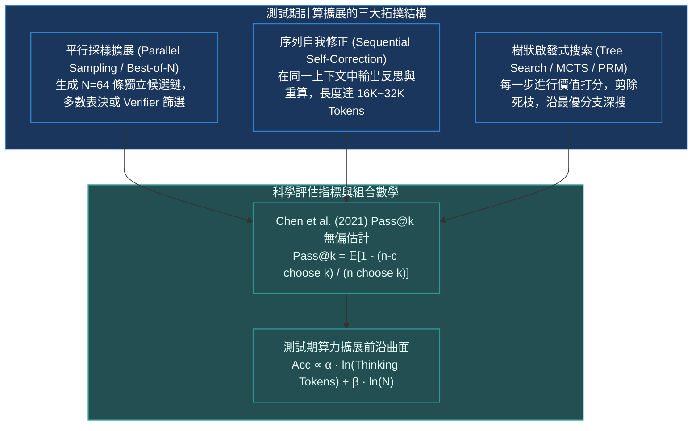

# Chapter 13: 測試期計算擴展·Pass@k 與思考鏈縮放 (Test-Time Compute)

> *「當預訓練數據撞上全互聯網高質量人類知識耗盡的物理之牆，AI 的擴展定律（Scaling Law）並未終結，而是轉移到了全新的維度——**測試期計算（Test-Time / Inference-Time Compute）**。讓模型在輸出最終答案前『多想一秒鐘』，小模型便能以驚人的精度斬殺體積大它十倍的龐然大物。」*

---

## 核心心智模型：從預訓練擴展轉向測試期思考擴展

在 2020~2023 年，大模型遵循著 Kaplan 與 Chinchilla 的**預訓練擴展定律（Pretraining Scaling Laws）**：性能僅取決於模型參數量 $N$ 與預訓練 Token 數 $D$。然而，當預訓練算力進入萬卡集群且能耗達到百兆瓦特級別時，邊際成本已難以承受。

以 **OpenAI o1** 與 **DeepSeek-R1** 為代表的推理革命揭示了全新的第二曲線：
**在推理評估時，賦予模型更多的思考計算預算（Thinking Tokens），模型的解決能力將沿著對數比例持續飆升！**



---

## 13.1 Chen et al. (2021) Pass@k 無偏組合數估計推導

在代碼生成（HumanEval）與數學競技（MATH / AIME）中，我們希望知道：**如果為每個問題採樣 $k$ 次，其中至少有一次答對的概率是多少？**

### 為什麼不能直接採樣 $k$ 次求經驗均值？
直覺的做法是直接為每道題採樣 $k$ 個樣本，若其中有正確答案則記為 1。
- **致命缺陷**：若 $k$ 很大（如 $k=100$），這需要巨大的採樣成本；若 $k=1$ 則隨機方差極大。更重要的是，在有限的測試集上，這種經驗統計具有很高的採樣偏差。

### 組合數無偏估計推導 (Chen et al. HumanEval)
OpenAI 的 Chen 等人提出：對每道題只生成較大集合 $n$ 個樣本（例如 $n \ge 100$），統計其中完全通過測試用例的正確答案數量 $c$。
我們在 $n$ 個樣本中無放回隨機抽取 $k$ 個，**全部都答錯的概率**為超幾何分佈：
$$P(\text{全錯}) = \frac{\binom{n - c}{k}}{\binom{n}{k}}$$

因此，**至少有一次答對的無偏估計量**為：
$$\text{Pass@}k = \mathbb{E}_{\text{problems}} \left[ 1 - \frac{\binom{n - c}{k}}{\binom{n}{k}} \right] = 1 - \frac{\prod_{i=0}^{k-1} (n - c - i)}{\prod_{i=0}^{k-1} (n - i)}$$

> [!NOTE]
> 當 $n - c < k$ 時，代表錯誤樣本數不足 $k$ 個，無論怎麼抽都必然至少抽到一個正確答案，此時 $\text{Pass@}k \equiv 1.0$。該公式在有限樣本下具備嚴格的無偏性與極低的估計方差。

> [!TIP]
> <button class="deep-link-btn" data-target="viz">🔬 啟動推理縮放定律實驗室</button>，可以自由調節採樣總數 $n$、正確數 $c$ 與思考 Token 長度，對比 Pass@k 與多數表決（Maj@k）的理論曲線。

---

## 13.2 思考 Token（Thinking Tokens）的對數縮放定律

Snell 等人（2024）深入研究了測試期計算的帕累托前沿：
對於難度為 $D$ 的問題，模型的準確率隨著測試期計算量 $C_{\text{test}}$（即生成長度與採樣分支數的乘積）呈對數漸近增長：
$$\text{Performance}(C_{\text{test}}) \approx \kappa \cdot \ln\left( \frac{C_{\text{test}}}{C_0} \right) + \text{BaseAcc}$$

在實際部署中，算力預算存在**動態最優分配（Compute-Optimal Tradeoff）**：
- **對於簡單題目（如 GSM8K）**：思考 200 個 Tokens 即可完全收斂，繼續延長思考長度只會增加延遲與長度溢出風險。
- **對於奧數競賽（AIME）與硬核競賽編程（Codeforces）**：擴展思考鏈長度至 16,000 Tokens 以上，正確率能從 15% 戲劇性攀升至 80% 以上！

---

## 13.3 可執行的 Python/PyTorch Pass@k 無偏估計防溢出實現

```python
import numpy as np

def estimate_pass_at_k(n: int, c: int, k: int) -> float:
    """
    計算 Chen et al. 無偏 Pass@k 估計值 (含嚴密數值下溢保護)
    Args:
        n: 總生成採樣數量 (n >= k)
        c: 通過測試用例的正確數量 (0 <= c <= n)
        k: 評估採樣預算
    """
    assert n >= k, f"總採樣數 n ({n}) 必須大於等於 k ({k})"
    assert 0 <= c <= n, f"正確數量 c ({c}) 必須落在 [0, n] 之間"

    # 若所有採樣均失敗，Pass@k 必為 0
    if c == 0:
        return 0.0
    # 若錯誤樣本數少於 k，則任意抽取 k 個必定至少包含 1 個正確答案
    if n - c < k:
        return 1.0

    # 數值防溢出累乘: 1 - ∏_{i=0}^{k-1} (n - c - i) / (n - i)
    prob_all_wrong = 1.0
    for i in range(k):
        prob_all_wrong *= (n - c - i) / (n - i)

    return float(1.0 - prob_all_wrong)

def evaluate_benchmark_pass_k(results: list[tuple[int, int]], k_list=[1, 5, 10]):
    """
    批量計算數據集上的平均 Pass@k
    results: 包含每道題的 (n, c) 元組列表
    """
    scores = {}
    for k in k_list:
        pass_k_vals = [estimate_pass_at_k(n, c, k) for (n, c) in results if n >= k]
        scores[f"Pass@{k}"] = float(np.mean(pass_k_vals)) if pass_k_vals else 0.0
    return scores

if __name__ == "__main__":
    # 測試示例：10 道題，每題採樣 n=20 次，各題正確數 c
    mock_benchmark = [
        (20, 0), (20, 2), (20, 5), (20, 1), (20, 8),
        (20, 12), (20, 0), (20, 18), (20, 4), (20, 6)
    ]
    res = evaluate_benchmark_pass_k(mock_benchmark, k_list=[1, 5, 10])
    for metric, val in res.items():
        print(f"{metric}: {val * 100:.2f}%")
```

---

## 13.4 測試期計算擴展三大範式橫向對比

| 範式名稱 | 核心架構機制 | 適用驗證器支持 | 算力成本與延遲 | 適用前沿場景 |
|---|---|---|---|---|
| **Majority Voting (Maj@k)** | 採樣 $k$ 條完整解答，按最終答案正則投票 | 弱（純無監督文本頻率投票） | 吞吐線性增加，需並發推理支持 | GSM8K, MATH 閉卷數值題 |
| **Best-of-N (BoN)** | 採樣 $N$ 條軌跡，由 RM 或 Verifier 挑選最高分 | 強（需高品質獎勵模型打分） | 延遲較高，易受 RM 黑客攻擊 | 寫作、代碼單元測試驗收 |
| **自發延長思維鏈 (Sequential CoT)** | 在單一自回歸上下文中自我提問、反思、重構 | **無（模型自發在內部完成思考循環）** | **最優（利用現代 KV Cache 持續接龍）** | **OpenAI o1、DeepSeek-R1 核心技術** |
| **MCTS + PRM 狀態樹搜索** | 在推理過程中逐步剪枝、回溯最優節點 | 強（需步驟級過程獎勵模型引導） | 延遲最高，工程部署難度極大 | AlphaGo、極限競技奧數競賽 |

---

## 🤔 架構深度思辨與工業界陷阱 (Architectural Insight & Production Pitfalls)

### 問題 1：在評估數學推理模型時，Pass@k 與多數表決（Majority@k / Self-Consistency）在工業界應用場景上有何本質區別？
- **解答**：
  1. **Pass@k 衡量的是「能力邊界（Capacity Upper Bound）」**：Pass@k 代表如果我們有一個完美的裁判（Oracle Verifier），模型在 $k$ 次嘗試中能否至少解出一次。它適用於代碼生成（可以用單元測試作為 Oracle）、定理證明等具備確定性客觀裁判的場景。
  2. **Majority@k 衡量的是「無監督在線部署表現（Deployable Accuracy）」**：在真實面向用戶的線上對話中，系統不可能人肉或者用測試集去挑選答案。此時只能依靠多數投票（Consensus）。然而，如果題目存在「常見直覺陷阱」，多數模型採樣都會掉入同一個錯誤思路，導致 Majority@k 常常把錯誤答案當作共識輸出。

### 問題 2：為什麼單純在推理時增加 Temperature 採樣更多樣的答案，無法替代真實的「訓練期推理思考鏈訓練（RLVR）」？
- **解答**：
  1. **無效噪聲 vs. 有效探索**：若基礎模型從未經過 RLVR 訓練，增大 Temperature 只會增加低概率胡言亂語的幻覺 Tokens，使得生成分佈迅速稀釋崩潰。
  2. **思維鏈延伸是強化學習自發強化的結果**：DeepSeek-R1 證明，「回過頭重新檢查（Wait, let me double check）」、「嘗試另一種幾何輔助線」等高維認知行為，必須在強化學習的策略梯度推動下，將對數似然概率真正錨定在網絡深層權重中。測試期計算只有與訓練期強化學習深度結合，才能真正釋放規模化智能。

---

## 參考文獻與經典論文

1. **Chen, M., et al. (2021).** *Evaluating large language models trained on code.* arXiv preprint arXiv:2107.03374.
2. **Snell, C., et al. (2024).** *Scaling LLM test-time compute optimally can be more effective than scaling model parameters.* arXiv preprint arXiv:2408.03314.
3. **Wang, X., et al. (2022).** *Self-consistency improves chain of thought reasoning in language models.* arXiv preprint arXiv:2203.11171.
