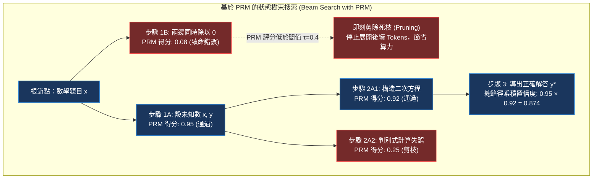

# Chapter 14: 過程獎勵模型·PRM 逐步推理與束搜索剪枝 (Process Reward Models)

> *「結果獎勵模型（ORM）只看最終答案對錯，容易獎勵靠運氣蒙對的荒謬推導；而過程獎勵模型（PRM）如同一位嚴苛的數學老師，緊盯解題步驟中的每一個等號與引理——在錯誤剛剛萌芽的瞬間揮刀剪枝，讓推理之樹永遠只沿著嚴謹邏輯的枝椏生長。」*

---

## 核心心智模型：結果監督 (ORM) vs. 過程監督 (PRM)

在長鏈條複雜數學推導（如 AIME / Olympiad）中，一個模型可能在第 3 步寫出了一個荒謬的代數錯誤，卻在第 15 步通過另一個巧合的計算失誤「負負得正」，碰巧得出了正確的數值答案。
- **結果獎勵模型（ORM, Outcome Reward Model）**：只能看見最終的數值正確，給予整條路徑滿分獎勵。這將強烈誤導策略學習錯誤的邏輯鏈條。
- **過程獎勵模型（PRM, Process Reward Model）**：在每個步驟（Step）末尾插入分隔符，為**每一個中間推導步驟獨立打分**：



---

## 14.1 過程標註難題與 Math-Shepherd 自動合成技術

OpenAI 在 2023 年發布的 *Let's Verify Step by Step* 論文中，耗費了數百萬美元僱用專業數學家標註了 80 萬個中間步驟。為了打破昂貴人工標註的枷鎖，學術界提出了 **Math-Shepherd（Wang et al. 2023）** 自動化無監督 PRM 標註管線：

### Math-Shepherd 自動生成標籤算法
給定題目 $x$ 與模型生成的一個中間步驟 $s_k$：
1. 從步驟 $s_k$ 的末端出發，利用快速推理引擎平行生成 $M$ 條完成剩餘解答的蒙特卡洛軌跡（Rollouts）。
2. 使用確定性驗證器驗收這 $M$ 條軌跡的最終答案。
3. 若其中有 $m$ 條最終算對，則該步驟的經驗成功率為：
   $$r(s_k) = \frac{m}{M} \in [0, 1]$$
4. 設定動態閾值（如 $r(s_k) \ge 0.5$ 標為 Positive，否則為 Negative），自動構建出千萬級精準的步驟級監督數據集！

---

## 14.2 束搜索 (Beam Search) 與死枝剪枝算法推導

在推理時，PRM 與搜索算法深度結合。定義在狀態 $s_t$ 下步驟候選集為 $\mathcal{C}(s_t)$。
束搜索在每一步維持寬度為 $B$ 的最優候選池：
$$\text{Beam}_{t} = \operatorname{Top-}B_{c \in \bigcup_{p \in \text{Beam}_{t-1}} \mathcal{C}(p)} \left[ \text{Score}(p) \cdot \text{PRM}(p \circ c) \right]$$

### 局部死枝硬剪枝準則 (Hard Pruning Condition)
若某個生成步驟的即時評分 $\text{PRM}(s) < \tau_{\text{cutoff}}$（例如 $\tau = 0.3$），則**無論其先驗語言模型概率多高，立即從束搜索池中徹底剔除**，杜絕浪費任何後續顯存與計算資源！

> [!TIP]
> <button class="deep-link-btn" data-target="viz">🔬 啟動過程獎勵模型實驗室</button>，可以手動調節 Beam 寬度 $B$ 與剪枝閾值 $\tau$，直觀觀察狀態樹展開軌跡與剪枝決策。

---

## 14.3 可執行的 PyTorch PRM 步驟評分器與束搜索控制器

```python
import torch
import torch.nn as nn
import torch.nn.functional as F

class ProcessRewardModel(nn.Module):
    """步驟級過程獎勵評分模型"""
    def __init__(self, backbone: nn.Module, hidden_dim: int, step_token_id: int):
        super().__init__()
        self.backbone = backbone
        self.step_token_id = step_token_id
        # 二元分類頭：預測當前步驟是否正確
        self.score_head = nn.Linear(hidden_dim, 1)

    def forward(self, input_ids: torch.Tensor, attention_mask: torch.Tensor) -> torch.Tensor:
        """
        輸出每個 step_token_id 位置的正確性概率 [0, 1]
        """
        outputs = self.backbone(input_ids=input_ids, attention_mask=attention_mask)
        hidden = outputs.last_hidden_state # [B, L, D]
        logits = self.score_head(hidden).squeeze(-1) # [B, L]
        step_probs = torch.sigmoid(logits)

        # 僅提取步驟結尾分隔標籤位置的概率
        step_mask = (input_ids == self.step_token_id)
        return step_probs * step_mask

def prune_and_rank_beams(
    candidate_steps: list[dict],
    prm_scores: list[float],
    beam_width: int = 4,
    prune_threshold: float = 0.35
) -> list[dict]:
    """
    基於 PRM 得分的束搜索剪枝與重排
    """
    survived_beams = []
    for step, score in zip(candidate_steps, prm_scores):
        if score >= prune_threshold:
            step_copy = dict(step)
            step_copy["cumulative_score"] = step.get("cumulative_score", 1.0) * score
            step_copy["prm_score"] = score
            survived_beams.append(step_copy)

    # 按照累積得分降序排序，保留前 B 個最優候選分支
    survived_beams.sort(key=lambda x: x["cumulative_score"], reverse=True)
    return survived_beams[:beam_width]
```

---

## 14.4 ORM vs PRM 多維工程特性對比

| 比較維度 | 結果獎勵模型 (ORM) | 過程獎勵模型 (PRM) |
|---|---|---|
| **標註粒度** | 整個序列單一標量標籤 ($\pm 1$) | 每個邏輯推導步驟獨立標籤 |
| **對蒙對答案的魯棒性** | 極差（嚴重被「負負得正」假象欺騙） | **極強（步驟出錯立即給予低分）** |
| **可解釋性** | 零（黑盒給分，無法定位出錯位置） | **完美（能精準高亮第幾步推導不合邏輯）** |
| **推理算力開銷** | 極低（僅在生成完畢後前向傳播一次） | 較高（每步生成均需調用 PRM 打分並重排） |
| **前沿搜索結合** | 僅支持 Best-of-N 全局重排 | **完美支持 MCTS、Beam Search 狀態樹逐步剪枝** |

---

## 🤔 架構深度思辨與工業界陷阱 (Architectural Insight & Production Pitfalls)

### 問題 1：在部署 PRM 進行線上服務時，每生成一個步驟就必須暫停、切換模型前向打分、做 KV Cache 管理，這會導致 Time-to-First-Token (TTFT) 與吞吐暴跌數倍。工業界有哪些極限加速架構？
- **解答**：
  1. **雙頭一體化架構（Joint Policy-PRM Head）**：無需加載兩個獨立的 70B 模型。直接在 Actor 策略模型的最後一層隱藏狀態上，平行掛載一個微型 PRM 標量打分頭。在策略接龍輸出步驟結尾 Token 的當前 Forward 週期內，同時計算出 LM Logits 與 PRM Score，顯存開銷增加不到 0.01%，零額外模型切換延遲！
  2. **非同步批處理投機搜索（Speculative Tree Search）**：讓推理引擎（如 vLLM）不等待 PRM 打分，盲目前向推導 2 步；後台異步進程完成 PRM 打分後，若發現出錯，直接在 KV Cache 中回滾截斷指針，大幅隱藏計算延遲。

### 問題 2：OpenAI 在發表 o1 系列模型時，淡化了顯式 PRM 樹搜索的宣傳，而是強調了「原生端到端自回歸 Extended CoT」。這是否意味著 PRM 路線被淘汰了？
- **解答**：
  1. **並非淘汰，而是從「外掛」融合成了「內生」**：在早期，工程師需要人為用 Python 代碼寫 MCTS 搜索循環外掛在模型周圍；而 DeepSeek-R1 與 o1 揭示：**通過強化學習（GRPO），模型自身學會了在思維鏈中自發充當自己的 PRM**！
  2. **自回歸內化**：模型在生成過程中輸出 *「Wait, that equation has no real root, let me try substitution instead...」*，本質上就是模型內部隱空間自發完成了「評估中間步驟 $\to$ 判定錯誤 $\to$ 主動回溯剪枝」的完整閉環。PRM 依然是引導這類能力訓練與數據合成的核心技術基礎。

---

## 參考文獻與經典論文

1. **Lightman, H., et al. (2023).** *Let's verify step by step.* arXiv preprint arXiv:2305.20050.
2. **Wang, P., et al. (2023).** *Math-Shepherd: Verify and reinforce step-by-step reasoning of large language models without human annotations.* arXiv preprint arXiv:2312.08935.
3. **Uesato, J., et al. (2022).** *Solving math word problems with process- and outcome-based feedback.* arXiv preprint arXiv:2211.14275.
