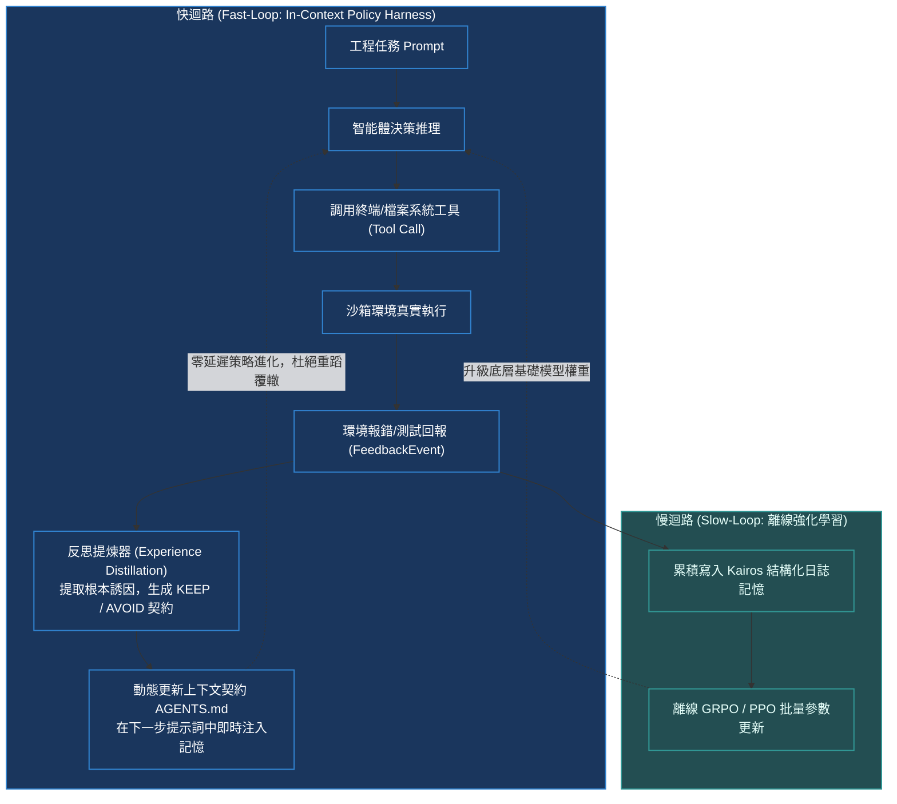

# Chapter 15: 上下文策略學習·In-Context Policy & Harness

> *「神經網絡權重的梯度反向傳播是昂貴、遲緩且不可逆的『慢思維（Slow Loop）』；而在長上下文窗口中進行實時經驗提煉、動態規則反思與 KEEP/AVOID 注入，則是靈動高效的『快思維（Fast Loop）』——Agent Harness 工程正在將大模型鍛造為永不重複犯錯的自進化在線智能體。」*

---

## 核心心智模型：快慢雙迴路 (Fast-Loop vs Slow-Loop)

在複雜軟體工程與自主智能體（Autonomous Agents）中，傳統的參數更新面臨嚴峻挑戰：每次遇到新 Bug 都要重新微調權重是不切實際的，且極易引發災難性遺忘。

現代 Agentic RL 架構引入了**快慢雙迴路學習範式（Dual-Loop Learning）**：
- **慢迴路（Slow Loop · 參數更新）**：每隔數天或數週，將累積的大規模軌跡進行離線 GRPO / PPO 微調，更新底層模型權重。
- **快迴路（Fast Loop · 上下文策略學習）**：在單次任務或會話運行期間，**Agent Harness 框架**攔截執行環境反饋，實時提煉經驗，將踩坑教訓動態轉化為結構化的 `AGENTS.md` 規則注入系統提示詞，實現秒級策略自適應！



---

## 15.1 KairosLogMemory 與結構化事件記憶架構

在長程 Agent 任務中，未經壓縮的原始輸出會迅速撐爆 Context Window。**Kairos 雙視圖日誌記憶（Dual-View Log Memory）** 提供了完美的解決方案：

1. **人類緊湊視圖（Compact Human View）**：單行高密度純文本，記錄時間戳、事件類型、操作目標與返回值摘要。
2. **模型完整狀態視圖（Full Trace View）**：包含完整 stdin/stdout、AST 變更 Diff 與環境異常堆疊。

### KEEP / AVOID 契約合成機制
當 Agent 遭遇環境失敗（如命令超時或語法錯誤）時，Harness 不僅僅回傳報錯，而是引導模型生成一對具有強大約束力的契約語句：
- **`KEEP`（成功模式保留）**：*「在執行數據庫遷移前，始終執行 `pg_isready -h localhost` 探針檢查。」*
- **`AVOID`（失敗路徑阻斷）**：*「嚴禁在未帶 `--non-interactive` 標誌的情況下調用 `apt-get install`，否則會因等待鍵盤輸入而掛起死鎖。」*

> [!TIP]
> <button class="deep-link-btn" data-target="viz">🔬 啟動 Agentic 策略實驗室</button>，可以手動注入各類工具報錯事件，實時觀察 KEEP/AVOID 規則提取與動態 Prompt 注入演變。

---

## 15.2 可執行的 Python 經驗提煉與動態規則注入實現

```python
import time
from dataclasses import dataclass, field

@dataclass
class FeedbackEvent:
    event_id: str
    tool_name: str
    command: str
    exit_code: int
    error_output: str
    timestamp: float = field(default_factory=time.time)

class InContextPolicyHarness:
    """上下文策略提煉與動態 Prompt 注入引擎"""
    def __init__(self, max_rules: int = 5):
        self.rules_keep = []
        self.rules_avoid = []
        self.max_rules = max_rules

    def ingest_event(self, event: FeedbackEvent):
        """分析環境反饋，動態提煉經驗契約"""
        if event.exit_code == 0:
            # 提煉成功經驗
            if "git commit" in event.command:
                self._add_rule(self.rules_keep, "提交代碼前確保 pre-commit hook 靜態檢查通過")
        else:
            # 提煉失敗教訓
            if "Permission denied" in event.error_output:
                self._add_rule(self.rules_avoid, f"調用 {event.tool_name} 時避免寫入受保護的根目錄，改用 scratch/")
            elif "Connection refused" in event.error_output:
                self._add_rule(self.rules_avoid, f"在服務進程未就緒前，切勿發送 HTTP 請求")

    def _add_rule(self, target_list: list[str], rule: str):
        if rule not in target_list:
            target_list.append(rule)
            if len(target_list) > self.max_rules:
                target_list.pop(0) # 保持最高優先級的滑動窗口

    def render_system_prompt_overlay(self) -> str:
        """動態渲染注入到系統提示詞中的運行期契約"""
        if not self.rules_keep and not self.rules_avoid:
            return ""

        overlay = ["\n### [RUNTIME CONTRACT - AGENT HARNESS ACTIVE MEMORY]"]
        if self.rules_keep:
            overlay.append("Guidelines to KEEP (Validated Successful Patterns):")
            for r in self.rules_keep:
                overlay.append(f"  - ✓ {r}")
        if self.rules_avoid:
            overlay.append("Pitfalls to AVOID (Enforced Safeguards):")
            for r in self.rules_avoid:
                overlay.append(f"  - ✗ {r}")
        overlay.append("--------------------------------------------------\n")
        return "\n".join(overlay)

if __name__ == "__main__":
    harness = InContextPolicyHarness()
    # 模擬一次失敗反饋
    err_event = FeedbackEvent(
        event_id="evt_01",
        tool_name="bash",
        command="cat /var/log/syslog > /etc/backup.txt",
        exit_code=1,
        error_output="Permission denied: /etc/backup.txt"
    )
    harness.ingest_event(err_event)
    print(harness.render_system_prompt_overlay())
```

---

## 15.3 參數微調 vs. 上下文策略工程深度對比

| 評估維度 | 權重微調 (LoRA / Full FT) | 離線 RL (PPO / GRPO) | 上下文策略工程 (In-Context Policy) |
|---|---|---|---|
| **適應延遲** | 數小時至數天（需重新訓練） | 數小時至數天 | **0 毫秒（即時寫入 Prompt 上下文生效）** |
| **計算資源消耗** | 需多卡 A100/H100 算力集群 | 需巨量 GPU 顯存支持 | **0 額外訓練顯存開銷** |
| **災難性遺忘風險** | 高（微調易衝淡通用能力） | 中等（需依賴嚴格 KL 約束） | **完全為零（底層權重被凍結保護）** |
| **策略可解釋性** | 極差（黑盒權重分佈變動） | 極差 | **完美（純人類可讀的 Markdown 契約規則）** |
| **持久化記憶空間** | 權重參數文件 | 權重參數文件 | 結構化本地檔案系統（如 `AGENTS.md`） |

---

## 🤔 架構深度思辨與工業界陷阱 (Architectural Insight & Production Pitfalls)

### 問題 1：在長期運行的自主 Coding Agent（如 SWE-bench 求解器）中，隨著運行步驟增加，Context Window 迅速被歷史命令輸出塞滿。工業界如何平衡「保留關鍵歷史教訓」與「防止上下文窒息（Context Saturation）」？
- **解答**：
  1. **上下文窒息災難**：若一股腦將所有 50 步的終端輸出塞入 Prompt，自注意力機制的分佈會被海量的長輸出稀釋（Lost in the Middle 現象），導致模型甚至忽略最初的系統指令。
  2. **工業級分級記憶架構（Tiered Memory Architecture）**：
     - **L1 瞬時記憶（Ephemeral Buffer）**：保留最近 3 步的完整 stdin/stdout，用以支撐當前緊湊的語法除錯。
     - **L2 結構化契約（Synthesized Rules）**：利用微型模型（如 8B 模型）將超過 3 步的歷史錯誤蒸餾為單行條目的 KEEP/AVOID 規則，寫入 `AGENTS.md`。原始數千行輸出直接從上下文銷毀！
     - **L3 外掛檢索（Vector / Grep Search）**：將超長日誌落盤存為本地文件，模型僅在需要時主動調用 `grep_search` 工具局部檢索，實現虛擬無限記憶！

### 問題 2：在多 Agent 協同（Multi-Agent System）中，若兩個智能體各自提煉出了互相衝突的 AVOID 規則，會引發什麼死鎖現象？Harness 應如何進行仲裁？
- **解答**：
  1. **策略震盪與死鎖（Policy Oscillation）**：Agent A 提煉了 *「AVOID 單次寫入超過 50 行代碼」*，而 Agent B 提煉了 *「AVOID 將模組拆分成過多零碎的小文件」*。兩者相互矛盾，導致系統在局部死循環中反覆重構代碼卻無法取得實質進展。
  2. **Harness 頂層仲裁協議**：
     - **優先級權重仲裁（Precedence Hierarchy）**：安全性規則（如禁止提權、禁止刪除源碼）具有最高硬優先級，代碼風格與重構規則屬於軟優先級。
     - **單一真理來源（Single Source of Truth, SSOT）**：所有 Agent 只能向根目錄的全局 `AGENTS.md` 申請變更，由中央 Harness 審計器執行語法無衝突校驗，衝突時強行回退至最保守的初始約定。

---

## 參考文獻與經典論文

1. **Park, J. S., et al. (2023).** *Generative agents: Interactive simulacra of human behavior.* In Proceedings of the 36th Annual ACM Symposium on User Interface Software and Technology.
2. **Shinn, N., et al. (2023).** *Reflexion: Language agents with verbal reinforcement learning.* Advances in Neural Information Processing Systems (NeurIPS 36).
3. **DeepAgents Core Team. (2025).** *Autonomous Agent Harness Engineering & In-Context Policy Specification.* Internal Technical Report.
