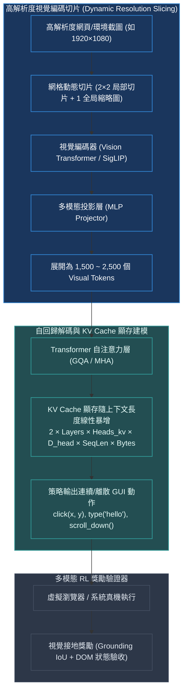

# Chapter 17: 多模態視覺 Agent·VLM RL 與 KV Cache 內存建模 (Multimodal RL)

> *「當大模型睜開雙眼直視屏幕像素與現實物理世界，輸入不再僅僅是幾十個字符，而是數千個高維視覺 Tokens（Visual Tokens）——多模態視覺強化學習（VLM RL）將智能體推向了具身智能與桌面 GUI 自動化的全新前沿，同時在 GPU 顯存中掀起了一場嚴酷的 KV Cache 內存風暴。」*

---

## 核心心智模型：視覺網格切片與長上下文顯存挑戰

在 GUI 操作（如操作瀏覽器 WebArena、手機操作 OSWorld）或機器人操作中，視覺語言模型（VLM）需要同時解析截圖像素並輸出精準的坐標點擊動作（如 `click(x=340, y=780)`）：



### 為什麼純文本模型無法替代視覺 Agent？
許多傳統網頁 Agent 試圖將 HTML DOM 樹全盤轉為純文本傳給 LLM。然而：
1. **DOM 樹體積爆炸**：現代動態前端頁面（React/Vue）生成的 DOM 樹往往長達數十萬字，充斥著混淆的 CSS 類名與 SVG 代碼，嚴重浪費 Context。
2. **視覺幾何信息的不可逆丟失**：純文本無法表達元素的真實層疊遮擋（Z-index）、彈窗覆蓋、顏色對比度以及動態動畫位置。**像素（Raw Pixels）才是終端人機界面的最高維通用表示**！

---

## 17.1 KV Cache 顯存消耗的精確數學解析模型

在多模態長序列推理與 RL Rollout 採樣中，**KV Cache（鍵值快取）往往超越模型權重本身，成為引發 OOM（顯存爆炸）的第一元兇**！

### KV Cache 顯存解析計算公式
設模型層數為 $L$，隱藏維度為 $H$，Attention 頭數為 $N_{\text{heads}}$，每個頭的維度為 $d_{\text{head}} = H / N_{\text{heads}}$。
若採用分組查詢注意力（GQA, Grouped-Query Attention），設 Key-Value 投影頭數為 $N_{\text{kv}}$（通常為 8，而 Query 頭數為 32 或 64）。
當前批次大小為 $B$，總序列長度（包含 Visual Tokens 與文字）為 $S$，數據精度為 $\text{Bytes}$（FP16/BF16 為 2 字節，FP8 為 1 字節）：

$$\text{Memory}_{\text{KV}} = 2 \times L \times N_{\text{kv}} \times d_{\text{head}} \times S \times B \times \text{PrecisionBytes}$$

> [!NOTE]
> 前方乘數 $2$ 代表分別存儲 **Key 矩陣** 與 **Value 矩陣**。
> 以 7B 參數模型（$L=32, N_{\text{kv}}=8, d_{\text{head}}=128$, BF16=2 Bytes）為例：
> 單個 Token 在 KV Cache 中佔用的顯存為：
> $2 \times 32 \times 8 \times 128 \times 1 \times 2 = 131,072\text{ 字節} = 128\text{ KB/Token}$！
> 若一輪包含 4 張截圖（每張 2000 Tokens，總長度 $S=8192$），單並發請求（$B=1$）的 KV Cache 就霸佔了 **$1.0\text{ GB}$ 顯存**；在並發 Rollout $B=32$ 時，KV Cache 需要 **$32\text{ GB}$ 顯存**！

> [!TIP]
> <button class="deep-link-btn" data-target="viz">🔬 啟動多模態顯存實驗室</button>，可以自由調節圖像分辨率切片數、序列長度與 GQA 比例，實時計算 KV Cache 與靜態權重佔用，預測 GPU OOM 警戒線。

---

## 17.2 可執行的 Python VLM KV Cache 顯存與 Token 開銷計算器

```python
def calculate_vlm_memory_budget(
    batch_size: int,
    num_images: int,
    image_resolution: tuple[int, int] = (1080, 1920),
    patch_size: int = 14,
    text_tokens: int = 512,
    num_layers: int = 32,
    num_kv_heads: int = 8,
    head_dim: int = 128,
    precision_bytes: int = 2 # 2 for BF16/FP16, 1 for FP8
) -> dict:
    """
    精確預估多模態 VLM 代理推理期顯存與 Token 開銷
    """
    h, w = image_resolution
    # 網格切片展開：局部 2x2 切片 + 1 個全局縮略圖 (如 LLaVA-NeXT / Qwen2-VL)
    patches_per_tile = (336 // patch_size) * (336 // patch_size) # 24x24 = 576
    tokens_per_image = 576 * (4 + 1) # 5 個 tile 展開 = 2880 tokens
    
    total_visual_tokens = num_images * tokens_per_image
    total_seq_len = total_visual_tokens + text_tokens

    # KV Cache 計算 (Bytes)
    # 2 (K & V) * Layers * KV_Heads * Head_Dim * SeqLen * Batch * Precision
    kv_cache_bytes = (
        2 * num_layers * num_kv_heads * head_dim * total_seq_len * batch_size * precision_bytes
    )
    kv_cache_gb = kv_cache_bytes / (1024 ** 3)

    return {
        "tokens_per_image": tokens_per_image,
        "total_seq_len": total_seq_len,
        "kv_cache_gb": round(kv_cache_gb, 3),
        "visual_token_percentage": round((total_visual_tokens / total_seq_len) * 100, 1)
    }

if __name__ == "__main__":
    spec = calculate_vlm_memory_budget(batch_size=8, num_images=2)
    print("VLM 顯存與 Token 預估矩陣:")
    for k, v in spec.items():
        print(f"  {k}: {v}")
```

---

## 17.3 視覺 Agent 強化學習獎勵設計範式

| 動作維度 | 預測格式 | 驗證器 (Verifier) 獎勵機制 | 負面懲罰與防禦 |
|---|---|---|---|
| **元素點擊 (Click)** | `click(x, y)` 歸一化坐標 $[0, 1000]^2$ | 檢測坐標是否落在目標按鈕 Bounding Box 內（IoU / Point-in-Box） | 點擊空白死區給予微小負回報 $-0.05$ |
| **文本鍵入 (Type)** | `type(text="search keyword")` | 驗證輸入框文本內容是否與目標完全匹配 | 未先聚焦輸入框直接鍵入扣分 |
| **頁面滾動 (Scroll)** | `scroll(direction="down")` | 驗證滾動後目標元素是否進入可見視窗（Viewport） | 達到頁面底部仍盲目滾動扣分 |
| **終局任務驗收** | 最終業務結果（如完成機票預訂） | 檢查 DOM 狀態、數據庫變更或確認界面 URL | 超時未完成給予大懲罰 $-1.0$ |

---

## 🤔 架構深度思辨與工業界陷阱 (Architectural Insight & Production Pitfalls)

### 問題 1：在多輪長對話視覺 Agent（例如連續操作 20 步的瀏覽器助手）中，歷史每一步都包含一張 2000 Tokens 的截圖。若不加處理，第 20 步時歷史截圖將高達 40,000 Tokens，導致顯存瞬間打爆。工業界最優的視覺 Token 剪枝（Pruning）策略是什麼？
- **解答**：
  1. **動態圖像丟棄與語義摘要（Image-to-Text Eviction）**：人類在操作瀏覽器時，根本不需要記憶 10 步前網頁的每一個像素。工業界最標準的做法是**僅保留最近 1~2 步的原始高解析度圖像**；對於超過 2 步的歷史截圖，利用輕量 VLM 將其提煉為精煉的單行文本描述（如 *「在第 3 步點擊了搜索按鈕，跳轉至機票列表頁」*），並徹底將歷史截圖的 Visual Tokens 從 KV Cache 中強制剔除（Evict）！
  2. **跨步 KV Cache 共享與 PagedAttention 複用**：若多輪交互僅有局部動態加載，利用 vLLM 的 PagedAttention 共享系統 Prompt 與全局靜態視覺組件的緩存，節省 60% 冗餘顯存。

### 問題 2：為什麼視覺接地（Visual Grounding）的 RL 訓練中，直接回傳連續浮點坐標的 Gaussian Policy（如 SAC）往往難以收斂，而將坐標離散化為 Token（如 `{"point": [342, 518]}`）卻能取得驚人成功？
- **解答**：
  1. **自回歸預訓練先驗的兼容性**：現代基礎大模型在預訓練階段見過海量的 HTML 代碼、JSON 數據與坐標文本。將坐標離散化為自回歸詞表中的數字 Token，能**最大程度繼承模型底層海量的預訓練模式匹配先驗**。
  2. **高斯連續策略的多峰缺陷**：在網頁界面中，兩個功能完全相同的按鈕可能分別位於屏幕的最左側（$x=100$）和最右側（$x=900$）。標準單峰高斯策略 $\mathcal{N}(\mu, \sigma)$ 在優化時，均值會被迫取折中值 $\mu = 500$（屏幕正中央的空白處），導致點擊在無效區域；而自回歸離散分佈是天然的**多峰概率分佈（Multimodal Distribution）**，能精確對兩個分離的按鈕賦予高概率，完美適配 UI 界面拓撲！

---

## 參考文獻與經典論文

1. **Liu, H., et al. (2023).** *Visual instruction tuning (LLaVA).* Advances in Neural Information Processing Systems (NeurIPS 36).
2. **Zhou, S., et al. (2024).** *WebArena: A realistic web environment for building autonomous agents.* International Conference on Learning Representations (ICLR).
3. **Kwon, W., et al. (2023).** *Efficient memory management for large language model serving with PagedAttention.* In Proceedings of the 29th ACM Symposium on Operating Systems Principles (SOSP).
