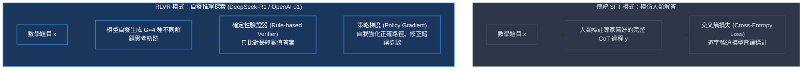
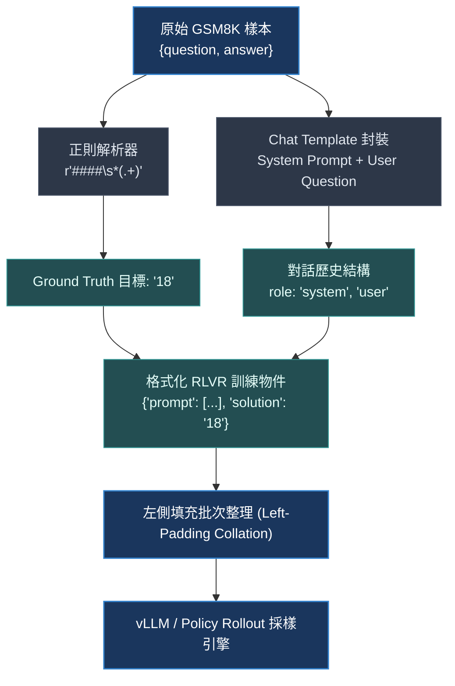
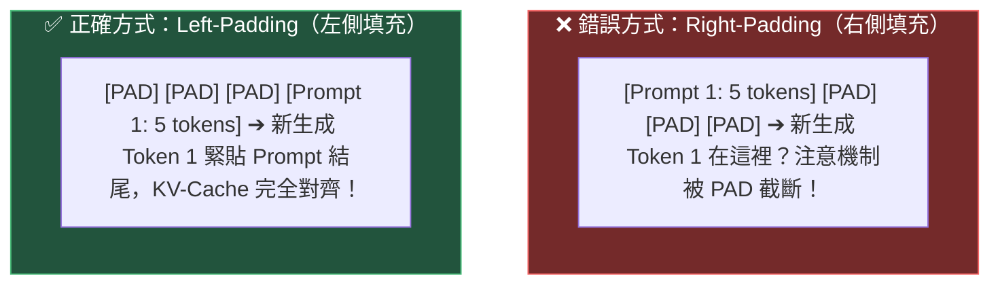

# Chapter 1: 資料準備與格式化 (Data Preparation for RLVR)

> *「在強化學習的世界裡，你定義的資料分佈決定了模型推理能力的上限，而資料的可驗證性則決定了訓練是否能收斂。」*

---

## 核心心智模型：SFT 模仿 vs. RLVR 探索

傳統監督微調（SFT, Supervised Fine-Tuning）與可驗證獎勵強化學習（RLVR, Reinforcement Learning with Verifiable Rewards）代表了兩種截然不同的模型進化哲學：



- **SFT 像「背誦參考書」**：人類寫什麼思維鏈，模型就學什麼模式。一旦遇到訓練集沒見過的新難題，模型很容易陷入幻覺。
- **RLVR 像「只給題目與標準答案，讓學生自己在草稿紙上嘗試」**：模型在嘗試過程中發現：「當我在 `<reasoning>` 裡寫出 *『Wait, let me recalculate...』* 時，最後算對的機率居然更高！」——於是**自我反思（Self-Correction）與思維鏈延伸（Extended CoT）便自然湧現**。

因此，RLVR 的資料準備只需要兩個核心元素：
1. **輸入提示詞（Prompt $x$）**：清晰、無歧義的題目描述。
2. **確定性基準答案（Ground-Truth Target $y^*$）**：能被演算法精確比對的標準標籤（如整數、浮點數、代碼測試集）。

---

## 1.1 理想 RLVR 數據的四大特質

並非所有資料都適合拿來訓練 RLVR。下表歸納了高質量 RLVR 訓練樣本的判斷維度：

| 特質維度 | 核心意義與直覺 | 典型範例 | 反面教材（不可驗證） |
|---|---|---|---|
| **可驗證性 (Verifiable)** | 能用確定性程式碼（Regex、SymPy、單元測試）在 1 毫秒內給出 0 或 1 的布林判定 | `42`、`[1, 2, 3]` | 「請寫一首描述秋天的優美詩歌」（過於主觀） |
| **無歧義性 (Unambiguous)** | 正確答案空間是封閉且唯一的，避免多解引發獎勵噪聲 | 數學求值、閉卷邏輯推理 | 「這部電影好看嗎？」（答案隨人而異） |
| **難度甜蜜區 (Goldilocks Band)** | 基礎模型在未經訓練時，其 Pass@k 應落在 10%～50% 之間 | GSM8K 對於 0.5B～7B 模型 | 基礎模型 Pass@k 為 0%（無有效梯度）或 100%（無提升空間） |
| **多樣性 (Diverse)** | 涵蓋四則運算、代數方程、單位換算與文字陷阱，防止模型過擬合特定數值範圍 | 混合算術與多步推理題庫 | 整批資料全是純加法運算 |

> [!TIP]
> **Goldilocks 難度法則**：如果題目太難，模型生成 8 個採樣全錯，組內優勢方差為 0，梯度信號歸零；如果題目太簡單，8 個採樣全對，優勢同樣全為 0。只有在「有人答對、有人答錯」的題目上，RLVR 才能發揮最大的探索驅動力。

---

## 1.2 GSM8K — 基準訓練資料集解構

**GSM8K**（Grade School Math 8K）由 OpenAI 發布，是強化學習推理對齊的黃金基準資料集：
- 包含 **8,792** 道高質量的美國小學應用題。
- 每個樣本包含自然語言解題步驟，並以 `####` 符號標記最終數值答案。

### 原始 GSM8K 數據結構

```json
{
  "question": "Janet's ducks lay 16 eggs per day. She eats three for breakfast every morning and bakes muffins for her friends every day with four. She sells every duck egg at the farmers' market daily for $2. How much in dollars does she make every day at the farmers' market?",
  "answer": "Janet sells 16 - 3 - 4 = <<16-3-4=9>>9 duck eggs a day.\nShe makes 9 * 2 = <<9*2=18>>$18 every day at the farmer's market.\n#### 18"
}
```

在 RLVR 中，我們丟棄人類的中間推導過程，僅抽取問題文字與 `####` 後的目標值 `18`。

---

## 1.3 資料清洗與 Chat Template 格式化管線

在進入 GRPO 演算法前，資料必須經過嚴格的格式化管線：



### System Prompt 與 XML 標籤設計

為了讓驗證器能夠無歧義地抽取解答，我們在 System Prompt 中規範清晰的 XML 標籤：

```python
SYSTEM_PROMPT = """You are a helpful math reasoning assistant. You must solve math problems step by step.

First, think through the problem inside <reasoning> tags.
Then, provide your final numerical answer inside <answer> tags.

Example format:
<reasoning>
I need to calculate the total cost.
5 items × $3 each = $15
</reasoning>
<answer>15</answer>

Important: Your answer must be ONLY a number inside the <answer> tags."""
```

#### 為什麼採用 `<reasoning>` 與 `<answer>` 標籤？
1. **釋放思維鏈（CoT）潛能**：給模型一個專屬的「思考緩衝區」，使其可以在做出結論前生成足夠多的思考 tokens。
2. **驗證器確定性提取**：驗證程式只需要用正則表達式 `r"<answer>\s*(.*?)\s*</answer>"` 即可無損取出最終答案，免去解析複雜自然語言語意的困擾。

### 資料管線實作代碼

```python
import re
from datasets import load_dataset

# 載入前 5 筆樣本進行驗證
dataset = load_dataset("openai/gsm8k", "main", split="train[:5]")

def extract_gsm8k_answer(answer_text: str) -> str:
    """提取並清洗 '####' 後方的純數值解答"""
    match = re.search(r"####\s*(.+)", answer_text)
    if match:
        answer = match.group(1).strip()
        # 清除貨幣符號與千分位逗號
        return answer.replace(",", "").replace("$", "")
    return answer_text.strip()

def format_prompt(question: str) -> list[dict]:
    """將題目包裝為多輪對話訊息結構"""
    return [
        {"role": "system", "content": SYSTEM_PROMPT},
        {"role": "user", "content": question}
    ]

formatted_samples = [
    {
        "prompt": format_prompt(s["question"]),
        "solution": extract_gsm8k_answer(s["answer"])
    }
    for s in dataset
]

print(f"成功載入 {len(formatted_samples)} 筆樣本。")
print("Sample 0 提示詞前 60 字:", formatted_samples[0]["prompt"][1]["content"][:60], "...")
print("Sample 0 正確解答:", formatted_samples[0]["solution"])
```

---

## 1.4 自回歸 Rollout 與 Left-Padding 直覺深度解析

在訓練階段，計算損失是平行的；但在**採樣階段（Rollout Phase）**，多個不同的 Prompt 會以 Batch 形式被送進 GPU 進行平行自回歸生成。



> [!IMPORTANT]
> **直覺理解**：自回歸語言模型永遠是根據「最後一個 token」的隱藏狀態預測「下一個 token」。若使用右側填充（Right-Padding），最右側全都是 `<pad>` 填充字符，模型在預測第一個輸出詞時，上下文被無效字符隔開，導致輸出立刻崩潰。因此：**生成採樣必須強制設置 `tokenizer.padding_side = "left"`**！

```python
import torch
from transformers import AutoTokenizer

tokenizer = AutoTokenizer.from_pretrained("Qwen/Qwen2.5-0.5B-Instruct")
tokenizer.pad_token = tokenizer.eos_token
tokenizer.padding_side = "left"  # 關鍵設定：採樣生成必須左側填充

# 使用 Chat Template 渲染純文字字串
raw_texts = [
    tokenizer.apply_chat_template(s["prompt"], tokenize=False, add_generation_prompt=True)
    for s in formatted_samples[:3]
]

# 批次編碼與自動左側填充
batch_inputs = tokenizer(raw_texts, padding=True, return_tensors="pt")

print("input_ids 維度:      ", batch_inputs["input_ids"].shape)
print("attention_mask 維度: ", batch_inputs["attention_mask"].shape)
print("第一列開頭 tokens (驗證左側填充):", batch_inputs["input_ids"][0, :5].tolist())
print("全批次填充 token 總數: ", (batch_inputs["attention_mask"] == 0).sum().item())
```

---

## 1.5 資料品質檢驗與完整性防禦

在將大量資料送入昂貴的 GPU 集群前，必須編寫防禦性檢查腳本，確保所有答案均符合數值標準，避免訓練因單一異常字串中斷：

```python
def validate_dataset(samples):
    valid_count = 0
    for idx, s in enumerate(samples):
        # 1. 驗證標籤是否為可解析的數值
        ans = s["solution"]
        try:
            float(ans)
        except ValueError:
            raise ValueError(f"樣本 #{idx} 包含無法轉換為浮點數的解答: '{ans}'")
        
        # 2. 驗證對話結構是否完整
        assert len(s["prompt"]) == 2, f"樣本 #{idx} 必須包含 system 與 user 訊息"
        assert s["prompt"][0]["role"] == "system"
        assert s["prompt"][1]["role"] == "user"
        valid_count += 1
    return valid_count

checked = validate_dataset(formatted_samples)
print(f"✅ 成功通過資料防禦驗證：{checked}/{len(formatted_samples)} 筆樣本合格。")
```

---

## 1.6 常見 RLVR 數據集全景對比

除了小學數學 GSM8K，業界在探索長思維鏈與推理擴展時廣泛使用以下基準：

| 數據集名稱 | 領域與任務 | 驗證器實作方式 | 典型基準準確率 (Base Model) |
|---|---|---|---|
| **GSM8K** | 小學應用題 | 正則抽取 + 數值等價比對 | 20% – 55% |
| **MATH / AMC** | 競賽級數學 | SymPy 符號簡化與 LaTeX 比對 | 5% – 25% |
| **HumanEval / MBPP** | Python 演算法代碼 | Docker 沙箱單元測試 (`pytest`) | 15% – 45% |
| **Countdown** | 算術組合謎題 | 逆波蘭運算式規則解析 | 10% – 40% |
| **ARC-Challenge** | 常識推理與科學問題 | 精確選項字母比對 (A/B/C/D) | 30% – 60% |

---

## 🤔 架構深度思辨與工業界陷阱 (Architectural Insight & Production Pitfalls)

> [!IMPORTANT]
> **Frontier Lab 核心考點 (DeepMind / OpenAI / Anthropic MLE)**:
> - **陷阱與對策 (Failure Mode & Fix)**:
>   1. **Rollout 填充方向陷阱 (Padding Side)**: 
>      在生成階段（`model.generate`），若誤將 tokenizer 設為 `padding_side = "right"`，自回歸 KV-Cache 會將 `<pad>` token 納入注意力上下文，使模型將填充符號視為生成前綴，造成長度爆炸或注意力崩潰。**生成採樣必須嚴格使用 `left-padding`**。
>   2. **數據污染 (Data Contamination)**: 
>      GSM8K 與 MATH 測試題已被大量公開預訓練語料爬取。工業界在準備 RLVR 數據時，會使用 MinHash 13-gram LSH 進行嚴格去重，並藉助 Rejection Sampling 生成完全未見過的合成題庫。
> - **核心技術思辨 (Technical Deep Dive)**:
>   *Q: 為什麼在 RLVR 訓練中，我們只對模型生成的回答計算策略梯度損失，而對 Prompt 實施掩碼（Masking）？*  
>   *A: 策略優化旨在提高答案軌跡 $y$ 的條件概率 $\pi_\theta(y|x)$。Prompt tokens $x$ 是環境給定的初始狀態。若對 prompt 計算策略梯度，不僅浪費顯存與計算量，更會破壞預訓練語言模型的自然語言理解先驗，引發災難性遺忘。*

---

## 下一步

→ 進入 [Chapter 2: 獎勵工程與驗證器 (Reward Engineering & Verifiers)](./02_rewards.md)，實作具備防作弊能力的確定性驗證器與多目標獎勵排程機制。
