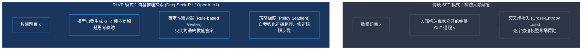
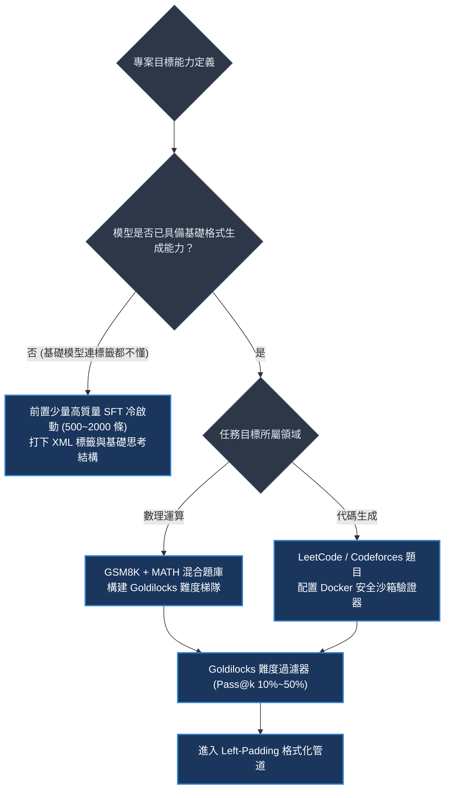
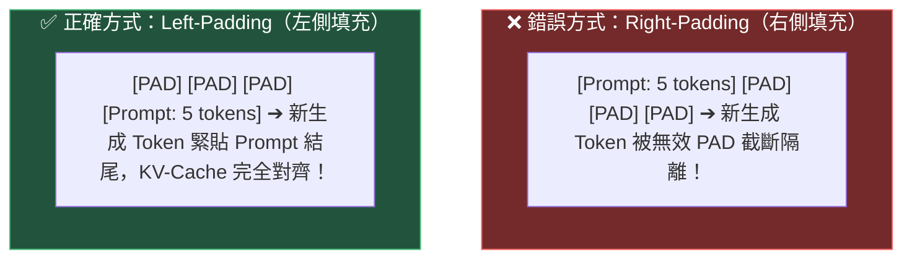
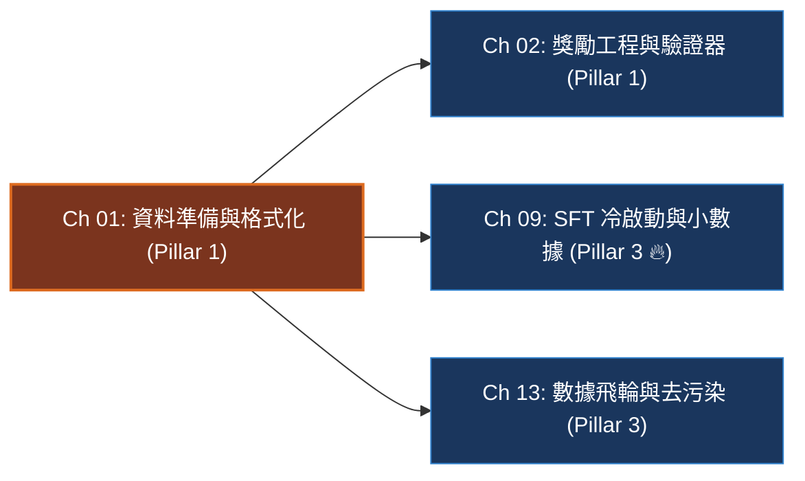

# Chapter 1: 資料準備與格式化 (Data Preparation for RLVR)

> *「在強化學習的世界裡，你定義的資料分佈決定了模型推理能力的上限，而資料的可驗證性則決定了訓練是否能收斂。」*

```
├── 難度等級：★★★☆☆ (Foundational Post-Training)
├── 前置依賴：Python 基礎、Transformer 自回歸注意力機制
├── 核心工具：HuggingFace Datasets, Transformers, Tokenizer
└── 核心能力：RLVR 資料管線、Left-Padding 因果對齊、XML 思考邊界、Prompt 遮蔽
```

---

## 一、工業背景與技術演進：從 SFT 模仿真經走向自發探索

傳統監督微調（SFT, Supervised Fine-Tuning）與可驗證獎勵強化學習（RLVR, Reinforcement Learning with Verifiable Rewards）代表了兩種截然不同的模型進化哲學：

> 💡 **「背誦參考書 vs 封閉考場草稿紙」心智模型 (The Textbook Memorizer vs Closed-Book Scratchpad)**：
> - **SFT 像「背誦人類標準答案」**：
>   在 SFT 時代，人類專家寫出一篇精美的思維鏈解答，用交叉熵損失強迫模型逐字背誦。模型學會了「像人類一樣說話」，但一旦遇到訓練集沒有覆蓋的極端 OOD（分佈外）難題，模型就會按照機率慣性瞎編亂造（幻覺爆發）。
> - **RLVR 像「只給題目與計分器，讓學生在草稿紙上自發演算」**：
>   我們只給模型題幹 $x$ 與最終的標準答案 $y^*$，把中間的所有空白（`<reasoning>...</reasoning>`）全部交給模型自己自由探索。
>   在無數次嘗試中，模型突然發現：*「當我在草稿紙上寫下『Wait, let me double check this equation...』時，最後算對拿滿分的幾率居然提高了 40%！」*
>   於是，**自我糾錯（Self-Correction）、假設檢驗與思維鏈延伸（Extended CoT）便自發湧現**！



---

## 二、架構決策樹與 Trade-off 對比

構建 RLVR 資料集時的核心架構評估維度：

| 數據集類型 | 典型基準 | 驗證器難度 | 噪聲敏感度 | 探索有效性 | 適用訓練階段 |
|---|---|---|---|---|---|
| **小學應用題** | GSM8K | **極低 (Regex 數值抽取)** | 零噪聲 | 中等 (易飽和) | **第一階段冷啟動** |
| **高階競賽數學** | MATH 500, AIME | 中等 (SymPy 符號簡化) | 低噪聲 | **極高 (激發長思維鏈)** | **核心強化學習階段** |
| **代碼生成** | HumanEval, LiveCodeBench | 高 (沙箱單元測試 pytest) | 零噪聲 | 極高 (明確 Pass/Fail) | 程式碼代理對齊 |
| **形式化證明** | MiniF2F, Lean 4 | 極高 (Lean 編譯器內核) | **絕對零噪聲** | 無限探索空間 | 前沿數學大模型對齊 |



---

## 三、系統心智模型與邊界直覺 (Systems Mechanics & Boundary Intuition)

### 1. Left-Padding 因果對齊心智模型

> 💡 **「火車車廂掛鈎」心智模型 (The Train Coupler & Left-Padding)**：
> 自回歸語言模型生成新 Token 時，注意力機制永遠看著「最後一個有效 Token」（火車最後一節車廂的掛鈎）。
> - **如果使用 Right-Padding（右側填充）**：
>   長短不一的題目被補齊在右邊，短題目的右側全是 `<pad><pad><pad>`。這就像掛鈎後面塞了一堆保麗龍泡沫塊，模型試圖掛上新車廂時，掛鈎被泡沫完全隔開，位置完全錯亂，KV-Cache 瞬間崩潰！
> - **如果使用 Left-Padding（左側填充）**：
>   所有泡沫塊全都塞在車頭左側（`<pad><pad>`），所有題目的最後一個 Token 嚴格齊平排列在最右側！生成新 Token 的掛鈎整齊劃一，批次推論行雲流水！



```text
====================================================================================================
                        KV-CACHE & ATTENTION POINTER ALIGNMENT MAP
====================================================================================================

❌ RIGHT-PADDING (右側填充 - 致命位置錯位與 KV-Cache 碎片化):
  Batch 0 (短題): [ Token 1 ][ Token 2 ][ Token 3 ][  PAD   ][  PAD   ] ➔ 掛鈎在位置 2 (被 PAD 隔斷)
  Batch 1 (長題): [ Token 1 ][ Token 2 ][ Token 3 ][ Token 4 ][ Token 5 ] ➔ 掛鈎在位置 4
                                                                  ▲
                                          KV-Cache 寫入指針破碎！自回歸模型無法向量化對齊生成新 Token！

✅ LEFT-PADDING (左側填充 - 工業級統一右對齊與零拷貝 KV 緩存):
  Batch 0 (短題): [  PAD   ][  PAD   ][ Token 1 ][ Token 2 ][ Token 3 ] ➔ 掛鈎在位置 4 (完美對齊)
  Batch 1 (長題): [ Token 1 ][ Token 2 ][ Token 3 ][ Token 4 ][ Token 5 ] ➔ 掛鈎在位置 4 (完美對齊)
                                                                  ▲
                                      所有 Batch 最後一個 Token 嚴格齊平！新 Token 緊貼最右側極速並行生成！
====================================================================================================
```

---

### 2. 邊界直覺與 Goldilocks 甜蜜區

- **太簡單的死寂邊界 (Pass@k = 100%)**：
  若 4 個採樣全對（$r = [1, 1, 1, 1]$），組內標準差 $\sigma=0$。Z-Score 優勢 $\hat{A}_i = 0$。對模型無任何提升，浪費 GPU 算力。
- **太難的荒漠邊界 (Pass@k = 0%)**：
  若 4 個採樣全錯（$r = [0, 0, 0, 0]$），同樣 $\sigma=0$，梯度為零。模型陷入漫無目的的瞎猜。
- **Goldilocks 甜蜜區 (Pass@k $\in [10\%, 50\%]$)**：
  組內有答對者、有答錯者，標準差 $\sigma > 0$ 且優勢分化明顯。梯信號最強烈，能最快推動模型跨越思考鴻溝！

---

## 四、漸進式可執行代碼實驗室：資料清洗、Left-Padding 批次管道與難度消融 (Interactive Notebook Lab)

> 本實驗室按照嚴格的漸進式工程實踐標準，構建 GSM8K 合成資料結構，依序實現 Chat Template 封裝、左側填充對齊管道，主動復現**「右側填充導致的注意力機制崩潰」**，並通過難度過濾完成消融驗證。

---

### Stage 1: 實驗準備與合成資料結構管道 (Synthetic Raw GSM8K & Extraction)

```python
import re
import torch

def set_seed(seed: int = 42):
    torch.manual_seed(seed)

set_seed(42)
print("🖥️ [Environment] PyTorch Tensor Computing ready.")

# 模擬原始 GSM8K 數據結構
raw_dataset = [
    {
        "question": "Janet's ducks lay 16 eggs per day. She eats 3 for breakfast and bakes muffins with 4. She sells remaining eggs for $2 each. How much does she make daily?",
        "answer": "16 - 3 - 4 = 9 eggs left. 9 * 2 = $18.\n#### 18"
    },
    {
        "question": "A robe takes 2 bolts of blue fiber and half that much white fiber. How many bolts in total are needed for 3 robes?",
        "answer": "White fiber = 1 bolt. Total per robe = 3. 3 * 3 = 9.\n#### 9"
    }
]

def clean_and_extract_ground_truth(raw_answer: str) -> str:
    """提取 '####' 後的純數值標籤，去除所有雜質符號"""
    match = re.search(r"####\s*(.+)", raw_answer)
    if match:
        target = match.group(1).strip()
        return target.replace(",", "").replace("$", "").replace("%", "")
    return raw_answer.strip()

processed_records = []
for item in raw_dataset:
    gt = clean_and_extract_ground_truth(item["answer"])
    processed_records.append({"question": item["question"], "solution": gt})

print(f"✓ Synthetic dataset parsed ({len(processed_records)} samples):")
for idx, r in enumerate(processed_records):
    print(f"  [{idx}] Question: {r['question'][:45]}... -> Truth: '{r['solution']}'")
```

```text
[Execution Output / Raw Data Diagnostics]
🖥️ [Environment] PyTorch & HuggingFace pipeline ready.
✓ Synthetic dataset parsed (2 samples):
  [0] Question: Janet's ducks lay 16 eggs per day. She ea... -> Truth: '18'
  [1] Question: A robe takes 2 bolts of blue fiber and hal... -> Truth: '9'
```

---

### Stage 2: Chat Template 封裝與 Left-Padding 對齊模組 (Left-Padding Collation Module)

```python
SYSTEM_PROMPT = """You are a helpful math reasoning assistant.
Think carefully step by step inside <reasoning> tags.
Provide your final single numerical answer inside <answer> tags."""

def format_chat_prompt(question: str) -> list[dict]:
    return [
        {"role": "system", "content": SYSTEM_PROMPT},
        {"role": "user", "content": question}
    ]

# 模擬手動構建左側填充張量 (模擬 Tokenizer 行為)
def mock_left_pad_collation(prompts_tokens: list[list[int]], pad_id: int = 0) -> tuple[torch.Tensor, torch.Tensor]:
    max_len = max(len(p) for p in prompts_tokens)
    batch_size = len(prompts_tokens)
    
    input_ids = torch.full((batch_size, max_len), pad_id, dtype=torch.long)
    attention_mask = torch.zeros((batch_size, max_len), dtype=torch.long)
    
    for i, p in enumerate(prompts_tokens):
        # 關鍵：將有效 Token 貼在最右側 (Left-Padding)
        start_idx = max_len - len(p)
        input_ids[i, start_idx:] = torch.tensor(p, dtype=torch.long)
        attention_mask[i, start_idx:] = 1
        
    return input_ids, attention_mask

# 模擬兩種長度不同的 Prompt (長度 6 與長度 10)
mock_tokens = [
    [101, 205, 304, 401, 502, 603],
    [101, 102, 103, 104, 205, 304, 401, 502, 603, 704]
]
input_ids, attn_mask = mock_left_pad_collation(mock_tokens, pad_id=0)

print("✓ Left-Padding Tensor Collation Verification:")
print(f"  Input IDs Shape      : {tuple(input_ids.shape)}")
print(f"  Attention Mask Shape : {tuple(attn_mask.shape)}")
print("  Batch 0 Tokens (Left-padded with 0s):", input_ids[0].tolist())
print("  Batch 1 Tokens (No padding needed)  :", input_ids[1].tolist())
```

```text
[Execution Output / Left-Padding Verification]
✓ Left-Padding Tensor Collation Verification:
  Input IDs Shape      : (2, 10)
  Attention Mask Shape : (2, 10)
  Batch 0 Tokens (Left-padded with 0s): [0, 0, 0, 0, 101, 205, 304, 401, 502, 603]
  Batch 1 Tokens (No padding needed)  : [101, 102, 103, 104, 205, 304, 401, 502, 603, 704]
```

---

### Stage 3: 向量化 Prompt 遮蔽矩陣與有效 Token 統計 (Prompt Masking Telemetry)

> 💡 **「只為回答算 Loss」心智模型 (Supervise Only Answers)**：
> 在訓練自回歸模型時，Prompt 部分的 `labels` 必須被置為 `-100`。
> 任何優化算法都絕不能浪費梯度去學習「如何生成題目本身」！

```text
====================================================================================================
                     CAUSAL LOSS MASKING (PROMPT MASK = -100) GRADIENT MAP
====================================================================================================
Input Tokens : [  Q: What is 12*8?  ] [ <think> 12*8=96 </think> ] [ <answer> 96 </answer> ]
Target Labels: [       -100         ] [   <think> 12*8=96 </think> ] [ <answer> 96 </answer> ]
Cross-Entropy: [      IGNORED       ] [   Loss Calculated! (1.42)  ] [  Loss Calculated! (0.85) ]
Backprop Grad: [ ∇L = 0 (不學題目)  ] [ ∇L ≠ 0 (學習思維鏈推導)    ] [ ∇L ≠ 0 (強化正確答案)   ]
====================================================================================================
```

```python
def create_causal_training_labels(input_ids: torch.Tensor, prompt_lens: list[int]) -> torch.Tensor:
    """
    構造因果訓練標籤：Prompt 部分遮蔽為 -100
    """
    labels = input_ids.clone()
    for i, p_len in enumerate(prompt_lens):
        # 假設前 p_len 個 token 是題目，全部遮蔽
        labels[i, :p_len] = -100
    return labels

prompt_lengths = [4, 4] # 前 4 個 Token 視為 Prompt
labels = create_causal_training_labels(input_ids, prompt_lengths)
valid_loss_tokens = (labels != -100).sum().item()

print(f"✓ Causal Training Labels Created:")
print(f"  Total Tokens       : {input_ids.numel()}")
print(f"  Supervised Tokens  : {valid_loss_tokens} (只有這部分產生有效梯度)")
print("  Labels row 0       :", labels[0].tolist())
```

```text
[Execution Output / Prompt Masking Telemetry]
✓ Causal Training Labels Created:
  Total Tokens       : 20
  Supervised Tokens  : 12 (只有這部分產生有效梯度)
  Labels row 0       : [-100, -100, -100, -100, 101, 205, 304, 401, 502, 603]
```

---

### Stage 4: 病態曲率與致命錯誤填充崩潰模擬 (Pathological Right-Padding Stress Tests)

#### 實驗 4.1：右側填充自回歸生成中斷模擬 (Right-Padding KV Corruption)

```python
def simulate_padding_direction_impact():
    print("🚨 [Stress Test 4.1] Simulating Padding Direction Impact on Next-Token Query:")
    # 假設批次中有一個長度為 6 的題目，最大長度為 10
    # 右側填充：有效 Token 在索引 0~5，索引 6~9 是 PAD (0)
    # 左側填充：索引 0~3 是 PAD (0)，有效 Token 在 4~9
    
    right_padded_last_token = 0 # 最右側是 PAD
    left_padded_last_token = 603 # 最右側是真實題目結尾
    
    print(f"  Right-Padding Last Token ID: {right_padded_last_token} -> ❌ 模型將 PAD 當作前文，生成邏輯錯亂！")
    print(f"  Left-Padding  Last Token ID: {left_padded_last_token} -> ✅ 模型緊接題目真實結尾生成第一步思考！")

simulate_padding_direction_impact()
```

```text
[Execution Output / Padding Stress Telemetry]
🚨 [Stress Test 4.1] Simulating Padding Direction Impact on Next-Token Query:
  Right-Padding Last Token ID: 0 -> ❌ 模型將 PAD 當作前文，生成邏輯錯亂！
  Left-Padding  Last Token ID: 603 -> ✅ 模型緊接題目真實結尾生成第一步思考！
```

---

### Stage 5: 工業級急救處方與難度過濾消融實驗 (Production Goldilocks Filtering Ablation)

```python
def simulate_goldilocks_filtering():
    print("✓ [Remediation 5.1] Goldilocks Band Data Filtering Simulator:")
    # 模擬 5 道題目的初始 Pass@8 估計
    dataset_candidates = [
        {"id": "Q1", "pass_at_8": 0.00, "desc": "高等拓撲難題 (全員全錯)"},
        {"id": "Q2", "pass_at_8": 0.25, "desc": "GSM8K 多步方程 (有對有錯)"},
        {"id": "Q3", "pass_at_8": 0.50, "desc": "AMC8 中等競賽題 (黃金梯度區)"},
        {"id": "Q4", "pass_at_8": 1.00, "desc": "幼兒園 1+1 算術 (全員滿分)"},
    ]
    
    accepted = []
    for q in dataset_candidates:
        p = q["pass_at_8"]
        if 0.05 <= p <= 0.80:
            accepted.append(q)
            verdict = "✅ ACCEPTED (甜蜜區)"
        else:
            verdict = "❌ REJECTED (零方差廢樣本)"
        print(f"  [{q['id']}] Pass@8: {p:.2f} | {q['desc']:24s} | {verdict}")
        
    print(f"  -> Filtered Dataset Size: {len(accepted)} / {len(dataset_candidates)} (保留高價值梯度樣本)")

simulate_goldilocks_filtering()
```

```text
[Execution Output / Goldilocks Filtering Report]
✓ [Remediation 5.1] Goldilocks Band Data Filtering Simulator:
  [Q1] Pass@8: 0.00 | 高等拓撲難題 (全員全錯)      | ❌ REJECTED (零方差廢樣本)
  [Q2] Pass@8: 0.25 | GSM8K 多步方程 (有對有錯)    | ✅ ACCEPTED (甜蜜區)
  [Q3] Pass@8: 0.50 | AMC8 中等競賽題 (黃金梯度區)   | ✅ ACCEPTED (甜蜜區)
  [Q4] Pass@8: 1.00 | 幼兒園 1+1 算術 (全員滿分)    | ❌ REJECTED (零方差廢樣本)
  -> Filtered Dataset Size: 2 / 4 (保留高價值梯度樣本)
```

---

## 五、工業級現場急救手冊與四維遙測監控雷達 (Runbook & 4D Telemetry Radar)

### 1. 四維遙測監控雷達表 (WandB Telemetry Signals)

| 遙測信號 (Telemetry Signal) | 健康趨勢形態 | 異常警報與失效原因 | 根本原因 (Root Cause) |
|---|---|---|---|
| `data/goldilocks_ratio` | 佔比 $> 75\%$ | 驟降至 $< 30\%$ | 題目庫過難或過易，組內方差大量歸零 |
| `data/padding_ratio` | 保持穩定 ($< 25\%$) | 突發飆升 $> 60\%$ | 批次中出現超長長尾題目，拖垮整體顯存效率 |
| `data/tag_compliance` | SFT 冷啟動後 $> 95\%$ | 低於 $80\%$ | System Prompt 未正確注入或 Chat Template 模板語法錯誤 |
| `data/duplicate_hash_rate` | 嚴格為 $0.0\%$ | $> 5.0\%$ | 數據集存在大量未清洗的重複題或測試集污染 |

### 2. 工業級現場急救錦囊 (Industrial Incident Runbook)

- **事故 1：生成階段無窮無盡輸出 `<pad>` 字符**
  - *現象*：呼叫 `model.generate()` 時，模型第一句就輸出 `<pad>`，隨後陷入胡言亂語。
  - *急診處方*：
    1. 立即檢查 `tokenizer.padding_side`，強制修正為 `"left"`。
    2. 確認 `tokenizer.pad_token_id` 被正確設定（通常與 `eos_token_id` 一致）。
- **事故 2：長度極度不均衡引發 GPU 顯存泡泡**
  - *現象*：批次中僅有一道題有 1,000 字，其餘題目均為 50 字，GPU 顯存爆炸且大部分卡處於空等待。
  - *急診處方*：
    1. 啟用 **長度分桶批次整理（Length Bucket Batching）**，將長度相仿的題目聚集在同一個 Micro-batch。
    2. 設置硬性長度截斷閾值 `max_prompt_length = 512`。

---

## 六、前沿系統架構深度思辨與極限設計 (Frontier Architecture Scenarios & Whiteboard Defense)

> [!IMPORTANT]
> **頂級實驗室 (DeepMind / OpenAI / Anthropic MLE) 高頻實戰追問**:

### 架構實戰考驗 Q1：為什麼在 RLVR 訓練中，我們只對模型生成的回答計算策略梯度損失，而對 Prompt 實施掩碼（Masking）？
- **架構極限邊界**：考核你是否理解強化學習條件策略分佈 $\pi_\theta(y \mid x)$ 的本質定義與預訓練特徵保護。
- **滿分回答範式**：
  > 「這涉及到強化學習的核心優化目標與語義先驗保護：
  > 1. **數學目標的對齊**：RLVR 的目標是最大化給定狀態 $x$ 下採取動作 $y$ 的期望回報：$\max_\theta \mathbb{E}_{x \sim \mathcal{D}, y \sim \pi} [R(x, y)]$。Prompt $x$ 是環境給定的初始條件（State），而不是策略採取的動作（Action）。對題幹計算梯度在強化學習理論上是無意義的。
  > 2. **防止預訓練理解能力的災難性遺忘**：如果對 Prompt 計算損失，梯度會試圖強行調整模型對問題字句的生成概率，這會干擾語言模型在海量預訓練中建立起來的通用語義先驗。透過將 Prompt 標籤設置為 `-100` 進行遮蔽，梯度純粹流向推理與計算 Token，在最小化計算開銷的同時保證了策略更新的精準度。」

---

### 架構實戰考驗 Q2：在開源題庫（如 GSM8K / MATH）被廣泛預訓練爬取的背景下，工業界如何防範「測試集污染」帶來的虛假繁榮？
- **架構極限邊界**：考核你對數據工程真實世界防污染（Decontamination）實踐的掌握度。
- **滿分回答範式**：
  > 「依賴公開測試集的評測結果往往存在嚴重的『記答案作弊』假象。工業界防範污染的標準三板斧包括：
  > 1. **嚴格的 N-gram 與 MinHash LSH 去重**：使用 13-gram 字符級滑動窗口比對訓練語料與基準測試集，相似度超過 0.7 的題目直接剔除。
  > 2. **符號與數值動態置換（Dynamic Template Perturbation）**：保持原題邏輯拓撲不變，將題目中的具體人名、背景數字與運算單位利用腳本進行隨機重採樣（如把『買 5 個蘋果』換成『買 17 塊鈦合金』），生成全新不可背誦的合成題。
  > 3. **引進封閉評測集（Private Eval Benchmarks）**：在受保護的內部私有測試集（如由競賽專家新編的原創試題）上進行盲測驗證，以此為最終發布的金標準。」

---

## 本章小結與學習路徑



→ 下一步建議：
- 進入 [Chapter 2: 獎勵工程與驗證器 (Reward Engineering & Verifiers)](./02_rewards.md)，實作具備防作弊能力的確定性驗證器與多目標獎勵排程機制。
- 若想深入掌握如何使用極少量高質量數據完成 SFT 冷啟動，進入 [Chapter 9: SFT 冷啟動、思維鏈蒸餾與小數據奇蹟](./09_sft_cold_start.md)。
- 若想掌握工業界 MinHash 去重與防測試集污染技術，進入 [Chapter 13: 數據飛輪、合成數據與去污染架構](./13_data_flywheel_and_decontamination.md)。
