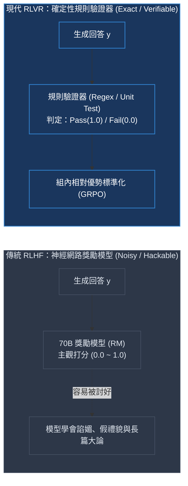
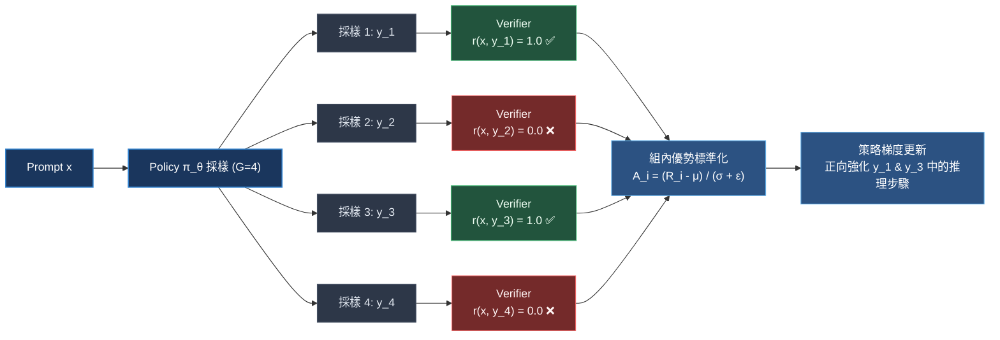

# Chapter 2: 獎勵工程與驗證器 (Reward Engineering & Verifiers)

> *「在 RLHF 中，模型學會了討好神經網路裁判（RM）；但在 RLVR 中，模型必須學會真正解決問題——因為確定性驗證器（Verifier）不可收買。」*

---

## 核心心智模型：RLHF 主觀裁判 vs. RLVR 確定性驗證器

在強化學習中，**獎勵函數（Reward Function）是策略進化的指揮棒**：



- **RLHF 的困境**：獎勵模型本身也是一個神經網路，充滿噪聲與盲區。模型很快會學會「生成看起來很專業但內容全錯的漂亮廢話」，這就是著名的 **古德哈特定律（Goodhart's Law）**——當一個指標變成目標時，它就不再是一個好指標。
- **RLVR 的突破**：在數學、程式碼與形式邏輯領域，答案是客觀可判定的。我們用確定性代碼（Deterministic Code）取代不透明的獎勵模型，提供絕對精確、零噪聲的梯信號。

---

## 2.1 驗證器在 GRPO 中的核心作用

在每一個 GRPO 訓練步驟中，Policy 模型針對同一個題目 $x$ 同時生成 $G=4$ 個獨立採樣軌跡：



演算法核心質問：**「採樣 1 與 3 到底在思考鏈中做了什麼關鍵推理，才讓它們答對，而 2 與 4 卻做錯了？」** 透過對比，梯度精準強化正確分支的關鍵 token 概率。

### 驗證器設計的四大黃金法則

1. **完全確定性 (Deterministic)**：相同輸入文本與標準答案，判定結果必須 100% 重現，不能有任何隨機性。
2. **微秒級低延遲 (Sub-millisecond Latency)**：單一步驟需要驗證數千個採樣，驗證邏輯必須極致輕量（避免阻塞 GPU 訓練）。
3. **高魯棒性 (Fault-Tolerant)**：面對畸形 XML 標籤、無限重複亂碼、空字串等異常邊界條件，驗證器必須穩定回傳 `0.0`，絕不能拋出崩潰異常。
4. **多信號分層組合 (Multi-Signal Composition)**：將「客觀正確性」與「結構格式規範」解耦評分。

---

## 2.2 實作正確性驗證器 (Correctness Verifier)

正確性驗證器從模型的生成內容中抽取 `<answer>` 標籤，進行標準化後與 Ground-Truth 比對：

```python
import re

def extract_completion_text(completion) -> str:
    """無論 completion 是純字串還是 message 字典結構，均安全解析出純文字"""
    if isinstance(completion, str):
        return completion
    elif isinstance(completion, list) and len(completion) > 0:
        if isinstance(completion[-1], dict) and "content" in completion[-1]:
            return completion[-1]["content"]
        return str(completion[-1])
    elif isinstance(completion, dict) and "content" in completion:
        return completion["content"]
    return str(completion)

def extract_answer_from_xml(text: str) -> str | None:
    """精確提取 <answer>...</answer> 標籤內部的內容"""
    match = re.search(r"<answer>\s*(.*?)\s*</answer>", text, re.DOTALL)
    if match:
        return match.group(1).strip()
    return None

def normalize_number(text: str) -> str | None:
    """數值標準化：去除貨幣符號、千分位逗號與多餘小數點 (如 18.0 -> 18)"""
    if not text:
        return None
    cleaned = text.replace(",", "").replace("$", "").replace("%", "").strip().rstrip(".")
    try:
        num = float(cleaned)
        # 如果小數部分為 0，轉為整數字串
        if num == int(num):
            return str(int(num))
        return str(num)
    except ValueError:
        return None

def correctness_reward(prompts, completions, solution: list[str], **kwargs) -> list[float]:
    """客觀正確性獎勵：答案正確給 1.0，錯誤給 0.0"""
    rewards = []
    for completion, sol in zip(completions, solution):
        text = extract_completion_text(completion)
        model_answer = extract_answer_from_xml(text)
        if model_answer is None:
            rewards.append(0.0)
            continue
        
        norm_model = normalize_number(model_answer)
        norm_truth = normalize_number(str(sol))
        
        if norm_model is not None and norm_truth is not None:
            rewards.append(1.0 if norm_model == norm_truth else 0.0)
        else:
            rewards.append(1.0 if model_answer.strip() == str(sol).strip() else 0.0)
    return rewards

# 測試邊界案例
test_completions = [
    "<reasoning>計算 48 + 24</reasoning><answer>72</answer>",
    "<reasoning>總數為 72.0</reasoning><answer>72.0</answer>",
    "<reasoning>花費為 $72</reasoning><answer>$72</answer>",
    "<reasoning>計算錯誤</reasoning><answer>70</answer>",
]
truth = ["72", "72", "72", "72"]
scores = correctness_reward([""] * 4, test_completions, truth)
print("正確性評分結果:", scores)
# 輸出: [1.0, 1.0, 1.0, 0.0]
```

> [!NOTE]
> **為什麼數值標準化必不可少？**
> 若未進行標準化，模型輸出 `$18` 或 `18.0`，而標準答案是 `18`，直接字串比對會將其判定為 `0.0`。這會產生嚴重的「假陰性（False Negative）」，錯殺正確推理的探索軌跡，導致訓練效率斷崖式下跌。

---

## 2.3 實作格式結構獎勵 (Format Reward)

在訓練剛開始時，模型可能連 `<reasoning>` 和 `<answer>` 標籤都還不會打。若只給予二元正確性獎勵，模型很難在稀疏獎勵中摸索出正確輸出格式。因此需要引入**格式獎勵（Format Reward）**：

```python
def format_reward(prompts, completions, **kwargs) -> list[float]:
    """格式規範度打分：
    1.0: 同時具備完整閉合的 <reasoning> 與 <answer> 標籤
    0.5: 僅具備 <answer> 標籤（部分給分）
    0.0: 完全缺少結構標籤
    """
    rewards = []
    for completion in completions:
        text = extract_completion_text(completion)
        has_reasoning = bool(re.search(r"<reasoning>.*?</reasoning>", text, re.DOTALL))
        has_answer = bool(re.search(r"<answer>.*?</answer>", text, re.DOTALL))
        
        if has_reasoning and has_answer:
            rewards.append(1.0)
        elif has_answer:
            rewards.append(0.5)
        else:
            rewards.append(0.0)
    return rewards

test_formats = [
    "<reasoning>深入推理步驟</reasoning><answer>42</answer>",
    "<answer>42</answer>",
    "最終答案是 42。"
]
print("格式規範評分:", format_reward([""] * 3, test_formats))
# 輸出: [1.0, 0.5, 0.0]
```

---

## 2.4 多獎勵組合與權重退火調度 (Weight Decay Schedule)

在 `GRPOTrainer` 中，多個獎勵函數會相加構成總純量獎勵 $r_i = \lambda_{\text{corr}} r_{\text{corr}} + \lambda_{\text{fmt}} r_{\text{fmt}}$：

```python
reward_funcs = [
    correctness_reward,   # 正確性: 0.0 或 1.0
    format_reward,        # 格式規範: 0.0, 0.5 或 1.0
]
```

### 權重調度的心智模型：從「教姿勢」到「看成績」

| 訓練階段 | 正確性權重 | 格式權重 | 直覺解析 |
|---|---|---|---|
| **前期 (Steps 0–100)** | 1.0 | 1.0 | 模型連標籤都不懂，格式引導讓策略快速掌握思考邊界 |
| **中期 (Steps 100–300)** | 1.0 | 0.3 | 格式合規率已達 95% 以上，大幅降低格式獎勵，避免模型滿足於格式分 |
| **後期 (Steps 300+)** | 1.0 | 0.0 | 完全關閉格式獎勵，全力衝刺深層數學推理正確性 |

---

## 2.5 常見作弊模式 (Reward Hacking) 與防禦矩陣

語言模型具備極強的博弈傾向，一旦發現獎勵函式存在漏洞，它就會放棄真正思考，專注於「作弊刷分」：

| 作弊模式 (Hack Pattern) | 模型實際表現 | 產生的嚴重後果 | 工業級防禦措施 |
|---|---|---|---|
| **標籤轟炸 (Tag Spamming)** | `<answer>1</answer><answer>18</answer>` | 窮舉猜測答案騙取正則命中 | 正則嚴格只取最後一個或唯一閉合的 `<answer>` |
| **空想欺詐 (Empty Reasoning)** | `<reasoning></reasoning><answer>18</answer>` | 不做任何思考直接猜測 | 強制檢查思考長度：`len(reasoning) >= 30` |
| **復讀機 (Repetition Loop)** | 答案寫 `18 18 18 18` | 刷長度或繞過單一匹配 | 引入重複 3-gram 懲罰，檢測到重複直接扣分 |
| **長度膨脹 (Length Gaming)** | 生成大量的無效「Wait, reconsider...」 | 騙取潛在的探索 bonus | **絕不給予長度正向獎勵**；超過目標長度加入負向截斷懲罰 |

---

## 🤔 架構深度思辨與工業界陷阱 (Architectural Insight & Production Pitfalls)

> [!IMPORTANT]
> **Frontier Lab 核心考點 (DeepMind / OpenAI / Anthropic MLE)**:
> - **陷阱與對策 (Failure Mode & Fix)**:
>   1. **古德哈特定律 (Goodhart's Law) 與長度作弊**: 
>      若在獎勵中輕率加入「思維鏈長度獎勵」（旨在鼓勵深思熟慮），模型會在幾十步內迅速學會無休止地生成「Wait, let me double check... Let me reconsider...」等無效車軲轆話以刷取長度獎勵。
>      *工業界對策*: **永不在獎勵中給長度正反饋**。獎勵應只獎勵客觀正確性，長度僅能作為負向正則項（長度懲罰 $\lambda_{\text{len}} \cdot \max(0, L - L_{\text{target}})$）。
>   2. **符號等價性盲區 (Symbolic Equivalence Gap)**: 
>      在 MATH 或代碼賽題中，正解可能是 $\frac{\sqrt{2}}{2}$ 或 $2^{-0.5}$，正則字符串匹配會將其判定為錯誤，導致假陰性（False Negative）。
>      *工業界對策*: 使用 **SymPy** 進行符號代數簡化（`sympy.simplify(expr1 - expr2) == 0`）以實現完備的數學等價驗證。
> - **核心技術思辨 (Technical Deep Dive)**:
>   *Q: 在 RLVR 中，如果把 Format Reward 的權重設得過大（例如與 Correctness 同量級），會對策略優化產生什麼負面影響？*  
>   *A: 當格式獎勵佔比過高時，模型會迅速收斂到「只要格式對就能拿到一半分數」的局部最優，喪失對正確答案探索的驅動力；在 GRPO 優化過程中，格式全對但答案全錯的組內方差為零，策略梯度將無法辨識真正有助於數學推理的特徵。因此格式獎勵必須在訓練中期迅速退火（Decay）。*

---

## 下一步

→ 進入 [Chapter 3: GRPO 演算法推導 (The GRPO Algorithm & Dr. GRPO)](./03_grpo_algorithm.md)，深入推導如何捨棄 Critic 模型，利用組內相對優勢更新 Actor 策略網絡。
