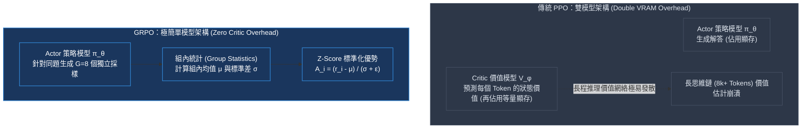
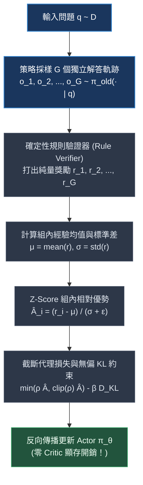
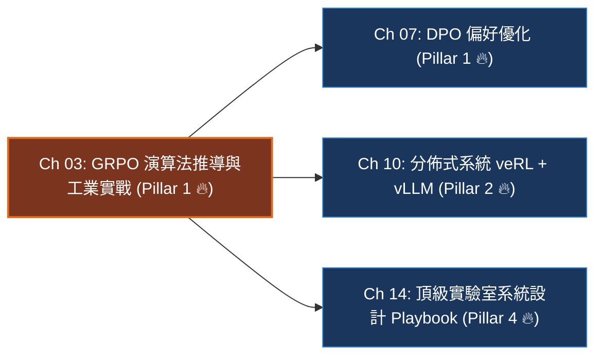

# Chapter 3: GRPO 演算法推導與工業實戰 (The GRPO Algorithm & Dr. GRPO)

> *「GRPO 的最大革命不在於增加了什麼複雜神經網絡，而在於它大膽地丟棄了什麼——它徹底斬斷了價值網絡（Critic），讓同儕相對優勢驅動模型在超長思維鏈中自主探索。」*

---

## 一、工業背景與技術演進：從 PPO 到 GRPO 的必然破局

在大語言模型（LLM）後訓練從「常規對話指令遵循」走向「複雜長思維鏈推理（Reasoning）」的歷史演進中，傳統 PPO（Proximal Policy Optimization）演算法遭遇了嚴重的工程與演算法雙重壁壘：



### 1. 為什麼傳統 PPO 在長推理鏈中必然失效？
- **價值網絡（Critic）的「預測幻覺」**：在長達 8,192 甚至 16,384 個 token 的數學與編程推導中，要求神經網絡 Critic 在第 500 個 token 精確預測「最終算對的機率」是極其病態的。中途微小的數值噪聲會被 GAE（Generalized Advantage Estimator）累積放大，導致優勢估計嚴重失真。
- **顯存翻倍稅（Double VRAM Penalty）**：Critic 網絡通常需要與 Actor 等大的參數規模。維持一套完整的 Critic 參數及其 AdamW 優化器狀態（每參數需額外 16 字節顯存），直接削奪了超過 50% 的可用顯存，嚴重鎖死了訓練 Batch Size 與最大上下文長度。

### 2. DeepSeek 的破局思維：回歸「同儕相對優勢」
DeepSeek 在 DeepSeekMath 與 DeepSeek-R1 中大膽拋棄 Critic，提出 **GRPO (Group Relative Policy Optimization)**：對於同一個 Prompt $q$，直接讓當前策略採樣生成 $G$ 個候選答案（例如 $G=8$）。利用規則驗證器判定各自的純量獎勵 $r_i$ 後，直接計算這組答案的**經驗均值與標準差**進行 Z-Score 標準化。
**「只要你的思考路徑在這一組同伴中名列前茅，你的生成概率就獲得正向強化；低於同伴平均水平，就被抑制。」**

---

## 二、架構決策樹與 Trade-off 對比

在頂級 AI 實驗室的技術選型中，後訓練工程師必須清楚不同強化學習與對齊範式的系統開銷與演算法特性邊界：

| 評估維度 | 傳統 PPO | GRPO / Dr. GRPO | 離線 DPO | 無參考 SimPO |
|---|---|---|---|---|
| **模型常駐數量** | 4 個 (Actor, Critic, Ref, RM) | **2 個 (Actor, Ref)** | 2 個 (Policy, Ref) | **僅 1 個 (Policy Only)** |
| **額外顯存負擔** | 極高 (+150% ~ +200%) | **中等 (僅需 Rollout 採樣緩衝區)** | 零額外優化器狀態 | **極低 (零 Ref、零 Critic)** |
| **探索能力 (OOD)** | 高 (線上主動採樣探索) | **極高 (多採樣組內多樣性探索)** | 低 (受限於離線偏好靜態數據集) | 低 (依賴離線配對數據集) |
| **對獎勵作弊敏感度** | 極高 (RM 容易被古德哈特擊穿) | **極低 (綁定確定性規則 Verifier)** | 中等 (標註配對噪聲) | 中等 (標註配對噪聲) |
| **吞吐量瓶頸** | Critic 前向+反向計算 | **Rollout 自回歸採樣速度 (vLLM 解耦)** | 前向 logp 計算 | 前向 logp 計算 |
| **最佳適用場景** | 通用多輪主觀對話對齊 | **數學推理、代碼生成、競賽題 (RLVR)** | 早期指令對齊冷啟動 | 顯存極限壓縮下的偏好微調 |

> [!TIP]
> **工業落地決策守則**：
> 1. 當目標任務具備**客觀可驗證判定標籤（如數學、單元測試、SQL）**時，**首選 GRPO**。
> 2. 當任務為**開放性文筆、主觀價值觀對齊且算力預算極度受限**時，**首選 DPO / SimPO**。
> 3. 只有在需要密集步驟狀態反饋且序列極短的特定控制任務中，才考慮維護複雜的 PPO Critic。

---

## 三、系統心智模型與邊界直覺 (Systems Mechanics & Boundary Intuition)

### 1. GRPO 四步閉環工作流



### 2. 核心目標函數（一行形式化）

$$\mathcal{J}_{\text{GRPO}}(\theta) = \mathbb{E}_{q \sim \mathcal{D}, \{o_i\}_{i=1}^G \sim \pi_{\theta_{\text{old}}}} \left[ \frac{1}{G} \sum_{i=1}^G \frac{1}{|o_i|} \sum_{t=1}^{|o_i|} \left( \min\left( \rho_{i,t} \hat{A}_i,\ \text{clip}(\rho_{i,t}, 1-\varepsilon, 1+\varepsilon) \hat{A}_i \right) - \beta D_{\text{KL}}(\pi_\theta \| \pi_{\text{ref}}) \right) \right]$$

其中重要性採樣比率為 $\rho_{i,t} = \frac{\pi_\theta(o_{i,t} \mid q, o_{i,<t})}{\pi_{\theta_{\text{old}}}(o_{i,t} \mid q, o_{i,<t})}$，優勢為 $\hat{A}_i = \frac{r_i - \text{mean}(\mathbf{r})}{\text{std}(\mathbf{r}) + \epsilon}$。

### 3. 關鍵參數物理意義與極限邊界分析 (Boundary Intuition)

在工程實作與系統架構評估中，不要死記公式，要理解參數在物理邊界上的系統表現：

- **KL 正則係數 $\beta$ 的邊界行為**：
  - 當 $\beta \to 0$：策略模型完全失去對原始語言能力的錨定，模型會迅速為了追求獎勵而退化為反覆發射單一符號的語言崩潰狀態（Mode Collapse / Gibberish）。
  - 當 $\beta \to \infty$：模型被死死鎖定在參考模型 $\pi_{\text{ref}}$ 上，梯度更新量趨近於 0，完全喪失自發探索與自我糾錯能力。
  - 工業甜蜜點：$\beta \in [0.001, 0.05]$，配合動態自適應 KL 控制。
- **組大小 $G$ 的算力與方差權衡**：
  - 當 $G = 1$：$\text{std}(r) = 0$，優勢公式分母為 $\epsilon$，組內無法構建相對參照物，梯度期望完全退化為零。
  - 當 $G = 4 \sim 8$：工業標準性價比區間。足夠提供穩定的標準化梯度，且 Rollout 階段顯存與 KV-Cache 延遲在可控範圍。
  - 當 $G \to 64$：組內均值估計方差邊際遞減，但自回歸生成時間大幅膨脹，形成嚴重的顯卡算力空轉（Rollout Bottleneck）。
- **組內標準差 $\sigma \to 0$ 的全對/全錯邊界**：
  - 若一組內 $G$ 個採樣全軍覆沒（$r = [0, 0, 0, 0]$）或全部答對（$r = [1, 1, 1, 1]$），$\hat{A}_i = 0$。此時該 Prompt 不產生任何有效策略梯度。
- **Schulman $k_3$ KL 估計器的非負特性**：
  - 傳統 $\log \frac{\pi}{\pi_{\text{ref}}}$ 近似在浮點數低精度（FP16/BF16）下容易因數值截斷出現負數，導致負 KL 懲罰促使策略飄移。Schulman $k_3$ 公式 $D = \exp(r) - r - 1$ 利用凸函數性質保證了**點點非負**，具備極強的數值穩定性。
- **Dr. GRPO 消除長度偏見**：
  - 原生 GRPO 的除以長度 $\frac{1}{|o_i|}$ 導致「簡短但漏洞百出的解答獲得更大的單 Token 梯度」，扼殺了長思維鏈的湧現。Dr. GRPO 移除長度除數，讓長推理與短推理在 Token 級別享有同等權重。

---

## 四、代碼剖析、實時遙測巡檢與失效急救

### 1. 核心向量化 PyTorch 代碼實作

```python
import torch
import torch.nn.functional as F

def compute_group_advantages(rewards: torch.Tensor, eps: float = 1e-8) -> torch.Tensor:
    """
    計算組內 Z-Score 相對優勢 (零 Critic 顯存開銷)
    輸入: rewards [batch_size, G]
    輸出: advantages [batch_size, G]
    """
    mean_r = rewards.mean(dim=-1, keepdim=True)
    std_r = rewards.std(dim=-1, keepdim=True)
    # 當 std 接近 0 (全對或全錯) 時，分子全為 0，安全輸出 0.0 優勢
    return (rewards - mean_r) / (std_r + eps)

def grpo_loss_step(
    pi_logps: torch.Tensor,       # [B, G, T] 當前策略 token 對數概率
    old_logps: torch.Tensor,      # [B, G, T] 採樣舊策略 token 對數概率
    ref_logps: torch.Tensor,      # [B, G, T] 凍結參考模型 token 對數概率
    advantages: torch.Tensor,     # [B, G] 組內標準化優勢
    mask: torch.Tensor,           # [B, G, T] 答案有效 token mask
    clip_eps: float = 0.2,
    beta: float = 0.04
) -> tuple[torch.Tensor, dict]:
    """完整 GRPO 截斷代理損失與 Schulman k3 KL 計算"""
    # 1. 重要性比率 rho
    log_ratio = pi_logps - old_logps
    rho = torch.exp(log_ratio)
    
    # 2. 廣播優勢到 Token 維度
    adv = advantages.unsqueeze(-1) # [B, G, 1]
    
    # 3. PPO 截斷代理項
    surr1 = rho * adv
    surr2 = torch.clamp(rho, 1.0 - clip_eps, 1.0 + clip_eps) * adv
    policy_loss = -torch.min(surr1, surr2)
    
    # 4. Schulman k3 無偏非負 KL 散度
    kl_ratio = ref_logps - pi_logps
    kl_div = torch.exp(kl_ratio) - kl_ratio - 1.0
    
    # 5. 綜合損失 (以 mask 遮蔽 Padding Token)
    total_token_loss = policy_loss + beta * kl_div
    loss = (total_token_loss * mask).sum() / mask.sum().clamp(min=1.0)
    
    metrics = {
        "loss/total": loss.item(),
        "policy/ratio_mean": (rho * mask).sum().item() / mask.sum().item(),
        "policy/kl_mean": (kl_div * mask).sum().item() / mask.sum().item(),
    }
    return loss, metrics
```

### 2. 四維遙測監控雷達表 (WandB Telemetry Signals)

| 遙測指標 (Telemetry Signal) | 健康運算形態 | 異常警報與失效原因分析 | 根本原因 (Root Cause) |
|---|---|---|---|
| `reward/mean` | 單調平穩爬升 ($0.1 \to 0.85$) | 停滯在 $0.0$ 或突發性垂直拉升至 $1.0$ | 獎勵信號過於稀疏 / 正則匹配規則被模型作弊破解 |
| `reward/std` | 保持健康方差 ($0.25 \le \sigma \le 0.6$) | 驟降至 $\approx 0.0$ 且無波動 | 組內採樣過度同質化，探索空間坍塌 |
| `objective/kl` | 平滑緩步微增 ($0.02 \to 0.6$) | 突發飆升 $> 3.0$ 甚至突破 $10.0$ | 學習率過大或 $\beta$ 過小，模型正在毀壞通用語言能力 |
| `completion_length` | 自然緩慢延伸 ($300 \to 1800$) | 幾十步內頂滿 `max_seq_len` 上限截斷 | 模型發現「重複廢話能拖延被判定錯誤」的長度作弊漏洞 |

### 3. 工業級現場急救錦囊 (Industrial Incident Runbook)

- **事故 1：全零優勢陷阱 (All-Zero Gradient Trap)**
  - *現象*：GPU 利用率滿載，但 `loss/total` 為 0，模型能力完全不增長。
  - *診斷*：當前題目難度超出模型能力範圍，$G$ 個候選解全錯，組內方差為 0。
  - *急診處方*：
    1. 開啟 **動態採樣過濾（Dynamic Group Filtering）**：跳過全錯題目，不計入反向傳播。
    2. 調高採樣溫度 $\tau$（從 0.7 升至 1.0），並在前置階段混入 15% 具備引導思維鏈的 SFT 數據作為「冷啟動階梯」。
- **事故 2：KL 散度爆炸與策略脫軌 ($KL > 5.0$)**
  - *現象*：生成文本開始夾雜無限重複的標點符號或亂碼，Loss 曲線劇烈震盪。
  - *急診處方*：
    1. 立即暫停訓練，回滾至上一個良好 Checkpoint。
    2. 啟動 **動態自適應 KL 控制器（Adaptive KL Controller）**：若 $KL > 1.5 \times KL_{\text{target}}$，動態將 $\beta$ 乘以 1.5；若 $KL < 0.5 \times KL_{\text{target}}$，除以 1.5。
    3. 將 AdamW `weight_decay` 設置為 0.01，並將 `max_grad_norm` 嚴格限制在 1.0。
- **事故 3：死循環長度作弊 (Length Explosion)**
  - *現象*：思維鏈長度迅速觸頂，`<reasoning>` 標籤中充斥著「Wait, wait, let me think again and again...」。
  - *急診處方*：
    1. 注入軟性長度懲罰：$R_{\text{len}} = -\lambda \cdot \max(0, L - L_{\text{threshold}})$。
    2. 切換至 **Dr. GRPO**，消除序列除數帶來的短序列不公平梯度激勵。

---

## 五、前沿系統架構深度思辨與極限設計 (Frontier Architecture Scenarios & Whiteboard Defense)

> [!IMPORTANT]
> **頂級實驗室 (DeepMind / OpenAI / Anthropic / Meta) 高頻實戰追問**:

### 架構實戰考驗 Q1：為什麼 GRPO 不需要價值網絡 (Critic)？它的優勢估計在數學上是無偏的嗎？方差相較 PPO 如何？
- **架構極限邊界**：考核你是否理解基線（Baseline）在策略梯度定理中的本質角色，以及經驗樣本與神經逼近的方差-偏差權衡（Bias-Variance Tradeoff）。
- **滿分回答範式**：
  > 「GRPO 的優勢估計在數學期望上是**嚴格無偏（Unbiased）**的。在策略梯度推導中，只要基線 $b(q)$ 不依賴於具體動作 $o$，減去該基線都不會改變梯度的期望值（$\mathbb{E}[\nabla_\theta \log \pi(o|q) \cdot b(q)] = 0$）。GRPO 採用的基線是同一題目下 $G$ 個獨立採樣的經驗均值 $\frac{1}{G}\sum r_i$。由於這 $G$ 個軌跡是從當前策略 $\pi_{\theta_{\text{old}}}$ 獨立同分佈（i.i.d.）採樣而來，基線與特定候選解的選擇獨立，因此保證了零偏差。
  > 
  > 然而，在**方差（Variance）**方面，GRPO 的方差顯著高於具備優秀 Critic 的 PPO。PPO 的 Critic 透過時序差分學習逼近狀態的期望價值，平滑了整個狀態空間的噪聲；而 GRPO 僅利用有限樣本（如 $G=8$）的經驗均值，當 $G$ 較小時噪聲較大。工業界透過兩項工程手段彌補方差缺陷：
  > 1. 設定合理的組大小（$G \ge 8$）；
  > 2. 放大批次累積步數（Gradient Accumulation），以足夠多的 Prompt 覆蓋抵消組內經驗估計的隨機方差。」

---

### 架構實戰考驗 Q2：DeepSeek 提出的 Dr. GRPO 具體發現並修復了原版 GRPO 的什麼致命缺陷？
- **架構極限邊界**：考核你是否讀過 2025 年最新前沿論文的底層細節，以及對 Token 級損失歸一化的敏感度。
- **滿分回答範式**：
  > 「原版 GRPO 在計算損失時，對每個軌跡除以了該軌跡的長度 $|o_i|$（即 $\frac{1}{|o_i|} \sum_{t=1}^{|o_i|} \dots$）。這看似是一個無害的長度歸一化，但在長程推理任務中引入了嚴重的**長度偏見（Length Penalty Bias）**：
  > 
  > 設有兩個回答都答對了（$A_i > 0$），解答 A 採用簡短粗暴的推導（長度 100 tokens），解答 B 進行了詳盡的自我反思與驗證（長度 1,000 tokens）。由於除以長度，解答 A 的每個 token 獲得的梯度權重是解答 B 的 **10 倍**！這反向懲罰了需要充分展開思考的長思維鏈，導致模型學會『走捷徑、碰運氣』。
  > 
  > Dr. GRPO 的修復方式非常徹底：**移除了軌跡長度除數**，將損失定義在所有採樣的有效 token 總數上進行全局平均，使得每個推理 token 享有平等的梯度更新權重，徹底釋放了長思維鏈自發反思的湧現。」

---

### 架構實戰考驗 Q3：如果讓你在 8 張 H100 (80GB) 上微調一個 32B 模型進行 GRPO 訓練，你會如何規劃顯存與組大小 $G$？
- **架構極限邊界**：考核你的硬體顯存心算能力、通信拓撲設計與訓練流水線瓶頸分析。
- **滿分回答範式**：
  > 「這是一個典型的顯存極限規劃場景：
  > 1. **參數與優化器預算**：32B 模型以 BF16 載入需要 64GB 靜態顯存。若全參數訓練，8 張卡（共 640GB）使用 FSDP2 / ZeRO-3 切分後，每張卡承擔約 8GB 權重 + 24GB AdamW 優化器狀態 = 32GB。若採用 LoRA（$r=64$），優化器與權重分片可壓到 10GB/卡以內。
  > 2. **Rollout 採樣與訓練解耦**：單節點 8x H100 內 NVLink 頻寬高達 900GB/s。我們將 8 張卡設為 TP=8 或動態切分：
  >    - 在採樣階段，利用 vLLM 載入權重並啟用 PagedAttention（TP=8），單次並行生成組大小 $G=8$ 個採樣（上下文設為 8k）。
  >    - 在訓練反向傳播階段，切換回 FSDP2，將批次切分到 8 張卡並行計算梯度。
  > 3. **上下文與 KV-Cache 算力保護**：長度設為 8k 時，8 個採樣的動態激活值極易 OOM。必須強制開啟 **FlashAttention-2**、**梯度檢查點（Gradient Checkpointing）**，並將每個 Forward Step 的 Micro-Batch 設為 1，藉由 `gradient_accumulation_steps = 8` 來維持穩定的梯度有效批次大小。」

---

## 本章小結與學習路徑



→ 下一步建議：
- 若想深入對比**離線對齊與隱式獎勵**，進入 [Chapter 7: DPO 與偏好優化](./07_dpo_preference_optimization.md)。
- 若想掌握**大規模叢集解耦部署與顯存調度**，進入 [Chapter 10: 分佈式系統 — veRL、vLLM 與 3D-HybridEngine](./10_distributed_systems_verl_vllm.md)。
