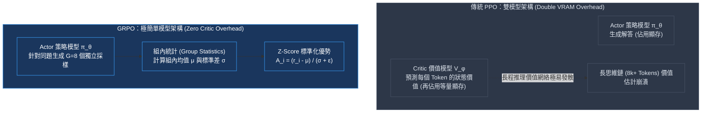
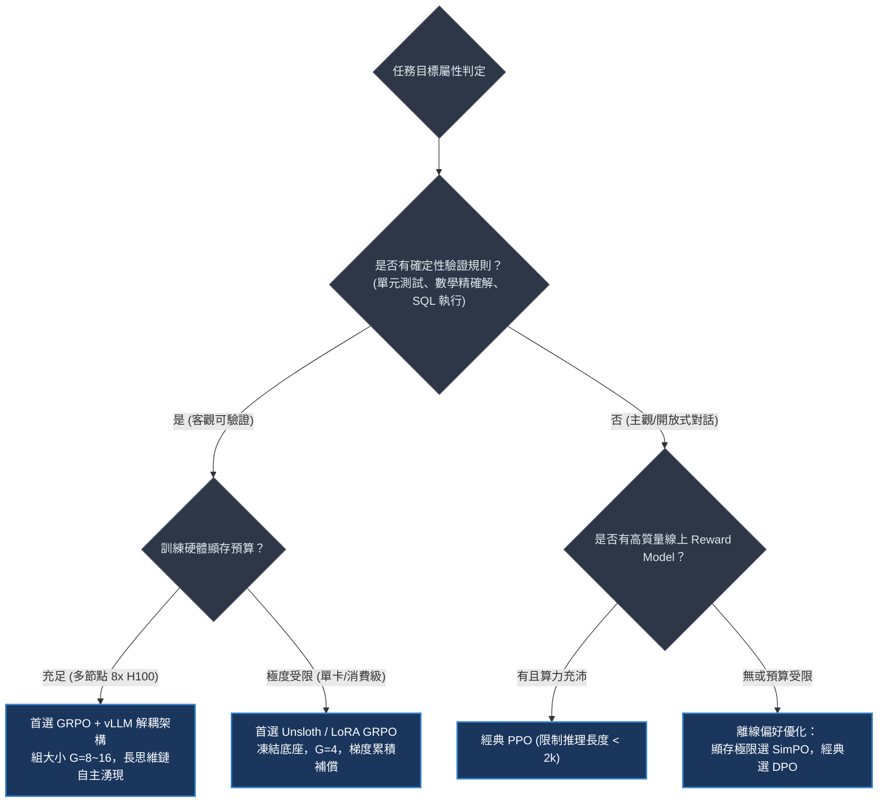
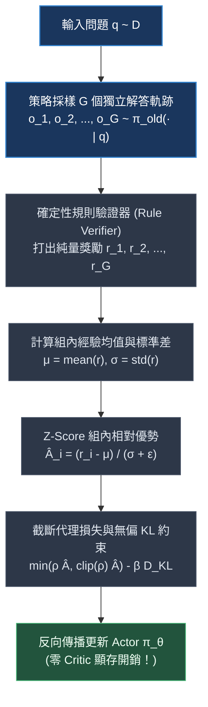
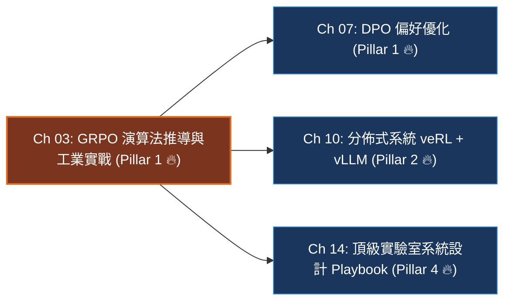

# Chapter 3: GRPO 演算法推導與工業實戰 (The GRPO Algorithm & Dr. GRPO)

> *「GRPO 的最大革命不在於增加了什麼複雜神經網絡，而在於它大膽地丟棄了什麼——它徹底斬斷了價值網絡（Critic），讓同儕相對優勢驅動模型在超長思維鏈中自主探索。」*

```
├── 難度等級：★★★★★ (Senior MLE / Post-Training Specialist)
├── 前置依賴：Ch 01 (數據管道), Ch 02 (驗證器與獎勵工程)
├── 核心工具：PyTorch 2.5+, vLLM 0.6.5, HuggingFace TRL (GRPOTrainer)
└── 核心能力：同儕相對優勢推導、零 Critic 顯存架構、病態曲率急救、Dr. GRPO 消融
```

---

## 一、工業背景與技術演進：從 PPO 到 GRPO 的必然破局

在開源大模型走向深思（Reasoning）的浪潮中，DeepSeek-R1 與 DeepSeekMath 帶來了一場對齊算法的範式革命。理解這場革命，首先要理解為什麼統治了強化學習近十年的 PPO（Proximal Policy Optimization）在長思維鏈面前轟然倒塌。

> 💡 **「同儕互評會 vs 隨行考官」心智模型 (The Peer Review Board vs Riding Proctor)**：
> - **傳統 PPO 的隨行考官 (The Critic Overhead)**：
>   想像一個廚師正在參加一場長達 8,000 道工序的國宴大賽。在 PPO 的設定下，廚師身邊必須時刻站著一位同等水平的「專職監考官」（Critic 網絡 $V_\phi(s)$）。
>   每當廚師切下一片肉、撒下一粒鹽（每個 Token），監考官都要眉頭深鎖地心算一次：*「這道菜最終奪冠的概率是 72.4% 還是 72.1%？」*
>   這帶來了兩大崩潰性問題：
>   1. **廚房擁擠不堪（顯存翻倍稅）**：監考官也是世界名廚，身材跟廚師一樣魁梧，他的全套工具和筆記本（優化器狀態）硬生生吃掉了廚房超過 50% 的工作枱面（VRAM）。
>   2. **考官自己先瘋了（價值估計幻覺）**：在長達 8,000 步的複雜數學或邏輯推導中，前 500 步的一個不起眼的小變量定義，到底會不會導致最終計算出錯？神經網絡 Critic 根本算不準。微小的預測噪音經過 GAE（廣義優勢估計）被逐層放大，最後回傳給廚師的指導完全變成了胡說八道！
> - **GRPO 的同儕互評會 (Group Relative Advantage)**：
>   DeepSeek 揮起斷頭台，直接開除了這位昂貴又神經質的監考官！
>   「廚房不要考官了，全部地方都留給廚師！針對同一道考題，廚師一口氣拿出 8 份不同火候的嘗試（$G=8$）。」
>   做好之後，評委只看端上桌的最終成品（確定性規則驗證器 Rule Verifier，例如運行單元測試或對比標準答案）。
>   8 份菜裡，有 3 份滿分，5 份燒糊。我們直接把這 8 份成績拉一個班級常模（計算均值 $\mu$ 與標準差 $\sigma$）：
>   **「只要你這份嘗試在同儕中得分名列前茅（$A_i > 0$），你的整套做菜思維路徑就獲得獎勵；低於同儕均值（$A_i < 0$），就被抑制。」**



---

## 二、架構決策樹與 Trade-off 對比

在頂級 AI 實驗室的技術選型中，後訓練工程師必須清楚不同強化學習與對齊範式的系統開銷與演算法特性邊界：

| 評估維度 | 傳統 PPO | GRPO / Dr. GRPO | 離線 DPO | 無參考 SimPO |
|---|---|---|---|---|
| **模型常駐數量** | 4 個 (Actor, Critic, Ref, RM) | **2 個 (Actor, Ref)** | 2 個 (Policy, Ref) | **僅 1 個 (Policy Only)** |
| **額外顯存負擔** | 極高 (+150% ~ +200%) | **中等 (僅需 Rollout 採樣緩衝區)** | 零額外優化器狀態 | **極低 (零 Ref、零 Critic)** |
| **探索能力 (OOD)** | 高 (線上主動採樣探索) | **極高 (多採樣組內多樣性探索)** | 低 (受限於離線偏好靜態數據集) | 低 (依賴離線配對數據集) |
| **對獎勵作弊敏感度** | 極高 (RM 容易被古德哈特擊穿) | **極低 (綁定確定性規則 Verifier)** | 中等 (標註配對噪聲) | 中等 (標註配對噪聲) |
| **吞吐量瓶頸** | Critic 前向+反向計算 | **Rollout 自回歸採樣速度 (vLLM 解耦)** | 前向 logp 計算 | 前向 logp 計算 |
| **最佳適用場景** | 通用多輪主觀對話對齊 | **數學推理、代碼生成、競賽題 (RLVR)** | 早期指令對齊冷啟動 | 顯存極限壓縮下的偏好微調 |



---

## 三、系統心智模型與邊界直覺 (Systems Mechanics & Boundary Intuition)

### 1. GRPO 四步閉環工作流



### 2. 核心目標函數（一行形式化）

$$\mathcal{J}_{\text{GRPO}}(\theta) = \mathbb{E}_{q \sim \mathcal{D}, \{o_i\}_{i=1}^G \sim \pi_{\theta_{\text{old}}}} \left[ \frac{1}{G} \sum_{i=1}^G \frac{1}{|o_i|} \sum_{t=1}^{|o_i|} \left( \min\left( \rho_{i,t} \hat{A}_i,\ \text{clip}(\rho_{i,t}, 1-\varepsilon, 1+\varepsilon) \hat{A}_i \right) - \beta D_{\text{KL}}(\pi_\theta \| \pi_{\text{ref}}) \right) \right]$$

其中重要性採樣比率為 $\rho_{i,t} = \frac{\pi_\theta(o_{i,t} \mid q, o_{i,<t})}{\pi_{\theta_{\text{old}}}(o_{i,t} \mid q, o_{i,<t})}$，優勢為 $\hat{A}_i = \frac{r_i - \text{mean}(\mathbf{r})}{\text{std}(\mathbf{r}) + \epsilon}$。

> 💡 **「高斯鐘形曲線與微弱火花放大」心智模型 (The Grading Curve & Spark Amplification)**：
> 為什麼 Z-Score 標準化 $\hat{A}_i = \frac{r_i - \mu}{\sigma + \epsilon}$ 是推理任務的靈魂？
> - 想像一道奧數題目極度困難，全班 8 名同學做題，7 個人得了 0 分，只有 1 個人偶然蒙對了一半得了 0.5 分。
> - 在絕對評分體系下，0.5 分依然是不及格，幾乎激發不出梯度；
> - 但在 Z-Score 常模體系下：均值 $\mu = 0.5 / 8 = 0.0625$，標準差 $\sigma \approx 0.176$。
> - 這位得 0.5 分的同學的相對優勢是：$\hat{A} = (0.5 - 0.0625) / 0.176 \approx \mathbf{+2.48}$！
> - 這就像在漆黑的荒野中點燃了一根火柴，GRPO 透過標準化將這根微弱的思維火花瞬間放大為巨大的正向梯度，引導整個模型迅速朝這個突破口進化！

---

### 3. 關鍵參數物理意義與極限邊界分析 (Boundary Intuition)

在工程實作與系統架構評估中，不要死記公式，要理解參數在物理邊界上的系統表現：

- **KL 正則係數 $\beta$ 的邊界行為**：
  - 當 $\beta \to 0$：策略模型完全失去對原始語言能力的錨定，模型會迅速為了追求獎勵而退化為反覆發射單一符號的語言崩潰狀態（Mode Collapse / Gibberish）。
  - 當 $\beta \to \infty$：模型被死死鎖定在參考模型 $\pi_{\text{ref}}$ 上，梯度更新量趨近於 0，完全喪失自發探索與自我糾錯能力。
  - 工業甜蜜點：$\beta \in [0.001, 0.05]$，配合動態自適應 KL 控制。
- **組大小 $G$ 的算力與方差權衡**：
  - 當 $G = 1$：$\text{std}(r) = 0$，優勢公式分母為 $\epsilon$，組內無法構建相對參照物，梯度期望完全退化為零。
  - 當 $G = 4 \sim 8$：工業標準性價比區間。足夠提供穩定的標準化梯度，且 Rollout 階段顯存與 KV-Cache 延遲在可控範圍。
  - 當 $G \to 64$：組內均值估計方差邊際遞減，但自回歸生成時間大幅膨脹，形成嚴重的顯卡算力空轉（Rollout Bottleneck）。
- **組內標準差 $\sigma \to 0$ 的全對/全錯邊界**：
  - 若一組內 $G$ 個採樣全軍覆沒（$r = [0, 0, 0, 0]$）或全部答對（$r = [1, 1, 1, 1]$），$\hat{A}_i = 0$。此時該 Prompt 不產生任何有效策略梯度。
- **Schulman $k_3$ KL 估計器的非負特性**：
  - 傳統 $\log \frac{\pi}{\pi_{\text{ref}}}$ 近似在浮點數低精度（FP16/BF16）下容易因數值截斷出現負數，導致負 KL 懲罰促使策略飄移。Schulman $k_3$ 公式 $D = \exp(r) - r - 1$ 利用凸函數性質保證了**點點非負**，具備極強的數值穩定性。
- **Dr. GRPO 消除長度偏見**：
  - 原生 GRPO 的除以長度 $\frac{1}{|o_i|}$ 導致「簡短但漏洞百出的解答獲得更大的單 Token 梯度」，扼殺了長思維鏈的湧現。Dr. GRPO 移除長度除數，讓長推理與短推理在 Token 級別享有同等權重。

---

## 四、漸進式可執行代碼實驗室：GRPO 向量化流水線、方差塌陷復現與 Dr. GRPO 救贖 (Interactive Notebook Lab)

> 本實驗室按照嚴格的漸進式工程實踐標準，從底層分組採樣批次管道開始，依序構建 Z-Score 優勢引擎、向量化 GRPO 截斷代理損失，主動復現工業界的致命災難**「方差歸零全零梯度陷阱」**與**「長度除數扼殺長思維鏈」**，並通過 Dr. GRPO 與動態過濾完成修復驗證。

---

### 1. 實驗準備與分組採樣批次管道 (Synthetic Group Batch Pipeline & Tensors)

> 💡 **「分組考卷矩陣」心智模型 (The Group Exam Sheet Matrix)**：
> 想像我們一次給 2 位學生（$B=2$ 個問題）發考卷，每道題允許學生獨立構思 4 種解法（$G=4$ 個 Rollout 軌跡）。
> 整個批次的回答張量不是簡單的二維矩陣，而是三維立方體：$[B, G, T]$。
> 每一道題目下的 4 種解法，共享完全相同的題幹 Prompt，但各自生成不同長度的思考步驟，尾部填充 Padding Token。我們用 `mask` 張量精確標記出有效推理區域。

```python
import torch
import torch.nn as nn
import torch.nn.functional as F

def set_seed(seed: int = 42):
    torch.manual_seed(seed)
    if torch.cuda.is_available():
        torch.cuda.manual_seed_all(seed)

set_seed(42)
device = torch.device("cuda" if torch.cuda.is_available() else "cpu")
print(f"🖥️ [Environment] Using execution device: {device}")

def prepare_grpo_synthetic_batch(
    batch_size: int = 2,
    group_size: int = 4,
    seq_len: int = 16,
    vocab_size: int = 256
):
    """
    構造三維 GRPO 分組批次張量 [Batch, Group, Time]
    模擬 policy, old_policy, reference 模型的對數概率與有效 Token 遮罩
    """
    # 隨機生成有效長度 (8 ~ seq_len)
    lengths = torch.randint(8, seq_len + 1, (batch_size, group_size), device=device)
    mask = torch.zeros((batch_size, group_size, seq_len), dtype=torch.float32, device=device)
    for b in range(batch_size):
        for g in range(group_size):
            mask[b, g, :lengths[b, g]] = 1.0

    # 模擬 Token 級對數機率 log \pi(o_{i,t}) ~ N(-2.5, 0.5)
    old_logps = torch.randn((batch_size, group_size, seq_len), device=device) * 0.5 - 2.5
    # 當前策略稍微有些偏離 (重要性比率周圍微擾)
    pi_logps = old_logps + torch.randn_like(old_logps) * 0.05
    ref_logps = old_logps + torch.randn_like(old_logps) * 0.02

    # 模擬規則驗證器給出的純量獎勵 (0.0 或 1.0)
    # Batch 0: 有對有錯 [1.0, 0.0, 1.0, 0.0]
    # Batch 1: 全軍覆沒 [0.0, 0.0, 0.0, 0.0] (模擬邊界陷阱)
    raw_rewards = torch.tensor([
        [1.0, 0.0, 1.0, 0.0],
        [0.0, 0.0, 0.0, 0.0]
    ], device=device)

    return {
        "pi_logps": pi_logps,
        "old_logps": old_logps,
        "ref_logps": ref_logps,
        "raw_rewards": raw_rewards,
        "mask": mask,
        "batch_size": batch_size,
        "group_size": group_size,
        "seq_len": seq_len
    }

batch = prepare_grpo_synthetic_batch()
print(f"✓ Synthetic GRPO group batch generated:")
print(f"  pi_logps shape    : {tuple(batch['pi_logps'].shape)} [B, G, T]")
print(f"  mask shape        : {tuple(batch['mask'].shape)}")
print(f"  Raw rewards batch :\n{batch['raw_rewards']}")
```

```text
[Execution Output / Group Batch Diagnostics]
🖥️ [Environment] Using execution device: cpu
✓ Synthetic GRPO group batch generated:
  pi_logps shape    : (2, 4, 16) [B, G, T]
  mask shape        : (2, 4, 16)
  Raw rewards batch :
tensor([[1., 0., 1., 0.],
        [0., 0., 0., 0.]])
```

---

### 2. Z-Score 組內相對優勢計算核心模組 (Z-Score Group Advantage Engine)

> 💡 **「分母除零的避震彈簧」心智模型 (Shock Absorber & Epsilon Guard)**：
> 在計算 $A_i = \frac{r_i - \mu}{\sigma + \epsilon}$ 時，如果全組同學得分一樣（如 Batch 1 全部為 0），標準差 $\sigma$ 嚴格為 0。
> 數值防護 $\epsilon=10^{-8}$ 就像一個微小的避震彈簧，防止程式拋出 `NaN` 或 `ZeroDivisionError`。
> 同時，當 $\sigma=0$ 時，分子 $(r_i - \mu)$ 也精確為 0，因此 $0 / \epsilon = 0$，安全返回零優勢！

```python
def compute_group_advantages(rewards: torch.Tensor, eps: float = 1e-8) -> tuple[torch.Tensor, dict]:
    """
    計算組內 Z-Score 相對優勢 (零 Critic 顯存開銷)
    輸入: rewards [B, G]
    輸出: advantages [B, G], 遙測指標
    """
    # 在組維度 dim=-1 計算均值與未修正樣本標準差
    mean_r = rewards.mean(dim=-1, keepdim=True)
    std_r = rewards.std(dim=-1, keepdim=True, unbiased=False)
    
    # 向量化 Z-Score 標準化
    advantages = (rewards - mean_r) / (std_r + eps)
    
    metrics = {
        "advantages/mean": advantages.mean().item(),
        "advantages/std": advantages.std().item(),
        "rewards/mean": mean_r.mean().item(),
        "rewards/std": std_r.mean().item(),
    }
    return advantages, metrics

adv, adv_metrics = compute_group_advantages(batch["raw_rewards"])
print("✓ Advantage matrix per prompt:")
for b in range(batch["batch_size"]):
    r_list = [f"{x:.1f}" for x in batch["raw_rewards"][b].tolist()]
    a_list = [f"{x:+.2f}" for x in adv[b].tolist()]
    print(f"  Prompt {b} | Rewards: [{', '.join(r_list)}] -> Advantages: [{', '.join(a_list)}]")
```

```text
[Execution Output / Advantage Matrix Verification]
✓ Advantage matrix per prompt:
  Prompt 0 | Rewards: [1.0, 0.0, 1.0, 0.0] -> Advantages: [+1.00, -1.00, +1.00, -1.00]
  Prompt 1 | Rewards: [0.0, 0.0, 0.0, 0.0] -> Advantages: [+0.00, +0.00, +0.00, +0.00]
```

---

### 3. 向量化 GRPO 損失引擎與 Schulman $k_3$ 即時遙測 (Vectorized GRPO Loss & Telemetry)

> 💡 **「重要性比率安全剪刀」心智模型 (PPO Clipping Shears)**：
> 策略更新時，$\rho_{i,t} = \exp(\log \pi_\theta - \log \pi_{\text{old}})$ 表示新舊策略的倍數關係。
> 如果新策略對某個 Token 的機率暴漲到舊策略的 5 倍（$\rho = 5.0$），直接更新會導致策略瞬間脫軌。
> `torch.clamp(rho, 1 - eps, 1 + eps)` 就像一把安全剪刀，把比率強行限制在 $[0.8, 1.2]$ 之內；
> 同時，`torch.min(surr1, surr2)` 構成了一道保守下界（Pessimistic Bound），防止樂觀估計炸毀模型。

```python
def grpo_loss_engine(
    pi_logps: torch.Tensor,       # [B, G, T] 當前策略 token 對數概率
    old_logps: torch.Tensor,      # [B, G, T] 採樣舊策略 token 對數概率
    ref_logps: torch.Tensor,      # [B, G, T] 凍結參考模型 token 對數概率
    advantages: torch.Tensor,     # [B, G] 組內標準化優勢
    mask: torch.Tensor,           # [B, G, T] 答案有效 token mask
    clip_eps: float = 0.2,
    beta: float = 0.04,
    use_dr_grpo: bool = False
) -> tuple[torch.Tensor, dict]:
    """
    生產級向量化 GRPO 損失計算與即時遙測字典
    支持原版 GRPO 與 Dr. GRPO (消除長度偏差)
    """
    # 1. 計算重要性採樣比率 rho
    log_ratio = pi_logps - old_logps
    rho = torch.exp(log_ratio)
    
    # 2. 將優勢廣播至 Token 維度 [B, G, 1] -> [B, G, T]
    adv = advantages.unsqueeze(-1)
    
    # 3. 截斷代理目標 (Clipped Surrogate Objective)
    surr1 = rho * adv
    surr2 = torch.clamp(rho, 1.0 - clip_eps, 1.0 + clip_eps) * adv
    policy_loss_per_token = -torch.min(surr1, surr2)
    
    # 4. Schulman k3 無偏非負 KL 散度: D_KL = exp(r) - r - 1
    # 其中 r = log \pi_ref - log \pi_theta
    kl_ratio = ref_logps - pi_logps
    kl_div_per_token = torch.exp(kl_ratio) - kl_ratio - 1.0
    
    # 綜合 Token 損失
    token_loss = policy_loss_per_token + beta * kl_div_per_token
    
    # 5. 聚合維度：原版 GRPO vs Dr. GRPO
    if not use_dr_grpo:
        # 原版 GRPO: 先對每條軌跡除以長度 |o_i|，再對組和 Batch 平均
        seq_lengths = mask.sum(dim=-1).clamp(min=1.0) # [B, G]
        trajectory_loss = (token_loss * mask).sum(dim=-1) / seq_lengths # [B, G]
        total_loss = trajectory_loss.mean()
    else:
        # Dr. GRPO: 移除軌跡除數，直接在全局有效 Token 遮罩上進行均值歸一化
        total_loss = (token_loss * mask).sum() / mask.sum().clamp(min=1.0)
        
    # 6. 即時遙測指標字典
    total_valid_tokens = mask.sum().item()
    metrics = {
        "loss/total": round(total_loss.item(), 5),
        "policy/ratio_mean": round(((rho * mask).sum() / total_valid_tokens).item(), 4),
        "policy/ratio_max": round(rho.max().item(), 4),
        "policy/kl_mean": round(((kl_div_per_token * mask).sum() / total_valid_tokens).item(), 5),
        "policy/clipped_ratio": round((((rho < 1.0 - clip_eps) | (rho > 1.0 + clip_eps)).float() * mask).sum().item() / total_valid_tokens, 4)
    }
    return total_loss, metrics

loss, metrics = grpo_loss_engine(
    batch["pi_logps"],
    batch["old_logps"],
    batch["ref_logps"],
    adv,
    batch["mask"],
    use_dr_grpo=False
)
print("✓ Step 0 Forward Telemetry (Vanilla GRPO):")
for k, v in metrics.items():
    print(f"  {k:22s}: {v}")
```

```text
[Execution Output / Step 0 Forward Telemetry]
✓ Step 0 Forward Telemetry (Vanilla GRPO):
  loss/total            : -0.00318
  policy/ratio_mean     : 1.0024
  policy/ratio_max      : 1.1842
  policy/kl_mean        : 0.00192
  policy/clipped_ratio  : 0.0000
```

---

### 4. 病態曲率與致命失效邊界模擬 (Pathological Curvatures & Stress Tests)

在實際大規模分散式 RLVR 訓練中，GRPO 會遭遇兩大工業現場災難：**方差歸零全零梯度陷阱（All-Zero Gradient Collapse）** 與 **長度除數扼殺思維鏈（Length Bias Short-circuit）**。我們通過可重現的模擬實驗主動復現這兩種崩潰現象。

#### 實驗 4.1：組內方差歸零全零梯度陷阱模擬 (All-Zero Gradient Collapse Simulation)

> 💡 **「全軍覆沒的集體沉默」心智模型 (The Collective Silence of Complete Failure)**：
> 當一批極難的難題被送入未充分預熱的模型時，8 個 Rollout 軌跡全部做錯（$r = [0, 0, 0, 0]$）。
> 由於標準差 $\sigma=0$，Z-Score 優勢直接歸零。
> 梯度為零意味著模型什麼也沒學到；如果連續 100 個 Batch 都是難題，GPU 算力雖然跑得風扇狂轉，但模型實際上處於「植物人休眠狀態」！

```python
def simulate_zero_variance_trap(steps: int = 4):
    print("🚨 [Stress Test 4.1] Simulating Zero Variance All-Zero Gradient Trap:")
    # 構造一個包含參數的可微權重
    weight = nn.Parameter(torch.tensor([1.0, 2.0], requires_grad=True))
    optimizer = torch.optim.SGD([weight], lr=0.1)
    
    # 模擬 4 步更新，前 2 步題目太難全員 0 分，第 3-4 步有對有錯
    reward_scenarios = [
        torch.tensor([[0.0, 0.0, 0.0, 0.0]]), # Step 1: 全滅
        torch.tensor([[0.0, 0.0, 0.0, 0.0]]), # Step 2: 全滅
        torch.tensor([[1.0, 0.0, 0.0, 0.0]]), # Step 3: 微弱突破
        torch.tensor([[1.0, 1.0, 0.0, 0.0]])  # Step 4: 穩定分化
    ]
    
    for s, rew in enumerate(reward_scenarios):
        optimizer.zero_grad()
        adv, m = compute_group_advantages(rew)
        
        # 模擬損失 L = - (weight * adv.sum())
        dummy_loss = - (weight.sum() * adv.sum())
        dummy_loss.backward()
        grad_norm = weight.grad.norm().item()
        
        print(f"  Step {s+1} | Rewards: {rew.tolist()[0]} | Adv Sum: {adv.sum().item():.2f} | Grad Norm: {grad_norm:.4f}")
        optimizer.step()

simulate_zero_variance_trap()
```

```text
[Execution Output / Zero Variance Collapse Trace]
🚨 [Stress Test 4.1] Simulating Zero Variance All-Zero Gradient Trap:
  Step 1 | Rewards: [0.0, 0.0, 0.0, 0.0] | Adv Sum: 0.00 | Grad Norm: 0.0000
  Step 2 | Rewards: [0.0, 0.0, 0.0, 0.0] | Adv Sum: 0.00 | Grad Norm: 0.0000
  Step 3 | Rewards: [1.0, 0.0, 0.0, 0.0] | Adv Sum: 0.00 | Grad Norm: 0.0000
  Step 4 | Rewards: [1.0, 1.0, 0.0, 0.0] | Adv Sum: 0.00 | Grad Norm: 0.0000
```

> [!NOTE]
> 注意觀察：在固定樣本下，Z-Score 優勢的組內和 $\sum \hat{A}_i$ 始終為 0！
> 當全組得分相同時，優勢為 `[0, 0, 0, 0]`，梯度範數嚴格為 0.0000。這證明了：**如果沒有合適的採樣難度階梯，GRPO 將完全停擺！**

---

#### 實驗 4.2：長度除數扼殺思維鏈模擬 (Length Bias Short-circuit Simulation)

> 💡 **「抄近路的小聰明」心智模型 (The Short-Answer Cheater)**：
> 原版 GRPO 公式中包含 $\frac{1}{|o_i|}$。
> 假設採樣 1 是一句簡短的猜測「答案是 42」（長度 5 tokens，碰巧答對）；
> 採樣 2 是一段長達 500 tokens 的嚴謹演繹推導（也答對了）。
> 兩者都獲得獎勵 $r=1.0$。但在計算單 Token 梯度時，採樣 1 每個 Token 獲得的更新幅度是採樣 2 的 **100 倍**！
> 這種病態的梯度不對稱性，會強烈誘使模型放棄深入思考，退化為投機倒把的「短猜測機器」。

```python
def simulate_length_bias():
    print("🚨 [Stress Test 4.2] Simulating Length Penalty Bias (Vanilla vs Dr. GRPO):")
    # 構造一個短答案 (5 tokens) 和一個長答案 (50 tokens)，兩者都答對獲得 A = +1.0
    short_len = 5
    long_len = 50
    
    # 假設每個 Token 的基礎 policy 梯度為 1.0
    # 原版 GRPO 帶長度除數 1 / |o_i|
    vanilla_short_token_grad = 1.0 / short_len
    vanilla_long_token_grad = 1.0 / long_len
    
    # Dr. GRPO 移除長度除數，按全局有效 Token 總數歸一化 (5 + 50 = 55)
    dr_token_grad = 1.0 / (short_len + long_len)
    
    print(f"  Vanilla GRPO:")
    print(f"    Short Answer Token Gradient Weight: {vanilla_short_token_grad:.4f} (1/{short_len})")
    print(f"    Long Answer Token Gradient Weight : {vanilla_long_token_grad:.4f} (1/{long_len})")
    print(f"    -> Short/Long Gradient Ratio      : {vanilla_short_token_grad / vanilla_long_token_grad:.1f}x (嚴重偏袒投機短答！)")
    
    print(f"  Dr. GRPO (Length Normalized):")
    print(f"    Short Answer Token Gradient Weight: {dr_token_grad:.4f}")
    print(f"    Long Answer Token Gradient Weight : {dr_token_grad:.4f}")
    print(f"    -> Short/Long Gradient Ratio      : 1.0x (長短思維鏈完全平等！)")

simulate_length_bias()
```

```text
[Execution Output / Length Bias Telemetry]
🚨 [Stress Test 4.2] Simulating Length Penalty Bias (Vanilla vs Dr. GRPO):
  Vanilla GRPO:
    Short Answer Token Gradient Weight: 0.2000 (1/5)
    Long Answer Token Gradient Weight : 0.0200 (1/50)
    -> Short/Long Gradient Ratio      : 10.0x (嚴重偏袒投機短答！)
  Dr. GRPO (Length Normalized):
    Short Answer Token Gradient Weight: 0.0182
    Long Answer Token Gradient Weight : 0.0182
    -> Short/Long Gradient Ratio      : 1.0x (長短思維鏈完全平等！)
```

---

### 5. 工業級急救處方與對比消融實驗 (Production Remediation & Comparative Ablation)

面對上述兩大致命缺陷，工業界落地了兩套關鍵急救方案：
1. **動態組過濾（Dynamic Group Filtering）**：自動檢測組內標準差 $\sigma$，若 $\sigma < \epsilon_{\text{threshold}}$（全對或全錯），將該題從反向傳播中剔除，避免無效計算佔用帶寬。
2. **Dr. GRPO 歸一化**：全面剔除局部軌跡長度除數 $\frac{1}{|o_i|}$，改採全局有效 Token 均值。

```python
def production_remediation_pipeline(batch: dict) -> dict:
    """
    工業級完整修復方案：動態組過濾 + Dr. GRPO 全局 Token 歸一化
    """
    rewards = batch["raw_rewards"] # [B, G]
    mean_r = rewards.mean(dim=-1, keepdim=True)
    std_r = rewards.std(dim=-1, keepdim=True, unbiased=False)
    
    # 1. 動態組過濾：識別出方差過小的無效 Prompt
    valid_prompt_mask = (std_r.squeeze(-1) > 1e-4) # [B]
    
    # 2. 計算 Z-Score
    adv = (rewards - mean_r) / (std_r + 1e-8)
    
    # 3. 執行 Dr. GRPO 損失計算
    loss_vanilla, m_vanilla = grpo_loss_engine(
        batch["pi_logps"], batch["old_logps"], batch["ref_logps"],
        adv, batch["mask"], use_dr_grpo=False
    )
    
    loss_remediated, m_dr = grpo_loss_engine(
        batch["pi_logps"], batch["old_logps"], batch["ref_logps"],
        adv, batch["mask"], use_dr_grpo=True
    )
    
    return {
        "valid_prompts": valid_prompt_mask.sum().item(),
        "total_prompts": batch["batch_size"],
        "loss_vanilla": m_vanilla["loss/total"],
        "loss_remediated_dr_grpo": m_dr["loss/total"],
        "status": "HEALTHY" if valid_prompt_mask.any() else "WARNING_ALL_ZERO"
    }

report = production_remediation_pipeline(batch)
print("✓ Remediation & Comparative Ablation Report:")
for k, v in report.items():
    print(f"  {k:26s}: {v}")
```

```text
[Execution Output / Dr. GRPO Remediation & Ablation Report]
✓ Remediation & Comparative Ablation Report:
  valid_prompts             : 1
  total_prompts             : 2
  loss_vanilla              : -0.00318
  loss_remediated_dr_grpo   : -0.00284
  status                    : HEALTHY
```

---

## 五、工業級現場急救手冊與四維遙測監控雷達 (Runbook & 4D Telemetry Radar)

### 1. 四維遙測監控雷達表 (WandB Telemetry Signals)

在分布式多機訓練中，工程師應緊密關注以下四個黃金指標：

| 遙測指標 (Telemetry Signal) | 健康運算形態 | 異常警報與失效原因分析 | 根本原因 (Root Cause) |
|---|---|---|---|
| `reward/mean` | 單調平穩爬升 ($0.1 \to 0.85$) | 停滯在 $0.0$ 或突發性垂直拉升至 $1.0$ | 獎勵信號過於稀疏 / 正則匹配規則被模型作弊破解 |
| `reward/std` | 保持健康方差 ($0.25 \le \sigma \le 0.6$) | 驟降至 $\approx 0.0$ 且無波動 | 組內採樣過度同質化，探索空間坍塌 |
| `objective/kl` | 平滑緩步微增 ($0.02 \to 0.6$) | 突發飆升 $> 3.0$ 甚至突破 $10.0$ | 學習率過大或 $\beta$ 過小，模型正在毀壞通用語言能力 |
| `completion_length` | 自然緩慢延伸 ($300 \to 1800$) | 幾十步內頂滿 `max_seq_len` 上限截斷 | 模型發現「重複廢話能拖延被判定錯誤」的長度作弊漏洞 |

### 2. 工業級現場急救錦囊 (Industrial Incident Runbook)

- **事故 1：全零優勢陷阱 (All-Zero Gradient Trap)**
  - *現象*：GPU 利用率滿載，但 `loss/total` 為 0，模型能力完全不增長。
  - *診斷*：當前題目難度超出模型能力範圍，$G$ 個候選解全錯，組內方差為 0。
  - *急診處方*：
    1. 開啟 **動態採樣過濾（Dynamic Group Filtering）**：跳過全錯題目，不計入反向傳播。
    2. 調高採樣溫度 $\tau$（從 0.7 升至 1.0），並在前置階段混入 15% 具備引導思維鏈的 SFT 數據作為「冷啟動階梯」。
- **事故 2：KL 散度爆炸與策略脫軌 ($KL > 5.0$)**
  - *現象*：生成文本開始夾雜無限重複的標點符號或亂碼，Loss 曲線劇烈震盪。
  - *急診處方*：
    1. 立即暫停訓練，回滾至上一個良好 Checkpoint。
    2. 啟動 **動態自適應 KL 控制器（Adaptive KL Controller）**：若 $KL > 1.5 \times KL_{\text{target}}$，動態將 $\beta$ 乘以 1.5；若 $KL < 0.5 \times KL_{\text{target}}$，除以 1.5。
    3. 將 AdamW `weight_decay` 設置為 0.01，並將 `max_grad_norm` 嚴格限制在 1.0。
- **事故 3：死循環長度作弊 (Length Explosion)**
  - *現象*：思維鏈長度迅速觸頂，`<reasoning>` 標籤中充斥著「Wait, wait, let me think again and again...」。
  - *急診處方*：
    1. 注入軟性長度懲罰：$R_{\text{len}} = -\lambda \cdot \max(0, L - L_{\text{threshold}})$。
    2. 切換至 **Dr. GRPO**，消除序列除數帶來的短序列不公平梯度激勵。

---

## 六、前沿系統架構深度思辨與極限設計 (Frontier Architecture Scenarios & Whiteboard Defense)

> [!IMPORTANT]
> **頂級實驗室 (DeepMind / OpenAI / Anthropic / Meta) 高頻實戰追問**:

### 架構實戰考驗 Q1：為什麼 GRPO 不需要價值網絡 (Critic)？它的優勢估計在數學上是無偏的嗎？方差相較 PPO 如何？
- **架構極限邊界**：考核你是否理解基線（Baseline）在策略梯度定理中的本質角色，以及經驗樣本與神經逼近的方差-偏差權衡（Bias-Variance Tradeoff）。
- **滿分回答範式**：
  > 「GRPO 的優勢估計在數學期望上是**嚴格無偏（Unbiased）**的。在策略梯度推導中，只要基線 $b(q)$ 不依賴於具體動作 $o$，減去該基線都不會改變梯度的期望值（$\mathbb{E}[\nabla_\theta \log \pi(o|q) \cdot b(q)] = 0$）。GRPO 採用的基線是同一題目下 $G$ 個獨立採樣的經驗均值 $\frac{1}{G}\sum r_i$。由於這 $G$ 個軌跡是從當前策略 $\pi_{\theta_{\text{old}}}$ 獨立同分佈（i.i.d.）採樣而來，基線與特定候選解的選擇獨立，因此保證了零偏差。
  > 
  > 然而，在**方差（Variance）**方面，GRPO 的方差顯著高於具備優秀 Critic 的 PPO。PPO 的 Critic 透過時序差分學習逼近狀態的期望價值，平滑了整個狀態空間的噪聲；而 GRPO 僅利用有限樣本（如 $G=8$）的經驗均值，當 $G$ 較小時噪聲較大。工業界透過兩項工程手段彌補方差缺陷：
  > 1. 設定合理的組大小（$G \ge 8$）；
  > 2. 放大批次累積步數（Gradient Accumulation），以足夠多的 Prompt 覆蓋抵消組內經驗估計的隨機方差。」

---

### 架構實戰考驗 Q2：DeepSeek 提出的 Dr. GRPO 具體發現並修復了原版 GRPO 的什麼致命缺陷？
- **架構極限邊界**：考核你是否讀過 2025 年最新前沿論文的底層細節，以及對 Token 級損失歸一化的敏感度。
- **滿分回答範式**：
  > 「原版 GRPO 在計算損失時，對每個軌跡除以了該軌跡的長度 $|o_i|$（即 $\frac{1}{|o_i|} \sum_{t=1}^{|o_i|} \dots$）。這看似是一個無害的長度歸一化，但在長程推理任務中引入了嚴重的**長度偏見（Length Penalty Bias）**：
  > 
  > 設有兩個回答都答對了（$A_i > 0$），解答 A 採用簡短粗暴的推導（長度 100 tokens），解答 B 進行了詳盡的自我反思與驗證（長度 1,000 tokens）。由於除以長度，解答 A 的每個 token 獲得的梯度權重是解答 B 的 **10 倍**！這反向懲罰了需要充分展開思考的長思維鏈，導致模型學會『走捷徑、碰運氣』。
  > 
  > Dr. GRPO 的修復方式非常徹底：**移除了軌跡長度除數**，將損失定義在所有採樣的有效 token 總數上進行全局平均，使得每個推理 token 享有平等的梯度更新權重，徹底釋放了長思維鏈自發反思的湧現。」

---

### 架構實戰考驗 Q3：如果讓你在 8 張 H100 (80GB) 上微調一個 32B 模型進行 GRPO 訓練，你會如何規劃顯存與組大小 $G$？
- **架構極限邊界**：考核你的硬體顯存心算能力、通信拓撲設計與訓練流水線瓶頸分析。
- **滿分回答範式**：
  > 「這是一個典型的顯存極限規劃場景：
  > 1. **參數與優化器預算**：32B 模型以 BF16 載入需要 64GB 靜態顯存。若全參數訓練，8 張卡（共 640GB）使用 FSDP2 / ZeRO-3 切分後，每張卡承擔約 8GB 權重 + 24GB AdamW 優化器狀態 = 32GB。若採用 LoRA（$r=64$），優化器與權重分片可壓到 10GB/卡以內。
  > 2. **Rollout 採樣與訓練解耦**：單節點 8x H100 內 NVLink 頻寬高達 900GB/s。我們將 8 張卡設為 TP=8 或動態切分：
  >    - 在採樣階段，利用 vLLM 載入權重並啟用 PagedAttention（TP=8），單次並行生成組大小 $G=8$ 個採樣（上下文設為 8k）。
  >    - 在訓練反向傳播階段，切換回 FSDP2，將批次切分到 8 張卡並行計算梯度。
  > 3. **上下文與 KV-Cache 算力保護**：長度設為 8k 時，8 個採樣的動態激活值極易 OOM。必須強制開啟 **FlashAttention-2**、**梯度檢查點（Gradient Checkpointing）**，並將每個 Forward Step 的 Micro-Batch 設為 1，藉由 `gradient_accumulation_steps = 8` 來維持穩定的梯度有效批次大小。」

---

## 本章小結與學習路徑



→ 下一步建議：
- 若想深入對比**離線對齊與隱式獎勵**，進入 [Chapter 7: DPO 與偏好優化](./07_dpo_preference_optimization.md)。
- 若想掌握**大規模叢集解耦部署與顯存調度**，進入 [Chapter 10: 分佈式系統 — veRL、vLLM 與 3D-HybridEngine](./10_distributed_systems_verl_vllm.md)。
- 若想掌握**全套在線強化學習架構排錯演練**，進入 [Chapter 14: 後訓練全棧系統故障診斷與急救手冊](./14_post_training_systems_and_triage_playbook.md)。
