```mermaid
graph TB
    subgraph LORA["LoRA 低秩分解原理：W = W_0 + (α/r) · B × A"]
        direction LR
        IN["輸入特徵 x<br/>(d_in = 2048)"] --> BASE["凍結基底權重 W_0<br/>(4-bit NF4 量化，僅 1.2GB)"]
        IN --> DOWNA["降維矩陣 A<br/>(2048 × 16)"]
        DOWNA --> UPB["升維矩陣 B<br/>(16 × 2048)"]
        UPB --> SCALE["縮放因子 α/r"]
        BASE --> SUM["相加 (⊕)"]
        SCALE --> SUM
        SUM --> OUT["輸出特徵 h"]
    end

    subgraph VRAM["16GB GPU 顯存預算分配矩陣 (以 1.5B 模型為例)"]
        direction TB
        V1["凍結基底模型 (4-bit NF4): ~1.2 GB"]
        V2["LoRA 可訓練權重 (r=16): ~0.08 GB"]
        V3["AdamW 優化器狀態 (FP32): ~0.38 GB"]
        V4["G=4 採樣 KV-Cache (L=2048): ~2.4 GB"]
        V5["重計算激活值 (Gradient Checkpointing): ~3.5 GB"]
        V_FREE["安全餘裕顯存空間: ~4.5 GB ✅ 徹底告別 OOM"]
    end

    classDef lora fill:#1a365d,stroke:#3182ce,stroke-width:1.5px,color:#fff;
    classDef vram fill:#2d3748,stroke:#4a5568,color:#e2e8f0;
    class LORA lora;
    class VRAM vram;
```

# Chapter 4: 輕量訓練管線 (Training Pipeline & Stabilization)

> *「在單張消費級或入門雲端 GPU（如 16GB T4 / RTX 4090）上訓練強化學習，不是比拼算力蠻力，而是考驗你對顯存預算、LoRA 參數分解與梯度累積的極致精算。」*

---

## 核心心智模型：16GB 單卡如何撬動大模型強化學習？

很多工程師誤以為訓練 RL 必須擁有 8 張 A100/H100 集群。事實上，結合 **4-bit 基礎量化 + LoRA 低秩分解 + GRPOTrainer**，我們可以在單張 16GB GPU 上穩定執行 1.5B～3B 模型的端到端後訓練：



---

## 4.1 硬體規格與模型選型矩陣

在 16GB 顯存的嚴格限制下，顯存需要同時容納：模型權重、可訓練 LoRA 權重、優化器狀態、反向傳播激活值、以及生成採樣時的動態 KV-Cache。

| 模型架構 | 總參數量 | 4-bit 靜態權重顯存 | 16GB T4/RTX4090 能否運行？ | 推理基礎能力評估 |
|---|---|---|---|---|
| **Qwen2.5-0.5B-Instruct** | 0.49B | $\sim 0.5\text{ GB}$ | ✅ 極為輕鬆 ($G=8$) | 基礎算術，較難維持長 CoT |
| **Qwen2.5-1.5B-Instruct** | 1.54B | $\sim 1.2\text{ GB}$ | ✅ **黃金推薦選型 ($G=4$)** | **長思維鏈自發反思能力優秀** |
| **Qwen2.5-3B-Instruct** | 3.09B | $\sim 2.2\text{ GB}$ | ✅ 需限制長度 ($G \le 4$) | 複雜方程與多步推理能力強勁 |
| **Qwen2.5-7B-Instruct** | 7.61B | $\sim 4.5\text{ GB}$ | ⚠️ 邊界極限 (需 $r=8$, 序列 $\le 384$) | 競賽級競品實力 |

> [!IMPORTANT]
> **硬體算力架構提示**：Unsloth 與 Triton 算子依賴 NVIDIA GPU 的 **Compute Capability $\ge$ 7.0**（Turing / Ampere / Ada / Hopper，例如 T4、RTX 3090/4090、A100、L4）。若是舊款 Pascal 架構（如 Tesla P100，Compute Capability 6.0）將無法編譯 Triton 2.x JIT 核心。

---

## 4.2 模型載入與 PEFT LoRA 配置

若對 1.5B 模型進行全參數微調（Full Fine-Tuning），僅僅 32-bit AdamW 優化器狀態就需要耗費超過 $18\text{ GB}$ 顯存。我們凍結 4-bit 基底權重，在 Attention 與 MLP 層全面掛載 LoRA 低秩適配器：

```python
import os
import torch
from transformers import AutoTokenizer, AutoModelForCausalLM
from peft import LoraConfig, get_peft_model

MODEL_ID = "Qwen/Qwen2.5-1.5B-Instruct"

tokenizer = AutoTokenizer.from_pretrained(MODEL_ID)
tokenizer.pad_token = tokenizer.eos_token
tokenizer.padding_side = "left"  # 確保 Rollout 採樣生成為左側填充

model = AutoModelForCausalLM.from_pretrained(
    MODEL_ID,
    torch_dtype=torch.bfloat16 if torch.cuda.is_bf16_supported() else torch.float16,
    device_map="auto",
    low_cpu_mem_usage=True
)

# 配置 All-Linear LoRA 適配器
lora_config = LoraConfig(
    r=16,
    lora_alpha=16,
    lora_dropout=0.05,
    bias="none",
    task_type="CAUSAL_LM",
    target_modules=["q_proj", "k_proj", "v_proj", "o_proj", "gate_proj", "up_proj", "down_proj"]
)

model = get_peft_model(model, lora_config)

total_params = sum(p.numel() for p in model.parameters())
trainable_params = sum(p.numel() for p in model.parameters() if p.requires_grad)

print(f"基底模型:         {MODEL_ID}")
print(f"總參數量:         {total_params:>12,}")
print(f"可訓練參數:       {trainable_params:>12,} ({trainable_params / total_params * 100:.2f}%)")
# 可訓練參數佔比僅約 1.51%，極大減輕顯存負擔！
```

---

## 4.3 設定 GRPO 訓練參數 (`GRPOConfig`)

```python
from trl import GRPOConfig

training_args = GRPOConfig(
    output_dir="./grpo-qwen-gsm8k",
    # 訓練排程
    num_train_epochs=1,
    max_steps=250,
    # 等效批次大小 = per_device_train_batch_size * gradient_accumulation_steps
    per_device_train_batch_size=1,
    gradient_accumulation_steps=4,
    # GRPO 採樣關鍵超參數
    num_generations=4,              # 組大小 G (Group Size)
    max_prompt_length=256,
    max_completion_length=512,
    temperature=0.8,
    # 優化器與正規化
    learning_rate=5e-6,             # RL 必須使用保守學習率
    lr_scheduler_type="cosine",
    warmup_ratio=0.1,
    max_grad_norm=1.0,              # 梯度裁剪防止梯度暴增
    beta=0.04,                      # KL 散度懲罰係數
    # 精度與顯存控制
    bf16=torch.cuda.is_bf16_supported(),
    fp16=not torch.cuda.is_bf16_supported(),
    gradient_checkpointing=True,    # 激活值重計算，顯存節省 60%
    logging_steps=5,
    save_steps=50,
    report_to="none"
)
```

### 等效批次大小（Effective Batch Size）直覺圖解

```text
                      ┌───────────────────────────────────────┐
單個梯度累積子步：     │ 取 1 筆 Prompt                         │
                      │ 模型平行生成 4 個解答 (num_generations)  │
                      │ 驗證器給予 4 個純量分數                  │
                      │ 計算組內相對優勢 Â_i 並反向傳播累積梯度  │
                      └───────────────────────────────────────┘
                                       × 4 步累積 (gradient_accumulation_steps)
                      ────────────────────────────────────────
                      每次參數更新：處理 4 道題，共 16 條完整推理軌跡
```

---

## 4.4 訓練啟動與四維遙測監控 (Telemetry Signals)

將模型、資料集與 Chapter 2 定義的驗證器傳入 `GRPOTrainer`：

```python
from trl import GRPOTrainer

trainer = GRPOTrainer(
    model=model,
    args=training_args,
    train_dataset=train_dataset,
    reward_funcs=[correctness_reward, format_reward],
    processing_class=tokenizer,
)

trainer.train()
```

### 訓練健康度的四維遙測監控指標

| 遙測信號 (Telemetry Signal) | 健康趨勢形態 | 異常警報與失效原因 |
|---|---|---|
| `reward/mean` | 單調平穩爬升 ($0.2 \to 1.4$) | 停滯在 $0.0$（獎勵稀疏）或瞬間垂直飆至滿分（作弊刷分） |
| `reward/std` | 保持健康方差 ($0.2 \le \sigma \le 0.7$) | 驟降至 $\approx 0.0$（組內同質化／策略坍塌／全對或全錯） |
| `objective/kl` | 平滑緩步微增 ($0.05 \to 0.8$) | 突破 $> 5.0$（策略嚴重飄移／語言能力破碎發瘋） |
| `completion_length` | 自然緩慢延伸（學會自我檢驗） | 幾十步內直接頂到上限 512（死循環作弊） |

```text
典型健康訓練日誌軌跡：
Step   25: reward/mean=0.35, reward/std=0.48, loss=-0.04, kl=0.08, len=182
Step   50: reward/mean=0.58, reward/std=0.42, loss=-0.12, kl=0.15, len=214
Step  100: reward/mean=0.84, reward/std=0.36, loss=-0.21, kl=0.28, len=260
Step  150: reward/mean=1.12, reward/std=0.31, loss=-0.33, kl=0.39, len=310
Step  250: reward/mean=1.38, reward/std=0.24, loss=-0.41, kl=0.48, len=345
```

---

## 4.5 顯存爆炸 (OOM) 工業級急救錦囊

若在訓練中遇到 CUDA Out of Memory：
1. **縮減最大生成長度 (`max_completion_length`)**：由 512 調降至 384。長度平方級影響顯存與注意力機制。
2. **縮小組大小 $G$**：由 $G=4$ 調降至 $G=2$，並將 `gradient_accumulation_steps` 由 4 提升至 8（保持相同的更新統計量）。
3. **開啟 FlashAttention-2**：在載入模型時傳入 `attn_implementation="flash_attention_2"`。
4. **開啟 PagedAdamW 8-bit 優化器**：利用 bitsandbytes 將優化器顯存再壓縮一半。

---

## 🤔 架構深度思辨與工業界陷阱 (Architectural Insight & Production Pitfalls)

> [!IMPORTANT]
> **Frontier Lab 核心考點 (DeepMind / OpenAI / Anthropic MLE)**:
> - **陷阱與對策 (Failure Mode & Fix)**:
>   1. **思維鏈長度爆炸 (Length Explosion)**: 
>      在訓練中後期，模型常學會在 `<reasoning>` 中反覆堆疊無效自問自答以延遲提交答案，導致單步推理由 200 tokens 膨脹至最大截斷長度 512。
>      *工業界對策*: 在 Reward 中加入軟性長度懲罰項 $R_{\text{len}} = -\lambda \cdot \max(0, L - L_{\text{target}})$，或採用 Dr. GRPO 移除序列長度歸一化。
>   2. **梯度裁剪陷阱 (Gradient Exploding)**: 
>      在 RL 訓練中，某些異常採樣會產生極大的 Advantage 或 Importance Ratio $\rho$，導致梯度范數（Grad Norm）瞬間暴增，破壞權重。
>      *工業界對策*: 務必設置 `max_grad_norm = 1.0`，並配合 FP32 的 AdamW 優化器狀態更新。
> - **核心技術思辨 (Technical Deep Dive)**:
>   *Q: 為什麼在顯存緊張時，我們可以將梯度累積步數設得很大，但不能隨意縮小 Group Size $G$？*  
>   *A: 梯度累積等效於擴大 Batch Size，僅在時域上平滑梯度，降低的是不同 Prompt 之間的方差；而 Group Size $G$ 決定了單個 Prompt 內部組內基線 $\mu_G$ 和標準差 $\sigma_G$ 的統計顯著性。若 $G$ 過小（如 $G=2$），組內方差估計嚴重失真，Advantage 噪聲急劇增加，極易導致策略優化震盪甚至發散。*

---

## 下一步

→ 進入 [Chapter 5: 評估基準與組合數學 (Evaluation Benchmarking & Pass@k)](./05_evaluation.md)，推導無偏 Pass@k 估計公式並建立多維評估雷達。
