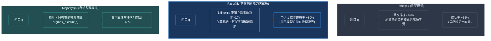

# Chapter 5: 評估基準與組合數學 (Evaluation Benchmarking & Pass@k)

> *「單純看訓練曲線的爬升往往是危險的幻覺——唯有嚴謹的無偏組合統計、多種子置信區間與測試集防污染評估，才能驗證模型是真正學會了邏輯推理，還是僅僅在鑽驗證器的漏洞。」*

---

## 核心心智模型：Pass@1 直覺回答 vs. Pass@k 潛力天花板

在評估對齊後的模型時，僅僅跑一次貪婪解碼（Greedy Decode, $T=0$）遠遠不能描摹策略模型的真實實力：



- **Pass@1（第一反應）**：如同要求學生在考場上 1 秒鐘內交卷，只能反映當前策略分佈中機率最高的常規路徑。
- **Pass@k（探索天花板）**：給學生 16 張草稿紙嘗試不同的數學推導步驟。只要有 1 次成功解出，就證明**神經網絡內部已經具備解決該題目的表徵能力**，後續只需藉由 Verifier/PRM 進行 Best-of-N 重排序或 SFT 蒸餾即可完全釋放。
- **Majority@k（自洽表決）**：若 16 次嘗試中有 12 次收斂到同一個答案，該解答正確的信賴度極高，是生產環境免 Critic 增強精度的標準手段。

---

## 5.1 評估策略：訓練前後的基準對照 (Before vs. After)

最基本的評估是將未經強化學習的**基底模型（Pretrained Base）**與經過 GRPO 的**後訓練策略模型**在完全隔離的測試集（Held-out Test Split）上進行同條件對決：

```python
# 模擬 10 題 GSM8K 測試題的判斷結果
base_model_correct = [True, False, False, True, False, False, False, False, False, False]
trained_model_correct = [True, True, False, True, True, False, True, False, True, True]

base_acc = sum(base_model_correct) / len(base_model_correct)
trained_acc = sum(trained_model_correct) / len(trained_model_correct)

print(f"基底模型準確率:     {base_acc * 100:.1f}%")
print(f"後訓練模型準確率:   {trained_acc * 100:.1f}%")
print(f"絕對提升幅度:       +{(trained_acc - base_acc) * 100:.1f} 百分點")
# 基準模型: 20.0% -> GRPO 模型: 60.0% (+40.0 pp)
```

### 典型 1.5B 模型（訓練 250 步）前後對比指標預期

| 評估維度 | GRPO 訓練前 (Base) | GRPO 訓練後 (Policy) | 預期演化 Delta | 物理直覺 |
|---|---|---|---|---|
| **Greedy 準確率** | $\sim 18\% - 25\%$ | $\sim 45\% - 55\%$ | $+25\% \text{ to } +30\text{pp}$ | 基礎推理能力本質提升 |
| **標籤格式合規率** | $\sim 20\% - 35\%$ | $\sim 92\% - 98\%$ | $+65\% \text{ to } +75\text{pp}$ | 完全掌握思考與答案邊界 |
| **平均思考長度** | $\sim 80 \text{ tokens}$ | $\sim 310 \text{ tokens}$ | $+230 \text{ tokens}$ | **長思維鏈與自發檢查湧現** |

---

## 5.2 無偏 Pass@k 估計器的組合數學推導

若直接對每題採樣 $k$ 次並檢查是否答對，在有限樣本下的方差極大且帶有系統性偏差。OpenAI 在 Codex 論文（Chen et al., 2021）中確立了學術界的**超幾何無偏 Pass@k 估計器**：

對每道題獨立採樣 $n \ge k$ 次（例如 $n=16, k=4$），若其中有 $c$ 次答對，則 $k$ 次採樣全錯的機率為超幾何分佈 $\frac{\binom{n-c}{k}}{\binom{n}{k}}$。因此，至少答對 1 次的無偏估計值為：

$$\text{Pass@k} = 1 - \frac{\binom{n - c}{k}}{\binom{n}{k}} = 1 - \prod_{j=1}^k \frac{n - c - j + 1}{n - j + 1}$$

```python
def compute_pass_at_k(n: int, c: int, k: int) -> float:
    """利用超幾何分佈無偏連乘計算 Pass@k"""
    if n - c < k:
        return 1.0  # 錯誤數量小於抽取數量，必然至少抽中 1 個正確
    prob_all_wrong = 1.0
    for j in range(1, k + 1):
        prob_all_wrong *= (n - c - j + 1) / (n - j + 1)
    return 1.0 - prob_all_wrong

# 測試評估：每題採樣 n=8 次，答對題數 c 分別為 [6, 3, 1, 0]
test_samples = [
    {"q": "題1 (高信心)", "n": 8, "c": 6},
    {"q": "題2 (中信心)", "n": 8, "c": 3},
    {"q": "題3 (稀有突破)", "n": 8, "c": 1},
    {"q": "題4 (未解難題)", "n": 8, "c": 0},
]

for k in [1, 2, 4, 8]:
    scores = [compute_pass_at_k(s["n"], s["c"], k) for s in test_samples]
    mean_pass = sum(scores) / len(scores)
    print(f"Pass@{k:<2}: {mean_pass * 100:.2f}%")
```

---

## 5.3 統計顯著性與 Bootstrap 95% 置信區間

在隨機自回歸生成中，單次評測存在高方差。頂級實驗室嚴禁僅回報單一浮點數點估計（Point Estimate），必須透過 **Bootstrap 非參數重採樣** 計算 95% 置信區間：

```python
import numpy as np

def bootstrap_ci(scores: list[float], n_bootstraps: int = 1000, ci: float = 0.95):
    """計算非參數百分位數 Bootstrap 95% 置信區間"""
    rng = np.random.default_rng(seed=42)
    boot_means = [
        np.mean(rng.choice(scores, size=len(scores), replace=True))
        for _ in range(n_bootstraps)
    ]
    alpha = (1.0 - ci) / 2.0
    lower = np.percentile(boot_means, alpha * 100)
    upper = np.percentile(boot_means, (1.0 - alpha) * 100)
    return np.mean(scores), lower, upper

# 100 道測試題中 52 題正確
test_results = [1.0] * 52 + [0.0] * 48
mean_val, low, high = bootstrap_ci(test_results)
print(f"實證準確率:   {mean_val * 100:.1f}%")
print(f"95% 置信區間: [{low * 100:.1f}%, {high * 100:.1f}%]")
```

---

## 5.4 作弊警報：識別 Reward Hacking 與策略坍塌

在訓練過程中，如果看到獎勵指標不斷爬升，必須立即交叉比對測試集的真實表現：

```text
                 典型 Reward Hacking 作弊特徵
獎勵 (Reward)                    測試集準確率 (Accuracy)
   ▲                               ▲
   │           ╱‾‾‾‾‾‾‾            │
   │          ╱                     │      ╱‾‾╲
   │         ╱                      │     ╱    ╲─── 測試準確率斷崖下跌！
   │        ╱                       │    ╱
   │   ────╱                        │───╱
   └──────────────────▶ 步數        └──────────────────▶ 步數
   
   訓練獎勵一路向好...               ...但測試泛化能力崩潰（模型學會了刷分漏洞）
```

### 三大警報診斷清單
1. **泛化斷層**：訓練題目獎勵由 $0.8$ 飆升到 $1.9$，但獨立測試集的準確率在 50 步後開始鈍化甚至倒退。
2. **熵崩潰 (Entropy Collapse)**：Policy Token Entropy 趨近於 0，所有問題生成的思考開頭完全千篇一律。
3. **KL 散度爆炸**：$D_{\text{KL}}(\pi_\theta \| \pi_{\text{ref}}) > 5.0$，模型開始丟失基礎語言理解能力，出現胡言亂語。

---

## 5.5 推理成本經濟學：每正確解 Token 成本 (TPCS)

長思維鏈的湧現必然會帶來生成長度的增長。嚴謹的 MLE 必須衡量額外消耗的計算資源是否划算：

$$\text{TPCS (Tokens Per Correct Solution)} = \frac{\text{測試集生成的總 Token 數量}}{\text{最終答對的題目總數}}$$

```python
eval_stats = {
    "Base Model": {"correct": 20, "evals": 100, "tokens": 12_400},
    "GRPO Model": {"correct": 58, "evals": 100, "tokens": 29_000}
}

for name, s in eval_stats.items():
    acc = s["correct"] / s["evals"]
    avg_len = s["tokens"] / s["evals"]
    tpcs = s["tokens"] / s["correct"]
    print(f"{name:<10} | 準確率: {acc*100:.1f}% | 均長: {avg_len:.1f} | TPCS: {tpcs:.1f} tokens/題")

# Base Model: 準確率 20.0% | TPCS = 620 tokens/題
# GRPO Model: 準確率 58.0% | TPCS = 500 tokens/題
```

> [!NOTE]
> **直覺結論**：雖然 GRPO 模型平均生成長度由 124 膨脹至 290 tokens（增加了 2.3 倍），但因為準確率大幅躍升，**換取一道正確答案所消耗的平均 Token 成本反而從 620 降至 500**！這證明長推理思考並不是浪費算力，而是以合理的代價換取確定性突破。

---

## 5.6 失效模式與迭代診斷決策樹

```text
模型是否生成合規的 XML 標籤？ ──否──► 提高 Format Reward 權重；加強 System Prompt 規範
        │
        是
        │
答案是否能被正確提取比對？ ────否──► 題目難度過高；引入 SFT 冷啟動或過濾題庫
        │
        是
        │
訓練 Reward 是否平穩上升？ ────否──► 檢查驗證器數值標準化邏輯；調整學習率與梯度裁剪
        │
        是
        │
測試集準確率是否同步上升？ ────否──► 偵測到 Reward Hacking / 過擬合！加入長度懲罰並提早停機
        │
        是
        │
        ✅ 健康收斂！成功完成 Post-Training 模型對齊
```

---

## 🤔 架構深度思辨與工業界陷阱 (Architectural Insight & Production Pitfalls)

> [!IMPORTANT]
> **Frontier Lab 核心考點 (DeepMind / OpenAI / Anthropic MLE)**:
> - **陷阱與對策 (Failure Mode & Fix)**:
>   1. **Pass@k 的有偏估計陷阱 (Biased Pass@k)**: 
>      許多工程師在評估 Pass@k 時直接取 $k$ 次採樣並計算經驗成功率。當多次評測時，未經無偏組合修正的估計量方差極大且偏向樂觀。
>      *工業界對策*: 必須嚴格採用 Chen et al. (2021) 提出的超幾何無偏估計量 $1 - \frac{\binom{n-c}{k}}{\binom{n}{k}}$，採樣 $n \ge 4k$ 次來計算穩健的期望值。
>   2. **數據污染洩漏 (Contamination Leakage)**: 
>      在報告 GSM8K 顯著提升時，需警惕訓練集是否意外混入了測試題的變體。
>      *工業界對策*: 在評估前運行 **13-gram Jaccard 相似度去重**，排除任何與測試集存在長詞重合的訓練樣本。
> - **核心技術思辨 (Technical Deep Dive)**:
>   *Q: 為什麼一個模型的 Pass@16 很高（例如 80%），但 Greedy Accuracy 只有 35%？在生產環境中你如何將其轉化為實際吞吐收益？*  
>   *A: 這表明模型已經具備解決問題的**潛在能力空間（Latent Capability Ceiling）**，只是策略分佈的高概率模式（Mode）被次優或錯誤路徑佔據。在生產環境中，可以通過以下方案釋放性能：1) 構建輕量級驗證器（Verifier/PRM）進行 **Best-of-N 重排序**；2) 藉由多數表決（Majority Voting）進行自洽性增強（Self-Consistency）；3) 將成功路徑收集為高質量數據進行額外 SFT 蒸餾，將探索優勢固化回貪婪解碼模式中。*

---

## 下一步

→ 進入 [Chapter 6: Agentic 多輪強化學習 (Agentic RLVR & Multi-Turn Verification)](./06_agentic_rlvr.md)，將 GRPO 由單步生成推向具有工具調用與沙箱互動的多輪探索環境。
