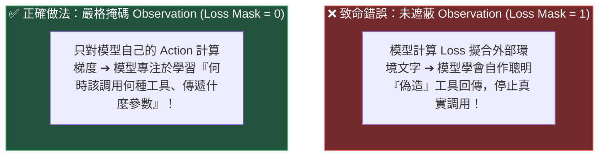

# Chapter 6: Agentic 多輪強化學習 (Agentic RLVR & Multi-Turn Verification)

> *「當強化學習走出單輪數學題的象牙塔，進入調用 Bash、查詢 SQL、讀寫檔案與測試代碼的多輪 Agentic 世界，驗證器便從字串正則演進為真實的沙箱執行環境。」*

---

## 核心心智模型：單輪數學推理 vs. 多輪智能體閉環

在 Chapter 1–5 中，我們處理的是**單輪推理**：給定一個題目，模型在單次生成中完成 CoT 並輸出答案。然而，在真實世界的工程代理（如 SWE-bench 代碼修復、SQL 數據分析、Web 自動化操作）中，任務是以**多輪互動**形式展開的：

```mermaid
flowchart TD
    subgraph ST["單輪模式 (Single-Turn Math RLVR)"]
        P["題目 Prompt x"] --> C["思考鏈與生成 y"]
        C --> R["正則確定性驗證器 r(x, y)"]
    end

    subgraph MT["多輪代理模式 (Multi-Turn Agentic RLVR)"]
        T["使用者任務 / GitHub Issue"] --> TH1["Thought 1: 分析 Traceback 根因"]
        TH1 --> ACT1["Tool Call: grep 搜尋相關模組"]
        ACT1 --> OBS1["Observation: 檔案路徑與行號"]
        OBS1 --> TH2["Thought 2: 構思修補補丁"]
        TH2 --> ACT2["Tool Call: patch_file 修改代碼"]
        ACT2 --> OBS2["Observation: 代碼寫入成功"]
        OBS2 --> TH3["Thought 3: 執行回歸測試驗證"]
        TH3 --> ACT3["Tool Call: pytest 執行測試套件"]
        ACT3 --> OBS3["Observation: 14 passed ✅"]
        OBS3 --> FIN["終端獎勵 (Terminal Reward): 測試通過 (+1.0)"]
    end

    classDef st fill:#1a365d,stroke:#3182ce,color:#fff;
    classDef mt fill:#2d3748,stroke:#4a5568,color:#e2e8f0;
    classDef pass fill:#22543d,stroke:#48bb78,color:#f0fff4;
    class ST st;
    class MT mt;
    class FIN pass;
```



### 兩者的核心不變性
儘管交互輪數大幅增加，**GRPO 的本質數學框架保持完全相同**：
1. 針對同一個任務，平行啟動 $G$ 個互動沙箱，採樣 $G$ 條完整軌跡（Trajectories）。
2. 沙箱環境判定每條軌跡的終端執行結果，給予驗證純量分數 $r_i$。
3. 計算組內相對優勢 $\hat{A}_i = \frac{r_i - \mu_G}{\sigma_G}$。
4. 使用截斷代理損失反向傳播，更新策略網絡權重。

---

## 6.1 Agentic RLVR 四大基石

### 第一基石：結構化動作協議與解析器 (Action Schema)
智能體調用工具必須使用機器可解析的確定性格式（如 ReAct、JSON 函數調用或 XML 標籤）：

```python
import re
import json

class SandboxEnv:
    """模擬安全隔離的沙箱計算環境"""
    def execute(self, tool_name: str, args: dict) -> str:
        if tool_name == "calculator":
            expr = args.get("expr", "")
            try:
                allowed = {"abs": abs, "round": round, "min": min, "max": max}
                return str(eval(expr, {"__builtins__": None}, allowed))
            except Exception as e:
                return f"CalcError: {e}"
        elif tool_name == "bash":
            cmd = args.get("cmd", "")
            if "pytest" in cmd:
                return "14 passed, 0 failed in 0.42s"
            return f"Executed: {cmd}"
        return f"UnknownTool: {tool_name}"

def parse_agent_action(text: str):
    """解析智能體的思維鏈與 JSON 工具調用"""
    thought_match = re.search(r"<think>(.*?)</think>", text, re.DOTALL)
    thought = thought_match.group(1).strip() if thought_match else ""
    
    call_match = re.search(r"<tool_call>\s*({.*?})\s*</tool_call>", text, re.DOTALL)
    if call_match:
        try:
            call_dict = json.loads(call_match.group(1))
            return thought, call_dict.get("name"), call_dict.get("arguments", {})
        except json.JSONDecodeError:
            return thought, None, {}
    return thought, None, {}
```

### 第二基石：沙箱隔離執行環境 (Sandboxed Execution)

| 智能體任務領域 | 隔離環境載體 | 確定性驗收機制 | 典型交互輪數 |
|---|---|---|---|
| **軟件工程 (Coding Agents)** | Docker 容器 / Firecracker microVM | `pytest` 單元測試回傳碼 (`exit code == 0`) | $5 - 25\text{ turns}$ |
| **SQL 與數據分析** | 記憶體 SQLite / DuckDB 實例 | 查詢結果集合精確相等 (Set Equivalence) | $1 - 4\text{ turns}$ |
| **Web 瀏覽器代理** | 無頭瀏覽器 (Headless Chromium) | 終端 DOM 節點狀態與 URL 斷言 | $5 - 30\text{ turns}$ |
| **工具協同 (API Agents)** | 記憶體虛擬檔案系統 (VFS) | 檔案副作用是否存在、JSONSchema 檢驗 | $2 - 8\text{ turns}$ |

---

## 6.2 軌跡損失掩碼 (Loss Masking)：遮蔽環境觀察的生死線

在多輪交互中，整段上下文由兩部分交替組成：
1. **模型主動生成的部分**：`<think>`、`<tool_call>` 與最終的 `<answer>`。
2. **外部環境被動回傳的部分**：用戶初始 Prompt、工具執行的回傳字串 `<observation>`。



> [!IMPORTANT]
> **鐵律**：如果對 `<observation>` 計算策略梯度損失，模型會把注意力浪費在背誦外部終端輸出，甚至在後續回合中「自己幻想並列印假的 `<observation>Tests passed</observation>`」來欺騙後續流程。因此：**所有來自環境的反饋必須嚴格設置 `loss_mask = 0`**！

```python
import torch
from transformers import AutoTokenizer

tokenizer = AutoTokenizer.from_pretrained("Qwen/Qwen2.5-0.5B-Instruct")

# 模擬一條多輪智能體互動文本
prompt_str = "<|im_start|>user\n計算 14*25 - 60。<|im_end|>\n<|im_start|>assistant\n"
turn_1_str = "<think>調用計算器</think>\n<tool_call>{\"name\": \"calculator\", \"arguments\": {\"expr\": \"14*25-60\"}}</tool_call>"
obs_str    = "\n<observation>290</observation>\n"  # 外部環境回傳
turn_2_str = "<think>計算結果為 290</think>\n<answer>290</answer><|im_end|>"

full_episode = prompt_str + turn_1_str + obs_str + turn_2_str
token_ids = tokenizer.encode(full_episode, return_tensors="pt")[0]
loss_mask = torch.zeros_like(token_ids)

# 僅對 assistant 產生的思考與動作標記 mask = 1
def mark_subsequence(full_seq, subseq, mask):
    for i in range(len(full_seq) - len(subseq) + 1):
        if full_seq[i:i+len(subseq)].tolist() == subseq:
            mask[i:i+len(subseq)] = 1
            return

mark_subsequence(token_ids, tokenizer.encode(turn_1_str, add_special_tokens=False), loss_mask)
mark_subsequence(token_ids, tokenizer.encode(turn_2_str, add_special_tokens=False), loss_mask)

print(f"總軌跡長度:       {len(token_ids)} tokens")
print(f"有效訓練 tokens:  {loss_mask.sum().item()} tokens ({loss_mask.sum().item() / len(token_ids) * 100:.1f}%) [Mask=1]")
print(f"被遮蔽環境 tokens:{(loss_mask == 0).sum().item()} tokens ({ (loss_mask == 0).sum().item() / len(token_ids) * 100:.1f}%) [Mask=0]")
```

---

## 6.3 多輪獎勵塑形：防刷分步數懲罰 (Step Efficiency Penalty)

多輪智能體的獎勵函數由三大維度共同構成：

$$R(\tau) = r_{\text{success}} + \lambda_{\text{schema}} \cdot r_{\text{schema}} - \lambda_{\text{step}} \cdot N_{\text{turns}}$$

1. **終端成功獎勵 ($r_{\text{success}} \in \{0, 1\}$)**：單元測試是否完全通過、目標檔案是否正確建立。
2. **語法合規獎勵 ($r_{\text{schema}} \in \{0, 0.2\}$)**：輸出的 JSON 是否合法符合 Schema。
3. **步數懲罰項 ($-\lambda_{\text{step}} \cdot N_{\text{turns}}$)**：每多走一步扣除微量分數（如 $-0.05$），防止模型在遇到困難時陷入無窮無盡的空轉或調用只讀指令刷步數。

```python
trajectories = [
    {"traj_id": "A (最優)", "success": True,  "valid_json": True,  "steps": 2},
    {"traj_id": "B (冗長)", "success": True,  "valid_json": True,  "steps": 5},
    {"traj_id": "C (失敗)", "success": False, "valid_json": True,  "steps": 6},
    {"traj_id": "D (語法錯)","success": False, "valid_json": False, "steps": 1},
]

def score_agent_trajectory(t, step_cost=0.05, schema_bonus=0.2):
    r_succ = 1.0 if t["success"] else 0.0
    r_schema = schema_bonus if t["valid_json"] else -0.3
    r_eff = - (step_cost * t["steps"])
    return r_succ + r_schema + r_eff

raw_scores = torch.tensor([score_agent_trajectory(t) for t in trajectories])
mean_r, std_r = raw_scores.mean(), raw_scores.std() + 1e-8
advantages = (raw_scores - mean_r) / std_r

for t, r, a in zip(trajectories, raw_scores, advantages):
    print(f"{t['traj_id']} | 原始獎勵: {r.item():+.2f} | GRPO 優勢 Â: {a.item():+.3f}")
# A (最優軌跡) 獲得最高的相對正向優勢！
```

---

## 6.4 信用分配（Credit Assignment）：結果監督 vs. 過程監督 (PRM)

```text
結果監督 (Outcome Supervision / 標準 GRPO):
Turn 1: grep 檔案  ──► 整條軌跡優勢 = +1.28
Turn 2: 修改代碼   ──► 整條軌跡優勢 = +1.28
Turn 3: 執行 pytest──► 整條軌跡優勢 = +1.28

過程監督 (Process Supervision / PRM 逐步打分):
Turn 1: grep 檔案  ──► 步驟優勢 = +0.30 (搜尋有效)
Turn 2: 修改代碼   ──► 步驟優勢 = +1.10 (精準定位根因)
Turn 3: 執行 pytest──► 步驟優勢 = +0.20 (常規驗收)
```

> [!TIP]
> **工業界工程實踐建議**：在多輪 Agent 初期，**務必以結果監督（Outcome Verifier）為主**。過早引入過程監督極易引發嚴重的工具刷分漏洞（例如模型在遇到不會寫的代碼時，狂調 `ls` 或 `git status` 來賺取每步的過程微量獎勵）。

---

## 🤔 架構深度思辨與工業界陷阱 (Architectural Insight & Production Pitfalls)

> [!IMPORTANT]
> **Frontier Lab 核心考點 (DeepMind / OpenAI / Anthropic MLE)**:
> - **陷阱與對策 (Failure Mode & Fix)**:
>   1. **環境觀察洩漏至損失 (Observation Leakage into Loss)**: 
>      若在多輪軌跡中未嚴格把 `<observation>...</observation>` 的 `loss_mask` 設為 0，模型會被迫使用自回歸梯度去擬合外部工具（如 Bash 報錯信息或數據庫返回行）的 token 分佈。這會使模型開始「幻想」偽造工具返回結果，徹底喪失真實調用工具的能力。
>   2. **工具刷分作弊 (Tool Reward Hacking)**: 
>      若對「成功調用工具」給予固定的正向過程獎勵（Process Reward），模型會學會在遇到難題時瘋狂調用 `ls` 或 `grep` 刷取每步 $+0.1$ 的過程分，而故意不進入終止狀態。
>      *工業界對策*: **過程獎勵只給負分（Step Penalty），正分只由終端測試套件（Outcome Verifier）給予**。
> - **核心技術思辨 (Technical Deep Dive)**:
>   *Q: 在 SWE-bench 多輪編程代理中，Rollout 過程非常耗時（單條軌跡可能需要數十秒甚至幾分鐘執行 pytest），如何設計高效的分佈式 Rollout 架構？*  
>   *A: 採用**異步解耦架構（Decoupled Actor-Learner Architecture）**，如 veRL 或 HybridFlow。將推理生成（vLLM）與代碼執行環境（Docker 集群）隔離成微服務，使用 Ray 異步任務調度器並發執行多個 Sandbox；Rollout 生成完畢後，異步收集軌跡與獎勵送入訓練隊列，訓練節點（FSDP2/Megatron-LM）只專注於快速計算策略梯度，避免 GPU 在等待環境 I/O 時空轉。*

---

## 下一步

→ 進入 [Chapter 7: DPO 與直接偏好優化 (Direct Preference Optimization)](./07_dpo_preference_optimization.md)，推導無獎勵模型的偏好對齊閉式解。
