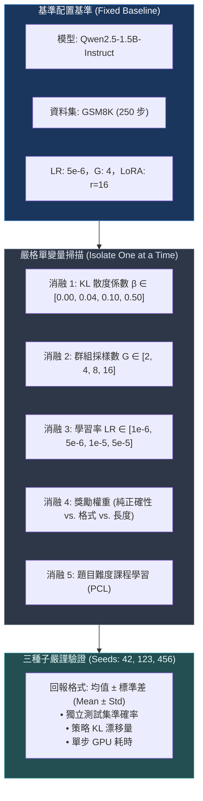
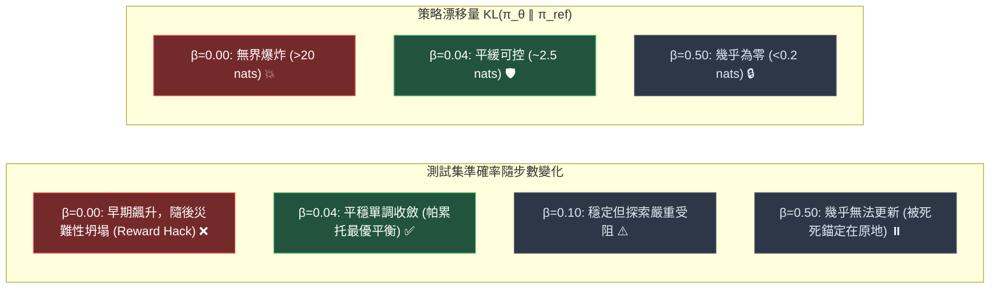

# Chapter 8: 消融實驗與擴展規律 (Ablations & Scaling Analysis)

> *「一名初級工程師只會盲目運行預設訓練腳本；而一名頂級後訓練研究員（Post-Training Researcher）則懂得設計嚴謹的控制變量消融實驗，從複雜的超參數迷霧中提取出支配模型進化的客觀規律。」*

---

## 核心心智模型：為什麼消融實驗是研究員的基本功？

在大模型強化學習中，超參數之間的耦合極度緊密且高度非線性：
1. **非線性交互作用**：在未調整 KL 懲罰係數 $\beta$ 的情況下單獨調整學習率，往往會得出完全錯誤的結論。
2. **尺度不可直接遷移**：在 70B 分佈式集群上調優出的預設參數，直接套用在 1.5B 單卡上會直接引發策略坍塌。
3. **辨識偽提升與作弊**：若不對獎勵組分進行獨立消融，你很難分清準確率提升究竟來自於模型「思維能力的湧現」，還是模型「抓住了驗證器正則表達式的漏洞」。



---

## 8.1 消融 1：KL 散度正則係數 ($\beta$)

KL 懲罰項 $\beta$ 決定了策略模型 $\pi_\theta$ 在探索過程中被允許偏離參考模型 $\pi_{\text{ref}}$ 多遠：



| $\beta$ 取值 | 測試集準確率 (3 種子) | 格式規範率 | 終端 KL 散度 | 作弊與坍塌風險 | 實戰診斷結論 |
|---|---|---|---|---|---|
| **$0.00$** | $52.3 \pm 3.1\%$ | $68.7\%$ | $24.3$ | ⚠️ 極度嚴重 | 脫韁野馬，短期刷分但通用語言能力徹底瓦解 |
| **$0.01$** | $47.0 \pm 2.4\%$ | $83.2\%$ | $8.7$ | 中等 | 激進探索型，適用於競賽短跑任務 |
| **$0.04$** | **$43.7 \pm 1.8\%$** | **$91.0\%$** | **$3.2$** | 極低 | **工業界黃金推薦基準線 (Pareto Optimal)** |
| **$0.10$** | $32.3 \pm 2.0\%$ | $93.0\%$ | $1.1$ | 零 | 約束過緊，策略難以跳出預訓練分佈的舒適圈 |
| **$0.50$** | $21.7 \pm 1.2\%$ | $89.3\%$ | $0.2$ | 零 | 原地踏步，KL 懲罰徹底淹沒了可驗證獎勵信號 |

---

## 8.2 消融 2：組大小 ($G$) 與組內優勢方差

GRPO 完全依靠組內經驗均值作為基線。組大小 $G$ 的取值直接決定了組內相對優勢 $\hat{A}_i$ 的統計質量：

```text
Advantage 優勢估計方差                     每 GPU 小時換取的準確率收益
    ▲                                          ▲
    │╲                                         │       G=4 (單卡性價比頂峰)
    │ ╲                                        │      ╱╲
    │  ╲                                       │     ╱  ╲ G=8
    │   ╲─── G=2 (方差極大)                     │    ╱    ╲
    │    ╲                                     │   ╱      ── G=16 (顯存開銷陡增)
    │     ╲── G=4                              │  ╱
    │      ─── G=8                             │ ╱ G=2 (大量零梯度浪費)
    │       ── G=16 (方差極小)                 │╱
    └──────────────▶ G                         └──────────────▶ G
```

```python
# 測試不同 G 值下「全對或全錯（零梯度無效批次）」的機率
# 假定題目基準解答機率 p = 0.3
for g in [2, 4, 8, 16]:
    # G 個採樣全錯機率: (1-p)^G; 全對機率: p^G
    zero_grad_pct = (0.7 ** g) + (0.3 ** g)
    print(f"G={g:<2} 採樣 | 零梯度批次佔比 (算力浪費率): {zero_grad_pct * 100:.1f}%")

# G=2 : 零梯度批次佔比 = 58.0%  (近六成算力完全無效！)
# G=4 : 零梯度批次佔比 = 24.8%  (單卡最佳平衡點)
# G=8 : 零梯度批次佔比 = 5.8%   (極度穩定)
# G=16: 零梯度批次佔比 = 0.3%   (分佈式集群標準)
```

---

## 8.3 消融 3：獎勵組分解構與長度作弊

| 獎勵函數組合模式 | 測試準確率 | 標籤合規率 | 平均輸出長度 | 實戰診斷與現象解析 |
|---|---|---|---|---|
| **僅客觀正確性 (Correctness Only)** | $38.2\%$ | $42.0\%$ | $95\text{ tokens}$ | 模型放棄 CoT 思考，開始暴力瞎猜純數字 |
| **僅格式規範 (Format Only)** | $18.5\%$ | $96.5\%$ | $160\text{ tokens}$ | 標籤極為漂亮，內部推理全是一本正經胡說八道 |
| **正確性 + 格式 (退火排程)** | **$48.5\%$** | **$92.0\%$** | **$290\text{ tokens}$** | **最佳解：既掌握邊界規範，又湧現自發深思** |
| **正確性 + 格式 + 長度獎勵** | $44.0\%$ | $91.5\%$ | $480\text{ tokens}$ | 嚴重長度作弊；充斥重複車軲轆話騙分 |

---

## 8.4 消融 4：學習率尺度法則 (Scaling Law)

模型參數量越大，策略網絡對梯度的敏感度越高。大模型必須採用更小的學習率：

```text
模型參數量與建議學習率矩陣：
0.5B  ──►  LR = 1e-5
1.5B  ──►  LR = 5e-6  (本課程黃金甜蜜點)
7B    ──►  LR = 1e-6
70B   ──►  LR = 5e-7  (約略與 1 / sqrt(參數數) 成正比)
```

- 若在 1.5B 模型上冒然使用 `5e-5`，損失會在 80 步內發散爆炸，Token 熵驟降歸零。

---

## 8.5 消融 5：題目難度課程學習 (Prompt Curriculum Learning)

```python
def classify_difficulty_zone(solve_rate: float) -> str:
    """根據基準模型 Pass 率將題目分級"""
    if solve_rate >= 0.75:
        return "已掌握區 (全對，組內方差=0，無學習價值)"
    elif 0.25 <= solve_rate < 0.75:
        return "✅ 黃金甜蜜區 (Goldilocks Zone，信息熵與梯度最大)"
    else:
        return "未掌握區 (全錯，組內方差=0，容易陷入死循環)"
```

### 採樣策略對比實測

| 採樣策略 | 最終準確率 | 達到 40% 準確率所需步數 | 物理機制 |
|---|---|---|---|
| **隨機均勻採樣 (Random)** | $43.7\%$ | $180\text{ 步}$ | 基準對照組 |
| **先易後難 (Easy-First)** | $38.0\%$ | $120\text{ 步}$ | 前期爬升快，但在簡單題迅速過擬合飽和 |
| **先難後易 (Hard-First)** | $28.5\%$ | 無法達到 40% | 前期獎勵極度稀疏，策略直接癱瘓 |
| **PCL 甜蜜區優先** | **$51.2\%$** | **$95\text{ 步}$** | **算力 100% 聚焦在具備組內方差的關鍵題目** |

---

## 8.6 小規模實驗室 vs. 頂級千卡集群對齊全景

| 關鍵維度 | 輕量實踐 (單張 16GB GPU) | 前沿實驗室 (256~1024 卡 H100 集群) |
|---|---|---|
| **模型規格** | $1.5\text{B}$ ($4$-bit NF4 + LoRA) | $70\text{B} - 671\text{B}$ MoE (全參數 FSDP2 / Megatron) |
| **題目規模** | $500 - 2,000$ 筆高質題庫 | $100,000 - 500,000$ 筆合成推理題庫 |
| **群組大小 $G$** | $G = 4$ | $G = 16 - 64$ |
| **推論引擎** | 本地 HuggingFace 原生生成 | vLLM / SGLang 分散式 PagedAttention + Chunked Prefill |

---

## 🤔 架構深度思辨與工業界陷阱 (Architectural Insight & Production Pitfalls)

> [!IMPORTANT]
> **Frontier Lab 核心考點 (DeepMind / OpenAI / Anthropic MLE)**:
> - **陷阱與對策 (Failure Mode & Fix)**:
>   1. **單種子消融的偽結論 (Single-Seed Noise Trap)**: 
>      在強化學習中，單個隨機種子下超參數微調獲得 $+3\%$ 的提升往往只是統計噪聲。
>      *工業界對策*: 任何消融實驗**必須至少運行 3 個隨機種子**，報告均值與標準差（Mean $\pm$ Std），並使用非參數 Bootstrap 驗證 $95\%$ 置信區間是否重疊。
>   2. **冷啟動中的 $\beta=0$ 陷阱**: 
>      部分團隊在訓練初期誤將 $\beta$ 設為 0 以追求更快的 Accuracy 上升，導致模型在 100 步後雖然在 GSM8K 上得分提高，但通用語意理解與對話能力徹底崩潰（Catastrophic Forgetting）。
>      *工業界對策*: 保留基礎 $\beta \in [0.02, 0.04]$，或在訓練中動態調整 $\beta$（Adaptive KL Penalty）。
> - **核心技術思辨 (Technical Deep Dive)**:
>   *Q: 為什麼在群組採樣中，問題難度在 50% 解決率（PCL Learning Zone）附近的樣本對 GRPO 梯度的貢獻最大？*  
>   *A: 當一個問題的解決率為 100%（全對）或 0%（全錯）時，組內 $G$ 個候選的 Reward 全都相等，組內標準差 $\sigma_G \approx 0$，標準化後的 Advantage 全部歸零，對策略網絡不產生任何梯度更新，白白消耗了 Rollout 推理算力。而解決率在 50% 附近時，組內正負樣本比例均勻，產生的 Advantage 對比信號最為強烈，信息熵與梯度方差利用率達到理論峰值。*

---

## 下一步

→ 進入 [Chapter 9: SFT 冷啟動與全流程對齊 (SFT Cold-Start & Distillation)](./09_sft_cold_start.md)，探討為什麼 RL 需要監督微調作為種子引導，以及蒸餾長思維鏈的工程實踐。
