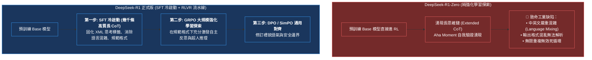
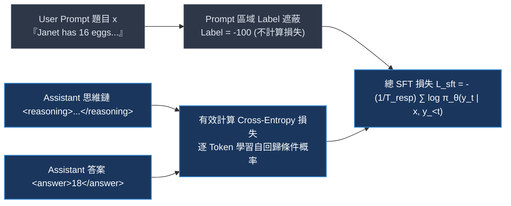
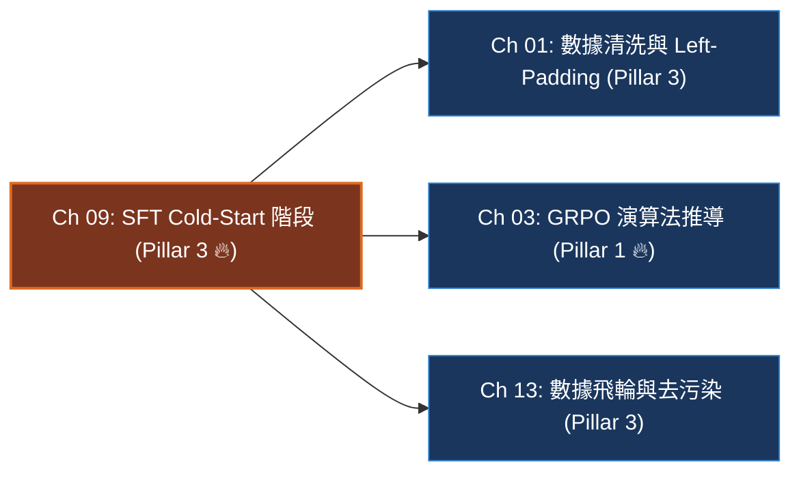

# Chapter 9: SFT Cold-Start 階段與思維鏈合成 (SFT Cold-Start & Reasoning Distillation)

> *「純強化學習（Pure RL）雖然證明了智能能夠在無人類標註下自發湧現，但在工程實踐中，缺少監督微調（SFT）冷啟動的探索就像在漆黑的荒野中漫無目的地開槍——SFT 的使命絕不是強迫模型背誦答案，而是為它點亮第一盞看清思考標籤與自我反思邊界的明燈。」*

---

## 一、工業背景與技術演進：冷啟動死局與 DeepSeek-R1-Zero 的啟示

在推理大模型後訓練的演進歷程中，業界曾對「是否還需要 SFT」產生過激烈爭論：



### 1. 冷啟動死局（The Cold-Start Trap）的根本成因
如果把一個完全未經微調的基模（如 Qwen-2.5-Base）直接投入 GRPO 訓練：
- **格式失配**：基模完全沒有 `<reasoning>` 與 `<answer>` 的 XML 標籤語法先驗。
- **組內梯度歸零**：對於難度較高的數學題，模型隨機採樣 $G=8$ 次，解答格式全部無法被正則解析，規則驗證器判定全部為 0 分（$r_i = 0$）。此時組內標準差 $\sigma = 0$，相對優勢 $\hat{A}_i = 0$。**策略梯度徹底消失，訓練陷入永久凍結**。

### 2. SFT 冷啟動的破局角色
SFT 冷啟動不需要十萬條百科問答，只需要 **3,000 ~ 8,000 條極致清晰、格式嚴密的長思維鏈樣本**：
1. **建立語法契約**：教會模型在 `<reasoning>` 中展開推導，在 `<answer>` 中輸出純量答案。
2. **拉升初始 Pass@k**：將基模在目標題庫的未微調 Pass@8 從 0% 提升到 **15% ~ 35%（進入 Goldilocks 甜蜜區）**，從而確保每一批次採樣都有成功與失敗的對比，源源不斷為 GRPO 提供有效的組內方差信號。

---

## 二、架構決策樹與 Trade-off 對比

在構建冷啟動長思維鏈數據集時，工程團隊面臨不同數據採集與蒸餾路徑的系統權衡：

| 數據合成範式 | 人工專家標註 (Human CoT) | 前沿模型蒸餾 (Teacher Distillation) | 拒絕採樣過濾 (Rejection Sampling) | 自我修正自舉 (Self-Correction) |
|---|---|---|---|---|
| **每千條合成成本** | 極高 ($5,000+ USD) | **極低 ($5 ~ $20 USD)** | 中等 ($50 ~ $200 USD) | 低 (本地 GPU 算力) |
| **思維鏈質量與嚴密性** | 高 (但存在人為手誤) | **極高 (如 Claude-3.5/R1 輸出)** | 高 (綁定 Verifier 判定) | 中等 (依賴初始模型能力) |
| **格式與標籤一致性** | 易出現人工疏漏 | **極佳 (可透過 Prompt 強制規範)** | **極佳 (正則嚴格過濾)** | 良好 |
| **模式坍塌 (Mode Collapse) 風險**| 零 | **較高 (過擬合教師模型的口頭禪)** | 低 (多樣化採樣候選) | 中等 |
| **推薦數據規模** | $500 \sim 1,000$ 條 | **$3,000 \sim 8,000$ 條** | **$5,000 \sim 15,000$ 條** | $2,000 \sim 5,000$ 條 |
| **最優適用階段** | 極早期概念驗證 | **生產級推理模型 SFT 冷啟動** | 規模化擴增高品質真題池 | 中期自演進迭代 |

> [!TIP]
> **工業落地決策守則**：
> - **黃金標準組合**：採用 **前沿旗艦模型（DeepSeek-R1 / OpenAI o1）作為教師生成候選解答 + 確定性正則代碼執行器進行拒絕採樣過濾**。
> - **絕不過擬合 SFT**：冷啟動 SFT 數據量嚴格控制在 10,000 條以內，訓練 1~2 個 Epoch 即可。一旦過度訓練，模型會退化為死板背誦教師思維模式的「鸚鵡」，喪失後續 RLVR 的自主探索能力。

---

## 三、系統心智模型與邊界直覺 (Systems Mechanics & Boundary Intuition)

### 1. SFT 標籤遮蔽因果訓練



### 2. 核心目標函數（一行形式化）

$$\mathcal{L}_{\text{SFT}}(\theta) = -\frac{1}{\sum_{t=1}^T m_t} \sum_{t=1}^T m_t \log \pi_\theta(x_t \mid x_{<t})$$

其中 $m_t \in \{0, 1\}$ 為標籤遮蔽掩碼（Mask），僅在 Assistant 生成的回覆 Token（思維鏈與答案）位置為 1，在 User Prompt 位置為 0（在 PyTorch 中對應 `ignore_index = -100`）。

### 3. 關鍵參數物理意義與極限邊界分析 (Boundary Intuition)

- **數據量 $N$ 的邊界行為**：
  - 當 $N < 500$：模型尚未完全固化 XML 閉合標籤規則，在後續 GRPO 採樣中仍有約 10%~20% 的格式解析失敗率。
  - 當 $N \in [3,000, 8,000]$：邊際效益最高。格式合規率達到 99% 以上，Pass@8 穩定落在 20%~40%，模型具備足夠的探索熵。
  - 當 $N > 100,000$：**負面效應顯現**。模型開始過擬合特定的思維模板，生成熵（Token Entropy）急劇下跌，在後續 RL 探索中無法跳出局部最優解。
- **Token 熵（Token Entropy）的預警邊界**：
  - 健康的冷啟動模型在回覆起點的平均 Token 熵應維持在 $1.2 \le H \le 2.5$。
  - 若 SFT 結束後平均熵跌落至 $< 0.4$，說明模型已被「洗腦式過擬合」，對所有輸入給出幾乎確定性的單一路徑，RL 階段將完全失去探索活力。
- **思維引導詞（Reflective Keywords）的催化作用**：
  - 在冷啟動數據中特意保留帶有自我反思標記的語料（如 *「Wait, let me double-check...」*、*「Alternatively, we can verify...」*），能夠在先驗分佈中埋下自我質疑的種子，加速後續 GRPO 在長思維鏈上的湧現。

---

## 四、代碼剖析、實時遙測巡檢與失效急救

### 1. 長思維鏈數據清洗與標籤遮蔽流水線代碼

```python
import re
import torch

def create_masked_sft_batch(
    tokenizer,
    prompt_text: str,
    reasoning_text: str,
    answer_text: str,
    max_len: int = 2048
) -> dict:
    """
    構建嚴格標籤遮蔽的 SFT 訓練樣本 (User Prompt 部分 label 設為 -100)
    """
    # 1. 結構化封裝
    system_prompt = "You are a reasoning assistant. Think inside <reasoning> and answer inside <answer>."
    formatted_prompt = f"<|im_start|>system\n{system_prompt}<|im_end|>\n<|im_start|>user\n{prompt_text}<|im_end|>\n<|im_start|>assistant\n"
    response_content = f"<reasoning>\n{reasoning_text}\n</reasoning>\n<answer>{answer_text}</answer><|im_end|>"
    
    # 2. Tokenize
    prompt_ids = tokenizer.encode(formatted_prompt, add_special_tokens=False)
    resp_ids = tokenizer.encode(response_content, add_special_tokens=False)
    
    input_ids = prompt_ids + resp_ids
    # 核心：Prompt 部分不參與損失計算，遮蔽為 -100
    labels = [-100] * len(prompt_ids) + resp_ids
    
    # 截斷保護
    if len(input_ids) > max_len:
        input_ids = input_ids[:max_len]
        labels = labels[:max_len]
        
    attention_mask = [1] * len(input_ids)
    
    return {
        "input_ids": torch.tensor(input_ids, dtype=torch.long),
        "labels": torch.tensor(labels, dtype=torch.long),
        "attention_mask": torch.tensor(attention_mask, dtype=torch.long)
    }
```

### 2. 四維遙測監控雷達表 (SFT Telemetry Signals)

| 遙測指標 (Telemetry Signal) | 健康運算形態 | 異常警報與失效原因分析 | 根本原因 (Root Cause) |
|---|---|---|---|
| `train/loss` | 平滑下降至 $0.4 \sim 0.8$ | 暴跌至 $< 0.1$ | 數據集多樣性嚴重不足，模型已完全死記硬背訓練樣本 |
| `eval/xml_compliance` | 1 個 Epoch 內迅速突破 $> 98\%$ | 徘徊在 $< 80\%$ | 訓練標註中存在未閉合標籤或數據混入格式雜質 |
| `eval/pass_at_8` | 從 $0\%$ 穩步爬升至 $20\% \sim 40\%$ | 始終低於 $5\%$ | 示範思維鏈難度過高或質量低劣，模型未能掌握基本解題邏輯 |
| `eval/token_entropy` | 保持在 $1.0 \sim 2.0$ 之間 | 急劇跌破 $< 0.4$ | SFT 訓練步數過多，策略多樣性坍塌，需提早停止 |

### 3. 工業級現場急救錦囊 (Industrial Incident Runbook)

- **事故 1：思維模板死板過擬合 (Template Collapse)**
  - *現象*：模型對任何題目，第一句話永遠是固定的一字不差的套話（如「I need to carefully read the problem and think step by step...」），缺乏真實解題靈活性。
  - *診斷*：合成數據時使用的教師模型 Prompt 單一，所有示範數據呈現高度同質化的起手式。
  - *急診處方*：
    1. 在教師模型採樣階段引入 **多樣性系統提示詞（Dynamic System Prompt Variation）**。
    2. 引入 15% 簡明、直切要害的短思考樣本，打亂長思維鏈的單一長度偏好。
- **事故 2：標籤未閉合與格式截斷**
  - *現象*：生成文本常出現 `<reasoning>` 寫到一半突然中斷，或者未寫 `</reasoning>` 直接出現 `<answer>`。
  - *診斷*：訓練長度截斷超參數 `max_seq_len` 設得太小，許多長樣本的閉合標籤被暴力截斷，模型錯誤地學會了「不閉合標籤也是合法序列」。
  - *急診處方*：在數據過濾時，直接剔除任何長度超過 `max_seq_len` 的樣本，**確保進入訓練的所有樣本在尾部都有完整的閉合標籤**。

---

## 五、前沿系統架構深度思辨與極限設計 (Frontier Architecture Scenarios & Whiteboard Defense)

> [!IMPORTANT]
> **頂級實驗室 (xAI / OpenAI / DeepMind / Anthropic) 高頻實戰追問**:

### 架構實戰考驗 Q1：DeepSeek-R1-Zero 證明了純強化學習（Pure RL）能讓模型自發學會長思維鏈，那為什麼工業界在訓練旗艦模型時依然堅持保留 SFT 冷啟動？
- **架構極限邊界**：考核你是否理解學術里程碑（概念可行性驗證）與工業生產級可落地性（Production Alignment）的本質區別。
- **滿分回答範式**：
  > 「DeepSeek-R1-Zero 是一個震撼學術界的科學概念驗證（Proof of Concept），它首次證明了**推理能力的自發湧現不依賴人類先驗**；但在工程落地與用戶體驗上，它存在三個無法接受的工業致命傷：
  > 
  > 1. **極度糟糕的人機互動可讀性**：R1-Zero 在思考過程中經常中英文交替跳躍、混雜代碼符號與生僻語言，思維碎片化嚴重，難以作為企業級產品交付；
  > 2. **格式解析脆弱性（Unparsable Formatting）**：由於完全沒有標籤規範先驗，輸出中常夾雜無效標籤或隨機自創標記，自動化系統無法穩定抽取答案，引發嚴重的格式懲罰震盪；
  > 3. **算力冷啟動黑洞**：在全零先驗下，訓練初期需要消耗海量 GPU 算力進行無意義的盲目亂猜。
  > 
  > 因此，DeepSeek-R1 正式版的工程最優解是：**以少量（幾千條）高質量長思維鏈 SFT 作為冷啟動，先為模型穿上『格式嚴密、語言純淨、標籤閉合』的禮貌外衣，再接入大規模 GRPO 進行算力驅動的深度推理探索**。」

---

### 架構實戰考驗 Q2：在 SFT 數據中直接蒸餾前沿模型（如 DeepSeek-R1 / o1）的長思維鏈，能否讓一個 7B 模型超越教師模型？為什麼隨後的 RLVR 才是真正的勝負手？
- **架構極限邊界**：考核你對監督模仿（Imitation Ceiling）與強化學習探索（Self-Evolution）的邊界認知。
- **滿分回答範式**：
  > 「**僅靠 SFT 蒸餾，7B 模型在理論與實踐上都絕不可能超越教師模型**：
  > 
  > 1. **模仿學習天花板（Imitation Ceiling）**：SFT 的目標函數是交叉熵損失，其本質是最大化教師輸出的條件概率。學生模型只學會了在表面特徵上『模仿教師的行文風格與反思用詞』，並沒有真正學會『何時該反思、反思何時能解決問題』。一旦遇到教師示範集沒見過的新題，分佈偏移（Covariate Shift）會使學生模型瞬間陷入幻覺。
  > 2. **RLVR 才是真正的勝負手**：在 SFT 冷啟動之後引入基於規則驗證器的 RLVR（GRPO），訓練目標從『像不像教師』轉變為『最終能不能算對』。模型在千萬次真實試錯中：
  >    - 揚棄那些無效的表面反思套話；
  >    - 強化那些能真正扭轉錯誤的關鍵 Token；
  >    - 在特定垂直領域，學生模型完全可以摸索出教師模型未曾覆蓋的新推導分支，從而在專門任務上實現超越教師模型的能力躍遷。」

---

## 本章小結與學習路徑



→ 下一步建議：
- 若想掌握如何以 XML 標籤與 Left-Padding 建立無 causal leak 的批次推理流水線，進入 [Chapter 1: 資料準備與格式化](./01_data.md)。
- 若想直接進入冷啟動後的強化學習探索核心，進入 [Chapter 3: GRPO 演算法推導與工業實戰](./03_grpo_algorithm.md)。
