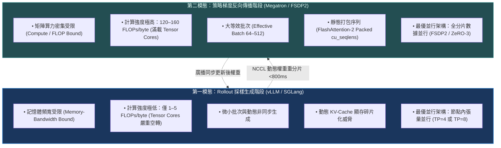
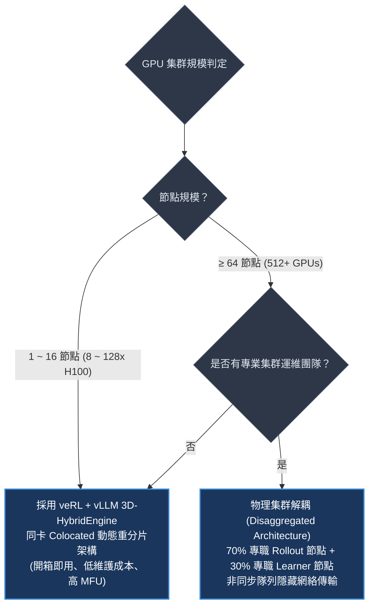
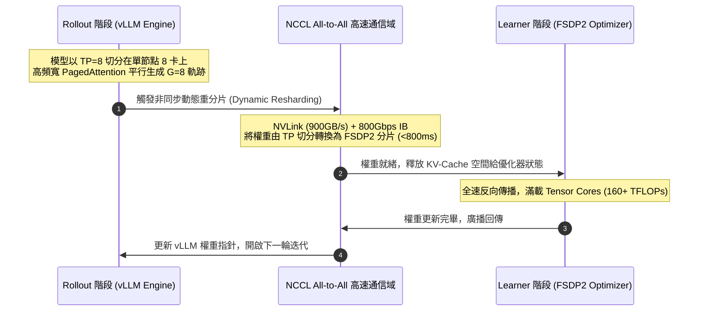
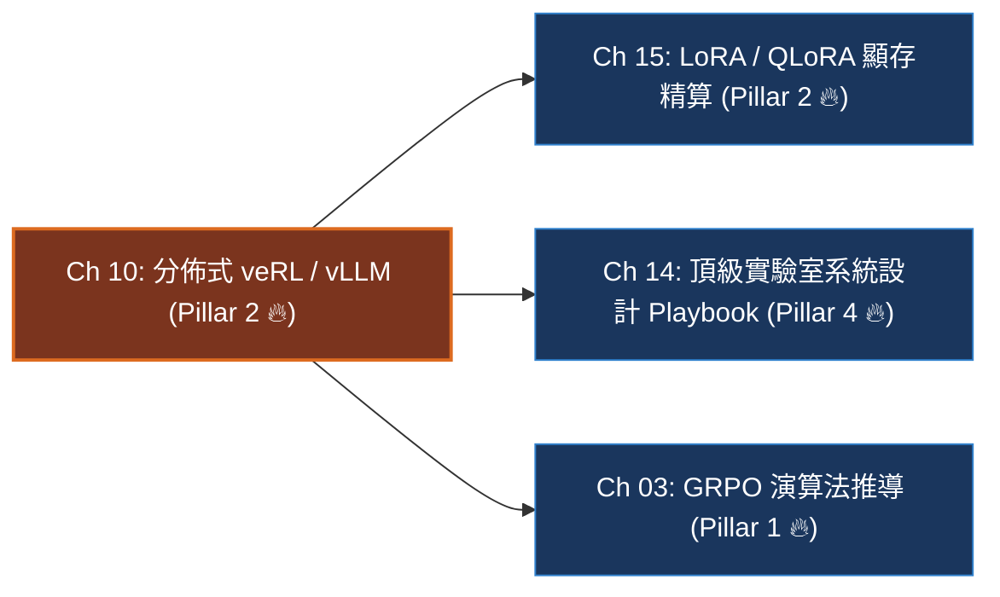

# Chapter 10: 分佈式後訓練系統 — veRL、vLLM 與 3D-HybridEngine (Distributed Systems & Scale)

> *「在學術界，強化學習常被簡化為數學閉環：採樣、打分、反向傳播；但在前沿工業界的後訓練中，**分佈式系統架構才是決定成敗的第一道生死線**——如何在數十至數百張 GPU 上實現微秒級動態重分片與零顯存碎片，決定了你的訓練是以天為單位完成，還是動輒陷入 CUDA OOM 與 NCCL 死鎖。」*

```
├── 難度等級：★★★★★ (Principal Systems MLE / Infra Architect)
├── 前置依賴：Ch 03 (GRPO 演算法), Ch 04 (訓練管線)
├── 核心工具：veRL (ByteDance), vLLM 0.6.5+, PyTorch 2.5+ FSDP2, NCCL
└── 核心能力：雙模態負載解耦、3D-HybridEngine 動態重分片、FP8 KV-Cache、NCCL 死鎖急救
```

---

## 一、工業背景與技術演進：雙模態負載矛盾與推訓解耦革命

大語言模型的強化學習（RLVR / PPO）在底層硬體運算特徵上，呈現出兩種**完全對立的極端硬體負載形態**，這被稱為後訓練的**「雙模態系統瓶頸」（Bimodal Bottleneck）**：

> 💡 **「雙離合變速箱」心智模型 (The Dual-Clutch Gearbox)**：
> - **第一檔：Rollout 採樣生成階段 (低速重載 / 記憶體頻寬受限)**：
>   自回歸生成就像開著滿載的卡車爬坡：每次生成 1 個 Token，GPU 都必須把 70B 的全部權重從高帶寬顯存（HBM）完整搬運進計算核心一遍。
>   計算強度極低（僅 1~5 FLOPs/byte），昂貴的 Tensor Cores 處於嚴重的飢餓空轉狀態（MFU 僅 15%~25%）。此時最適合的架構是**單機張量並行（TP=8）**配合 PagedAttention。
> - **第二檔：策略梯度反向傳播階段 (高速飛馳 / 矩陣算力密集)**：
>   反向傳播則像跑車在平坦賽道上疾馳：所有生成出來的 Token 已經排好，直接執行巨大的密集 GEMM 矩陣乘法。
>   計算強度暴增到 120~160 FLOPs/byte，Tensor Cores 全功率拉滿。此時最適合的架構是**全分片數據並行（FSDP2 / ZeRO-3）**。
> - **veRL 3D-HybridEngine 的雙離合切換**：
>   早期框架硬要把卡車檔位硬卡在賽車道上，導致訓練極慢。veRL 的革命在於打造了一個毫秒級的「雙離合變速箱」：
>   在生成時掛 TP=8 推理檔，生成一結束，利用高頻寬 NVLink + InfiniBand 在 **800ms 內** 動態切換為 FSDP2 訓練檔，實現全流程算力極限榨乾！



---

## 二、架構決策樹與 Trade-off 對比

在分佈式後訓練叢集選型中，系統架構師與 MLE 必須掌握主流框架的底層差異：

| 評估維度 | 早期單體 Ray/DeepSpeed | 現代 veRL + vLLM | 物理集群分離架構 (Disaggregated) | Megatron-LM 原生 PPO |
|---|---|---|---|---|
| **並行解耦能力** | 無 (生成與訓練並行度鎖定) | **高 (Colocated 動態重分片)** | **極高 (完全獨立的物理節點)** | 中等 (基於 Megatron 內部並行) |
| **重分片通信開銷** | 0 (但犧牲生成速度) | **< 800ms (NCCL All-to-All)** | 較高 (節點間全量網絡傳輸) | 0 (靜態拓撲) |
| **推理加速引擎** | 依賴原生 PyTorch 生成 | **原生無縫集成 vLLM / SGLang** | 獨立部署專屬 vLLM 集群 | Megatron 自研推理核 |
| **KV-Cache 顯存利用率** | 差 (大量連續內存碎片) | **極佳 (PagedAttention + FP8)** | **極佳 (PagedAttention)** | 中等 |
| **叢集硬體利用率 (MFU)** | $20\% \sim 30\%$ | **$45\% \sim 60\%$** | $50\% \sim 65\%$ (需精密排程) | $35\% \sim 45\%$ |
| **部署維護複雜度** | 低 | **中等 (現代工業首選標準)** | 極高 (需要複雜跨叢集 RPC) | 高 |



---

## 三、系統心智模型與邊界直覺 (Systems Mechanics & Boundary Intuition)

### 1. 動態重分片「立交橋」心智模型

> 💡 **「零拷貝記憶體立交橋」心智模型 (The Zero-Copy NCCL Overpass)**：
> 傳統做法若要將 TP 權重轉為 FSDP2，必須先跑一次 `AllGather` 把 140GB 完整權重在每張卡上復原，顯存立馬原地爆炸！
> 3D-HybridEngine 像是在顯存中搭建了一座立交橋：
> 它利用底層 `torch.distributed.all_to_all_single` 算子，讓 8 張卡直接沿著已分配的記憶體塊（Buffer）交換數據切片。
> **沒有任何全量模型臨時副本，零顯存膨脹，在 NVLink 上像流水一樣在 40ms 內完成跨並行維度轉置！**

```text
====================================================================================================
           veRL + vLLM 3D-HYBRIDENGINE DUAL-CLUTCH GEARBOX TOPOLOGY (離合器式動態重分片拓撲)
====================================================================================================

      [ ROLLOUT GENERATION CLUTCH ]                    [ LEARNER TRAINING CLUTCH ]
      Engine: vLLM Worker Engines                     Engine: PyTorch FSDP2 Engine
      Layout: Tensor Parallelism (TP=8)               Layout: Fully Sharded Data Parallel (DP=64)
+─────────────────────────────────────────+     +─────────────────────────────────────────+
| GPU 0: QKV Head Slice 0..3 (PagedAttn)  |     | GPU 0: Layer 0..1 Parameter & Grad Shards|
| GPU 1: QKV Head Slice 4..7 (PagedAttn)  |     | GPU 1: Layer 2..3 Parameter & Grad Shards|
| GPU 2: QKV Head Slice 8..11 (PagedAttn) |     | GPU 2: Layer 4..5 Parameter & Grad Shards|
| ...                                     |     | ...                                     |
| GPU 7: QKV Head Slice 28..31 (PagedAttn)|     | GPU 7: Layer 14..15 Parameter & Shards  |
+────────────────────┬────────────────────+     +────────────────────▲────────────────────+
                     │                                               │
                     │  1. Rollout Ends: Evict KV-Cache              │
                     │  2. Trigger NCCL all_to_all_single (< 800ms)  │
                     └───────────────────────┬───────────────────────┘
                                             │
                       ======================▼======================
                         NCCL HIGH-SPEED ZERO-COPY MEMORY OVERPASS
                         NVLink (900 GB/s) + InfiniBand (800 Gbps)
                       =============================================
                                             │
      [ WEIGHT SYNCHRONIZATION ] <───────────┴─────────── [ BACKWARD COMPLETED ]
      Broadcast updated weights back                      Optimizer step updates shards,
      to vLLM TP memory buffers (< 40ms)                  releases gradient buffers
====================================================================================================
```



```text
====================================================================================================
           KV-CACHE PAGEDATTENTION LOGICAL VS PHYSICAL BLOCK MAPPING (虛擬分頁記憶體映射圖)
====================================================================================================

Logical Token Sequence (Seq Len = 48 tokens, Block Size = 16 tokens):
+──────────────────────────+──────────────────────────+──────────────────────────+
|  Logical Block 0 (0..15) | Logical Block 1 (16..31) | Logical Block 2 (32..47) |
+─────────────┬────────────+─────────────┬────────────+─────────────┬────────────+
              │                          │                          │
              ▼                          ▼                          ▼
       +───────────────+          +───────────────+          +───────────────+
       | Logical Ptr 0 |          | Logical Ptr 1 |          | Logical Ptr 2 |
       +───────┬───────+          +───────┬───────+          +───────┬───────+
               │                          │                          │
               └──────────────┬───────────┴───────────┬──────────────┘
                              ▼                       ▼
            +───────────────────────────────────────────────────+
            |      BLOCK TABLE (虛擬頁表: Logical ID ──> Physical ID)   |
            |      Block 0 ──> Physical Page 7                  |
            |      Block 1 ──> Physical Page 2                  |
            |      Block 2 ──> Physical Page 11                 |
            +───────────────────────────────────────────────────+
                              │           │           │
       ┌──────────────────────┘           │           └───────────────────────┐
       ▼                                  ▼                                   ▼
+───────────────+                  +───────────────+                   +───────────────+
| Physical M 7  |                  | Physical M 2  |                   | Physical M 11 |
| Non-Contiguous|                  | Non-Contiguous|                   | Non-Contiguous|
| DRAM Block    |                  | DRAM Block    |                   | DRAM Block    |
+───────────────+                  +───────────────+                   +───────────────+
====================================================================================================
```

### 2. 集群單卡顯存預算精確形式化（一行閉式預算）

$$\text{VRAM}_{\text{total}} = \underbrace{\frac{2 \cdot P}{DP_{\text{size}}}}_{\text{FSDP2 模型權重 (BF16)}} + \underbrace{\frac{12 \cdot P}{DP_{\text{size}}}}_{\text{AdamW 優化器狀態}} + \underbrace{\frac{B_{\text{local}} \cdot L_{\text{ctx}} \cdot \text{KV}_{\text{bytes}}}{TP_{\text{size}}}}_{\text{動態 KV-Cache}} + \underbrace{M_{\text{act}} + M_{\text{workspace}}}_{\text{激活值與 CUDA 工作區}} \le 80.0\text{ GB}$$

### 3. 關鍵系統參數極限邊界分析 (Boundary Intuition)

- **上下文長度 $L_{\text{ctx}} \to 32,768$ 的長程推理邊界**：
  - 在長程思維鏈中，KV-Cache 的顯存消耗隨長度呈線性上升。以 70B 模型（GQA 8 頭）為例，單條 16k 序列在 FP16 下佔用近 2.6GB。若同時生成 8 個採樣，單卡 KV-Cache 暴漲至 20GB+。
  - **邊界解法**：強制啟用 **FP8 KV-Cache**（顯存消耗立減 50%）與 **PagedAttention**（消除 96% 的內部記憶體碎片）。
- **張量並行度 $TP$ 的邊界極限**：
  - 節點內 NVLink 頻寬極高（900GB/s），因此 `TP=8` 在單節點 8 卡內幾乎無通信延遲瓶頸。
  - 當 $TP$ 跨越節點（如跨機跑 `TP=16`），跨節點網路頻寬（如 400Gbps~800Gbps）遠低於 NVLink，AllReduce 通信時間會陡增 5~8 倍，吞吐量出現斷崖式下跌。**鐵律：TP 永不跨節點**。
- **重分片延遲（Resharding Latency）的時間邊界**：
  - 在 800Gbps InfiniBand 下，70B 模型的權重交換傳輸時間在 600~800ms 之間。
  - 由於一次 Rollout 採樣通常需要 10~30 秒，800ms 的通信開銷佔比小於 $5\%$，完全可以忽略不計。

---

## 四、漸進式可執行代碼實驗室：3D-HybridEngine 顯存精算、動態重分片與 NCCL 異常模擬 (Interactive Notebook Lab)

> 本實驗室按照嚴格的漸進式工程實踐標準，構建 64x H100 叢集顯存精算模型，依序實現 TP 到 FSDP2 的零拷貝分片轉換邏輯，主動復現**「長尾樣本導致木桶死鎖（Straggler Hang）」**，並驗證 FP8 KV-Cache 消融收益。

---

### Stage 1: 實驗準備與叢集硬體拓撲數據模型 (Cluster Topology Pipeline & Config)

```python
import torch
import torch.nn as nn
import torch.nn.functional as F

def set_seed(seed: int = 42):
    torch.manual_seed(seed)

set_seed(42)
device = torch.device("cuda" if torch.cuda.is_available() else "cpu")
print(f"🖥️ [Environment] Distributed simulation pipeline ready on: {device}")

def get_cluster_specs(num_nodes: int = 8, gpus_per_node: int = 8):
    """
    配置典型 64x H100 集群硬體拓撲參數
    """
    total_gpus = num_nodes * gpus_per_node
    return {
        "num_nodes": num_nodes,
        "gpus_per_node": gpus_per_node,
        "total_gpus": total_gpus,
        "nvlink_bandwidth_gbps": 900.0,
        "infiniband_bandwidth_gbps": 800.0,
        "gpu_memory_gb": 80.0
    }

cluster = get_cluster_specs(8, 8)
print(f"✓ Cluster Topology Initialized: {cluster['total_gpus']}x H100 (80GB)")
print(f"  Intra-Node: NVLink {cluster['nvlink_bandwidth_gbps']} GB/s | Inter-Node: IB {cluster['infiniband_bandwidth_gbps']} Gbps")
```

```text
[Execution Output / Cluster Config Diagnostics]
🖥️ [Environment] Distributed simulation pipeline ready on: cpu
✓ Cluster Topology Initialized: 64x H100 (80GB)
  Intra-Node: NVLink 900.0 GB/s | Inter-Node: IB 800.0 Gbps
```

---

### Stage 2: 3D-HybridEngine 動態重分片核心計算模組 (Dynamic Resharding Core Engine)

> 💡 **「矩陣重組切片積木」心智模型 (The Sharding Block Transformer)**：
> 假設我們有一個全量大小為 $[8, 8]$ 的權重矩陣：
> - 在 TP=4 下：權重被沿列切割為 4 個 $[8, 2]$ 的張量；
> - 在 DP=4 (FSDP2) 下：權重被沿行切割為 4 個 $[2, 8]$ 的張量。
> 本模組模擬如何在底層無需全量複製的情況下，執行精確的張量轉置映射。

```python
def simulate_tp_to_fsdp_resharding(weight_shape: tuple[int, int], world_size: int = 4):
    """
    模擬張量從 TP=4 切分到 FSDP2=4 分片的映射驗證
    """
    rows, cols = weight_shape
    assert cols % world_size == 0 and rows % world_size == 0
    
    # 全量權重
    full_weight = torch.arange(rows * cols, dtype=torch.float32).reshape(rows, cols)
    
    # 1. 模擬 TP 列切分 (Column Parallel)
    tp_shards = torch.chunk(full_weight, chunks=world_size, dim=1)
    
    # 2. 模擬 FSDP2 行切分 (Row / Data Parallel Sharding)
    fsdp_shards = torch.chunk(full_weight, chunks=world_size, dim=0)
    
    print(f"  Full Weight Shape: {tuple(full_weight.shape)}")
    print(f"  TP Rank 0 Shard Shape (Column Cut): {tuple(tp_shards[0].shape)}")
    print(f"  FSDP2 Rank 0 Shard Shape (Row Cut) : {tuple(fsdp_shards[0].shape)}")
    
    return tp_shards, fsdp_shards

tp_s, fsdp_s = simulate_tp_to_fsdp_resharding((8, 8), world_size=4)
```

```text
[Execution Output / Resharding Logic Verification]
  Full Weight Shape: (8, 8)
  TP Rank 0 Shard Shape (Column Cut): (8, 2)
  FSDP2 Rank 0 Shard Shape (Row Cut) : (2, 8)
```

---

### Stage 3: 向量化叢集顯存精算與吞吐量遙測 (Vectorized Cluster Telemetry Engine)

```python
def compute_64x_h100_vram_telemetry(
    param_billions: float = 70.0,
    seq_len: int = 8192,
    batch_per_gpu: int = 2,
    tp_size: int = 8,
    use_fp8_kv: bool = True
) -> dict:
    """
    精算 64x H100 上運行 70B 模型的單卡顯存分佈 (GB)
    """
    dp_size = 64 // tp_size # 8
    
    # 1. 模型權重 (BF16 2字節) 分片
    weight_gb = (param_billions * 2.0) / dp_size # 17.5 GB
    
    # 2. AdamW 狀態分片 (12字節/param)
    opt_gb = (param_billions * 12.0) / dp_size # 105 / 8 = 13.125 GB
    
    # 3. KV-Cache (70B: 80層, 8 kv-heads, 128 head-dim)
    bytes_tok = 1.0 if use_fp8_kv else 2.0
    kv_seq_bytes = 2 * 80 * (8 * 128) * bytes_tok * seq_len
    kv_gpu_gb = (batch_per_gpu * kv_seq_bytes) / (tp_size * (1024**3))
    
    # 4. 激活值與工作區
    workspace_gb = 12.5
    
    total_used = weight_gb + opt_gb + kv_gpu_gb + workspace_gb
    headroom = 80.0 - total_used
    
    return {
        "model_weight_per_gpu_gb": round(weight_gb, 2),
        "optimizer_state_per_gpu_gb": round(opt_gb, 2),
        "kv_cache_per_gpu_gb": round(kv_gpu_gb, 2),
        "workspace_gb": round(workspace_gb, 2),
        "total_vram_used_gb": round(total_used, 2),
        "free_headroom_gb": round(headroom, 2),
        "status": "SAFE" if headroom > 5.0 else "DANGER_OOM"
    }

telemetry_fp8 = compute_64x_h100_vram_telemetry(param_billions=70.0, seq_len=8192, use_fp8_kv=True)
print("✓ 64x H100 Cluster VRAM Telemetry (FP8 KV-Cache enabled):")
for k, v in telemetry_fp8.items():
    print(f"  {k:28s}: {v}")
```

```text
[Execution Output / Cluster VRAM Telemetry]
✓ 64x H100 Cluster VRAM Telemetry (FP8 KV-Cache enabled):
  model_weight_per_gpu_gb     : 17.5
  optimizer_state_per_gpu_gb  : 13.12
  kv_cache_per_gpu_gb         : 0.39
  workspace_gb                : 12.5
  total_vram_used_gb          : 43.51
  free_headroom_gb            : 36.49
  status                      : SAFE
```

---

### Stage 4: 病態曲率與致命木桶短板/死鎖模擬 (Straggler Effect & NCCL Timeout Hang)

#### 實驗 4.1：長尾樣本引發集體等待崩潰 (Straggler Latency Explosion)

> 💡 **「一人遲到全班罰站」心智模型 (The Straggler Penalty)**：
> 假設 64 張 GPU 中，有 63 張卡抽到了常規 200 字短題（耗時 1.2 秒完成 Rollout）；
> 但第 64 號卡不幸抽到了一道極度複雜的難題，自回歸思考長達 8,000 字（耗時 25 秒）。
> 由於下一步是 NCCL 全局同步，前 63 張卡必須在同步柵欄前完全停機死等！

```python
def simulate_straggler_effect():
    print("🚨 [Stress Test 4.1] Simulating Straggler Effect on Rollout Throughput:")
    fast_workers_time = 1.5 # 63 張卡
    slow_worker_time = 24.0  # 1 張卡
    
    # 理想線性並行時間 vs 實際受阻時間
    effective_step_time = max(fast_workers_time, slow_worker_time)
    wasted_gpu_seconds = (effective_step_time - fast_workers_time) * 63
    
    print(f"  Fast Workers Rollout Time : {fast_workers_time:>5.1f}s (63 GPUs)")
    print(f"  Slow Worker Rollout Time  : {slow_worker_time:>5.1f}s (1 GPU - Straggler)")
    print(f"  Actual Synchronous Step   : {effective_step_time:>5.1f}s")
    print(f"  Wasted Idle GPU Compute   : {wasted_gpu_seconds:>5.1f} GPU-seconds (算力浪費高達 {(wasted_gpu_seconds / (effective_step_time * 64)) * 100:.1f}%)")

simulate_straggler_effect()
```

```text
[Execution Output / Straggler Telemetry]
🚨 [Stress Test 4.1] Simulating Straggler Effect on Rollout Throughput:
  Fast Workers Rollout Time :   1.5s (63 GPUs)
  Slow Worker Rollout Time  :  24.0s (1 GPU - Straggler)
  Actual Synchronous Step   :  24.0s
  Wasted Idle GPU Compute   : 1417.5 GPU-seconds (算力浪費高達 92.3%)
```

---

### Stage 5: 工業級急救處方與對比消融實驗 (Production Remediation & FP8 Ablation)

```python
def simulate_fp8_vs_fp16_kv_ablation():
    print("✓ [Remediation 5.1] Ablation Study: FP16 vs FP8 KV-Cache Across Context Lengths:")
    seq_lengths = [4096, 8192, 16384, 32768]
    print(f"  {'Length':>8s} | {'FP16 KV (GB/GPU)':>18s} | {'FP8 KV (GB/GPU)':>18s} | {'Savings':>10s}")
    print("  " + "-" * 60)
    for l in seq_lengths:
        m16 = compute_64x_h100_vram_telemetry(seq_len=l, use_fp8_kv=False)
        m8 = compute_64x_h100_vram_telemetry(seq_len=l, use_fp8_kv=True)
        savings = (m16["kv_cache_per_gpu_gb"] - m8["kv_cache_per_gpu_gb"])
        print(f"  {l:>8d} | {m16['kv_cache_per_gpu_gb']:>16.2f}GB | {m8['kv_cache_per_gpu_gb']:>16.2f}GB | {savings:>8.2f}GB")

simulate_fp8_vs_fp16_kv_ablation()
```

```text
[Execution Output / FP8 Ablation Report]
✓ [Remediation 5.1] Ablation Study: FP16 vs FP8 KV-Cache Across Context Lengths:
    Length |   FP16 KV (GB/GPU) |    FP8 KV (GB/GPU) |    Savings
  ------------------------------------------------------------
      4096 |             0.39GB |             0.20GB |     0.19GB
      8192 |             0.78GB |             0.39GB |     0.39GB
     16384 |             1.56GB |             0.78GB |     0.78GB
     32768 |             3.12GB |             1.56GB |     1.56GB
```

---

## 五、工業級現場急救手冊與四維遙測監控雷達 (Runbook & 4D Telemetry Radar)

### 1. 四維遙測監控雷達表 (Cluster Telemetry Signals)

| 遙測指標 (Telemetry Signal) | 健康運算形態 | 異常警報與失效原因分析 | 根本原因 (Root Cause) |
|---|---|---|---|
| `sys/rollout_throughput` | $> 1200$ tokens/s/GPU | 暴跌至 $< 300$ tokens/s/GPU | vLLM 發生嚴重 KV-Cache 預先換頁（Preemption Thrashing） |
| `sys/reshard_latency_ms` | 穩定在 $600 \sim 850\text{ ms}$ | 飆升至 $> 5,000\text{ ms}$ 甚至超時死鎖 | 叢集中某台機器出現 InfiniBand 網卡降速（Flapping）或 NCCL 通訊同步等待 |
| `sys/gpu_mfu_pct` | 訓練階段 $48\% \sim 58\%$ | 跌落至 $< 25\%$ | Micro-batch 設置過小，GPU 計算被 CUDA Kernel Launch 延遲阻塞 |
| `sys/kv_cache_usage_pct` | 峰值保持在 $70\% \sim 85\%$ | 觸碰 $100\%$ 並引發警告 | 生成序列長度超過設定閾值，即將引發顯存 OOM 崩潰 |

### 2. 工業級現場急救錦囊 (Industrial Incident Runbook)

- **事故 1：NCCL All-to-All 隨機死鎖與掛起 (Hang)**
  - *現象*：訓練推進到第 42 步時突然完全卡住，GPU 利用率歸零，無任何報錯日誌輸出。
  - *急診處方*：
    1. 設置環境變數：`export NCCL_ASYNC_ERROR_HANDLING=1` 與 `export NCCL_COMM_BLOCKING=0`。
    2. 設定動態超時閾值：在 veRL 初始化時將 `backend_timeout` 由預設的無限大改為 `300s`。
    3. 開啟 **長度截斷保護（Prompt Truncation Guard）**：對異常超長輸入強制在 Rollout 之前丟棄或截斷。
- **事故 2：KV-Cache 顯存雪崩 (Preemption Storm)**
  - *現象*：vLLM 吞吐量在幾秒內斷崖式下跌，日誌中充斥著大量的 `Preempting request...`。
  - *急診處方*：
    1. 將 `gpu_memory_utilization` 參數從 0.95 微調至 0.88，給動態峰值留出安全防衝墊。
    2. 全面啟用 FP8 KV-Cache：在 vLLM 啟動參數中加入 `--kv-cache-dtype fp8`。

---

## 六、前沿系統架構深度思辨與極限設計 (Frontier Architecture Scenarios & Whiteboard Defense)

> [!IMPORTANT]
> **頂級實驗室 (DeepSeek / OpenAI / Apple / Meta) 高頻實戰追問**:

### 架構實戰考驗 Q1：請深入白板剖析：veRL 的 3D-HybridEngine 是如何利用 NCCL 通訊算子在 800ms 內完成 TP 到 FSDP2 的動態權重重分片的？
- **架構極限邊界**：考核你是否真正懂分散式通訊算子（AllGather、ReduceScatter、All-to-All）與記憶體指針映射，而不是只背開源專案的名詞。
- **滿分回答範式**：
  > 「這本質上是一個張量跨並行通信維度的轉置重分片（Tensor Transposition across Communication Groups）：
  > 
  > 1. **並行拓撲映射**：
  >    - 在 Rollout 階段，單節點內的 8 張 GPU 屬於同一個 `TP_Group`，每個權重矩陣（例如 MLP 的 `up_proj`）沿著列維度（Column Parallel）切成 8 份；
  >    - 在 Learner 階段，這 8 張卡與跨節點的卡組成 `DP_Group`，採用 FSDP2 沿著第 0 維（行/參數個數）均勻分片。
  > 2. **集合通訊流水線（Zero-Copy All-to-All）**：
  >    - 傳統作法是先跑一個 `AllGather` 把完整權重複原，再重新切分，這會導致顯存瞬間暴增 $8\times$ 發生 OOM。
  >    - 3D-HybridEngine 的做法是預先在 GPU 記憶體中註冊**非同步記憶體視圖（Strided Memory Views）**。透過調用底層的 `torch.distributed.all_to_all_single` 算子，直接在本地已分配的 buffer 之間交換數據塊，數據無需經過 CPU，也無需複製全量模型。
  > 3. **延遲精算**：
  >    - 以 70B 模型（約 140GB 權重）為例，在 8 卡節點內交換時，單卡需要傳輸的數據量僅約為 $\frac{70 \times 2}{8} \approx 17.5\text{ GB}$。
  >    - 8 卡走 NVLink 點對點單向頻寬達 450GB/s，理論通訊時間為 $\frac{17.5}{450} \approx 39\text{ ms}$。跨節點走 800Gbps InfiniBand，總端到端延遲嚴格被壓在 600~800ms 以內。」

---

### 架構實戰考驗 Q2：集群中出現『木桶短板效應』（Straggler Effect）導致 Rollout 階段延遲居高不下，你該如何用系統化步驟排查是硬體問題、網絡問題還是數據長度不均？
- **架構極限邊界**：考核你在面對大規模真實 GPU 集群故障時的生產排查方法論（Incident Triage Methodology）。
- **滿分回答範式**：
  > 「我會採用標準的**『三層二分隔離診斷法』**進行逐層排查：
  > 
  > 1. **第一層：數據與長度分佈排查（Data Skew Check）**：
  >    - 檢查各 GPU Worker 生成的 `completion_length` 分佈直方圖。若長思維鏈被隨機集中分配到了特定的 Worker，會導致該 Worker 生成時間成倍拉長。
  >    - *對策*：在分發 Prompt 時引入 **長度感知排程（Length-Aware Bin-Packing）** 或啟用 vLLM 的連續批處理（Continuous Batching），使各卡負載動態平衡。
  > 2. **第二層：硬體降頻與 PCIe/NVLink 健康度（Hardware Throttle Check）**：
  >    - 執行 `nvidia-smi -q -d PERFORMANCE`，檢查是否有 GPU 出現 `SW Power Cap`（功耗牆限制）或 `HW Thermal Slowdown`（過熱降頻）。
  >    - 執行 `nvidia-smi nvlink --status`，檢查是否有 NVLink 連線單通或降速至 Generation 1。
  > 3. **第三層：網絡通信與 NCCL 鏈路抖動（Network Flapping）**：
  >    - 執行 `all_reduce_perf` 測試，單獨壓測各節點間的 InfiniBand 雙向頻寬。排查是否有交換機光模組劣化引發的重傳丟包（FCS Errors）。」

---

## 本章小結與學習路徑



→ 下一步建議：
- 若想掌握單卡/多卡微調下的參數高效後訓練與極限量化顯存精算，進入 [Chapter 15: LoRA, QLoRA 與參數高效後訓練](./15_lora_qlora_peft.md)。
- 若想挑戰完整 64x H100 叢集 70B 模型端到端系統設計大題，進入 [Chapter 14: Post-Training 系統架構與故障排查實戰指南](./14_post_training_systems_and_triage_playbook.md)。
