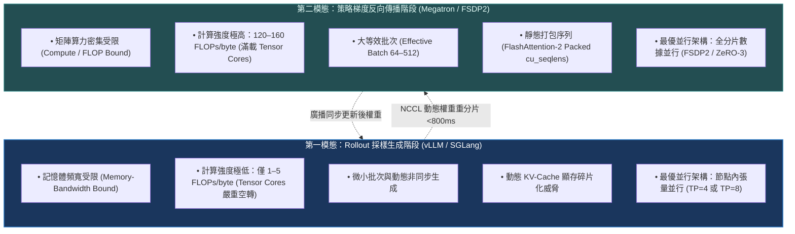
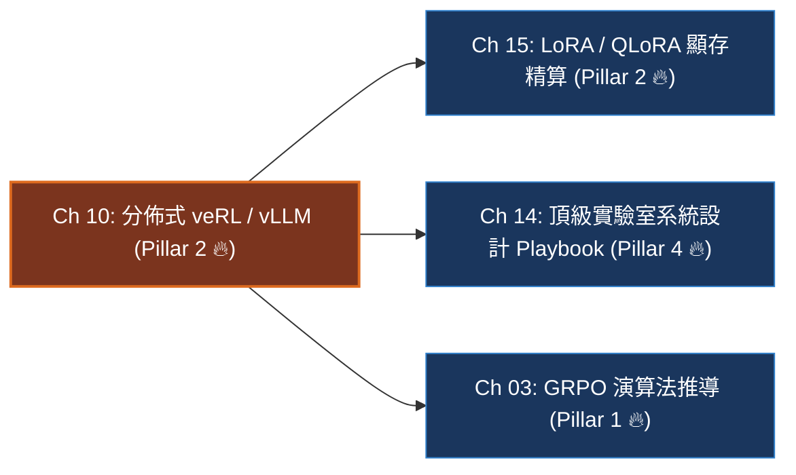

# Chapter 10: 分佈式後訓練系統 — veRL、vLLM 與 3D-HybridEngine (Distributed Systems & Scale)

> *「在學術界，強化學習常被簡化為數學閉環：採樣、打分、反向傳播；但在前沿工業界的後訓練中，**分佈式系統架構才是決定成敗的第一道生死線**——如何在數十至數百張 GPU 上實現微秒級動態重分片與零顯存碎片，決定了你的訓練是以天為單位完成，還是動輒陷入 CUDA OOM 與 NCCL 死鎖。」*

---

## 一、工業背景與技術演進：雙模態負載矛盾與推訓解耦革命

大語言模型的強化學習（RLVR / PPO）在底層硬體運算特徵上，呈現出兩種**完全對立的極端硬體負載形態**，這被稱為後訓練的**「雙模態系統瓶頸」（Bimodal Bottleneck）**：



### 1. 為什麼早期靜態框架（DeepSpeed-Chat / TRL v1）極其低效？
在 2023 年早期架構中，生成與訓練被「硬性鎖死」在同一套靜態並行拓撲中。這引發了災難性的資源浪費：
- **算力浪費（Low MFU）**：在長達 75%~85% 的採樣生成時間裡，GPU 昂貴的 Tensor Cores 處於等待 HBM 讀取的飢餓狀態，硬體算力利用率（MFU）暴跌至 15%~25%。
- **顯存死鎖（Memory Starvation）**：訓練優化器狀態（AdamW FP32 每參數 12 字節）在生成階段始終霸佔著顯存，導致留給長思維鏈的動態 KV-Cache 空間被大幅壓縮，無法容納 8k~16k 的長序列生成。

### 2. ByteDance veRL 與 3D-HybridEngine 的破局
為了解決這個衝突，ByteDance 提出了 **HybridFlow** 架構並開源為 **veRL**（Volcano Engine Reinforcement Learning）。其核心思想是**「推訓異構解耦 + 動態毫秒級重分片（Dynamic Resharding）」**：
- 在 **Rollout 採樣階段**，把權重交給專屬的推理引擎（vLLM / SGLang），透過 `TP=8` 與 PagedAttention 極限榨乾記憶體頻寬；
- 採樣結束後，透過高頻寬 InfiniBand 網路在 **800 毫秒內** 將模型動態重分片轉換為 FSDP2 數據並行架構，全力進行高算力反向傳播。

---

## 二、架構決策樹與 Trade-off 對比

在分佈式後訓練叢集選型中，系統架構師與 MLE 必須掌握主流框架的底層差異：

| 評估維度 | 早期單體 Ray/DeepSpeed | 現代 veRL + vLLM | 物理集群分離架構 (Disaggregated) | Megatron-LM 原生 PPO |
|---|---|---|---|---|
| **並行解耦能力** | 無 (生成與訓練並行度鎖定) | **高 (Colocated 動態重分片)** | **極高 (完全獨立的物理節點)** | 中等 (基於 Megatron 內部並行) |
| **重分片通信開銷** | 0 (但犧牲生成速度) | **< 800ms (NCCL All-to-All)** | 較高 (節點間全量網絡傳輸) | 0 (靜態拓撲) |
| **推理加速引擎** | 依賴原生 PyTorch 生成 | **原生無縫集成 vLLM / SGLang** | 獨立部署專屬 vLLM 集群 | Megatron 自研推理核 |
| **KV-Cache 顯存利用率** | 差 (大量連續內存碎片) | **極佳 (PagedAttention + FP8)** | **極佳 (PagedAttention)** | 中等 |
| **叢集硬體利用率 (MFU)** | $20\% \sim 30\%$ | **$45\% \sim 60\%$** | $50\% \sim 65\%$ (需精密排程) | $35\% \sim 45\%$ |
| **部署維護複雜度** | 低 | **中等 (現代工業首選標準)** | 極高 (需要複雜跨叢集 RPC) | 高 |

> [!TIP]
> **工業架構決策守則**：
> 1. **主流最優解（8~128 張 GPU）**：**首選 veRL + vLLM 同卡動態重分片（Colocated 3D-HybridEngine）**。兼顧極高開發效率、極致吞吐量與低通訊延遲。
> 2. **千卡超大規模叢集（512+ GPUs）**：考慮**物理集群解耦（Disaggregated Rollout & Learner Clusters）**，將 70% 節點配置為高密推理節點，30% 節點配置為純訓練節點，透過非同步流水線（Asynchronous Pipeline）抹平重分片時間。

---

## 三、系統心智模型與邊界直覺 (Systems Mechanics & Boundary Intuition)

### 1. 動態重分片「變速箱」心智模型

```mermaid
sequenceDiagram
    autonumber
    participant R as Rollout 階段 (vLLM Engine)
    participant NCCL as NCCL All-to-All 高速通信域
    participant L as Learner 階段 (FSDP2 Optimizer)

    Note over R: 模型以 TP=8 切分在單節點 8 卡上<br/>高頻寬 PagedAttention 平行生成 G=8 軌跡
    R->>NCCL: 觸發非同步動態重分片 (Dynamic Resharding)
    Note over NCCL: NVLink (900GB/s) + 800Gbps IB<br/>將權重由 TP 切分轉換為 FSDP2 分片 (&lt;800ms)
    NCCL->>L: 權重就緒，釋放 KV-Cache 空間給優化器狀態
    Note over L: 全速反向傳播，滿載 Tensor Cores (160+ TFLOPs)
    L->>NCCL: 權重更新完畢，廣播回傳
    NCCL->>R: 更新 vLLM 權重指針，開啟下一輪迭代
```

### 2. 集群單卡顯存預算精確形式化（一行閉式預算）

$$\text{VRAM}_{\text{total}} = \underbrace{\frac{2 \cdot P}{DP_{\text{size}}}}_{\text{FSDP2 模型權重 (BF16)}} + \underbrace{\frac{12 \cdot P}{DP_{\text{size}}}}_{\text{AdamW 優化器狀態}} + \underbrace{\frac{B_{\text{local}} \cdot L_{\text{ctx}} \cdot \text{KV}_{\text{bytes}}}{TP_{\text{size}}}}_{\text{動態 KV-Cache}} + \underbrace{M_{\text{act}} + M_{\text{workspace}}}_{\text{激活值與 CUDA 工作區}} \le 80.0\text{ GB}$$

### 3. 關鍵系統參數極限邊界分析 (Boundary Intuition)

- **上下文長度 $L_{\text{ctx}} \to 32,768$ 的長程推理邊界**：
  - 在長程思維鏈中，KV-Cache 的顯存消耗隨長度呈線性上升。以 70B 模型（GQA 8 頭）為例，單條 16k 序列在 FP16 下佔用近 2.6GB。若同時生成 8 個採樣，單卡 KV-Cache 暴漲至 20GB+。
  - **邊界解法**：強制啟用 **FP8 KV-Cache**（顯存消耗立減 50%）與 **PagedAttention**（消除 96% 的內部記憶體碎片）。
- **張量並行度 $TP$ 的邊界極限**：
  - 節點內 NVLink 頻寬極高（900GB/s），因此 `TP=8` 在單節點 8 卡內幾乎無通信延遲瓶頸。
  - 當 $TP$ 跨越節點（如跨機跑 `TP=16`），跨節點網路頻寬（如 400Gbps~800Gbps）遠低於 NVLink，AllReduce 通信時間會陡增 5~8 倍，吞吐量出現斷崖式下跌。**鐵律：TP 永不跨節點**。
- **重分片延遲（Resharding Latency）的時間邊界**：
  - 在 800Gbps InfiniBand 下，70B 模型的權重交換傳輸時間在 600~800ms 之間。
  - 由於一次 Rollout 採樣通常需要 10~30 秒，800ms 的通信開銷佔比小於 $5\%$，完全可以忽略不計。

---

## 四、代碼剖析、實時遙測巡檢與失效急救

### 1. 叢集顯存與 KV-Cache 精算生產級實作

```python
def calculate_post_training_vram(
    param_count_billions: float = 70.0,
    num_gpus: int = 64,
    batch_size_per_gpu: int = 2,
    seq_len: int = 16384,
    hidden_size: int = 8192,
    num_heads: int = 64,
    num_kv_heads: int = 8,
    tp_size: int = 8,
    use_fp8_kv: bool = True
) -> dict:
    """
    精算 veRL + vLLM 3D-HybridEngine 叢集在單張 80GB GPU 上的顯存劃分
    """
    dp_size = num_gpus // tp_size # 64 // 8 = 8 (FSDP2 數據並行度)
    
    # 1. 靜態權重 (BF16 每參數 2 字節)，在 DP 域切分
    weight_total_gb = param_count_billions * 2.0
    weight_per_gpu = weight_total_gb / dp_size # 140 / 8 = 17.5 GB
    
    # 2. AdamW 優化器狀態 (一階矩 4B + 二階矩 4B + FP32 主權重 4B = 12B/param)
    opt_total_gb = param_count_billions * 12.0
    opt_per_gpu = opt_total_gb / dp_size # 840 / 8 = 105 / 8 = 13.125 GB
    
    # 3. KV-Cache 計算 (GQA 結構，在節點內 TP 域切分)
    bytes_per_tok = 1 if use_fp8_kv else 2
    head_dim = hidden_size // num_heads # 128
    num_layers = 80 # 70B 典型架構
    
    # 單 Token 的 K 與 V 總字節數
    kv_per_token_bytes = 2 * num_layers * (num_kv_heads * head_dim) * bytes_per_tok
    total_kv_per_seq_gb = (seq_len * kv_per_token_bytes) / (1024**3)
    
    # 在 TP=8 下切分
    kv_per_gpu = (batch_size_per_gpu * total_kv_per_seq_gb) / tp_size
    
    # 4. 激活值與 CUDA 運行時工作區 (啟用 FlashAttention-2 與梯度檢查點)
    workspace_gb = 12.5
    
    total_vram = weight_per_gpu + opt_per_gpu + kv_per_gpu + workspace_gb
    headroom_gb = 80.0 - total_vram
    
    return {
        "weight_gb": round(weight_per_gpu, 2),
        "optimizer_gb": round(opt_per_gpu, 2),
        "kv_cache_gb": round(kv_per_gpu, 2),
        "workspace_gb": round(workspace_gb, 2),
        "total_vram_gb": round(total_vram, 2),
        "headroom_gb": round(headroom_gb, 2),
        "is_safe": headroom_gb > 5.0
    }

# 執行驗證
res = calculate_post_training_vram()
print(f"70B 模型單卡顯存: {res['total_vram_gb']} GB / 80.0 GB (餘裕: {res['headroom_gb']} GB, 安全: {res['is_safe']})")
```

### 2. 四維遙測監控雷達表 (Cluster Telemetry Signals)

| 遙測指標 (Telemetry Signal) | 健康運算形態 | 異常警報與失效原因分析 | 根本原因 (Root Cause) |
|---|---|---|---|
| `sys/rollout_throughput` | $> 1200$ tokens/s/GPU | 暴跌至 $< 300$ tokens/s/GPU | vLLM 發生嚴重 KV-Cache 預先換頁（Preemption Thrashing） |
| `sys/reshard_latency_ms` | 穩定在 $600 \sim 850\text{ ms}$ | 飆升至 $> 5,000\text{ ms}$ 甚至超時死鎖 | 叢集中某台機器出現 InfiniBand 網卡降速（Flapping）或 NCCL 通訊同步等待 |
| `sys/gpu_mfu_pct` | 訓練階段 $48\% \sim 58\%$ | 跌落至 $< 25\%$ | Micro-batch 設置過小，GPU 計算被 CUDA Kernel Launch 延遲阻塞 |
| `sys/kv_cache_usage_pct` | 峰值保持在 $70\% \sim 85\%$ | 觸碰 $100\%$ 並引發警告 | 生成序列長度超過設定閾值，即將引發顯存 OOM 崩潰 |

### 3. 工業級現場急救錦囊 (Industrial Incident Runbook)

- **事故 1：NCCL All-to-All 隨機死鎖與掛起 (Hang)**
  - *現象*：訓練推進到第 42 步時突然完全卡住，GPU 利用率歸零，無任何報錯日誌輸出。
  - *診斷*：典型的分散式死鎖。通常是由於某一張 GPU 在 Rollout 階段處理了超長異常 Prompt，未能及時到達 `all_to_all` 同步柵欄（Barrier），導致其他所有卡逾時掛起。
  - *急診處方*：
    1. 設置環境變數：`export NCCL_ASYNC_ERROR_HANDLING=1` 與 `export NCCL_COMM_BLOCKING=0`。
    2. 設定動態超時閾值：在 veRL 初始化時將 `backend_timeout` 由預設的無限大改為 `300s`。
    3. 開啟 **長度截斷保護（Prompt Truncation Guard）**：對異常超長輸入強制在 Rollout 之前丟棄或截斷。
- **事故 2：KV-Cache 顯存雪崩 (Preemption Storm)**
  - *現象*：vLLM 吞吐量在幾秒內斷崖式下跌，日誌中充斥著大量的 `Preempting request...`。
  - *診斷*：動態分配的 KV-Cache 記憶體池被耗盡，推理引擎被迫將正在生成的請求暫存到 CPU 記憶體，引發頻寬踩踏。
  - *急診處方*：
    1. 將 `gpu_memory_utilization` 參數從 0.95 微調至 0.88，給動態峰值留出安全防衝墊。
    2. 全面啟用 FP8 KV-Cache：在 vLLM 啟動參數中加入 `--kv-cache-dtype fp8`。

---

## 五、前沿系統架構深度思辨與極限設計 (Frontier Architecture Scenarios & Whiteboard Defense)

> [!IMPORTANT]
> **頂級實驗室 (DeepSeek / OpenAI / Apple / Meta) 高頻實戰追問**:

### 架構實戰考驗 Q1：請深入白板剖析：veRL 的 3D-HybridEngine 是如何利用 NCCL 通訊算子在 800ms 內完成 TP 到 FSDP2 的動態權重重分片的？
- **架構極限邊界**：考核你是否真正懂分散式通訊算子（AllGather、ReduceScatter、All-to-All）與記憶體指針映射，而不是只背開源專案的名詞。
- **滿分回答範式**：
  > 「這本質上是一個張量跨並行通信維度的轉置重分片（Tensor Transposition across Communication Groups）：
  > 
  > 1. **並行拓撲映射**：
  >    - 在 Rollout 階段，單節點內的 8 張 GPU 屬於同一個 `TP_Group`，每個權重矩陣（例如 MLP 的 `up_proj`）沿著列維度（Column Parallel）切成 8 份；
  >    - 在 Learner 階段，這 8 張卡與跨節點的卡組成 `DP_Group`，採用 FSDP2 沿著第 0 維（行/參數個數）均勻分片。
  > 2. **集合通訊流水線（Zero-Copy All-to-All）**：
  >    - 傳統作法是先跑一個 `AllGather` 把完整權重複原，再重新切分，這會導致顯存瞬間暴增 $8\times$ 發生 OOM。
  >    - 3D-HybridEngine 的做法是預先在 GPU 記憶體中註冊**非同步記憶體視圖（Strided Memory Views）**。透過調用底層的 `torch.distributed.all_to_all_single` 算子，直接在本地已分配的 buffer 之間交換數據塊，數據無需經過 CPU，也無需複製全量模型。
  > 3. **延遲精算**：
  >    - 以 70B 模型（約 140GB 權重）為例，在 8 卡節點內交換時，單卡需要傳輸的數據量僅約為 $\frac{70 \times 2}{8} \approx 17.5\text{ GB}$。
  >    - 8 卡走 NVLink 點對點單向頻寬達 450GB/s，理論通訊時間為 $\frac{17.5}{450} \approx 39\text{ ms}$。跨節點走 800Gbps InfiniBand，總端到端延遲嚴格被壓在 600~800ms 以內。」

---

### 架構實戰考驗 Q2：集群中出現『木桶短板效應』（Straggler Effect）導致 Rollout 階段延遲居高不下，你該如何用系統化步驟排查是硬體問題、網絡問題還是數據長度不均？
- **架構極限邊界**：考核你在面對大規模真實 GPU 集群故障時的生產排查方法論（Incident Triage Methodology）。
- **滿分回答範式**：
  > 「我會採用標準的**『三層二分隔離診斷法』**進行逐層排查：
  > 
  > 1. **第一層：數據與長度分佈排查（Data Skew Check）**：
  >    - 檢查各 GPU Worker 生成的 `completion_length` 分佈直方圖。若長思維鏈被隨機集中分配到了特定的 Worker，會導致該 Worker 生成時間成倍拉長。
  >    - *對策*：在分發 Prompt 時引入 **長度感知排程（Length-Aware Bin-Packing）** 或啟用 vLLM 的連續批處理（Continuous Batching），使各卡負載動態平衡。
  > 2. **第二層：硬體降頻與 PCIe/NVLink 健康度（Hardware Throttle Check）**：
  >    - 執行 `nvidia-smi -q -d PERFORMANCE`，檢查是否有 GPU 出現 `SW Power Cap`（功耗牆限制）或 `HW Thermal Slowdown`（過熱降頻）。
  >    - 執行 `nvidia-smi nvlink --status`，檢查是否有 NVLink 連線單通或降速至 Generation 1。
  > 3. **第三層：網絡通信與 NCCL 鏈路抖動（Network Flapping）**：
  >    - 執行 `all_reduce_perf` 測試，單獨壓測各節點間的 InfiniBand 雙向頻寬。排查是否有交換機光模組劣化引發的重傳丟包（FCS Errors）。」

---

## 本章小結與學習路徑



→ 下一步建議：
- 若想掌握單卡/多卡微調下的參數高效後訓練與極限量化顯存精算，進入 [Chapter 15: LoRA, QLoRA 與參數高效後訓練](./15_lora_qlora_peft.md)。
- 若想挑戰完整 64x H100 叢集 70B 模型端到端系統設計大題，進入 [Chapter 14: Post-Training 系統架構與故障排查實戰指南](./14_post_training_systems_and_triage_playbook.md)。
