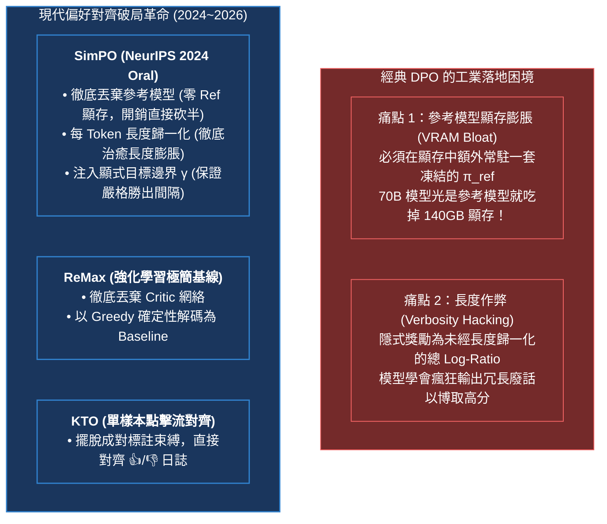
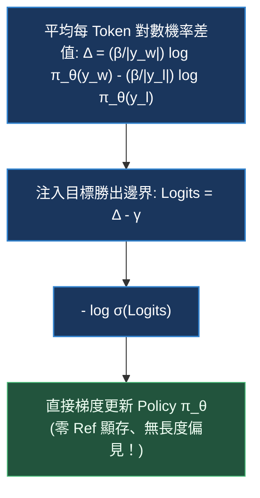
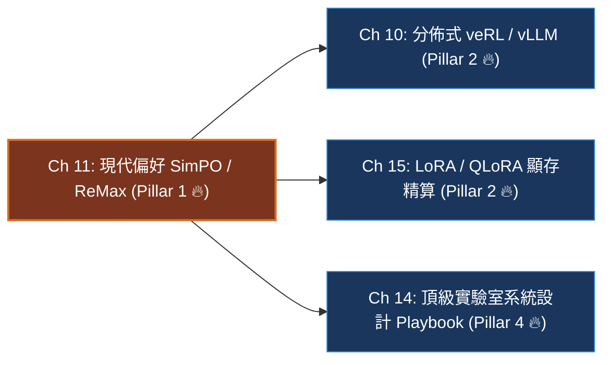

# Chapter 11: 現代偏好優化 — SimPO、ReMax 與 KTO (Modern Preference Optimization)

> *「後訓練演算法的進化史就是一部不斷**砍掉多餘神經網絡、消滅長度偏見與榨乾 GPU 顯存**的工程極致精簡史。從 DPO 到 SimPO，我們終於敢於甩掉沉重的參考模型背包。」*

---

## 一、工業背景與技術演進：甩掉參考模型與根除長度作弊

在 DPO 於 2023 年普及之後，工業界在千億參數模型的大規模生產訓練中迅速撞上了兩堵新的牆壁：



### 1. 為什麼「參考模型 $\pi_{\text{ref}}$」成為顯存的沉重包袱？
在全參數或大規模微調時，經典 DPO 要求在同一 GPU 叢集節點上同時載入 Policy 模型 $\pi_\theta$ 與凍結的 Reference 模型 $\pi_{\text{ref}}$。以 70B 模型為例，單是載入 FP16/BF16 參考模型就吃掉 140GB 顯存。這迫使工程師必須使用更激進的 Tensor Parallelism (TP) 或 ZeRO-3 切分，大幅增加了節點間的 AllGather 通信延遲。

### 2. 長度作弊（Verbosity Hacking）的全面氾濫
DPO 隱式獎勵採用序列總對數機率累加，使長度更長、廢話更多的回答天然具有更大的數值優勢。在 AlpacaEval 2.0 等基準測試中，DPO 模型的長度經常暴增 40%~70%，生成內容充斥著「重複修飾、空洞客套與格式包裝」。**SimPO** 正是在這兩大工業痛點的倒逼下橫空出世。

---

## 二、架構決策樹與 Trade-off 對比

在當前工業界的多維技術評估中，各種偏好對齊演算法的工程特性對比極其鮮明：

| 評估維度 | 經典 DPO | 現代 SimPO | 在線 ReMax | 展望理論 KTO | 聯合訓練 ORPO |
|---|---|---|---|---|---|
| **常駐模型套數** | 2 套 (Policy + Ref) | **僅 1 套 (Policy Only)** | **僅 1 套 (Policy Only)** | 2 套 (Policy + Ref) | **僅 1 套 (Policy Only)** |
| **GPU 顯存佔用** | 基準線 ($1.0\times$) | **減半 ($\approx 0.5\times$)** | 中等 (需維護 Rollout) | 基準線 ($1.0\times$) | **低 ($\approx 0.5\times$)** |
| **數據標註格式** | 成對數據 $(x, y_w, y_l)$ | 成對數據 $(x, y_w, y_l)$ | 題目 + 獎勵信號 | **單條非成對 $(x, y, \pm 1)$** | 成對數據 $(x, y_w, y_l)$ |
| **抗長度作弊** | 差 (強烈長度偏見) | **極佳 (嚴格長度歸一化)** | 取決於 Reward 設計 | 良好 | 中等 |
| **收斂邊界保證** | 無顯式勝出間隔 | **具備目標邊界 $\gamma$** | 無 (動態基線) | 隱含邊界 | 無顯式邊界 |
| **線上生產適用** | 早期對話模型指令對齊 | **長文本/顯存受限偏好對齊** | 零 Critic 的在線 RL 探索 | **用戶點擊/點讚日誌對齊** | 追求極致精簡的單階段微調 |

> [!TIP]
> **工業架構決策守則**：
> 1. **大模型顯存極限受限**：若需在 8x A100/H100 上微調 70B 模型且顯存吃緊，**毫不猶豫選擇 SimPO**，直接省掉 140GB 顯存。
> 2. **日誌驅動的產品反饋**：若在生產系統中收集了大量真實用戶的「點讚 👍 / 點踩 👎」非成對日誌，**首選 KTO**。
> 3. **在線 RL 探索但顯存不足以跑 PPO/GRPO**：**選擇 ReMax**，用貪婪解碼取代複雜的網絡計算。

---

## 三、系統心智模型與邊界直覺 (Systems Mechanics & Boundary Intuition)

### 1. SimPO 核心心智模型：「卸下參考模型沉重行囊」



### 2. 核心目標函數（一行形式化）

$$\mathcal{L}_{\text{SimPO}}(\theta) = -\mathbb{E}_{(x, y_w, y_l) \sim \mathcal{D}} \left[ \log \sigma \left( \frac{\beta}{|y_w|} \log \pi_\theta(y_w \mid x) - \frac{\beta}{|y_l|} \log \pi_\theta(y_l \mid x) - \gamma \right) \right]$$

其中 $\beta$ 為縮放係數（通常 $2.0 \sim 2.5$），$|y|$ 為實際 Token 長度，$\gamma$ 為目標邊界（Target Margin，通常 $0.5 \sim 1.4$）。

### 3. 關鍵參數物理意義與極限邊界分析 (Boundary Intuition)

- **目標邊界 $\gamma$ 的物理作用**：
  - 在標準 DPO 中，只要 $r_w > r_l$，模型就認為任務完成，哪怕僅僅微弱領先 0.001。這導致模型在模糊樣本上過早停滯更新。
  - SimPO 的 $\gamma$ 強制要求：勝者的每 Token 平均對數機率必須比敗者**高出至少 $\gamma/\beta$**。
  - 當 $\gamma \to 0$：退化為純長度歸一化 DPO，失去嚴格分離勝負邊界的保護。
  - 當 $\gamma \to \infty$：目標變得不可達成，Logits 趨向 $-\infty$，動態權重 $\sigma(-\text{Logits}) \to 1$，模型會以最大梯度盲目更新，導致數值溢出或權重發散。
  - 工業經驗值：$\gamma \in [0.5, 1.0]$。
- **長度歸一化 $\frac{1}{|y|}$ 的物理意義**：
  - 將度量維度從「整句累積機率」拉平為「單 Token 平均置信度」。
  - 徹底斷絕了模型「透過輸出 2,000 字車軲轆話抵消單詞置信度劣勢」的作弊空間。
- **ReMax 的 Greedy 基線物理機制**：
  - ReMax 在強化學習中計算優勢時：$A_i = R(y_i) - R(y_{\text{greedy}})$。
  - 用完全零參數的貪婪解碼答案打分作為 Baseline，數學上期望依然無偏，同時省去 Critic 網絡 40% 的顯存。

---

## 四、代碼剖析、實時遙測巡檢與失效急救

### 1. 向量化 PyTorch SimPO 生產級實作

```python
import torch
import torch.nn.functional as F

def compute_simpo_loss(
    chosen_logps: torch.Tensor,       # [B] Policy 對勝者序列的累積 logp
    rejected_logps: torch.Tensor,     # [B] Policy 對敗者序列的累積 logp
    chosen_lens: torch.Tensor,        # [B] 勝者有效 token 長度
    rejected_lens: torch.Tensor,      # [B] 敗者有效 token 長度
    beta: float = 2.0,
    gamma: float = 0.8
) -> tuple[torch.Tensor, dict]:
    """
    向量化 SimPO 損失函數：免參考模型、長度歸一化與邊界 gamma
    """
    # 1. 計算每 Token 平均對數機率 (長度歸一化隱式獎勵)
    r_w = (beta / chosen_lens.clamp(min=1.0)) * chosen_logps
    r_l = (beta / rejected_lens.clamp(min=1.0)) * rejected_logps
    
    # 2. 注入顯式目標勝出邊界 gamma
    logits = (r_w - r_l) - gamma
    
    # 3. 二元交叉熵損失
    loss = -F.logsigmoid(logits).mean()
    
    # 4. 遙測指標
    margin = (r_w - r_l).detach()
    accuracy = (margin > 0).float().mean()
    margin_satisfied = (margin > gamma).float().mean()
    
    metrics = {
        "loss/simpo": loss.item(),
        "rewards/chosen_norm": r_w.mean().item(),
        "rewards/rejected_norm": r_l.mean().item(),
        "rewards/margin_mean": margin.mean().item(),
        "rewards/accuracy": accuracy.item(),
        "rewards/margin_satisfied_rate": margin_satisfied.item(),
    }
    return loss, metrics
```

### 2. 四維遙測監控雷達表 (WandB Telemetry Signals)

| 遙測指標 (Telemetry Signal) | 健康運算形態 | 異常警報與失效原因分析 | 根本原因 (Root Cause) |
|---|---|---|---|
| `rewards/accuracy` | 平穩升至 $80\% \sim 92\%$ | 停滯在 $\le 55\%$ | $\beta$ 過小或數據集中標註雜訊過大 |
| `rewards/margin_mean` | 平穩超越目標邊界 $\gamma$ ($1.0 \sim 1.8$) | 始終低於 $\gamma$ 且無增長趨勢 | 目標邊界 $\gamma$ 設得過高，超出模型容量上限 |
| `rewards/margin_satisfied_rate` | 穩步提升至 $> 65\%$ | 接近 $0.0$ | 策略難以拉開質量差距，需要降低學習率或調降 $\gamma$ |
| `completion_length` | 保持穩定甚至微幅縮短 | 急劇縮短成「單詞回答」 | 長度歸一化權重過激，模型學會「回答越短，平均 logp 越高」的**反向長度作弊** |

### 3. 工業級現場急救錦囊 (Industrial Incident Runbook)

- **事故 1：反向長度作弊（極短回答崩潰）**
  - *現象*：切換至 SimPO 後，模型生成長度驟降至 10~20 個 token，甚至直接輸出單字（如「Yes」、「Correct」）。
  - *診斷*：當 $\beta$ 過大或短樣本的每 Token logp 天生較高時，模型發現縮短長度能最大化每 Token 平均獎勵。
  - *急診處方*：
    1. 在數據預處理階段設置**最小長度閾值**（如排除小於 50 tokens 的配對）。
    2. 調低 $\beta$（從 2.5 降至 1.5），並適度調小 $\gamma$。
- **事故 2：無參考模型帶來的「語言漂移」（Language Drift）**
  - *現象*：在訓練後期，雖然勝負分離度高，但通用 Benchmark（如 MMLU、GSM8K）分數開始下滑。
  - *診斷*：沒有凍結的 $\pi_{\text{ref}}$ 錨定，策略分佈在成對數據上漂移過遠。
  - *急診處方*：
    1. 引入 10% 的預訓練/SFT 保留集，計算常規 Cross-Entropy 損失作為正則化項。
    2. 提早停止訓練（Early Stopping），SimPO 通常只需要 1~2 個 Epoch 即可達到最優對齊狀態。

---

## 五、前沿系統架構深度思辨與極限設計 (Frontier Architecture Scenarios & Whiteboard Defense)

> [!IMPORTANT]
> **頂級實驗室 (Anthropic / DeepMind / Apple / Meta) 高頻實戰追問**:

### 架構實戰考驗 Q1：SimPO 徹底拋棄了參考模型 $\pi_{\text{ref}}$，在數學和系統層面它靠什麼防止模型發散或發生語言坍塌？
- **架構極限邊界**：考核你是否理解 DPO 依賴 KL 約束的本質，以及 SimPO 是如何透過長度歸一化隱含約束策略空間的。
- **滿分回答範式**：
  > 「DPO 依賴參考模型 $\pi_{\text{ref}}$ 的根本目的，是在損失函數中透過 $\log \frac{\pi_\theta}{\pi_{\text{ref}}}$ 隱式引入反向 KL 散度懲罰，防止 Policy 偏離自然語言流暢性。
  > 
  > SimPO 丟棄參考模型後，依靠兩大關鍵機制維護語言穩定性：
  > 1. **長度歸一化的隱式正則（Implicit Length Normalization Regularization）**：在自回歸模型中，每 Token 對數機率 $\frac{1}{|y|}\sum \log \pi(y_t)$ 本質上代表了模型的交叉熵似然率（Negative Cross-Entropy）。最大化勝者的每 Token 平均對數機率，等價於在勝者回答上執行微調訓練（SFT），這天然具有維持語言建模能力的收斂性質。
  > 2. **顯式邊界 $\gamma$ 的梯度截斷效應**：一旦勝者相對於敗者的平均對數機率優勢超過 $\gamma$，動態權重 $\sigma(-(\Delta - \gamma))$ 迅速衰減至 0，梯度停止推動。這種『達到邊界即停止更新』的機制有效防止了單一方向的過度優化，避免了策略無休止地漂移。」

---

### 架構實戰考驗 Q2：試對比 ReMax 與 GRPO：兩者都消滅了 Critic 價值網絡，在系統架構、方差控制與採樣成本上有何本質差異？
- **架構極限邊界**：考核你對強化學習無 Critic 兩大流派（貪婪基線 vs 同儕組內基線）的橫向對比能力。
- **滿分回答範式**：
  > 「ReMax 與 GRPO 是當前消滅 Critic 的兩大代表性架構：
  > 
  > 1. **基線構造機制**：
  >    - **ReMax**：對同一 Prompt 進行 1 次貪婪解碼（Greedy Search, $\tau=0$）作為 Baseline $b(q) = R(y_{\text{greedy}})$，外加 $N$ 次隨機採樣計算優勢。
  >    - **GRPO**：對同一 Prompt 進行 $G$ 次隨機採樣（$\tau > 0$），計算這 $G$ 個採樣的組內經驗均值 $\mu$ 與標準差 $\sigma$ 進行 Z-Score 標準化。
  > 2. **顯存與採樣成本（Compute Overhead）**：
  >    - ReMax 每次訓練需要額外跑一次無梯度的 Greedy 解碼，計算開銷為 $(1 + N)$ 次 Rollout。
  >    - GRPO 全部 $G$ 次採樣均參與梯度計算，沒有『純作基線而不算梯度』的無效採樣，採樣計算利用率達到 100%。
  > 3. **方差與尺度敏感性（Variance & Scale Sensitivity）**：
  >    - ReMax 的優勢是未經標準化的絕對差值 $R(y_i) - R(y_{\text{greedy}})$，對 Reward 的絕對尺度極度敏感。
  >    - GRPO 透過除以標準差 $\sigma$，天生完成了動態自適應尺度歸一化，在不同難度的題目間梯度尺度高度一致，因此在 DeepSeek-R1 等大模型推理中成為更主流的選擇。」

---

## 本章小結與學習路徑



→ 下一步建議：
- 若想掌握大規模生產叢集中如何利用 vLLM 與 veRL 將採樣和訓練高效解耦，進入 [Chapter 10: 分佈式系統 — veRL、vLLM 與 3D-HybridEngine](./10_distributed_systems_verl_vllm.md)。
- 若想深入剖析 70B 模型在單卡/多卡下的極限顯存切分，進入 [Chapter 15: LoRA, QLoRA 與參數高效後訓練](./15_lora_qlora_peft.md)。
