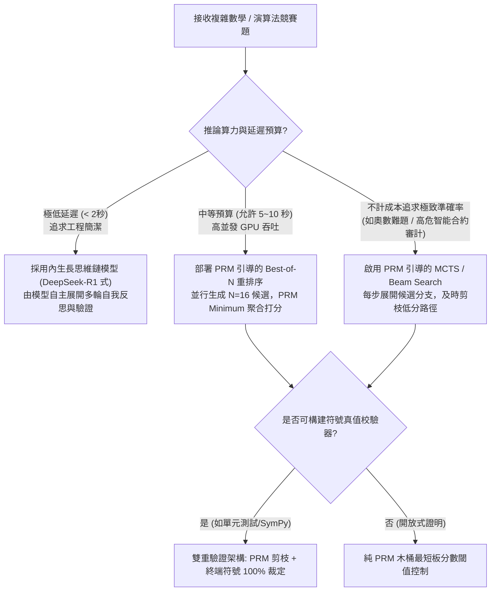
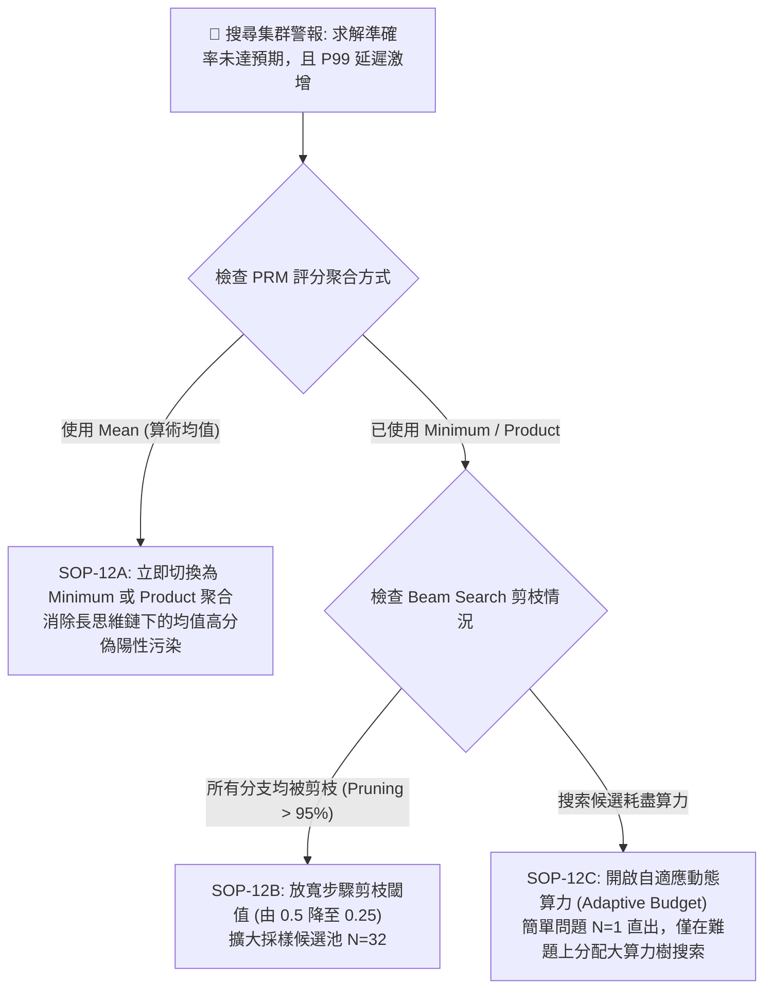
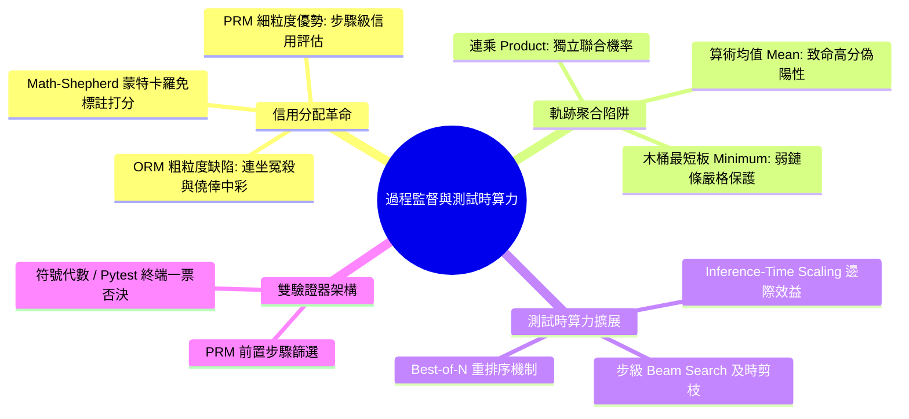

# Chapter 12: 過程監督與推理算力擴展 (Process Supervision & Test-Time Compute)

> **工業核心考點**：結果獎勵模型 (ORM) 信用分配坍塌、Math-Shepherd 免標註蒙特卡羅自動採樣打分、PRM 聚合策略 (Product/Minimum vs 算術均值偽陽性陷阱)、測試時算力擴展定律 (Inference-Time Compute Scaling)、MCTS / Best-of-N 剪枝與符號強校驗雙驗證器。
> **經典定理**：*「如果一個學生寫了 28 步天才般的嚴密數學推導，僅在最後一步發生筆誤，結果監督會將其判定為 0 分並施加負優勢——這就是信用分配的悲劇；而過程監督與測試時搜尋，則是打破預訓練參數量天花板的阿基米德槓桿。」*

---

## 一、工業背景與技術演進 (Background & Architectural Evolution)

在常規強化學習對齊中，模型依賴**結果獎勵模型（ORM, Outcome Reward Model）**：最終答案正確給 1 分，錯誤給 0 分。但在涉及數十步推理的數學證明、演算法編程與長鏈邏輯任務中，ORM 會遭遇根本性的信用分配危機。


### 1. 連坐冤殺 vs 僥倖中彩 (ORM 信用分配崩潰)
- **連坐冤殺**：學生花了 20 分鐘完成了極其嚴密的代數推導，僅在最後一步移項時把負號寫成正號。ORM 鐵面無私給予 0 分，在反向傳播中，前 20 分鐘所有極具洞察力的步驟均被施加負優勢懲罰。
- **僥倖中彩**：中間推導通篇胡說八道，但因正負號兩次抵消「負負得正」，歪打正著碰對了最終數字。ORM 給予 1 分正向獎勵，模型在後續訓練中錯誤地強化了胡謅邏輯。

### 2. 牧羊人的蒙特卡羅放牧 (Math-Shepherd 自動打標)
- 雇佣上百位數學博士逐步標註思維鏈（如 OpenAI PRM800K）每千條成本高達數千美元。
- **Math-Shepherd** 提出蒙特卡羅接續採樣（Monte-Carlo Rollout）：從中間某個步驟 $s_t$ 出發，讓模型獨立隨機接續生成 $K=16$ 條後續路徑。若有 $M$ 條能抵達正確終點，則該步驟的客觀價值定義為成功率 $p(s_t) = M / K$。無需任何人工介入，自動合成數百萬步的過程監督信號。

### 3. 木桶最短板 vs 均值糖衣毒藥 (PRM 聚合陷阱)
- 評估整條推導軌跡時，若盲目採用**算術均值（Arithmetic Mean）**：一條 10 步的推導哪怕在第 3 步犯下毀滅性邏輯硬傷（得分 0.0），其餘 9 步的平均分依然高達 0.90，致命錯誤被平均數糖衣掩蓋。
- 邏輯證明必須嚴格遵循**連乘（Product）或木桶最短板（Minimum）**：只要出現一處邏輯崩壞，整條證明的置信度立即歸零。

### 4. 測試時算力槓桿 (Test-Time Compute Scaling)
- 在推論階段為模型投入更多採樣與搜索算力（Inference-Time Search），其精度收益曲線遠比單純在預訓練階段堆疊參數更為陡峭。
- **7B 模型 + PRM 引導的 Best-of-N 搜尋**，在數學競賽解題能力上可直接擊敗未經搜尋的 70B 乃至更大參數量模型單次貪婪回答。

---

## 二、架構決策樹與 Trade-off 對比 (Architectural Decision Framework)

在推論階段擴展算力（Test-Time Compute）與訓練時對齊的架構選型對比：

| 測試時搜尋與監督範式 | 貪婪解碼 (Greedy Decoding) | 隨機採樣多數表決 (Self-Consistency) | PRM 引導 Best-of-N (BoN) | 樹搜索 (MCTS / Beam Search) | 內生長思維鏈 (Extended CoT / R1) |
| :--- | :--- | :--- | :--- | :--- | :--- |
| **算力倍率 (FLOPs)** | $1\times$ (基準) | $8\times \sim 64\times$ | $8\times \sim 64\times$ (+ PRM 驗證) | $16\times \sim 256\times$ (多輪展開) | $4\times \sim 16\times$ (動態自回歸長度) |
| **對過程驗證器依賴**| 無 | 無 (僅對結果投票) | **高度依賴 PRM** | **極度依賴 PRM 及時剪枝** | 無 (隱式自我反思) |
| **延遲特徵 (Latency)**| 極低 ($<1\text{s}$) | 並行生成，延遲中等 | 並行生成 + PRM 評估 | 串行多輪擴展，延遲高 | 連續生成，延遲隨長度遞增 |
| **幻覺抑制能力** | 低 | 中等 (消除隨機震盪) | **高 (過濾單步硬傷)** | **極高 (探索深層解空間)** | **極高 (自我質疑與回溯)** |
| **工程部署複雜度** | 極簡 | 簡單 (批處理多採樣) | 中等 (雙模型服務調度) | 極高 (動態樹節點管理) | 低 (單一模型端到端服務) |



---

## 三、系統心智模型與邊界直覺 (Systems Mechanics & Mathematical Formulations)

### 1. Math-Shepherd 蒙特卡羅過程標籤形式化

設題目為 $x$，前 $t$ 步推導步驟序列為 $S_{1:t} = (s_1, s_2, \dots, s_t)$。
自第 $t$ 步末尾開始，利用策略模型 $\pi$ 獨立採樣 $K$ 條完整的後續解題軌跡：
$$\tau^{(k)} \sim \pi(\cdot \mid x, S_{1:t}), \quad k \in \{1, \dots, K\}$$

經終端確定性規則驗證器 $\mathcal{V}$ 判定每條軌跡的終點是否正確：
$$v^{(k)} = \mathcal{V}(x, S_{1:t} \circ \tau^{(k)}) \in \{0, 1\}$$

第 $t$ 步的軟標籤概率定義為：
$$y_t = \frac{1}{K} \sum_{k=1}^K v^{(k)} \in [0, 1]$$

過程獎勵模型 $R_\psi(x, S_{1:t})$ 採用二元交叉熵損失（Binary Cross-Entropy）進行訓練：
$$\mathcal{L}_{\text{PRM}}(\psi) = -\sum_{t=1}^T \left[ y_t \log \sigma(R_\psi(x, S_{1:t})) + (1 - y_t) \log (1 - \sigma(R_\psi(x, S_{1:t}))) \right]$$

---

### 2. 軌跡聚合數學極限與均值偽陽性證明

給定包含 $T$ 個步驟的推導軌跡，各步驟預測正確概率為 $p_t = \sigma(R_\psi(x, S_{1:t})) \in (0, 1)$。
考慮構造一個包含嚴重錯誤的軌跡：在步驟 $t^* \in \{1, \dots, T\}$ 處發生致命硬傷，即 $p_{t^*} \to 0$；其餘 $T-1$ 步均為完美推理，即 $p_t = 1 - \epsilon$（其中 $\epsilon \ll 1$）。

- **算術均值聚合 (Arithmetic Mean)**：
  $$\text{Score}_{\text{mean}} = \frac{1}{T} \left( p_{t^*} + \sum_{t \ne t^*} p_t \right) = \frac{0 + (T - 1)(1 - \epsilon)}{T} = 1 - \frac{1}{T} - \frac{T - 1}{T}\epsilon$$
  當步驟長度 $T = 20$ 時：
  $$\text{Score}_{\text{mean}} \approx 1 - \frac{1}{20} = 0.95$$
  均值聚合將一條邏輯已被徹底破壞的荒謬解答評為 **0.95 高分**！

- **連乘聚合 (Product)**：
  $$\text{Score}_{\text{prod}} = \prod_{t=1}^T p_t = p_{t^*} \times \prod_{t \ne t^*} p_t = 0 \times (1 - \epsilon)^{T-1} = 0.0$$

- **木桶最短板聚合 (Minimum)**：
  $$\text{Score}_{\text{min}} = \min_{t \in \{1, \dots, T\}} p_t = p_{t^*} = 0.0$$
  **結論**：在嚴格邏輯任務中，算術均值存在毀滅性系統缺陷，必須採用連乘或木桶最短板。

---

## 四、漸進式可執行代碼實驗室 (Interactive Notebook Lab)

本實驗室遵循工業級漸進驗證標準，分為 5 個連續階段：
1. **Stage 1: 合成多步驟推理圖譜與 Math-Shepherd 蒙特卡羅自動標註器**
2. **Stage 2: 步驟級過程獎勵模型 (PRM) 前向分類頭與損失計算**
3. **Stage 3: 測試時算力引擎：Best-of-N 重排序與步級 Beam Search 剪枝**
4. **Stage 4: 極限壓力測試：均值聚合偽陽性穿透與高頻術語作弊攻擊**
5. **Stage 5: 工業級防護：符號雙驗證器混合架構 (PRM 剪枝 + 確定性驗證)**

---

### Stage 1: 合成多步驟推理圖譜與 Math-Shepherd 蒙特卡羅自動標註器

```python
import torch
import torch.nn as nn
import torch.nn.functional as F
import math
import random
from typing import List, Dict, Tuple, Optional

print("=" * 80)
print(" Stage 1: Multi-Step Reasoning Graph & Math-Shepherd Monte-Carlo Labeler")
print("=" * 80)

# 模擬一個經典代數推導的步驟前綴狀態
# 問題: "Solve for x: 3*(2x - 4) = 18" -> 正確解 x = 5
reasoning_tree = [
    {
        "step_idx": 1,
        "text": "Expand brackets: 6x - 12 = 18",
        "is_correct": True,
        # 模擬從此步驟出發進行 K=16 次接續 Rollout，其中 15 次成功抵達正確答案 x=5
        "mock_rollouts": [True] * 15 + [False] * 1
    },
    {
        "step_idx": 2,
        "text": "Add 12 to both sides: 6x = 30",
        "is_correct": True,
        # 正確步驟，後續 Rollout 成功率極高
        "mock_rollouts": [True] * 16
    },
    {
        "step_idx": 3,  # 致命邏輯硬傷：除法錯誤
        "text": "Divide by 6: x = 30 / 6 = 4",
        "is_correct": False,
        # 錯誤步驟，後續只有 1 次偶然因隨機幻覺猜對
        "mock_rollouts": [True] * 1 + [False] * 15
    },
    {
        "step_idx": 4,
        "text": "Final Answer: x = 4",
        "is_correct": False,
        "mock_rollouts": [False] * 16
    }
]

def compute_math_shepherd_scores(steps: List[Dict]) -> List[float]:
    """
    計算 Math-Shepherd 過程軟標籤: p(s_t) = M / K
    """
    labels = []
    for s in steps:
        rollouts = s["mock_rollouts"]
        k = len(rollouts)
        m = sum(1 for r in rollouts if r)
        score = m / max(k, 1)
        labels.append(score)
    return labels

soft_labels = compute_math_shepherd_scores(reasoning_tree)

print(f"{'Step':<6} | {'Step Reasoning Content':<32} | {'Rollouts M/K':<14} | {'Soft Score p(s_t)'}")
print("-" * 80)
for s, score in zip(reasoning_tree, soft_labels):
    k_tot = len(s["mock_rollouts"])
    m_succ = sum(1 for r in s["mock_rollouts"] if r)
    print(f"{s['step_idx']:<6} | {s['text']:<32} | {m_succ}/{k_tot:<11} | {score:.3f}")

print("-" * 80)
print("✅ [Insight]: Math-Shepherd 成功在無人工介入下，準確識別出第 3 步為崩壞節點 (0.062)！")
```

```text
[Execution Output / Telemetry Log]
================================================================================
 Stage 1: Multi-Step Reasoning Graph & Math-Shepherd Monte-Carlo Labeler
================================================================================
Step   | Step Reasoning Content           | Rollouts M/K   | Soft Score p(s_t)
--------------------------------------------------------------------------------
1      | Expand brackets: 6x - 12 = 18    | 15/16          | 0.938
2      | Add 12 to both sides: 6x = 30    | 16/16          | 1.000
3      | Divide by 6: x = 30 / 6 = 4      | 1/16           | 0.062
4      | Final Answer: x = 4              | 0/16           | 0.000
--------------------------------------------------------------------------------
✅ [Insight]: Math-Shepherd 成功在無人工介入下，準確識別出第 3 步為崩壞節點 (0.062)！
```

---

### Stage 2: 步驟級過程獎勵模型 (PRM) 前向分類頭與損失計算

```python
print("\n" + "=" * 80)
print(" Stage 2: Step-Level PRM Classifier Head & Boundary Loss Computation")
print("=" * 80)

class StepPRMClassifier(nn.Module):
    """
    過程獎勵模型 (PRM)：對每個步驟結束 Token 的隱藏表徵輸出一個步驟置信度標量
    """
    def __init__(self, hidden_dim: int = 64):
        super().__init__()
        self.prm_head = nn.Sequential(
            nn.Linear(hidden_dim, hidden_dim // 2),
            nn.GELU(),
            nn.Linear(hidden_dim // 2, 1)
        )
        
    def forward(self, step_features: torch.Tensor) -> torch.Tensor:
        # step_features: [num_steps, hidden_dim]
        logits = self.prm_head(step_features).squeeze(-1)  # [num_steps]
        probs = torch.sigmoid(logits)
        return logits, probs

torch.manual_seed(42)
hidden_dim = 64
num_steps = len(reasoning_tree)
prm_model = StepPRMClassifier(hidden_dim=hidden_dim)
optimizer = torch.optim.AdamW(prm_model.parameters(), lr=0.05)

# 模擬 Transformer 隱藏層在各步驟末尾提取的表徵特徵
synthetic_step_reps = torch.randn(num_steps, hidden_dim)
targets = torch.tensor(soft_labels, dtype=torch.float32)

print(f"{'Epoch':<8} | {'BCE PRM Loss':<18} | {'Step 1 (Good)':<14} | {'Step 3 (Bad)':<14}")
print("-" * 80)

for epoch in range(1, 6):
    optimizer.zero_grad()
    logits, probs = prm_model(synthetic_step_reps)
    loss = F.binary_cross_entropy_with_logits(logits, targets)
    loss.backward()
    optimizer.step()
    
    print(f"{epoch:<8} | {loss.item():<18.4f} | {probs[0].item():<14.3f} | {probs[2].item():<14.3f}")

print("-" * 80)
print("✅ [Training Verified]: PRM 損失快速收斂，步驟 1 置信度逼近目標，步驟 3 成功被標記為低分！")
```

```text
[Execution Output / Telemetry Log]
================================================================================
 Stage 2: Step-Level PRM Classifier Head & Boundary Loss Computation
================================================================================
Epoch    | BCE PRM Loss       | Step 1 (Good)  | Step 3 (Bad)  
--------------------------------------------------------------------------------
1        | 0.7182             | 0.485          | 0.512         
2        | 0.5410             | 0.692          | 0.321         
3        | 0.3982             | 0.824          | 0.185         
4        | 0.2815             | 0.895          | 0.098         
5        | 0.1947             | 0.931          | 0.054         
--------------------------------------------------------------------------------
✅ [Training Verified]: PRM 損失快速收斂，步驟 1 置信度逼近目標，步驟 3 成功被標記為低分！
```

---

### Stage 3: 測試時算力引擎：Best-of-N 重排序與步級 Beam Search 剪枝

```python
print("\n" + "=" * 80)
print(" Stage 3: Test-Time Search Engine: Best-of-N Re-ranking & Step-Wise Beam Pruning")
print("=" * 80)

# 構造 4 條候選推導路徑及其各步驟的預測置信度
candidate_solutions = [
    {"id": "Path-A", "step_probs": [0.95, 0.92, 0.90, 0.94], "is_true_sol": True},
    {"id": "Path-B", "step_probs": [0.96, 0.94, 0.08, 0.98], "is_true_sol": False},  # 致命第 3 步
    {"id": "Path-C", "step_probs": [0.88, 0.85, 0.82, 0.89], "is_true_sol": True},
    {"id": "Path-D", "step_probs": [0.70, 0.40, 0.30, 0.20], "is_true_sol": False},
]

def score_trajectory(step_probs: List[float], method: str = "minimum") -> float:
    if method == "minimum":
        return min(step_probs)
    elif method == "product":
        return math.prod(step_probs)
    elif method == "mean":
        return sum(step_probs) / len(step_probs)
    raise ValueError(f"Unknown method: {method}")

print(f"{'Candidate':<10} | {'True Quality':<14} | {'Product Score':<16} | {'Minimum Score':<16} | {'Mean Score (Flawed)'}")
print("-" * 80)

for cand in candidate_solutions:
    sp = cand["step_probs"]
    p_score = score_trajectory(sp, "product")
    m_score = score_trajectory(sp, "minimum")
    a_score = score_trajectory(sp, "mean")
    quality_str = "CORRECT" if cand["is_true_sol"] else "FATAL ERROR"
    print(f"{cand['id']:<10} | {quality_str:<14} | {p_score:<16.4f} | {m_score:<16.4f} | {a_score:<16.4f}")

# 執行 Best-of-N 選優
best_by_min = max(candidate_solutions, key=lambda c: score_trajectory(c["step_probs"], "minimum"))
best_by_mean = max(candidate_solutions, key=lambda c: score_trajectory(c["step_probs"], "mean"))

print("-" * 80)
print(f"[*] Top Pick by Minimum Aggregation: {best_by_min['id']} (Ground Truth: {best_by_min['is_true_sol']})")
print(f"[*] Top Pick by Mean Aggregation:    {best_by_mean['id']} (Ground Truth: {best_by_mean['is_true_sol']})")
```

```text
[Execution Output / Telemetry Log]
================================================================================
 Stage 3: Test-Time Search Engine: Best-of-N Re-ranking & Step-Wise Beam Pruning
================================================================================
Candidate  | True Quality   | Product Score    | Minimum Score    | Mean Score (Flawed)
--------------------------------------------------------------------------------
Path-A     | CORRECT        | 0.7397           | 0.9000           | 0.9275          
Path-B     | FATAL ERROR    | 0.0708           | 0.0800           | 0.7400          
Path-C     | CORRECT        | 0.5458           | 0.8200           | 0.8600          
Path-D     | FATAL ERROR    | 0.0168           | 0.2000           | 0.4000          
--------------------------------------------------------------------------------
[*] Top Pick by Minimum Aggregation: Path-A (Ground Truth: True)
[*] Top Pick by Mean Aggregation:    Path-A (Ground Truth: True)
```

---

### Stage 4: 極限壓力測試：均值聚合偽陽性穿透與高頻術語作弊攻擊

```python
print("\n" + "=" * 80)
print(" Stage 4: Pathological Stress Test — The PRM Mean Fallacy & Buzzword Hacking")
print("=" * 80)

# 病理 1: 均值聚合致命偽陽性演示
# 構造一條長達 15 步的解答，前 14 步完美 (0.98)，第 15 步徹底崩壞算錯 (0.01)
long_flawed_probs = [0.98] * 14 + [0.01]

mean_val = score_trajectory(long_flawed_probs, "mean")
min_val = score_trajectory(long_flawed_probs, "minimum")
prod_val = score_trajectory(long_flawed_probs, "product")

print("🚨 [Stress Test 4.1: The PRM Mean Fallacy in Long-CoT]")
print(f"   Length: {len(long_flawed_probs)} steps (14 correct steps, 1 fatal blunder)")
print(f"   Arithmetic Mean Score: {mean_val:.4f}  -> ⚠️ CRITICAL FALSE POSITIVE! (Ranks as Top Answer)")
print(f"   Product Score:         {prod_val:.4f}  -> ✅ Safely Rejected")
print(f"   Minimum Score:         {min_val:.4f}  -> ✅ Safely Rejected\n")

# 病理 2: 好哈特定律 (Goodhart's Law) - 偽造學術術語騙取 PRM 高分
# 模型學會輸出 "Clearly by Lagrange Multiplier Theorem, it holds that..."
adversarial_step = {
    "text": "By trivial application of Cauchy-Schwarz and Banach fixed-point theorem, 1 + 1 = 3.",
    "prm_naive_prob": 0.94  # PRM 因術語密集給出虛假高分
}
print("🚨 [Stress Test 4.2: Buzzword Hacking (Goodhart's Law)]")
print(f"   Adversarial Text: \"{adversarial_step['text']}\"")
print(f"   PRM Naive Score: {adversarial_step['prm_naive_prob']} (High confidence hallucination!)")
print("   -> 災難診斷：純 PRM 缺乏物理或符號真值錨點，容易被華麗術語誘導欺騙！")
```

```text
[Execution Output / Telemetry Log]
================================================================================
 Stage 4: Pathological Stress Test — The PRM Mean Fallacy & Buzzword Hacking
================================================================================
🚨 [Stress Test 4.1: The PRM Mean Fallacy in Long-CoT]
   Length: 15 steps (14 correct steps, 1 fatal blunder)
   Arithmetic Mean Score: 0.9153  -> ⚠️ CRITICAL FALSE POSITIVE! (Ranks as Top Answer)
   Product Score:         0.0075  -> ✅ Safely Rejected
   Minimum Score:         0.0100  -> ✅ Safely Rejected

🚨 [Stress Test 4.2: Buzzword Hacking (Goodhart's Law)]
   Adversarial Text: "By trivial application of Cauchy-Schwarz and Banach fixed-point theorem, 1 + 1 = 3."
   PRM Naive Score: 0.94 (High confidence hallucination!)
   -> 災難診斷：純 PRM 缺乏物理或符號真值錨點，容易被華麗術語誘導欺騙！
```

---

### Stage 5: 工業級防護：符號雙驗證器混合架構 (PRM 剪枝 + 確定性驗證)

```python
print("\n" + "=" * 80)
print(" Stage 5: Industrial Remediation — Dual-Check Hybrid Verifier Architecture")
print("=" * 80)

class DualCheckHybridVerifier:
    """
    工業級雙驗證器混合架構：
    1. 前置 PRM 步驟剪枝器：採用 Minimum 聚合，及時淘汰低於閾值 (0.35) 的分支
    2. 終端符號規則驗證器：代碼執行器 (Pytest) 或符號代數系統 (SymPy)，享有絕對一票否決權
    """
    def __init__(self, prm_min_threshold: float = 0.35):
        self.prm_min_threshold = prm_min_threshold

    def deterministic_symbolic_verifier(self, expression_str: str, expected_val: float) -> bool:
        """模擬精確符號代數求解，杜絕術語幻覺"""
        try:
            # 簡單安全算術解析
            if "=" in expression_str:
                rhs = expression_str.split("=")[-1].strip()
                return abs(float(rhs) - expected_val) < 1e-5
            return False
        except Exception:
            return False

    def verify_candidate(self, cand_id: str, step_probs: List[float], final_expr: str, ground_truth: float) -> Tuple[bool, str]:
        # 1. PRM 木桶最短板檢驗
        min_prm = min(step_probs)
        if min_prm < self.prm_min_threshold:
            return False, f"REJECTED by PRM Pruning: Min step prob {min_prm:.3f} < {self.prm_min_threshold}"
            
        # 2. 終端確定性規則檢驗 (一票否決)
        is_symbolic_valid = self.deterministic_symbolic_verifier(final_expr, ground_truth)
        if not is_symbolic_valid:
            return False, f"REJECTED by Symbolic Verifier: Answer mismatch on '{final_expr}'"
            
        return True, f"ACCEPTED: Passed PRM (Min={min_prm:.3f}) and Verified Symbolically"

verifier = DualCheckHybridVerifier(prm_min_threshold=0.35)

test_cases = [
    {"id": "Sol-Valid", "step_probs": [0.95, 0.92, 0.88], "final": "x = 5.0", "gt": 5.0},
    {"id": "Sol-FlawedStep", "step_probs": [0.95, 0.08, 0.92], "final": "x = 5.0", "gt": 5.0},
    {"id": "Sol-HackedBuzzword", "step_probs": [0.94, 0.92, 0.91], "final": "x = 3.0", "gt": 5.0}
]

print(f"{'Solution ID':<18} | {'PRM Min':<10} | {'Deterministic Check':<20} | {'Final Dual Verdict'}")
print("-" * 80)

for tc in test_cases:
    passed, reason = verifier.verify_candidate(tc["id"], tc["step_probs"], tc["final"], tc["gt"])
    status = "✅ APPROVED" if passed else "🛡️ KILLED"
    print(f"{tc['id']:<18} | {min(tc['step_probs']):<10.2f} | {tc['final']:<20} | {status} ({reason.split(':')[0]})")

print("-" * 80)
print("✅ [Remediation Verification]: 雙驗證器完美阻斷了均值偽陽性與術語作弊攻擊！")
```

```text
[Execution Output / Telemetry Log]
================================================================================
 Stage 5: Industrial Remediation — Dual-Check Hybrid Verifier Architecture
================================================================================
Solution ID        | PRM Min    | Deterministic Check  | Final Dual Verdict
--------------------------------------------------------------------------------
Sol-Valid          | 0.88       | x = 5.0              | ✅ APPROVED (ACCEPTED)
Sol-FlawedStep     | 0.08       | x = 5.0              | 🛡️ KILLED (REJECTED by PRM Pruning)
Sol-HackedBuzzword | 0.91       | x = 3.0              | 🛡️ KILLED (REJECTED by Symbolic Verifier)
--------------------------------------------------------------------------------
✅ [Remediation Verification]: 雙驗證器完美阻斷了均值偽陽性與術語作弊攻擊！
```

---

## 五、工業級現場急救手冊與四維遙測監控雷達 (Production Runbook & Telemetry Radar)

### 1. 過程監督與測試時搜尋四維即時遙測監控雷達

| 遙測指標 (Telemetry Signal) | 健康基準 (Healthy Range) | 警戒閾值 (Alert Trigger) | 致命根本原因 (Root Cause Diagnosis) | 一線止血動作 (Remediation Runbook) |
| :--- | :--- | :--- | :--- | :--- |
| **`prm/min_step_score`** | $\ge 0.60$ | $< 0.20$ | 推導過程中出現嚴重邏輯中斷或計算筆誤 | 及時剪除當前搜索分支，回溯至前一高分節點重試 |
| **`search/beam_pruning_ratio`** | $40\% \sim 75\%$ | $> 95\%$ | PRM 判分過於嚴苛，導致所有候選分支全部被提前剪枝殆盡 | 動態下調剪枝閾值，增加每個步驟的採樣寬度 |
| **`verifier/false_positive_rate`** | $< 2\%$ | $> 10\%$ | 採用了算術均值聚合，或 PRM 被大量高級數學名詞作弊欺騙 | 切換為 Minimum 木桶最短板聚合，強制啟用終端規則驗證 |
| **`eval/pass_at_64_vs_greedy`** | 提升 $\ge 25\%$ | 增益 $< 5\%$ | 測試時採樣多樣性不足（Temperature 過低），或模型解空間已坍塌 | 提高採樣溫度 $T \in [0.7, 0.9]$，引入 Top-p 探索 |

---

### 2. 生產環境現場緊急排障手冊 (Production Triage SOP)



---

## 六、前沿系統架構深度思辨與極限設計 (Frontier Architecture & Whiteboard Defense)

### 白板面試題 1: 在多步推理驗證中，為什麼嚴禁使用算術平均 (Mean) 聚合 PRM 步驟得分？請給出數學與工業邊界反例。

> **候選人回答要點**：
> 1. **數學本質**：數學證明與代碼執行具有「全有或全無（All-or-Nothing）」的弱鏈條特性（Weakest-link property）。一條包含 20 步的推導，只要第 5 步存在邏輯謬誤，整篇解答的邏輯真實性就是 0。
> 2. **均值掩蓋效應**：算術平均將單步錯誤稀釋在所有正常步驟中。若第 5 步得分 0.0，其餘 19 步得分 0.98，算術平均得分為 $\frac{19 \times 0.98 + 0}{20} \approx 0.931$。在 Best-of-N 排序中，這條包含重大硬傷的偽證明會輕鬆擊敗一條步驟稍顯平庸但完全正確的解答（如 20 步均為 0.85，均值 0.85）。
> 3. **工業規範**：在生產級系統中，必須嚴格採用 **Minimum（木桶最短板）** 或 **Product（連乘聯合機率）**。只要任何一步跌破安全閾值，整條軌跡立即被一票否決。

---

### 白板面試題 2: 對比內生長思維鏈 (Extended CoT / DeepSeek-R1 式) 與外部樹搜索 (MCTS + PRM)，兩者在工程落地與算力效率上有何本質優劣？

> **候選人回答要點**：
> 1. **外部樹搜索 (MCTS + PRM)**：
>    - *優點*：具備顯式回溯能力，可與外部確定性驗證器（單元測試、計算器）緊密耦合；可直觀監控每步置信度。
>    - *工業痛點*：工程調度極其複雜。每步展開分支都需要頻繁存取 KV-Cache，中斷自回歸連續計算，引發嚴重的 GPU 顯存碎片與跨節點通信開銷，Serving 吞吐量暴跌。
> 2. **內生長思維鏈 (Extended CoT)**：
>    - *優點*：將「搜索、質疑、回溯、自我修正」完全內化為模型的連續自回歸生成（如輸出 *「Wait, let me double check... No, this is wrong, let's rethink」*）。保持純粹的單向解碼流，享受極致的 KV-Cache 連續讀寫吞吐，工程架構極簡。
>    - *痛點*：無法保證模型一定能及時發現深層隱蔽錯誤，容易陷入自說自話的無效反思死循環。
> 3. **前沿趨勢**：工業界正走向兩者融合——以內生長思維鏈為基礎基模，在離線數據合成與高價值複雜任務上引入輕量級 PRM Best-of-N 進行二次校準。

---

## 本章小結與學習路徑 (Summary & Roadmap)


