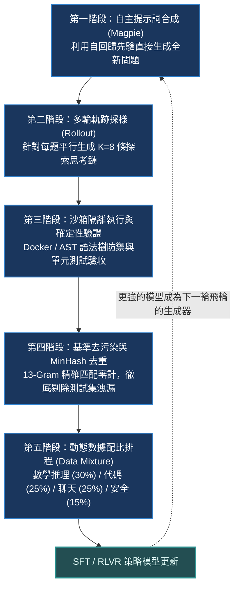

# Chapter 13: 數據飛輪與基準去污染 (Data Flywheel & Decontamination)

> *「當全球前沿實驗室的 Transformer 架構趨於標準化（RoPE、SwiGLU、GQA），**後訓練數據飛輪工程（Data Flywheel Engineering）便成為了拉開模型智商差距的唯一護城河**——誰能以最低的成本自動合成、驗證百萬級高質量思維鏈，並以最嚴苛的標準清除基準測試洩漏，誰就能奪得開源與閉源的王座。」*

---

## 核心心智模型：五階段端到端後訓練數據飛輪

一個能夠自我進化的數據飛輪，必須在沒有昂貴人工標註的前提下形成閉環：



---

## 13.1 Magpie：免種子提示詞的自發數據生成 (NeurIPS 2024)

傳統的 Self-Instruct 或 Evol-Instruct 需要人類手工編寫幾百個種子題目，並大量調用昂貴的閉源商業 API。**Magpie** 揭示了一個驚人的直覺：**一個經過對齊的指令模型，其自回歸先驗中本身就沉澱了海量的提問模式**！只需在 Prompt 中提供到 User 標籤結尾（如 `<|im_start|>user\n`）而不輸入任何內容，模型就會自發接龍輸出高質量、多樣化的問題：

```python
def build_magpie_prompt_trigger(template_style: str = "qwen") -> str:
    """構造觸發模型自主生成題目的 Pre-Tokens 標頭"""
    if template_style == "qwen":
        # 僅給予 user 標籤，不給予任何題目內容
        return "<|im_start|>system\nYou are a helpful assistant.<|im_end|>\n<|im_start|>user\n"
    elif template_style == "llama3":
        return "<|start_header_id|>system<|end_header_id|>\n\nYou are a helpful assistant.<|eot_id|><|start_header_id|>user<|end_header_id|>\n\n"
    raise ValueError(f"未知的模板格式: {template_style}")

# 送入 Qwen2.5-Instruct 模型，模型將自發生成題目：
# 生成示例：「一個長方體的長為 8cm，寬為 5cm，高為 12cm。如果高翻倍，新的體積是多少立方厘米？」
```

---

## 13.2 自動化沙箱驗證與 AST 語法樹安全防禦

在生成代碼或工具調用數據時，**絕不能使用簡單的正則比對，代碼必須在沙箱中真實執行**。但在自動執行百萬條模型生成的代碼時，必須首先利用 Python AST（抽象語法樹）進行靜態安全防禦，阻斷一切惡意系統呼叫：

```python
import ast

class SecurityValidator(ast.NodeVisitor):
    """AST 靜態審計器：攔截危險模組導入與系統調用"""
    FORBIDDEN_MODULES = {"os", "sys", "subprocess", "socket", "shutil", "requests"}
    
    def __init__(self):
        self.is_safe = True
        self.violation = None
        
    def visit_Import(self, node):
        for alias in node.names:
            if alias.name in self.FORBIDDEN_MODULES:
                self.is_safe = False
                self.violation = f"偵測到禁止導入的危險模組: {alias.name}"
        self.generic_visit(node)

def execute_sandboxed_snippet(code: str, unit_test: str) -> tuple[bool, str]:
    """安全解析 AST 並在嚴格受限環境中運行單元測試"""
    try:
        tree = ast.parse(code)
    except SyntaxError as e:
        return False, f"語法錯誤: {e}"
        
    validator = SecurityValidator()
    validator.visit(tree)
    if not validator.is_safe:
        return False, f"🚨 安全攔截: {validator.violation}"
    
    # 安全隔離的微執行環境
    sandbox_globals = {"__builtins__": {"abs": abs, "min": min, "max": max, "range": range, "len": len, "AssertionError": AssertionError}}
    try:
        exec(code, sandbox_globals)
        exec(unit_test, sandbox_globals)
        return True, "✅ 單元測試全部通過"
    except AssertionError:
        return False, "❌ 斷言失敗 (答案錯誤)"
    except Exception as e:
        return False, f"執行期異常: {e}"
```

---

## 13.3 基準測試去污染工程 (13-Gram Filter)

大模型訓練最忌諱的是「測試集洩漏（Contamination）」，這會導致評測指標虛高，在論文或商業發布中引發嚴重的誠信危機。Meta（Llama 3 技術報告）與 OpenAI 確立了業界通用的 **13-Gram 精確匹配去污染標準**：

```python
import re

def extract_ngrams(text: str, n: int = 13) -> set[str]:
    """將文本標準化並切分為連續的 n-gram 詞窗集合"""
    words = re.findall(r"\b\w+\b", text.lower())
    if len(words) < n:
        return set()
    return {" ".join(words[i:i+n]) for i in range(len(words) - n + 1)}

# GSM8K 基準測試官方題目 (禁區基準語料庫)
benchmark_question = "Janet sells 16 duck eggs a day for two dollars each at the farmers market daily"
gold_ngrams = extract_ngrams(benchmark_question, n=8)

clean_sample  = "A farmer sells apples at the weekend market for five dollars per bag"
leaked_sample = "Janet sells 16 duck eggs a day for two dollars each to her neighbors"

def check_contamination(candidate: str, forbidden_ngrams: set[str], n: int = 8) -> bool:
    cand_ngrams = extract_ngrams(candidate, n=n)
    return len(cand_ngrams.intersection(forbidden_ngrams)) > 0

print("候選題目 1 是否乾淨？", not check_contamination(clean_sample, gold_ngrams, n=8))  # True
print("候選題目 2 是否乾淨？", not check_contamination(leaked_sample, gold_ngrams, n=8)) # False (被抓出洩漏！)
```

> [!IMPORTANT]
> **鐵律**：任何候選訓練樣本，只要與 GSM8K、MATH、HumanEval、SWE-bench 等評測基準的測試集重合了 **連續 13 個單詞**，該樣本必須**被永久自訓練資料庫中物理刪除**！

---

## 13.4 Llama 3 六輪多階段迭代混合排程 (Data Mixture Scheduling)

Meta 在 **Llama 3 技術報告第三章** 揭示了其前沿後訓練的六輪漸進式飛輪：

```text
[Round 1] 基底模型 ──► 高質量種子 SFT (建立語音與格式先驗)
                          │
[Round 2] 拒絕採樣 SFT (8 條 Rollout 中挑選 1 條最優且最簡練的解題示範)
                          │
[Round 3] 在線 RLVR (在數學與編程確定性驗收環境中進行大規模探索)
                          │
[Round 4] 偏好微調 (利用 SimPO / DPO 進行主觀風格與勝負比優化)
                          │
[Round 5] 安全防禦與拒絕回答校準 (平衡有益性與安全邊界)
                          │
[Round 6] 終端退火混合 (最終全域泛化能力固化)
```

### 工業級後訓練黃金配比矩陣
- **深度數學推理 (Mathematical Reasoning)**：$30\%$
- **編程代碼與工具調用 (Coding & Tools)**：$25\%$
- **通用指令遵循與寫作 (General Instruction & Chat)**：$25\%$
- **安全防護與對抗對齊 (Safety & Red-Teaming)**：$15\%$
- **多語言與通識世界知識 (Multilingual / Knowledge)**：$5\%$

---

## 🤔 架構深度思辨與工業界陷阱 (Architectural Insight & Production Pitfalls)

> [!IMPORTANT]
> **Frontier Lab 核心考點 (DeepMind / OpenAI / Anthropic MLE)**:
> - **陷阱與對策 (Failure Mode & Fix)**:
>   1. **合成數據自我消化崩潰 (Synthetic Model Collapse)**: 
>      當連續多輪飛輪完全依賴自生成數據進行 SFT，模型會快速丟失低頻常識與長尾詞彙，語言多樣性崩解。
>      *工業界對策*: **在每輪 SFT/RL 混合中保留固定 $15\% - 20\%$ 的高質量人類預訓練精選數據**，作為語義分佈的「錨點」。
>   2. **沙箱逃逸與資源耗盡 (Sandbox Denial of Service)**: 
>      在執行百萬條合成代碼時，模型生成的代碼可能包含 `while True:` 內存炸彈，耗盡主機內存導致整個 GPU 集群訓練隊列癱瘓。
>      *工業界對策*: 採用 **Firecracker microVM** 配合 Linux `cgroups v2`，設置硬性限制：單核 CPU、512MB 內存、10s 超時殺進程（SIGKILL）、禁止所有非本地網絡連接。
> - **核心技術思辨 (Technical Deep Dive)**:
>   *Q: 為什麼 Meta Llama 3 和 DeepSeek 堅持使用 13-gram 作為數據去污染的標準？比 13-gram 更短（例如 5-gram）或更長（例如 30-gram）會有什麼缺陷？*  
>   *A: 13-gram 處於統計語言學中的**臨界特異性窗口**。若採用 5-gram 或 8-gram，通用的自然語言習慣用語（如 "in order to find the final answer we must"）會大量誤傷正常訓練數據，導致有效語料被錯誤丟棄；若採用 30-gram，只要題目中人名或數字稍作改動（如將 "Janet sells 16 eggs" 改為 "Mary sells 16 eggs"），長度即無法精確匹配，使污染數據逃逸。13 個單詞既保證了極低的誤報率（False Positive），又能以高置信度截獲絕大多數基準問題的真實洩漏。*

---

## 下一步

→ 進入 [Chapter 14: Post-Training 系統架構與故障排查實戰手冊 (System Architecture & Triage Playbook)](./14_post_training_systems_and_triage_playbook.md)，系統化梳理頂級實驗室系統設計與演算法實戰。
