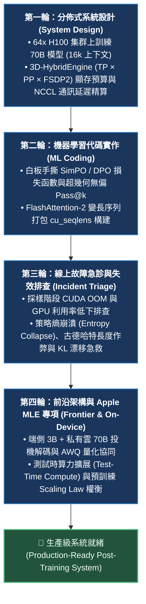
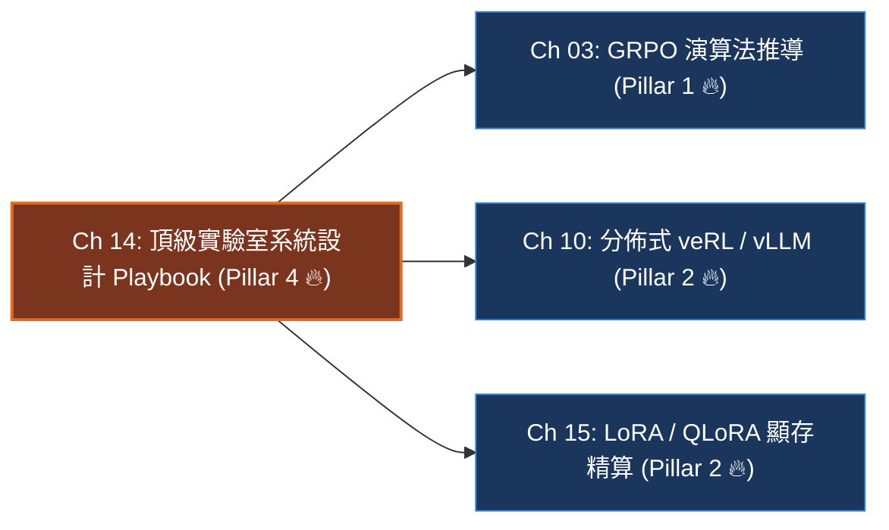

# Chapter 14: Post-Training 系統架構與故障排查實戰指南 (System Architecture & Incident Triage Playbook)

> *「在頂級 AI 實驗室（OpenAI、Anthropic、Google DeepMind、Meta、Apple、xAI、ByteDance Seed）的後訓練（Post-Training MLE）系統架構評估中，評審委員會絕不會停留在名詞解釋八股文——他們唯一關心的是你的**硬體顯存算力心算能力、分佈式系統設計直覺、白板手撕關鍵損失函數、以及面對線上 OOM 與策略坍塌事故時的秒級急救反應**。」*

---

## 一、工業背景與技術演進：頂級後訓練系統架構的四大核心技術維度

在大模型從預訓練轉向後訓練（Post-Training）為核心驅動力的時代，後訓練工程師與系統架構評估維度發生了根本性的範式轉變：



### 1. 架構評估哲學演進：從學術名詞到系統工程決策
- **舊指標（2022~2023）**：推導 Transformer 縮放點積注意力公式、解釋什麼是 Reinforce、說出 RLHF 的三步驟。
- **新架構要求（2025~2026）**：
  1. *心算能力*：在白板上 2 分鐘內給出 70B 模型在 64 張 H100 上全量訓練與 LoRA 訓練的各部分精確顯存數字；
  2. *決策邊界*：說出在什麼顯卡叢集與任務特徵下應該選 GRPO 而不是 DPO/SimPO；
  3. *事故急救*：看到 WandB 監控曲線中 KL > 5.0 或長度暴漲時，30 秒內定位根因並提出線上修復指令。

---

## 二、架構決策樹與 Trade-off 對比

後訓練全景決策矩陣是應對系統設計（System Design）與研究深入考題的核心思維框架：

| 評估維度 | 在線可驗證 RLVR (GRPO) | 離線隱式偏好 (DPO) | 免參考極限量化 (SimPO) | 經典 Actor-Critic (PPO) |
|---|---|---|---|---|
| **常駐模型數** | 2 套 (Policy + Ref) | 2 套 (Policy + Ref) | **僅 1 套 (Policy Only)** | 4 套 (Actor, Critic, Ref, RM) |
| **GPU 顯存開銷** | 基準線 ($1.0\times$) | 基準線 ($1.0\times$) | **減半 ($\approx 0.5\times$)** | 極高 ($2.5\times \sim 3.0\times$) |
| **核心優勢** | 自主探索湧現長思維鏈 | 二元分類極速收斂 | 零參考顯存 + 根除長度偏見 | 狀態空間精確平滑估計 |
| **致命盲區** | 依賴確定性規則 Verifier | 依賴靜態數據，易長度作弊 | 缺少 Ref 錨點易語言漂移 | 價值網絡極難收斂且吃顯存 |
| **架構亮點** | 掌握 Dr. GRPO 移除長度偏見 | 掌握隱含獎勵推導過程 | 掌握目標邊界 $\gamma$ 的截斷作用 | 說清 GAE 偏差-方差連續權衡 |

---

## 三、系統心智模型與邊界直覺：64x H100 叢集 70B 模型系統設計

### 1. 系統設計核心挑戰 (System Design Prompt)
> *「請為一個 70B 參數量、具備 16,384 上下文長度的推理大模型，在一個 8 節點集群（共 64 張 NVIDIA H100 80GB SXM5 GPU）上，設計端到端的強化學習後訓練架構。請給出精確到小數點的顯存預算、並行切分方案與通訊拓撲。」*

```mermaid
flowchart TD
    subgraph Cluster["8 節點叢集 (共 64 張 H100 80GB，節點間 800Gbps InfiniBand)"]
        subgraph Node1["節點 1 (8x H100 SXM5, NVLink 900GB/s)"]
            GPU0["GPU 0~7<br/>TP=8 (節點內張量並行)"]
        end
        subgraph Node8["節點 8 (8x H100 SXM5, NVLink 900GB/s)"]
            GPU7["GPU 56~63<br/>TP=8 (節點內張量並行)"]
        end
        Node1 <-->|FSDP2 跨節點數據並行 (DP=8)| Node8
    end

    classDef cluster fill:#1a365d,stroke:#3182ce,stroke-width:1.5px,color:#fff;
    classDef node fill:#2d3748,stroke:#4a5568,color:#e2e8f0;
    class Cluster cluster;
    class Node1,Node8 node;
```

### 2. 顯存精算數學公式與閉式預算

$$\text{VRAM}_{\text{total}} = \frac{M_{\text{weight}}}{DP} + \frac{M_{\text{optimizer}}}{DP} + \frac{B_{\text{node}} \cdot L \cdot \text{KV}_{\text{bytes}}}{TP} + M_{\text{workspace}} \le 80.00\text{ GB}$$

```python
def calculate_70b_cluster_memory(
    num_gpus: int = 64,
    batch_size_per_node: int = 4, # 8 節點 * 4 = 32 個並發推理
    seq_len: int = 16384,
    layers: int = 80,
    hidden_size: int = 8192,
    num_heads: int = 64,
    num_kv_heads: int = 8,
    use_fp8_kv: bool = True
) -> dict:
    """精算 70B 模型在 64 張 H100 GPU 上的顯存分配明細"""
    # 1. 模型靜態權重：BF16 每參數 2 字節 -> 70B * 2 = 140 GB
    weight_total_gb = 70.0 * 2.0
    
    # 2. 優化器狀態：AdamW FP32 需維護一階矩 (4B) + 二階矩 (4B) + 主權重 (4B) = 12 字節/參數
    # 在 64 張 GPU 上經 FSDP2 / ZeRO-3 均勻切分 (DP=64 或 DP=8*TP=8)：
    # 這裡採用 8 節點 FSDP2 切分權重與優化器 (64 卡分片):
    opt_sharded_per_gpu = (70.0 * 12.0) / num_gpus     # 840 GB / 64 = 13.125 GB/GPU
    weight_sharded_per_gpu = weight_total_gb / num_gpus # 140 GB / 64 = 2.1875 GB/GPU
    
    # 3. 動態 KV-Cache (節點內 TP=8 分片，使用 FP8 量化)
    bytes_per_elem = 1 if use_fp8_kv else 2
    head_dim = hidden_size // num_heads # 128
    kv_bytes_per_tok = 2 * layers * (num_kv_heads * head_dim) * bytes_per_elem # 163,840 B
    total_node_kv = (batch_size_per_node * seq_len * kv_bytes_per_tok) / (1024**3) # ~10 GB
    kv_per_gpu = total_node_kv / 8 # TP=8 ➔ 1.25 GB/GPU
    
    # 4. 激活值與運行時工作區 (啟用 FlashAttention-2 與梯度檢查點)
    workspace_gb = 14.0
    
    total_alloc = weight_sharded_per_gpu + opt_sharded_per_gpu + kv_per_gpu + workspace_gb
    headroom = 80.0 - total_alloc
    
    return {
        "weights": round(weight_sharded_per_gpu, 2),
        "optimizer": round(opt_sharded_per_gpu, 2),
        "kv_cache": round(kv_per_gpu, 2),
        "workspace": round(workspace_gb, 2),
        "total": round(total_alloc, 2),
        "headroom": round(headroom, 2)
    }

budget = calculate_70b_cluster_memory()
print(f"單卡總佔用: {budget['total']} GB / 80.00 GB (安全餘裕: {budget['headroom']} GB)")
```

### 3. 通訊拓撲與邊界分析 (Boundary Analysis)
- **TP 嚴禁跨節點**：NVLink 雙向頻寬 900 GB/s，而跨節點 800Gbps InfiniBand 僅約 100 GB/s。若將 TP 跨節點，All-Reduce 通訊時間劇增 9 倍，訓練管線立即停滯。
- **動態重分片**：Rollout 時節點內以 `TP=8` 運行 vLLM，反向傳播時透過 NCCL `all_to_all` 在 800ms 內動態重分片為 `FSDP2`。

---

## 四、代碼剖析、實時遙測巡檢與失效急救

### 1. 核心底層 4 大白板手撕演算法實作

```python
import math
import torch
import torch.nn.functional as F

# 1. 手撕 SimPO 損失函數 (免參考模型 + 長度歸一化 + 目標邊界 gamma)
def simpo_loss(pi_w_logp: torch.Tensor, pi_l_logp: torch.Tensor, len_w: torch.Tensor, len_l: torch.Tensor, beta: float = 2.0, gamma: float = 0.8) -> torch.Tensor:
    r_w = (beta / len_w) * pi_w_logp
    r_l = (beta / len_l) * pi_l_logp
    return -F.logsigmoid((r_w - r_l) - gamma).mean()

# 2. 手撕超幾何無偏 Pass@k 組合估計器 (避免大數階乘溢出)
def pass_at_k(n: int, c: int, k: int) -> float:
    """
    n: 總採樣數, c: 通過測試的正確採樣數, k: 評估指標 k
    無偏估計公式: 1 - prod_{i=0}^{k-1} (n - c - i) / (n - i)
    """
    if n - c < k:
        return 1.0
    return 1.0 - math.prod((n - c - i) / (n - i) for i in range(k))

# 3. 手撕 ReMax 貪婪解碼基線優勢 (零 Critic 顯存開銷)
def remax_advantages(sampled_rewards: list[float], greedy_reward: float) -> list[float]:
    return [r - greedy_reward for r in sampled_rewards]

# 4. 手撕 FlashAttention 變長拼接 cu_seqlens 構建器
def build_cu_seqlens(lengths: list[int]) -> tuple[torch.Tensor, int]:
    cu = [0]
    for l in lengths:
        cu.append(cu[-1] + l)
    return torch.tensor(cu, dtype=torch.int32), max(lengths)
```

### 2. 四維遙測監控雷達表與事故診斷引擎

| 事故類型 | 遙測信號形態 | 根本原因 (Root Cause) | 工業級現場急救方案 |
|---|---|---|---|
| **長度作弊 (Verbosity Hacking)** | `mean_length` 暴漲，但 `test_acc` 停滯 | 獎勵函數在長答案上存在正相關漏洞 | 切換為帶長度歸一化的 SimPO，注入動態長度負懲罰 |
| **策略熵崩潰 (Entropy Collapse)** | Token Entropy 暴跌至 $< 0.15$ | 學習率過大或梯度裁剪失效，策略陷入死循環 | 調大 KL 係數 $\beta$，注入熵正則化獎勵，限制 `max_grad_norm=1.0` |
| **採樣階段 OOM (Rollout OOM)** | OOM 100% 發生在生成環節 | 長思維鏈導致 KV-Cache 顯存池耗盡 | 開啟 vLLM PagedAttention + FP8 KV-Cache + Chunked Prefill |
| **數據污染假繁榮 (Leakage)** | 訓練 Loss 極低，但 OOD 測試集歸零 | 基準測試題洩漏進冷啟動或訓練集 | 執行 13-gram 嚴格滑動窗口去重與 MinHash LSH 審查 |

---

## 五、前沿系統架構深度思辨與極限設計 (Frontier Architecture Scenarios & Whiteboard Defense)

> [!IMPORTANT]
> **頂級實驗室 (Apple / OpenAI / Anthropic / Meta) 高頻實戰追問**:

### 架構實戰考驗 Q1：Apple MLE 專項系統設計 — 端側 3B 與私有雲 PCC 70B 如何架構協同？
- **架構極限邊界**：考核你對邊緣設備（Apple Silicon 統一記憶體）與雲端大規模計算（Private Cloud Compute）的分工協同架構設計。
- **滿分回答範式**：
  > 「我們採用**三層階梯架構（Three-Tiered Architecture）**：
  > 
  > 1. **端側路由與保護（On-Device AFM 3B）**：
  >    - 在 A17 Pro / M 系列晶片上，3B 基礎模型經過 **AWQ 4-bit 量化**（記憶體佔用壓縮至 1.8GB，完美置入 8GB 統一記憶體）。利用 Apple MLX / Metal 進行算子編譯，解碼速度達 38 tok/s。
  >    - 端側作為第一道隱私過濾器，處理簡單摘要、郵件分類，並充當有害輸入的本機安全門禁。
  > 2. **私有雲端推理（PCC 70B with Speculative Decoding）**：
  >    - 對於複雜多步邏輯問題，請求通過端到端加密通道轉發至 PCC 叢集。
  >    - **投機解碼協同**：雲端 70B 模型以端側已生成的 3B 答案作為 Draft 進行平行批次驗證，實現 2.2x~2.5x 的端到端無損加速。
  > 3. **離線對齊與自改進飛輪**：
  >    - 雲端採用 All-Linear QLoRA + SimPO 進行每週適配器增量微調，並由自動化紅隊（GCG/TAP）持續探測對抗樣本，驗證通過後以差分 LoRA 權重（約 150MB）推播至端側。」

---

### 架構實戰考驗 Q2：工程師在顯存心算時最常犯的致命錯誤是什麼？
- **架構極限邊界**：考核你是否具備真實一線踩坑經驗，能否一眼識破理論算力與工程落地的鴻溝。
- **滿分回答範式**：
  > 「系統容量評估中最致命的錯誤是**『只算模型靜態權重，完全忘記 AdamW 優化器狀態與激活值動態顯存』**：
  > 
  > - 很多工程師看到 70B 模型，心算 $70 \times 2\text{ Bytes} = 140\text{ GB}$，便脫口而出『2 張 80GB 卡即可微調』。
  > - 實際上，全參數 AdamW 在 FP32 下必須維護一階動量（4B）、二階動量（4B）與主權重副本（4B），每參數需額外消耗 12 字節，即 $70 \times 12 = 840\text{ GB}$。加上梯度 140GB，靜態需求已高達 1.12TB！
  > - 只有清楚列出：**Weights + Gradients + Optimizer States + Activations + KV-Cache + Workspace Headroom**，並給出 FSDP2 / ZeRO-3 的切分除數，才能展現出資深後訓練工程師的專業水準。」

---

## 本章小結與學習路徑



恭喜完成 7 大核心熱點章節學習！此時你已具備：
1. **Pillar 1 (演算法核心)**：GRPO 零 Critic 機制、DPO 隱式獎勵推拉力學、SimPO 顯存砍半與邊界直覺；
2. **Pillar 2 (系統與顯存)**：veRL + vLLM 3D-HybridEngine 動態重分片、70B 顯存心算公式；
3. **Pillar 3 (數據與啟動)**：SFT Cold-Start 破局死局、Goldilocks 甜蜜區 Pass@8 躍遷；
4. **Pillar 4 (系統就緒)**：64x H100 系統設計、白板手撕程式碼與線上事故秒級急救。
