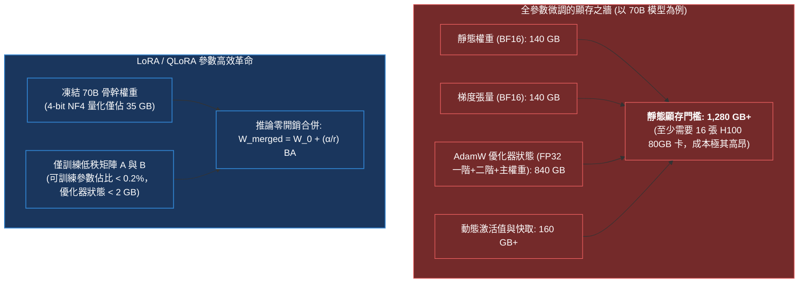
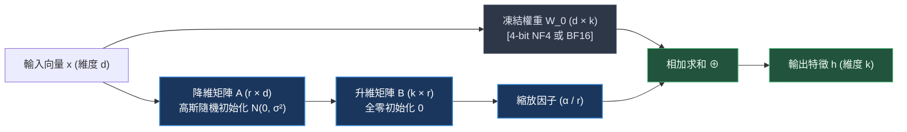
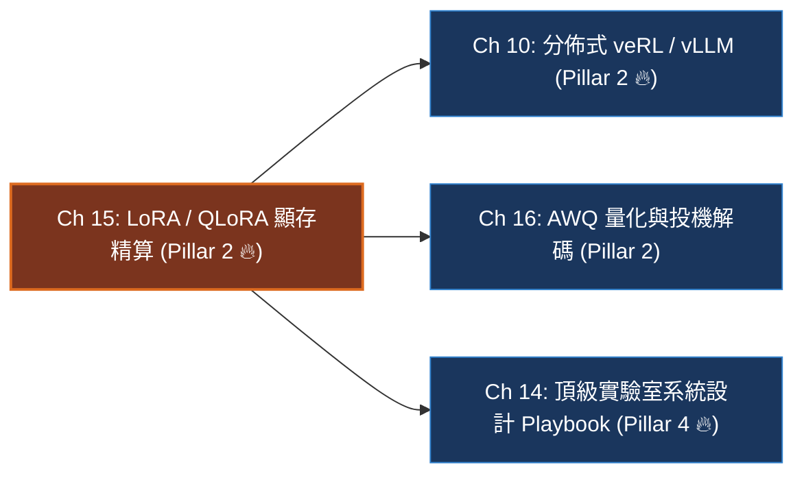

# Chapter 15: LoRA, QLoRA 與參數高效後訓練 (PEFT & VRAM Arithmetic)

> *「LoRA 的哲學就像是在一本厚重不可修改的經典教科書上覆蓋了一張透明描圖紙——我們永遠不塗改底層千億參數的基底權重，只在低秩紙張上記錄任務的微小增量變化。推論時，只需將兩者合二為一。」*

---

## 一、工業背景與技術演進：全參數微調的顯存之牆與 PEFT 革命

在 7B 到 70B 甚至更大參數量的基礎模型（Foundation Models）時代，傳統**全參數微調（Full Parameter Fine-Tuning）**面臨著物理硬體與工程營運的雙重顯存高牆：



### 1. 為什麼全參數微調在生產中難以規模化？
- **顯存翻倍稅**：AdamW 優化器需要維護每個參數的 FP32 一階矩（4B）、二階矩（4B）與主權重（4B），單是優化器狀態就是模型權重顯存的 **6 倍**（每參數 12 字節）。微調一個 70B 模型僅優化器就需要 840GB 顯存！
- **MLOps 儲存與部署災難**：如果團隊有 20 個垂直業務（法律、代碼、醫療、財務），若每個模型都做全參微調，需要存儲與維護 20 套 140GB 的 Checkpoint（總計近 3TB 權重），在線上切換模型需要重新載入數百 GB 權重，引發災難性的冷啟動延遲。

### 2. 參數高效微調（PEFT）的進化躍遷
- **Prompt / Prefix Tuning**：在輸入端插入虛擬 Token。但嚴重佔用寶貴的上下文窗口，且對超參數極端敏感，推理能力顯著退化。
- **LoRA (Hu et al. 2021)**：基於矩陣內在維度（Intrinsic Dimension）理論，將權重更新量分解為 $\Delta W = B \cdot A$。凍結主幹，可訓練參數下降 99% 以上。
- **QLoRA (Dettmers et al. NeurIPS 2023)**：引入 **4-bit NormalFloat (NF4)** 量化、**雙重量化 (Double Quantization)** 與 **分頁優化器 (Paged Optimizers)**，讓單卡 80GB 微調 70B 模型成為現實！

---

## 二、架構決策樹與 Trade-off 對比

在頂級實驗室的系統選型與架構設計中，工程師必須精確掌握各類微調策略的架構與資源消耗邊界：

| 評估維度 | 全參數微調 (Full FT) | 經典 LoRA (16-bit) | 極限量化 QLoRA (4-bit) | 權重分解 DoRA |
|---|---|---|---|---|
| **70B 模型顯存門檻** | $> 1,280\text{ GB}$ (需 16x H100) | $\approx 240\text{ GB}$ (需 4x H100) | **$\approx 48\text{ GB}$ (單張 H100 即可！)** | $\approx 260\text{ GB}$ |
| **可訓練參數佔比** | $100\%$ | **$0.1\% \sim 0.5\%$** | **$0.1\% \sim 0.5\%$** | $0.15\% \sim 0.6\%$ |
| **訓練速度 / 吞吐量** | 基準線 ($1.0\times$) | **較快 ($1.1\times \sim 1.3\times$)** | 略慢 ($0.75\times$，有量化解包開銷) | 基準線 ($0.95\times$) |
| **推理能力保留度** | 基準線 ($100\%$) | **$98\% \sim 100\%$** (需掛載 All-Linear) | **$96\% \sim 99\%$** | **$99\% \sim 101\%$** |
| **推論部署延遲** | 0 額外延遲 | **0 (推論前直接權重合併)** | 0 (合併反量化後部署) | 0 (合併後部署) |
| **單卡多租戶切換** | 不可能 (需重載 140GB) | **微秒級 (動態切換 100MB Adapter)** | **微秒級 (動態切換 Adapter)** | 微秒級 |

> [!TIP]
> **工業落地決策守則**：
> 1. **算力極度充裕、追求通用推理天花板**：選擇 **Full FT** 或 **DoRA**。
> 2. **主流生產微調、快速迭代（8x H100 集群）**：選擇 **經典 LoRA (BF16) + All-Linear 掛載**。
> 3. **顯存極端受限（如單張 80GB A100/H100 或 24GB 消費卡）**：選擇 **QLoRA (NF4 + Double Quantization)**。

---

## 三、系統心智模型與邊界直覺 (Systems Mechanics & Boundary Intuition)

### 1. 矩陣低秩分解前向與權重合併



### 2. 核心代數公式與推論零延遲合併

$$W = W_0 + \Delta W = W_0 + \frac{\alpha}{r} (B \cdot A)$$

推論前，執行離線無損矩陣乘法加和：
$$W_{\text{merged}} = W_0 + \frac{\alpha}{r} (B \cdot A)$$
**在線上 Serving 時，模型結構與原始模型完全一致，完全不存在額外的矩陣乘法分支延遲！**

### 3. 關鍵參數物理意義與極限邊界分析 (Boundary Intuition)

- **秩 (Rank $r$) 的邊界行為**：
  - 當 $r = 1$：$\Delta W$ 退化為外積向量，模型只能調整神經元的全局縮放比例，在多步推理與代碼合成上表現極差。
  - 當 $r \in [16, 64]$：工業黃金區間。足以捕捉下游領域的專業知識（如醫學知識、SQL 語法）。
  - 當 $r \to d$（如 $r=4096$）：低秩約束消失，參數量逼近全量微調，不僅失去了正則化防過擬合的作用，顯存開銷也暴增。
- **縮放係數比率 $\frac{\alpha}{r}$ 的物理常數特性**：
  - 傳統矩陣微調在改變 Rank 時需要重新網格搜索學習率。LoRA 引入 $\frac{\alpha}{r}$（常設為固定常數，如 $\frac{\alpha}{r} = 2.0$）。
  - 當你將 $r$ 從 16 翻倍至 32 時，只要保持 $\alpha = 2r = 64$，初始化更新步長與梯度尺度保持恆定，**無需重調學習率**。
- **NF4 (NormalFloat4) 的資訊理論直覺**：
  - 傳統 INT4/FP4 採用均勻分佈量化點，浪費了大量精度在分佈邊緣。
  - 大模型權重嚴格服從零均值正態分佈 $\mathcal{N}(0, \sigma^2)$。NF4 根據高斯分佈分位數切割出 16 個等機率區間。**在資訊論上，NF4 使得每個 4-bit 量化點保留的資訊熵最大化，量化重建誤差逼近理論極限**。
- **All-Linear 掛載法則**：
  - 早期 LoRA 僅掛載在 Attention 的 $W_q, W_v$。
  - 最新研究表明：**Transformer 80% 以上的知識容量儲存在 MLP 前饋層（`gate_proj`, `up_proj`, `down_proj`）**。在推理模型後訓練中，必須掛載全線性層（All-Linear），否則模型推理能力會遭受 30%~50% 的性能截斷。

---

## 四、代碼剖析、實時遙測巡檢與失效急救

### 1. 生產級 QLoRA (NF4 + All-Linear) PEFT 配置代碼

```python
import torch
from transformers import AutoModelForCausalLM, BitsAndBytesConfig
from peft import LoraConfig, get_peft_model, prepare_model_for_kbit_training

def setup_production_qlora_model(model_id: str, lora_r: int = 32, lora_alpha: int = 64):
    """
    配置生產級 4-bit QLoRA 模型 (NF4 + Double Quantization + All-Linear)
    """
    # 1. 4-bit NF4 與雙重量化配置
    bnb_config = BitsAndBytesConfig(
        load_in_4bit=True,
        bnb_4bit_quant_type="nf4",           # 資訊理論最優高斯量化
        bnb_4bit_use_double_quant=True,      # 雙重量化，省 0.37 bits/param
        bnb_4bit_compute_dtype=torch.bfloat16 # 計算保持 BF16 防止溢出
    )
    
    # 2. 載入骨幹模型
    model = AutoModelForCausalLM.from_pretrained(
        model_id,
        quantization_config=bnb_config,
        device_map="auto",
        torch_dtype=torch.bfloat16
    )
    
    # 3. 凍結主幹並為 k-bit 訓練做準備 (LayerNorm FP32 穩定化)
    model = prepare_model_for_kbit_training(model, use_gradient_checkpointing=True)
    
    # 4. All-Linear 全模組掛載 LoRA 配置
    peft_config = LoraConfig(
        r=lora_r,
        lora_alpha=lora_alpha,
        # 覆蓋 Attention 與 MLP 全部 7 個投影矩陣
        target_modules=[
            "q_proj", "k_proj", "v_proj", "o_proj",
            "gate_proj", "up_proj", "down_proj"
        ],
        lora_dropout=0.05,
        bias="none",
        task_type="CAUSAL_LM"
    )
    
    peft_model = get_peft_model(model, peft_config)
    peft_model.print_trainable_parameters()
    return peft_model
```

### 2. 四維遙測監控雷達表 (PEFT Telemetry Signals)

| 遙測指標 (Telemetry Signal) | 健康運算形態 | 異常警報與失效原因分析 | 根本原因 (Root Cause) |
|---|---|---|---|
| `train/loss` | 平滑單調遞減 | 陡然跳變為 `NaN` 或數值劇烈震盪 | Adapter 梯度在低精度下出現下溢，或學習率過大 |
| `grad_norm/adapter` | 保持在 $0.5 \sim 2.0$ | 突破 $> 10.0$ 或跌落至 $< 1e-5$ | 梯度爆炸或反向傳播在凍結主幹邊界受阻 |
| `vram/allocated_gb` | 訓練全程恆定（平穩無突刺） | 隨長度階梯式暴漲引發 OOM | 未開啟 Paged Optimizer 或梯度檢查點失效 |
| `throughput/tokens_per_sec` | 達到同卡 BF16 的 $75\% \sim 85\%$ | 暴跌至 $< 40\%$ | 踩入 CPU Paging 頻繁換頁陷阱 |

### 3. 工業級現場急救錦囊 (Industrial Incident Runbook)

- **事故 1：Adapter 權重合併精度漂移 (Precision Mismatch on Merge)**
  - *現象*：在 LoRA 訓練時 Evaluation 準確率高達 90%，但將權重合併回基座模型發布上線後，生成內容崩潰亂碼。
  - *診斷*：基座模型是以 4-bit NF4 載入，如果直接把 FP32 的 Adapter 權重加回 4-bit 反量化的基座矩陣，會產生不可逆的數值捨入截斷。
  - *急診處方*：**永遠不要在 4-bit 狀態下合併權重**！正確發布流程：在 CPU 或高顯存節點以原生 FP16/BF16 載入純淨的原始基座權重，將 Adapter 加和後，再導出為最終模型。
- **事故 2：梯度下溢引發的「假死學習」**
  - *現象*：Loss 完全不下降，模型生成的答案毫無變化。
  - *診斷*：在使用純 FP16 訓練時，Adapter 的微小梯度（如 $10^{-6}$）在 FP16 的數值動態範圍下直接被截斷為 0（Underflow）。
  - *急診處方*：全面切換為 **BF16**（具備與 FP32 相同的 8 位指數位），或將 AdamW 優化器狀態強制綁定在 FP32。

---

## 五、前沿系統架構深度思辨與極限設計 (Frontier Architecture Scenarios & Whiteboard Defense)

> [!IMPORTANT]
> **頂級實驗室 (Apple / OpenAI / Meta / ByteDance) 高頻實戰追問**:

### 架構實戰考驗 Q1：從資訊理論與概率密度角度，請白板推導證明：為什麼 QLoRA 要發明 NF4 (NormalFloat4) 而不是直接使用標準 FP4 或 INT4？
- **架構極限邊界**：考核你是否理解無損量化的第一性原理（Quantization from First Principles），以及高斯分位數對資訊熵的保持。
- **滿分回答範式**：
  > 「量化（Quantization）的本質，是用有限的離散狀態數（4 bits 即 16 個量化槽）去逼近連續的實數分佈，其核心目標是**最小化資訊損失（Information Loss / Mean Squared Error）**：
  > 
  > 1. **傳統 INT4/FP4 的分佈失配**：
  >    - 均勻整數量化（INT4）假設權重在區間內均勻分佈；標準浮點量化（FP4）假設符號、指數與尾數具有特定結構。
  >    - 但大語言模型預訓練後的權重張量，經大數法則與 LayerNorm 約束，嚴格服從**零均值正態分佈 $\mathcal{N}(0, \sigma^2)$**。權重高度集中在 0 附近，尾部極為稀疏。
  > 2. **NF4 的資訊論最優設計**：
  >    - 根據資訊論，要讓 16 個量化點攜帶最大的資訊熵，每個量化槽（Quantile Bin）所包含的**概率質量（Probability Mass）必須嚴格相等**，即 $P(q_i \le x \le q_{i+1}) = \frac{1}{16}$。
  >    - NF4 透過計算標準正態分佈的累積反函數 $Q_X(i/16)$，直接求解出這 16 個非均勻分佈的量化點數值，並對 0 進行精確對齊。
  > 3. **結論**：NF4 在 4-bit 極限下實現了對正態權重的資訊熵最大化保留，其實測量化誤差顯著低於 INT4 與 FP4，保證了 4-bit 量化後大模型的推理能力幾乎零損耗。」

---

### 架構實戰考驗 Q2：請精算：在一台配備單張 A100 (80GB) 的機器上，能否微調一個 70B 模型？如果可以，請給出各項顯存開銷的精確預算表。
- **架構極限邊界**：考核你的硬體顯存心算極限能力，驗證你是否具備在嚴苛硬體預算下落地千億模型的工業工程實操經驗。
- **滿分回答範式**：
  > 「**答案是：完全可以，但必須採用 QLoRA + 梯度檢查點 + Paged AdamW。**
  > 
  > 顯存精算拆解如下：
  > 1. **骨幹權重（4-bit NF4 + 雙重量化）**：
  >    - 70B 參數在 4-bit 下理論大小為 $70 \times 0.5\text{ Bytes} = 35.0\text{ GB}$。
  >    - 雙重量化將分塊縮放係數壓縮至 $0.129\text{ bits/param} \approx 1.1\text{ GB}$。
  >    - **權重靜態顯存 $\approx 36.1\text{ GB}$**。
  > 2. **LoRA 可訓練參數與優化器（All-Linear, $r=32$）**：
  >    - All-Linear 掛載下，可訓練參數約佔總參數的 $0.2\% \approx 1.4\times 10^8$ 參數（140M）。
  >    - BF16 參數權重：$140\text{M} \times 2\text{B} = 0.28\text{ GB}$。
  >    - BF16 梯度：$0.28\text{ GB}$。
  >    - AdamW FP32 優化器狀態：$140\text{M} \times 12\text{B} = 1.68\text{ GB}$。
  >    - **LoRA 相關顯存合計 $\approx 2.24\text{ GB}$**。
  > 3. **激活值（Activation Memory，上下文 4,096）**：
  >    - 開啟 **FlashAttention-2** 與 **全激活值重計算（Gradient Checkpointing）**。
  >    - 單條 Sequence (Batch Size = 1, SeqLen = 4096) 激活值顯存嚴格控制在 **$\approx 8.5\text{ GB}$**。
  > 4. **CUDA 工作區與預留緩衝（Workspace Headroom）**：
  >    - 預留約 **$10.0\text{ GB}$** 用於臨時張量操作與 Paged Optimizer 換頁緩衝。
  > 
  > **總峰值顯存預算**：
  > $$36.1 + 2.24 + 8.5 + 10.0 = 56.84\text{ GB} \le 80.0\text{ GB}$$
  > 剩餘超過 23GB 的安全餘裕，完全不會發生 OOM，可進一步支援更大 Batch 或更長上下文。」

---

## 本章小結與學習路徑



→ 下一步建議：
- 若想了解訓練後的模型如何透過 **AWQ 4-bit 量化與投機解碼** 實現推論吞吐量暴增 3~5 倍，進入 [Chapter 16: 推論極限優化 — 量化、投機解碼與硬體編譯](./16_inference_optimization_quantization_compilation.md)。
- 若想挑戰完整 64x H100 叢集 70B 模型端到端系統設計大題，進入 [Chapter 14: Post-Training 系統架構與故障排查實戰指南](./14_post_training_systems_and_triage_playbook.md)。
