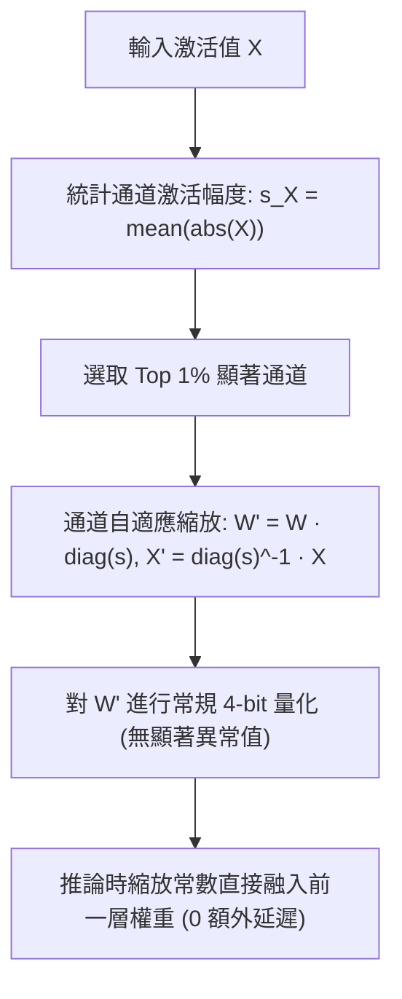
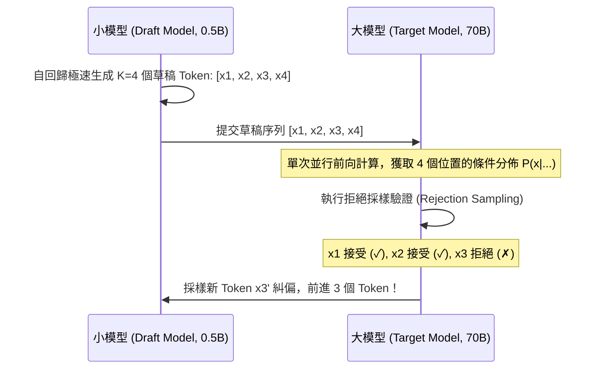
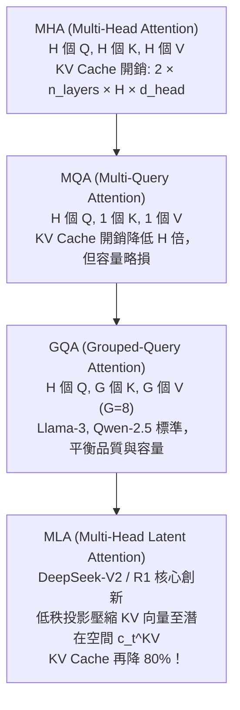

# Chapter 16: 大模型推論極限優化 — 量化 (GPTQ/AWQ)、投機解碼、KV-Cache 與硬體編譯

> **Apple MLE / Post-Training 核心考點**：Roofline 模型分析、GPTQ 二階誤差補償、AWQ 激活感知、投機解碼無損數學證明、PagedAttention 虛擬分頁、MLA 注意力與 Apple MLX 硬體編譯。

---

## 16.1 推論雙階段瓶頸：Roofline 模型與計算/帶寬邊界

大語言模型的推論過程嚴格劃分為兩個特徵完全不同的階段：

```
                ┌─────────────────────────────────────────────────────────────┐
                │             Roofline 模型與推論雙階段瓶頸                     │
    Attainable  │                                                             │
    Performance │                      Peak Compute (TFLOPS)                  │
    (TFLOPS)    │                   ┌───────────────────────────────          │
                │                  ╱                                          │
                │                 ╱  Prefill 階段 (Prompt Processing)         │
                │                ╱   • Compute-Bound (計算受限)                │
                │               ╱    • 併發多 Token 矩陣乘法 GEMM              │
                │              ╱     • 瓶頸：Tensor Core 算力峰值              │
                │             ╱                                               │
                │            ╱   Decode 階段 (Autoregressive Generation)      │
                │           ╱    • Memory-Bandwidth Bound (內存帶寬受限)       │
                │          ╱     • 每次生成 1 個 Token 矩陣-向量 GEMV         │
                │         ╱      • 瓶頸：HBM / 統一內存帶寬 (MBU)             │
                │        ╱                                                    │
                └───────┴─────────────────────────────────────────────────────┘
                                  Operational Intensity (FLOPs / Byte)
```

1. **Prefill 階段 (Prompt Processing)**:
   - 輸入所有 Prompt Token，計算所有注意力矩陣。
   - **Compute-Bound**：矩陣乘法（GEMM）為主，算力利用率高（MFU > 50%）。
   - 指標：**TTFT (Time-to-First-Token)**。

2. **Decode 階段 (Autoregressive Token Generation)**:
   - 每步自回歸生成 1 個 Token。需要將全部數十億參數以及過往所有 KV Cache 從高帶寬內存（HBM / RAM）搬移至計算核心（SRAM/Cache）中，僅做一次向量乘法（GEMV）。
   - **Memory-Bandwidth Bound**：運算強度極低（$\approx 1\text{ FLOP / Byte}$）。
   - 指標：**TPOT (Time-Per-Output-Token)** 與 **吞吐量 (Tokens/sec)**。

$$\text{Decode 吞吐上限 (tok/s)} \approx \frac{\text{Memory Bandwidth (GB/s)}}{\text{Model Size (GB)} + \text{KV Cache per Token (GB)}}$$

以 7B FP16（14GB 權重）在 A100 (2,039 GB/s 帶寬) 上為例，單 Batch 理想生成速度最高僅約 $\frac{2039}{14} \approx 145\text{ tok/s}$。若在 Apple M3 Max (400 GB/s 帶寬) 上，則為 $\frac{400}{14} \approx 28.5\text{ tok/s}$。

---

## 16.2 權重量化技術：GPTQ vs AWQ

為了突破內存帶寬瓶頸，將 16-bit 權重壓縮至 4-bit / 8-bit 能直接減少 2x 到 4x 的內存搬移量，從而使 Decode 速度成倍提升。

### 1. GPTQ (Accurate Post-Training Quantization)

GPTQ 基於二階泰勒展開的權重誤差重建理論（Optimal Brain Surgeon）。目標是最小化量化前後的輸出誤差：

$$\min_{\widehat{W}} \| W X - \widehat{W} X \|_2^2$$

對單個權重 $w_q$ 量化時，通過二階海森逆矩陣 $H^{-1} = (2 X X^T + \lambda I)^{-1}$ 對未量化的剩餘權重進行動態補償：

$$w_j \leftarrow w_j - \frac{w_q - \text{quant}(w_q)}{[H^{-1}]_{qq}} \cdot [H^{-1}]_{:, q}$$

- **特點**：逐列（Column-by-column）迭代更新，計算開銷較高，但極限壓縮下精度極高。

### 2. AWQ (Activation-aware Weight Quantization)

Lin 等人 (MLSys 2023) 指出：**並非所有權重都同等重要**。神經網絡中僅有約 **1% 的顯著通道（Salient Channels）** 決定了困惑度（PPL），而這些顯著通道直接對應於前向傳播中**激活值（Activation）較大的通道**。



AWQ 的通道保護變換公式：
$$W \cdot X = (W \cdot S) \cdot (S^{-1} \cdot X)$$
其中 $S = \text{diag}(s)$。通過搜索最優縮放因子 $s$，使得量化誤差最小化：
$$s^* = \arg\min_s L(s) = \arg\min_s \| W X - \text{quant}(W \cdot S) S^{-1} X \|$$

- **特點**：無過擬合風險、保護關鍵泛化特徵、推論時透過算子融合實現 **0 額外運行時開銷**。

---

## 16.3 投機解碼 (Speculative Decoding)：無損加速之美

Leviathan 等人 (2023) 與 Chen 等人 (2023) 提出的投機解碼是利用計算換取延遲的典範。

### 核心思想
讓一個體積極小、延遲極低的小模型（Draft Model, 如 0.5B）快速猜測接下來的 $K$ 個 Token，然後由大模型（Target Model, 如 70B）在 **一次 Prefill 矩陣乘法中並行驗證這 $K$ 個猜測**。



### 嚴格數學保證：無損分佈一致性

對於草稿 Token $x \sim q(x)$，目標模型的真實機率為 $p(x)$。採樣接受機率為：

$$\alpha = \min\left(1, \frac{p(x)}{q(x)}\right)$$

- 若 $\text{Uniform}(0, 1) \le \alpha$：**接受 $x$**。
- 若拒絕：從修正殘差分佈中重新採樣：
  $$p'(x) = \frac{\max(0, p(x) - q(x))}{\sum_{x'} \max(0, p(x') - q(x'))}$$

**數學定理**：通過此驗證演算法生成的最終分佈，與直接從目標模型 $p(x)$ 自回歸採樣獲得的分佈**嚴格等價**！輸出質量無損，而實測加速比可達 **2.0x ~ 3.2x**。

---

## 16.4 KV-Cache 極限優化：PagedAttention 與 MLA

### 1. PagedAttention (vLLM 核心技術)

傳統 LLM 推論預先分配連續顯存以容納最大序列長度（Max Seq Len），導致兩大顯存浪費：
- **內部碎片 (Internal Fragmentation)**：實際生成的長度遠小於預先分配的長度。
- **外部碎片 (External Fragmentation)**：顯存不連續導致無法分配大塊空間。
- 顯存浪費高達 **60% ~ 80%**。

**PagedAttention 解決方案**：借鑑作業系統虛擬內存（Virtual Memory Paging）思想：
- 將每個請求的 KV 快取切分為固定大小的 Block（如 16 個 Token 一個 Block）。
- 在物理顯存中非連續分散存儲，通過邏輯 Block Table 建立映射。
- 顯存浪費降低至 **<4%**，使得服務併發吞吐量提升 **2x ~ 4x**。

### 2. 注意力架構演進 (MHA $\to$ MQA $\to$ GQA $\to$ MLA)



---

## 16.5 硬體感知編譯：`torch.compile` 與 Apple MLX

### 1. PyTorch 2.0 `torch.compile` 全棧編譯原理

- **TorchDynamo**：利用 CPython Frame Evaluation API 安全攔截 Python 字節碼，提取乾淨的計算圖（FX Graph），在遇到非張量動態邏輯時平滑回退（Guard System）。
- **AOTAutograd**：在執行前捕獲反向傳播圖，計算激活值檢查點的最優重算策略。
- **TorchInductor**：為 NVIDIA GPU 生成高度優化的 Triton 融合核（Kernel Fusion），將連續的 LayerNorm + Bias + GELU 融合成單個 GPU 內核，徹底消除顯存讀寫開銷。

```python
import torch

# 生產環境標準編譯調用
compiled_model = torch.compile(
    model,
    mode="reduce-overhead",  # 啟用 CUDA Graphs 消除 CPU Launch 開銷
    dynamic=True,            # 支持動態輸入長度
)
```

### 2. Apple MLX 與統一內存 (Unified Memory) 極限推論

在 Apple Silicon (M-series) 晶片架構上，CPU 與 GPU 共享同一塊實體高帶寬統一內存（Unified Memory Architecture）：
- **Zero-Copy 特性**：權重在 CPU 加載後無需通過 PCIe 匯流排拷貝至顯卡，GPU 可直接訪問。
- **Metal Shading Language (MSL)**：Apple MLX 框架專為 Apple Silicon 設計，提供極低開銷的矩陣分塊運算與延遲執行（Lazy Evaluation）。

```python
# Apple MLX 推論範例
import mlx.core as mx
import mlx.nn as nn

# 矩陣在統一內存中直讀，零拷貝開銷
x = mx.random.normal((1, 512, 4096))
# 延遲計算與圖優化
mx.eval(x)
```

---

## 16.6 前沿架構核心考點與系統設計 (Architecture & System Design)

### Q: 請設計一個兼顧端側（Apple Device, 8GB RAM）與雲端集群的混合推論服務架構。
- **端側層 (On-Device)**:
  1. 模型選擇：3B 級別小模型，採用 **AWQ 4-bit 量化**，權重佔比降至 $\approx 1.8\text{ GB}$。
  2. 推論引擎：使用 **Apple MLX / CoreML**，充分利用 Unified Memory 與 Neural Engine (ANE)。
  3. KV 快取：採用 **GQA + 動態滑動窗口 (Sliding Window Attention)**，限制上下文內存峰值。
- **雲端層 (Private Cloud Compute)**:
  1. 模型選擇：70B / 671B MoE 大模型。
  2. 加速技術：**vLLM PagedAttention + 投機解碼 (以端側 3B 模型作為 Draft Model)**。
  3. 吞吐提升：Tensor Parallelism + FP8 量化 + Chunked Prefill 消除長請求飢餓。
