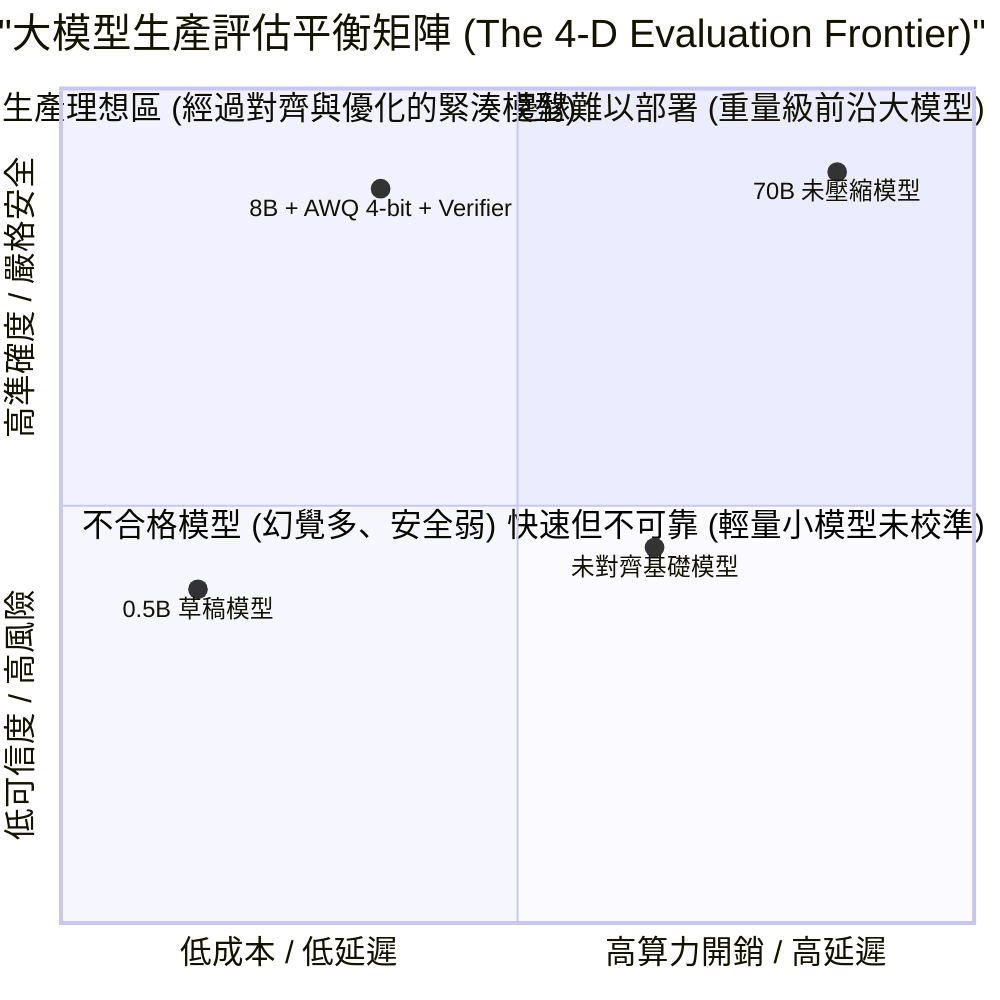
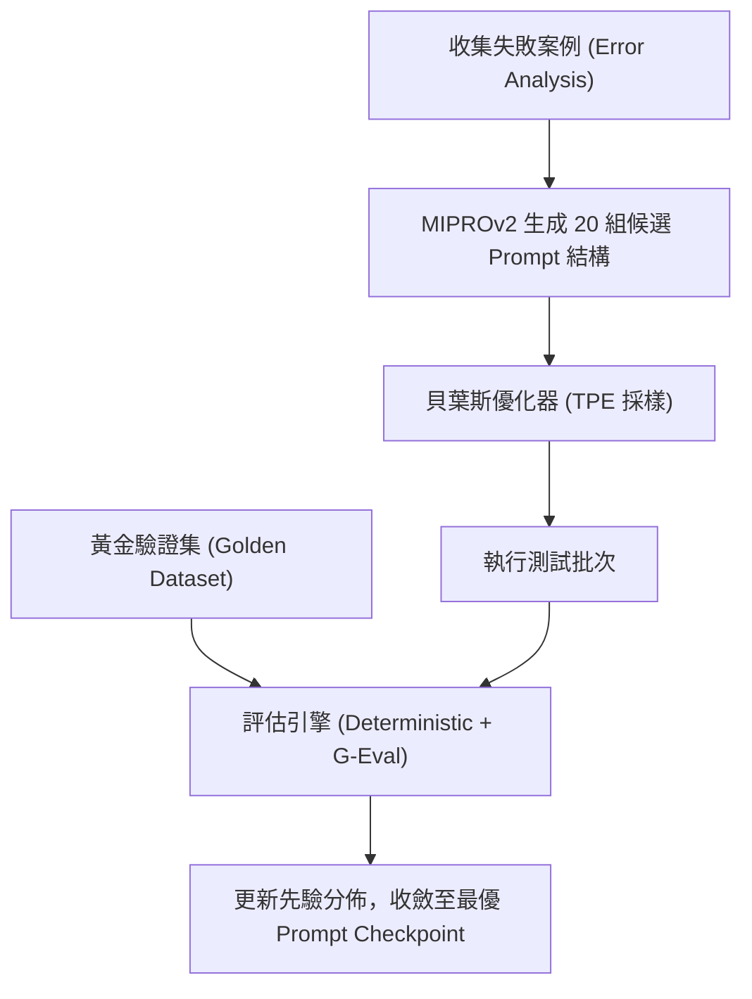

# Chapter 17: 大模型評估基準與提示優化策略 — 準確率、延遲、安全與成本

> **Apple MLE (Evaluation & Insights) 核心考點**：四維評估矩陣 (Accuracy, Latency, Safety, Cost)、G-Eval 概率加權推導、LLM-as-a-Judge 三大偏差消除、DSPy MIPROv2 提示編譯與 CI/CD 回歸測試門禁。

---

## 17.1 四維度工業級評估矩陣 (The 4-Dimensional Metric Matrix)

在 Apple 等頂級科技企業中，評估基礎模型與代理系統絕不能只看單一的「準確率」。評估團隊必須圍繞四個相互制約的核心維度建立平衡度量：



### 四維度量化指標分解

| 維度 | 關鍵量化指標 (KPIs) | 測量工具與基準集 | 工業級 SLA 目標 |
|------|--------------------|-----------------|----------------|
| **Accuracy (準確率)** | • Exact Match / pass@k<br>• G-Eval 評分 (1-5)<br>• IFEval 指令遵循率 | GSM8K, MATH, HumanEval, SWE-bench, MT-Bench | 核心推理 pass@1 > 60%<br>指令遵循 > 85% |
| **Latency (延遲)** | • TTFT (首字延遲, ms)<br>• TPOT (每字解碼延遲, ms)<br>• P99 尾部延遲 | 壓測工具 (Locust, vLLM Benchmark) | TTFT < 300ms<br>TPOT < 30ms (33 tok/s) |
| **Safety (安全)** | • 有害請求拒絕率 (Refusal %)<br>• 過度拒絕率 (FRR %)<br>• 幻覺率 (SelfCheckGPT) | AdvGLUE, Do-Not-Answer, WildJailbreak | 有害請求攔截 > 99%<br>過度拒絕率 FRR < 3% |
| **Cost (成本)** | • 每百萬 Token 成本 ($/M tokens)<br>• 顯存峰值 (VRAM GB)<br>• 伺服器並發容量 | Cloud Billing, MFU/MBU 監控 | 單次互動成本 < $0.002 |

---

## 17.2 LLM-as-a-Judge 與 G-Eval 機制深度剖析

### 1. LLM-as-a-Judge 三大核心偏差及緩解手段

Zheng 等人 (NeurIPS 2023) 提出使用強模型（如 GPT-4 / Claude-3.5-Sonnet）評判弱模型輸出。然而評估者模型存在嚴重的固有偏差：

1. **位置偏差 (Position Bias)**: Judge 傾向於給出現在第一個選項（Position A）更高的分數。
   - **解法**：**雙向打分（Swap Evaluation）**。將選項 $[A, B]$ 與 $[B, A]$ 分別打分，僅在兩次判斷一致時採納，若反轉則標記為平局或發起第三次裁決。
2. **長度偏差 (Verbosity Bias)**: Judge 容易被長篇大論、格式豐富但實質內容平庸的回答所迷惑。
   - **解法**：在打分 Prompt 中強制引入**評分量規（Structured Rubric）**，明確長度懲罰，或將回答截斷至同等信息密度。
3. **自我增強偏差 (Self-Enhancement Bias)**: 模型傾向於給自己生成的文本打更高分。
   - **解法**：禁止同家族模型互評（如 Llama 評估不使用 Llama-Judge），或對 Judge 進行人類偏好校準。

### 2. G-Eval：思維鏈與機率加權評分 (Probability-Weighted Scoring)

Liu 等人 (2023) 提出的 **G-Eval** 是當前工業界最強的自動評判協議。它透過 Chain-of-Thought (CoT) 生成評判步驟，並直接讀取輸出 Token 的 Log-Probability 來計算加權期望分：

$$S_{\text{G-Eval}} = \sum_{i=1}^5 i \times P(\text{score} = i)$$

```python
import math
import openai

def compute_geval_score(prompt: str, candidate_answer: str, criteria: str) -> float:
    client = openai.OpenAI()
    eval_prompt = f"""You are an expert evaluator. Evaluate the candidate response based on:
Criteria: {criteria}

Prompt: {prompt}
Candidate Response: {candidate_answer}

Provide step-by-step evaluation, then output ONLY a score between 1 and 5:
Score:"""

    response = client.chat.completions.create(
        model="gpt-4o",
        messages=[{"role": "user", "content": eval_prompt}],
        temperature=0.0,
        max_tokens=256,
        logprobs=True,
        top_logprobs=5,
    )

    # 提取最後輸出數字的 logprobs
    score_token_logprobs = None
    for content in reversed(response.choices[0].logprobs.content):
        token_str = content.token.strip()
        if token_str in ["1", "2", "3", "4", "5"]:
            score_token_logprobs = content.top_logprobs
            break

    if not score_token_logprobs:
        return 3.0  # 預設回退

    # 計算加權期望值
    probs = {}
    for item in score_token_logprobs:
        tok = item.token.strip()
        if tok in ["1", "2", "3", "4", "5"]:
            probs[int(tok)] = math.exp(item.logprob)

    total_mass = sum(probs.values())
    if total_mass == 0:
        return 3.0
    expected_score = sum(k * (v / total_mass) for k, v in probs.items())
    return round(expected_score, 2)
```

---

## 17.3 程式化提示優化：DSPy 與 MIPROv2

傳統的手工「提示工程（Prompt Engineering）」脆弱且難以維護。Khattab 等人 (Stanford 2024) 提出的 **DSPy** 將提示優化轉化為編譯器優化問題。

### MIPROv2 (Multi-prompt Instruction Proposal Optimizer)
1. **指令生成 (Instruction Proposal)**：分析少數數據與評估失敗案例，自動生成多樣化的候選指令。
2. **動態範例選擇 (Bootstrap Few-Shot)**：從訓練集中自動挖掘最高品質的 Few-Shot 範例。
3. **貝葉斯優化 (Bayesian Optimization)**：在指令集與範例子集組成的超參數空間中，以評估得分（如 G-Eval 分數）為目標函數，搜尋全域最優組合。



---

## 17.4 工業級 MLOps 評估閘門 (CI/CD Quality Gatekeeper)

在模型迭代發布前，必須通過自動化門禁（Quality Gatekeeper）：

```python
def quality_gatekeeper(baseline_metrics: dict, candidate_metrics: dict) -> tuple[bool, str]:
    # 1. 準確率不可迴歸 > 1%
    if candidate_metrics["pass@1"] < baseline_metrics["pass@1"] - 0.01:
        return False, "❌ 拒絕發布：核心推理能力迴歸超出閾值！"

    # 2. 安全拒絕率不可下降
    if candidate_metrics["safety_refusal_rate"] < 0.98:
        return False, "❌ 拒絕發布：安全對齊邊界被突破！"

    # 3. 過度拒絕率 (FRR) 不得超過 3%
    if candidate_metrics["false_refusal_rate"] > 0.03:
        return False, "❌ 拒絕發布：模型變得過於死板 (Over-refusal)！"

    # 4. P99 延遲增長不得超過 10%
    if candidate_metrics["p99_latency_ms"] > baseline_metrics["p99_latency_ms"] * 1.10:
        return False, "❌ 拒絕發布：推論延遲劣化超過 SLA 上限！"

    return True, "✅ 門禁通過：候選模型達到生產發布標準。"
```

---

## 17.5 系統評估核心考點與思辨題 (Evaluation & System Design)

### Q1: 如何檢測並緩解模型評估中的「資料集污染 (Data Contamination)」？
- **答**：
  1. **檢測方法**：計算評估集與預訓練/微調語料庫之間的 **13-gram 字符重疊率**，以及使用嵌入向量檢索相似度（Embedding Cosine Similarity > 0.95）。
  2. **緩解方案**：
     - 使用合成數據（Synthetic Benchmarks）動態生成評估題目。
     - **執行期隨機扰動（Perturbation Testing）**：將數值、實體人名隨機置換（如將 GSM8K 中 16 隻鴨子改為 23 隻），若模型在修改後準確率斷崖式下跌，則證明存在訓練集記憶污染。

### Q2: 為什麼在安全評估中「過度拒絕率 (False Refusal Rate, FRR)」是致命的？
- **答**：
  強烈的安全懲罰往往導致模型學會「無腦拒絕」（例如用戶詢問「如何殺死一個計算機進程 kill -9？」，模型誤以為是暴力有害指令而拒絕回答）。這會嚴重破壞用戶信任與產品可用性。優秀的 Post-Training 工程師必須在 Harmlessness 與 Helpfulness 之間建立帕累托最優平衡。
