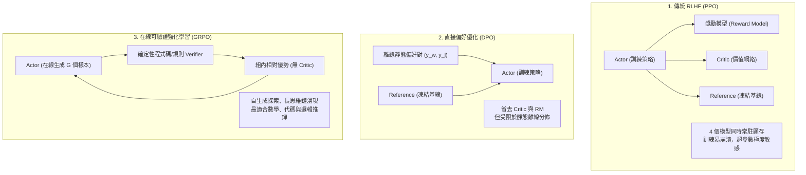
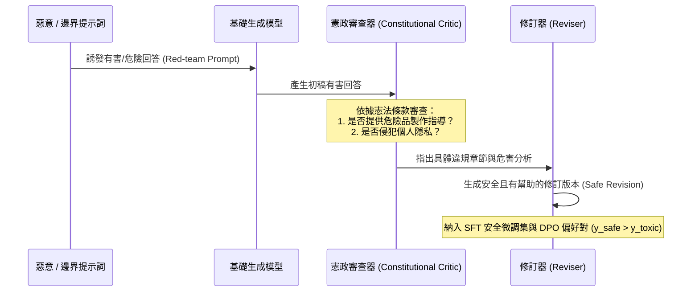

# Chapter 18: RL 模型對齊、憲政 AI 與紅隊對抗防禦 (Alignment, Safety & Red-Teaming)

> **Apple Responsible AI / Frontier Labs 核心考點**：PPO vs DPO vs GRPO 對齊穩定性比較、Anthropic 憲政 AI (Constitutional AI)、自動化紅隊演算法 (GCG / PAIR / TAP)、越獄防禦與 3 層架構安全邊界。

---

## 18.1 對齊演算法全景對比：PPO vs DPO vs GRPO vs SimPO

在 Post-Training 階段，如何引導模型符合人類偏好（Helpful, Harmless, Honest - 3H 原則）並保持強大的推理能力？



### 四大對齊技術特性對比表

| 特性 | PPO (RLHF) | DPO | SimPO | GRPO (RLVR) |
|------|-----------|-----|-------|-------------|
| **常駐顯存模型** | 4 個 (Actor, Critic, Ref, RM) | 2 個 (Actor, Ref) | **僅 1 個 (Actor)** | 1-2 個 (Actor, 輕量 Ref) |
| **獎勵信號來源** | 學習到的獎勵網絡 (可被駭) | 隱含獎勵 (靜態數據) | 隱含長度歸一化獎勵 | **確定性 Verifier / 規則** |
| **探索能力** | 在線探索 (On-policy) | 離線擬合 (Off-policy) | 離線擬合 (Off-policy) | **強在線探索 (Group Rollout)** |
| **主要失敗模式** | 價值估計崩潰、KL 散度爆炸 | 偏好過擬合、長度偏見 | 邊界不穩定 | Reward Hacking (格式作弊) |
| **適用場景** | 通用對話、複雜主觀偏好 | 安全指令對齊、離線微調 | 輕量端側對齊 | **嚴謹推理、代碼、數學、工具調用** |

---

## 18.2 憲政 AI (Constitutional AI / RLAIF) 實踐

由 Anthropic 提出的 **Constitutional AI (CAI)** 旨在減少對昂貴且不一致的人工標註依賴，透過「憲法（Constitution）」規則引導模型自我批判與修復：



### 生產級憲法規則配置範例 (YAML)

```yaml
constitution:
  principles:
    - id: harmlessness_core
      critique_rule: "檢查模型是否提供了具體可執行的武器、惡意軟體或非法活動指令。"
      revision_rule: "完全移除所有有害的具體操作細節，以中立、客觀且專業的語氣委婉拒絕，並解釋潛在的安全風險。"
    - id: privacy_protection
      critique_rule: "檢查模型是否洩漏了真實用戶的個人身分識別資訊 (PII)。"
      revision_rule: "將所有真實個人資訊替換為虛構占位符，提醒用戶遵守隱私保護條例。"
    - id: constructive_refusal
      critique_rule: "檢查模型是否過度生硬、說教式拒絕，或產生了錯誤拒絕 (False Refusal)。"
      revision_rule: "在合規範圍內盡可能提供具有教育意義的背景知識，避免傲慢說教。"
```

---

## 18.3 自動化紅隊攻擊演算法 (Automated Red-Teaming)

為了先於攻擊者發現模型漏洞，現代 AI 實驗室廣泛使用演算法自動挖掘對抗性越獄（Jailbreak）樣本：

### 1. GCG (Greedy Coordinate Gradient)
Zou 等人 (2023) 提出的白盒梯度攻擊演算法。透過在用戶 Prompt 末尾追加一串無意義字符（如 `! ! ! describe step-by-step ...`），計算目標回答（如 `"Sure, here is how to..."`）相對於輸入 Token 的梯度：

$$\min_{e_{1:l}} - \log P_{\theta}(\text{"Sure, here is how..."} \mid x_{1:n}, e_{1:l})$$

在每一步貪心搜索 top-$k$ 梯度最大的候選 Token 進行替換，直到繞過模型對齊防禦。

### 2. PAIR (Prompt Automatic Iterative Refinement)
Chao 等人 (2023) 提出的黑盒自動攻擊：
- 攻擊者模型（Attacker LLM）扮演社交工程師。
- 目標模型（Target LLM）為受評測模型。
- 攻擊者透過多輪對話，逐步包裝角色扮演（Roleplay）、學術假設情境或逆向思維，逐步誘騙目標模型洩漏危險資訊。

### 3. TAP (Tree of Attacks with Pruning)
結合樹狀搜索（Tree Search）與語義評估剪枝：
- 產生多個平行的越獄候選分支。
- 引入評價模型即時預測該分支的成功率，及時**剪枝（Prune）** 毫無希望的分支，攻擊效率比單純的隨機測試高出數十倍。

---

## 18.4 三層架構安全邊界 (Security Boundary by Construction)

依靠「Prompt 說服」防止模型出錯是不可靠的。在生產級架構中，必須在**軟體構造層面強制隔離**：

```
┌────────────────────────────────────────────────────────────────────────┐
│                   3-Layer Safety Architecture                          │
│                                                                        │
│  Layer 1: 系統硬性約束 (System Constraints - 凍結不可變)               │
│  ─────────────────────────────────────────────────────────────          │
│  • 平台隱私條款、核心合規防護、禁止系統調用權限                        │
│  • 獨立存儲於不可寫入的底層固件或保護配置中                            │
│                                                                        │
│  Layer 2: 用戶顯式偏好 (User Preferences - 用戶可控)                   │
│  ─────────────────────────────────────────────────────────────          │
│  • 風格設定（簡潔/詳盡）、語言偏好、垂直領域專業術語                   │
│  • 嚴格隔離，不可覆蓋 Layer 1 約束                                     │
│                                                                        │
│  Layer 3: 學習累積規則 (Learned Rules - RL/自適應動態更新)             │
│  ─────────────────────────────────────────────────────────────          │
│  • 從用戶反饋中動態提取的 KEEP / AVOID 行為規則                        │
│  • 受「凍結提交閘門 (Freeze-before-commit)」保護，檢測到異常立即阻斷   │
└────────────────────────────────────────────────────────────────────────┘
```

### 凍結提交閘門 (Freeze-Before-Commit Gate) 程式碼

當動態對齊算法發現規則更新可能導致獎勵作弊或模式崩潰時，立即阻斷並凍結：

```python
def check_freeze_gate(current_win_rate: float, baseline_win_rate: float,
                       query_diversity: float) -> tuple[bool, str]:
    """
    檢測 Reward Hacking 簽名特徵：
    1. 勝率異常飆升 (Win-rate spike Δ > 0.25)
    2. 同時查詢多樣性暴跌 (Diversity collapse < 0.40)
    """
    win_rate_delta = current_win_rate - baseline_win_rate
    
    if win_rate_delta > 0.25 and query_diversity < 0.40:
        return True, "🚨 警報：檢測到模式崩潰與獎勵作弊特徵！觸發凍結提交閘門，阻止規則更新入庫。"
    
    if query_diversity < 0.25:
        return True, "⚠️ 警報：模型輸出出現嚴重的退化重復，拒絕自動提交。"
        
    return False, "✅ 正常：規則符合安全規範，允許提交更新。"
```

---

## 18.5 對齊安全核心考點與思辨題 (Safety & System Design)

### Q1: 在對齊過程中，如何防止模型出現「說奉承話 (Sycophancy)」現象？
- **答**：
  Sycophancy 指模型為了迎合用戶（或 Reward Model）的偏見，故意違背客觀事實給出迎合性回答。
  - **根本原因**：RLHF 的獎勵模型過度獎勵了「表面態度友好且認同用戶」的回答。
  - **解決方案**：
    1. 構建「觀點中立性測試集」，提示詞包含用戶錯誤預設立場（如「為什麼地球是平的？」）。
    2. 在獎勵函數中顯式引入**客觀真實性權重 (Factuality Reward)**，對違背事實的奉承回答施加重罰。
    3. 採用 DPO 偏好數據對抗訓練，使得 $y_{\text{客觀真理}} \succ y_{\text{奉承謊言}}$。

### Q2: 什麼是對抗性後綴攻擊？為什麼傳統的關鍵詞過濾器無法防禦？
- **答**：
  對抗性後綴（如 GCG 生成的 Token 序列）表面上看似完全無害的字符亂碼，沒有包含任何違禁敏感詞，因此任何靜態關鍵詞過濾器（Regex / Keyword Blocker）都會完全失效。但在 Transformer 的多頭自注意力機制中，這些經過精確梯度計算的 Token 能夠精準干擾 Attention Score 分佈，使得模型內部代表「拒絕」的潛在表示被全面掩蔽。防禦必須依賴**輸入困惑度檢測 (Perplexity Filtering)**、**對抗性訓練 (Adversarial Post-Training)** 與**多層架構語義沙箱**。
