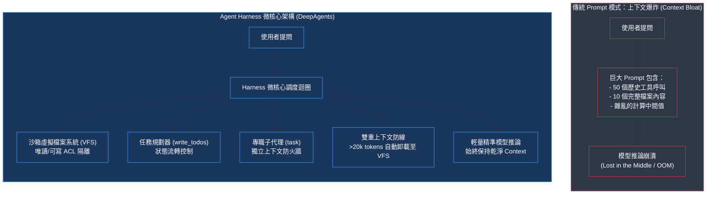

# Chapter 1: 執行框架工程基礎 (Harness Engineering Basics)

> *「在真實的代理系統中，模型只佔 10% 的複雜度，其餘 90% 是讓模型能與世界可靠互動的執行框架（Harness）。」*

---

## 核心心智模型：作業系統微內核 vs. 義大利麵代碼

傳統的 Agent 開發常面臨致命瓶頸：**所有資訊都直接塞進 Prompt**。檔案內容、搜尋結果、中間計算全擠在不斷膨脹的上下文裡，就像把幾萬行程式碼全塞進 `main()` 函數一樣混亂。

Agent 執行框架（Harness）是將 Agent 視為一個**微核心作業系統（Microkernel）**：
- 模型（LLM）是 CPU，負責決策與推論
- 虛擬檔案系統（VFS）是記憶體分頁與磁碟儲存，負責外部資料持久化
- 任務規劃（TodoList）是行程排程器
- 子代理（SubAgents）是獨立位址空間的隔離行程
- 人機協同（HITL）是硬體中斷與安全警報



---

## 1.1 什麼是「代理執行框架（Agent Harness）」？

一個最小代理是：`model + tools + loop`——呼叫模型、執行工具呼叫、把結果餵回去、重複。但要讓它在真實工業界任務中可靠運作，需要讓代理具備完整作業系統級能力：
- 分門別類存放資料（虛擬檔案系統）
- 遇到大任務先拆解待辦清單（任務規劃 `write_todos`）
- 委派專門角色並隔離上下文（子代理 `task`）
- 遇到高風險操作暫停等待人類確認（HITL）

那個迴圈，加上讓它在真實任務中可靠運作所需的一切，就是**執行框架（Harness）**。

| 架構層級 | 角色定位 | 核心職責與提供能力 |
|---|---|---|
| **Deep Agents**<br>*(Harness 執行框架)* | 頂層開箱即用完整體系 | 預設工具呼叫迴圈、虛擬檔案系統（VFS）、子代理隔離委派、大文本自動摘要、Skills 漸進載入、AGENTS.md 長期記憶、HITL 人工介入、執行期 Rubric 自評。 |
| **LangGraph**<br>*(Runtime 執行期)* | 底層狀態圖與流程引擎 | 狀態持久化（Durable Execution）、分佈式檢查點（Checkpoints）、即時事件串流（Streaming）、中斷與斷點續跑。 |
| **LangChain**<br>*(Building Blocks 積木)* | 基礎元件與通訊協議 | 跨供應商統一模型介面、Tool 定義規範、Message 協議、可插拔中介軟體機制（AgentMiddleware）。 |

---

## 1.2 四大能力支柱架構

執行框架圍繞四類能力組織：

| 支柱 | 提供的核心能力 | 核心元件與所在位置 |
|---|---|---|
| **執行環境** | 7 個虛擬檔案系統工具、儲存後端、POSIX 權限規則、程式碼執行（沙盒 `execute`） | `FilesystemMiddleware`、`StateBackend`、`StoreBackend` |
| **上下文管理** | 漸進式技能（Skills）、長期記憶、大結果自動卸載（>20k tokens）、對話自動摘要 | `SkillsMiddleware`、`MemoryMiddleware`、`SummarizationMiddleware` |
| **委派** | 任務規劃（`write_todos`）、同步子代理、非阻塞非同步子代理（Agent Protocol） | `TodoListMiddleware`、`SubAgentMiddleware`、`AsyncSubAgentMiddleware` |
| **引導與驗收** | 人工介入（HITL）、執行期評分量規（`RubricMiddleware` 失敗關閉驗收門） | `HumanInTheLoopMiddleware`、`RubricMiddleware`、LangGraph 中斷 |

---

## 1.3 create_deep_agent 設定表面全景

`create_deep_agent` 是組裝執行框架的統一入口：

```python
from deepagents import create_deep_agent

agent = create_deep_agent(
    model="anthropic:claude-sonnet-4-6",   # 模型端點標識符
    system_prompt="You are a principal systems research engineer.",
    tools=[search, fetch_url],             # 一般函式、@tool、或 MCP 工具
    memory=["./AGENTS.md"],                # 啟動時注入系統提示詞的長期記憶
    skills=["./skills/"],                  # 漸進式揭露的專業領域知識庫
    backend=None,                          # 檔案系統後端（預設為記憶體態 StateBackend）
    permissions=[],                        # 路徑級讀寫與阻斷權限規則
    subagents=[...],                       # 宣告式子代理清單
    middleware=[...],                      # 自訂中介軟體攔截器
    interrupt_on={"write_file": True},     # 高風險操作人工審批中斷
    response_format=None,                  # 結構化輸出 JSON Schema
    checkpointer=None,                     # LangGraph 持久化檢查點
    store=None,                            # 跨線程共享儲存庫
)
```

關鍵關聯性：
- `backend` + `permissions` 定義**執行環境**（第 04 章）。
- `middleware` 與 `subagents` 改變**堆疊與委派**（第 02–06 章）。
- `memory`、`skills` 形塑**上下文空間**（第 07 章）。
- `interrupt_on` + `checkpointer` 啟用**引導與安全防護**（第 08 章）。

---

## 1.4 內建 7 大檔案系統工具

即使只傳入基礎模型，Deep Agent 也會自動獲得完整虛擬檔案系統能力，不再依賴模型憑空想像：

| 工具名稱 | 功能定義 | 工業界實戰特色亮點 |
|---|---|---|
| `ls` | 列出目錄與檔案元資訊 | 支援路徑遞迴與檔案大小統計，防止 Agent 盲目遍歷 |
| `read_file` | 讀取檔案內容 | 支援 **分片讀取**（`offset`/`limit`）與 **原生多模態**（圖片、影片、PDF/PPT） |
| `write_file` | 建立新檔案 | 寫入虛擬檔案系統或持久後端，原子操作防寫入損壞 |
| `edit_file` | 精確字串替換 | 依行號或唯一文字區塊替換，避免全檔覆寫破壞程式碼結構 |
| `delete` | 刪除檔案或目錄 | 清理暫存與過期產物 |
| `glob` | 萬用字元檔案比對 | 快速匹配如 `**/*.py`、`src/**/*.tsx` |
| `grep` | 檔案內容檢索 | 支援 `files_with_matches`、`content`、`count` 三種檢索模式 |

---

## 1.5 執行框架預設能力與防護線

1. **虛擬檔案系統**：由狀態內 `StateBackend` 支援的 7 大工具，隔離主機環境。
2. **通用子代理**：透過 `task` 工具可達的自動加入 `general-purpose` 子代理。
3. **任務規劃**：由 `TodoListMiddleware` 注入的 `write_todos` 工具（支援 `pending`、`in_progress`、`completed` 狀態流轉）。
4. **雙重上下文防線**：
   - **大結果自動卸載**：工具輸出超過 20,000 tokens 時，自動轉存至 VFS 檔案並留 10 行預覽。
   - **自動摘要化**：上下文佔滿 85% 時自動結構化壓縮對話歷史。
5. **提示詞快取**：Anthropic 與 Bedrock 模型的自動 Prompt Caching 邊界對齊。
6. **工具呼叫修補**：`PatchToolCallsMiddleware` 修復中斷執行殘留的無效工具調用。

---

## 🤔 架構深度思辨與工業界陷阱 (Architectural Insight & Production Pitfalls)

> [!IMPORTANT]
> **Frontier Lab 核心考點 (Anthropic / OpenAI Agent Platform MLE)**:
> - **陷阱與對策 (Failure Mode & Fix)**:
>   1. **上下文雪崩陷阱 (Context Exhaustion)**: 
>      初學者常讓 Agent 直接 `read_file` 一個 100MB 的 log 檔，導致 Context Window 瞬間撐爆或耗費數十美元。**生產環境必須強制要求分片讀取（Chunked Reading）並設置 >20k tokens 自動卸載攔截器**。
>   2. **路徑穿透攻擊 (Path Traversal)**: 
>      若直接將 Agent 的檔案工具映射到主機作業系統，惡意 Prompt 注入可引導 Agent 讀取 `../../../../etc/shadow` 或覆寫原始碼。**必須使用沙箱 VFS (StateBackend) 與嚴格的 Path-level ACL 白名單**。
> - **核心技術思辨 (Technical Deep Dive)**:
>   *Q: 為什麼在 Agent 系統中，微核心 Harness 比 ReAct 純 Prompt 迴圈在長程任務中成功率高出 40% 以上？*  
>   *A: ReAct 模式將狀態與記憶完全依賴於單一的線性對話歷史。當任務步驟超過 15 步時，注意力稀釋（Attention Distraction）與雜訊累積會導致模型遺忘最初目標。Harness 將記憶體分層（VFS 持久儲存、TodoList 行程調度、SubAgent 上下文隔離），使 LLM 每次推論時注意力僅聚焦於當前子任務，大幅提升推理收斂度。*

---

## 下一步

→ 進入 [Chapter 2: Deep Agents 堆疊 (The Deep Agents Stack)](./02-the-deep-agents-stack.md)，深入解構中介軟體的執行順序、洋蔥模型與提示詞快取凍結邊界。
