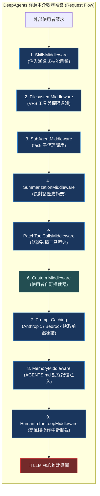

# Chapter 2: Deep Agents 堆疊 (The Deep Agents Stack)

> *「中介軟體堆疊的順序不是實作細節，而是定義了代理的生命週期、語意邊界與快取存活率。」*

---

## 核心心智模型：洋蔥防護盾與請求管線

在中介軟體架構中，執行迴圈被多層「洋蔥皮」層層包裹。每一個外部請求從外層穿透至最核心的 LLM，再由核心反向穿透各層回傳給使用者。

中介軟體的**排列順序**直接決定了系統行為：
- 為什麼 `SkillsMiddleware` 必須在 `FilesystemMiddleware` 之前？因為在檔案工具生效前，代理必須先知道技能目錄的中繼資料。
- 為什麼 `PatchToolCallsMiddleware` 必須在你的自訂中介軟體之前？因為你的中介軟體不應該處理格式破損的無效工具呼叫。
- 為什麼 `Prompt Caching` 必須盡量靠後，而 `MemoryMiddleware` 又必須在快取之後？因為動態記憶如果放在快取前面，每一次記憶變更都會摧毀快取前綴！



---

## 2.1 精簡堆疊與完整堆疊全景

當你呼叫 `create_deep_agent` 時，系統會根據傳入的參數動態編譯出執行堆疊。

### 精簡堆疊（僅傳入 model）
只有 `model`（沒有選用引數）時，主代理依序獲得基礎安全防護：
1. **`FilesystemMiddleware`**：提供 7 大檔案工具（`ls`、`read_file`、`write_file` 等）。
2. **`SubAgentMiddleware`**：提供 `task` 工具與預設通用子代理。
3. **`SummarizationMiddleware`**：當上下文變長時自動壓縮歷史。
4. **`PatchToolCallsMiddleware`**：修復歷史中殘留或無效的工具呼叫。
5. **提示詞快取**：Anthropic 與 Bedrock 的快取中介軟體。
6. **執行框架設定檔附加項**：供應商專屬過濾器。

### 完整堆疊（12 層精密管線）

| 順序 | 中介軟體名稱 | 注入時機 | 核心職責與設計哲學 |
|---|---|---|---|
| **1** | `SkillsMiddleware` | 傳入 `skills=` | 注入技能中繼資料在檔案系統**之前**，讓技能知識在工具執行前就可用 |
| **2** | `FilesystemMiddleware` | 永遠啟用 | 支援 `permissions` 強制執行與 VFS 讀寫 |
| **3** | `SubAgentMiddleware` | 至少一個同步子代理 | 提供 `task` 工具與隔離上下文 |
| **4** | `SummarizationMiddleware` | 永遠啟用 | 監控上下文長度，超標時觸發摘要 |
| **5** | `PatchToolCallsMiddleware` | 永遠啟用 | 修復中斷重啟後的壞死工具呼叫 |
| **6** | `AsyncSubAgentMiddleware` | 設定非同步子代理時 | 提供非阻塞式背景任務委派 |
| **7** | **自訂 `middleware=` 實例** | 傳入自訂中介軟體 | 攔截點位於 Patch 之後、Cache 之前 |
| **8** | 執行框架設定檔附加項 | 解析設定檔時 | 供應商專用轉換器 |
| **9** | 排除工具過濾器 | 由 Profile 驅動 | 拔除特定模型不支援的工具 |
| **10** | 提示詞快取 (Prompt Cache) | 永遠註冊 | 凍結長前綴以換取 90% 成本與延遲降低 |
| **11** | `MemoryMiddleware` | 傳入 `memory=` | 放在快取**之後**，動態記憶更新不摧毀快取前綴 |
| **12** | `HumanInTheLoopMiddleware` | 傳入 `interrupt_on=` | 位於最內層，在發出動作前執行人機審批 |

---

## 2.2 為什麼順序至關重要——三個架構範例

1. **技能在檔案系統之前**：  
   `SkillsMiddleware` 在 `FilesystemMiddleware` 提供代理讀取技能檔案所需的工具之前，先把技能位置與中繼資料注入提示詞。如果順序相反，代理可能會看到它還不知道怎麼用的工具。
2. **快取盡量靠後，記憶在快取之後**：  
   提示詞快取的運作方式是凍結請求的靜態長前綴。所有貢獻到前綴的東西（設定檔、自訂中介軟體、修補歷史）都必須在快取中介軟體**之前**執行。而 `MemoryMiddleware` 刻意放在快取**之後**，讓頻繁變更的熱記憶（Hot Memory）更新不會在每一輪都讓快取失效。
3. **Patch 在你的中介軟體之前**：  
   你的自訂中介軟體是在 Patch 修復了格式錯誤的歷史*之後*才攔截工具呼叫，確保自訂邏輯永遠不會遭遇崩潰的無效資料。

---

## 2.3 自訂中介軟體的合併與覆蓋語意

當傳入 `middleware=[...]` 給 `create_deep_agent` 時，每個實例會依其 **`.name`** 屬性智慧合併：

- 與**內建條目**（例如 `"FilesystemMiddleware"`）相符的 `.name` 會**原位取代它**。這是替換官方預設行為（例如換成自訂 S3 後端）的標準做法。
- **全新名稱**的中介軟體會被安插在插槽 7（`PatchToolCallsMiddleware` 之後、`Prompt Caching` 之前）。
- 順序會保持你在清單中傳入的相對先後順序。

```python
from langchain.agents.middleware import AgentMiddleware

class CustomSecurityGuard(AgentMiddleware):
    name = "CustomSecurityGuard"  # 獨有名稱：插入插槽 7

class CustomFilesystem(AgentMiddleware):
    name = "FilesystemMiddleware"  # 相同名稱：原位覆蓋預設 VFS
```

---

## 2.4 同步子代理堆疊與不可移除核心

子代理是主代理的輕量複本，但為了防止遞迴爆炸，子代理的堆疊經過裁剪：
- **沒有 `SubAgentMiddleware`**：子代理預設不能再委派子代理（防範遞迴死鎖）。
- **沒有 `TodoListMiddleware`**：子代理專注於單一目標，不拆解頂層 todo。
- **不可移除的鐵律**：`PatchToolCallsMiddleware` 與快取中介軟體是強制載入的，任何自訂覆蓋都不能繞過歷史修復。

---

## 🤔 架構深度思辨與工業界陷阱 (Architectural Insight & Production Pitfalls)

> [!IMPORTANT]
> **Frontier Lab 核心考點 (Cursor / Anthropic Tooling MLE)**:
> - **陷阱與對策 (Failure Mode & Fix)**:
>   1. **Prompt Cache 命中率崩潰**: 
>      工程師在系統提示詞中動態插入 `datetime.now()` 或即時 Token 計數，導致每次請求的 Prompt Prefix 均不相同，Prompt Caching 命中率直接從 95% 跌至 0%，Token 成本暴增 10 倍。**所有動態變更必須置於快取斷點（Cache Breakpoint）之後或轉為獨立 Message**。
>   2. **中介軟體原位覆蓋陷阱**: 
>      覆寫 `FilesystemMiddleware` 時忘記相容 7 大工具的 JSON 輸出規範，導致後續的 `SummarizationMiddleware` 無法正確解析工具回傳長度。**自訂中介軟體覆蓋內建元件時必須通過相容性測試套件**。
> - **核心技術思辨 (Technical Deep Dive)**:
>   *Q: 為什麼 LangGraph 的持久化檢查點（Checkpointer）必須與中介軟體堆疊解耦？*  
>   *A: 中介軟體處理的是單次請求/回應的生命週期攔截（In-flight transformation），而 Checkpointer 負責整個多輪對話圖狀態的時空快照（State persistence）。若將持久化綁死在中介軟體內部，一旦中介軟體拋出例外，將導致狀態保存不完整或資料庫交易鎖死。解耦確保了即使中介軟體失敗，執行期仍能回滾至上一個穩定 Checkpoint。*

---

## 下一步

→ 進入 [Chapter 3: 撰寫自訂中介軟體 (Custom Middleware)](./03-custom-middleware.md)，實戰 `@wrap_tool_call` 與 `AgentMiddleware` 子類別，掌握請求攔截與動態修補。
