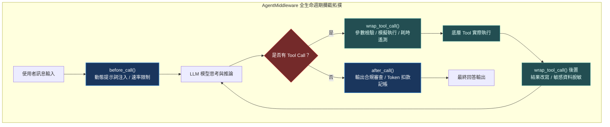

# Chapter 3: 撰寫自訂中介軟體 (Custom Middleware)

> *「好的架構讓核心邏輯保持乾淨，把橫切關注點交給中介軟體；攔截器是 Agent 的安全氣囊與黑盒子。」*

---

## 核心心智模型：機場安檢閘門與封包過濾器

中介軟體（Middleware）是 Agent 執行框架的擴充中樞。想像一個國際機場安檢通道：
- **`@wrap_tool_call`（行李 X 光機）**：只專注於檢查進出工具的參數與產物。如果參數包含高危指令，可直接短路報錯；若結果過大，可立即壓縮。
- **`AgentMiddleware`（全套海關海防系統）**：監控乘客登機的全生命週期。在模型產生念頭前（`before_call`）注入情資，在回應完成後（`after_call`）審查合規性，並在跨代理切換時同步通關紀錄。



---

## 3.1 風格 1：`@wrap_tool_call`——輕量級工具呼叫攔截

當你只需要在工具呼叫周圍加入記錄、計時或參數防護時，裝飾器風格最為精煉：

```python
from langchain.agents.middleware import wrap_tool_call
from langchain.tools import tool
from deepagents import create_deep_agent

call_count = [0]

@wrap_tool_call
def log_and_guard_tool(request, handler):
    """攔截並記錄每一次工具呼叫，同時實施安全防護。"""
    call_count[0] += 1
    tool_name = request.name
    print(f"🛡️ [Gatekeeper] 工具呼叫 #{call_count[0]}: {tool_name}")
    print(f"📦 引數內容: {request.args}")

    # 1. 快速失敗與短路（不呼叫 handler）
    if tool_name == "delete" and "/prod" in str(request.args):
        raise PermissionError("禁止對生產環境目錄執行刪除操作！")

    # 2. 執行底層工具
    result = handler(request)

    # 3. 檢查或改寫結果
    print(f"✅ 工具 #{call_count[0]} 執行完畢")
    return result

agent = create_deep_agent(
    model="anthropic:claude-sonnet-4-6",
    tools=[fetch_user_data],
    middleware=[log_and_guard_tool],
)
```

---

## 3.2 風格 2：`AgentMiddleware` 子類別——完整生命週期掛鉤

當需要橫跨模型推論、狀態管理與工具呼叫的全域能力時，必須繼承 `AgentMiddleware`：

```python
from typing import Any, Callable, Dict, List
from langchain.agents.middleware import AgentMiddleware
from langchain_core.messages import AIMessage, BaseMessage, SystemMessage

class ProductionAuditMiddleware(AgentMiddleware):
    name = "ProductionAuditMiddleware"

    def before_call(self, state: Dict[str, Any]) -> Dict[str, Any]:
        """在 LLM 生成前被呼叫：可動態注入系統提示詞或檢查上下文預算。"""
        messages = list(state.get("messages", []))
        # 動態注入環境上下文
        env_context = SystemMessage(content="[Security Rule: All database queries must limit to 100 records]")
        return {"messages": [env_context] + messages}

    def after_call(self, response: AIMessage, state: Dict[str, Any]) -> AIMessage:
        """在 LLM 完成推論後被呼叫：可審查輸出或標記指標。"""
        if "DROP TABLE" in response.content.upper():
            return AIMessage(content="[Security Alert: Dangerous SQL pattern detected and blocked.]")
        return response

    def wrap_tool_call(self, request: Any, handler: Callable[[Any], Any]) -> Any:
        """包裹工具呼叫本身。"""
        return handler(request)
```

---

## 3.3 中介軟體內部狀態變更與上下文傳遞

中介軟體可以維護私有狀態，但必須注意多執行緒環境下的執行緒安全性：
- 推薦將短期請求狀態儲存在 LangGraph 的 `state` 字典中。
- 長期統計資訊應透過外部 OTel 追蹤或專用 StoreClient 匯出。

---

## 🤔 架構深度思辨與工業界陷阱 (Architectural Insight & Production Pitfalls)

> [!IMPORTANT]
> **Frontier Lab 核心考點 (OpenAI / Anthropic Middleware MLE)**:
> - **陷阱與對策 (Failure Mode & Fix)**:
>   1. **非冪等重試引發重複副作用 (Double-Spend Bug)**: 
>      若在中介軟體中實作工具重試機制（Retry），當遇到網路短暫超時，重試呼叫 `pay_invoice` 或 `send_email` 會導致重複交易。**所有寫入類中介軟體必須包含唯一 Idempotency-Key，並由後端或中介軟體實施快取去重**。
>   2. **狀態字典無意覆寫 (State Overwrite Collision)**: 
>      在 `before_call` 中若直接對 `state["messages"]` 做 inplace `.append()`，會破壞 LangGraph 的不可變狀態檢查點機制。**永遠以不可變拷貝的方式返回新字典**。
> - **核心技術思辨 (Technical Deep Dive)**:
>   *Q: 為什麼在 Agent 系統中，日誌記錄與敏感資料遮罩（PII Redaction）必須在中介軟體層實作，而不是在每個 Tool 內部各寫一套？*  
>   *A: 這是標準的關注點分離（SoC）與縱深防禦原則。若在 Tool 內部實作，任何新加入的 Tool 或外部 MCP 工具都有遺漏防護的風險；將 PII 遮罩與稽核置於中介軟體層，能確保無論 Agent 調用何種工具、甚至未來動態載入第三方外掛，所有進出流量均能獲得 100% 強制一致的合規審查。*

---

## 下一步

→ 進入 [Chapter 4: 後端與權限機制 (Backends & Permissions)](./04-backends-and-permissions.md)，學習如何透過 StateBackend、StoreBackend 與路徑級 ACL 打造堅不可摧的沙箱環境。
