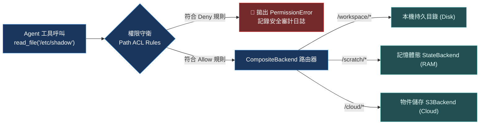

# Chapter 4: 後端與權限機制 (Backends & Permissions)

> *「給 Agent 終端機權限等於把伺服器鑰匙交給小偷；沙箱 VFS 是兼顧生產力與安全防護的唯一解法。」*

---

## 核心心智模型：容器沙箱與 POSIX 檔案描述符

在作業系統中，程式無法隨意寫入任意實體記憶體，必須透過虛擬記憶體與檔案描述符（File Descriptor）由核心代理存取。

Deep Agents 的儲存體系採用完全相同的沙箱哲學：
- **`StateBackend`（RAM Disk）**：存活在單次對話線程狀態圖中，速度極快、隨線程釋放，適合暫存中間結果。
- **`StoreBackend`（持久化 SSD）**：跨線程、跨使用者持久保存，支援長程工作記憶。
- **`CompositeBackend`（儲存路由器）**：將 `/workspace` 導向本機磁碟，將 `/scratch` 導向記憶體，將 `/archive` 導向 S3。
- **`FilesystemPermission`（POSIX 權限守衛）**：嚴格的路徑白名單，任何試圖跳出邊界的存取都會觸發 PermissionDenied。



---

## 4.1 內建儲存後端體系全景

| 後端類型 | 存續週期 | 儲存載體 | 適用情境 |
|---|---|---|---|
| **`StateBackend`** | 綁定單次執行緒 (Thread) | LangGraph 圖狀態記憶體 | 預設後端；暫存程式碼執行產物、中間資料轉換 |
| **`StoreBackend`** | 跨線程永久存續 | LangGraph BaseStore | 跨會話長期產物、使用者個人偏好文件 |
| **`FilesystemBackend`** | 本機作業系統生命週期 | 實體本機磁碟目錄 | 本機 CLI 工具、本機沙箱專案目錄 |
| **`CompositeBackend`** | 依掛載路由而定 | 混合式多後端掛載點 | 生產環境多級快取與儲存隔離 |

---

## 4.2 關鍵實踐：`CompositeBackend` 混合路由

在生產環境中，我們絕不將整個主機檔案系統暴露給 Agent，而是採用掛載點（Mount Points）架構：

```python
from deepagents import create_deep_agent
from deepagents.backends import CompositeBackend, FilesystemBackend, StateBackend

backend = CompositeBackend(
    default=StateBackend(),  # 未匹配路徑預設落在安全的記憶體沙箱
    mounts={
        "/workspace": FilesystemBackend(root_dir="/safe/sandbox/project"),
        "/tmp": StateBackend(),
    }
)
```

---

## 4.3 權限守衛（Permissions）與路徑級 ACL

單純限制目錄還不夠，必須對路徑實施微粒度的行為控制：

```python
from deepagents.permissions import FilesystemPermission

permissions = [
    # 允許在 workspace 進行讀寫
    FilesystemPermission(path="/workspace", read=True, write=True),
    # 唯讀參考資料目錄
    FilesystemPermission(path="/workspace/reference", read=True, write=False),
    # 嚴格禁止碰觸任何隱藏設定檔與金鑰
    FilesystemPermission(path="/workspace/.env*", read=False, write=False),
]

agent = create_deep_agent(
    model="anthropic:claude-sonnet-4-6",
    backend=backend,
    permissions=permissions,
)
```

---

## 4.4 沙盒後端矩陣 (Docker / Modal / E2B)

針對任意程式碼執行（Code Execution），純 VFS 無法防禦惡意 CPU 消耗或 Fork 炸彈。DeepAgents 支援無縫橋接容器沙盒：
- **DockerSandboxBackend**：本機隔離容器
- **E2BSandboxBackend**：雲端輕量級秒級安全沙盒
- **ModalSandboxBackend**：大規模無伺服器 GPU 執行

---

## 🤔 架構深度思辨與工業界陷阱 (Architectural Insight & Production Pitfalls)

> [!IMPORTANT]
> **Frontier Lab 核心考點 (Security & Infrastructure MLE)**:
> - **陷阱與對策 (Failure Mode & Fix)**:
>   1. **符號連結逃逸攻擊 (Symlink Escape)**: 
>      惡意程式碼在 `/workspace` 內建立一個軟連結 `ln -s /etc/passwd leaked.txt`，隨後 Agent 呼叫 `read_file("/workspace/leaked.txt")` 繞過路徑檢查。**VFS 權限解析必須在呼叫 `os.path.realpath()` 解析所有符號連結後再比對 ACL 白名單**。
>   2. **狀態庫膨脹崩潰 (Checkpoint Explosion)**: 
>      若使用 `StateBackend` 讓 Agent 寫入大型二進位檔案（如 50MB 測試資料集），該檔案會被連帶序列化進每一次 LangGraph Checkpoint，導致 PostgreSQL / Redis 儲存庫在 5 輪對話後爆滿。**大檔案必須強制上傳外部物件儲存（S3），VFS 僅保留 URL 與中繼資料指標**。
> - **核心技術思辨 (Technical Deep Dive)**:
>   *Q: 為什麼說純粹的 Docker 沙盒無法完全取代 Agent Harness 的 VFS 權限機制？*  
>   *A: Docker 提供的是作業系統層的虛擬化隔離，但對 LLM 而言缺乏語意感知。例如在專案目錄中，我們希望 Agent 能夠修改程式碼，但不能刪除 `.git` 或讀取包含金鑰的 `.env`。Docker 只能做粗粒度的磁碟掛載，若無 Harness 層的 Path-level ACL，Agent 仍可能在容器內造成不可逆的代碼損壞或密鑰外洩。兩者是縱深防禦的互補關係。*

---

## 下一步

→ 進入 [Chapter 5: 執行框架設定檔 (Harness Profiles)](./05-harness-profiles.md)，探索如何針對不同模型供應商（Claude / GPT-4o / DeepSeek）自適應調整系統提示詞與工具排除規則。
