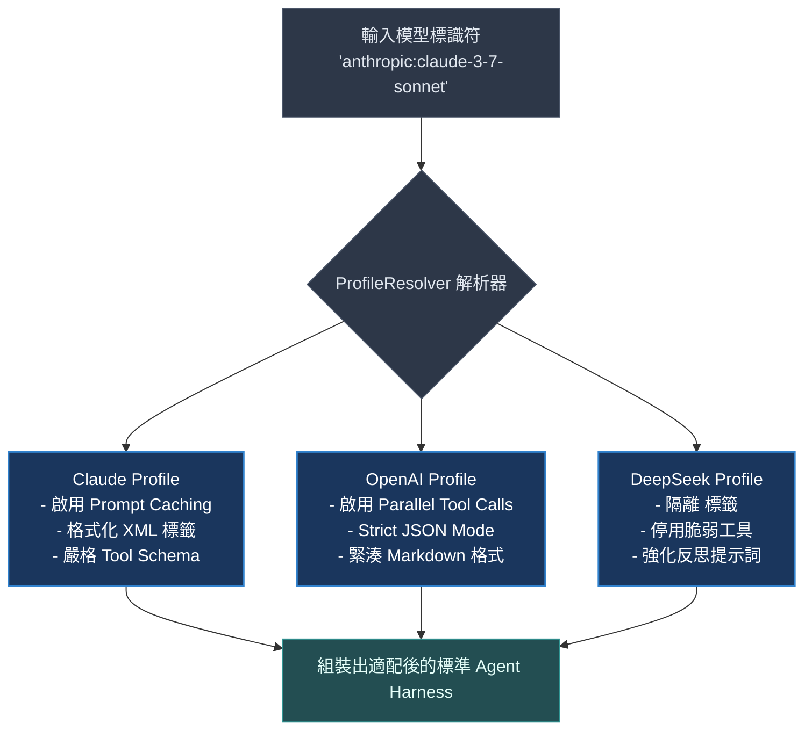

# Chapter 5: 執行框架設定檔 (Harness Profiles)

> *「沒有放之四海皆準的模型參數；執行框架必須像變頻器一樣，精準適配不同供應商的底層特性。」*

---

## 核心心智模型：自適應變頻器與硬體抽象層

在作業系統中，同一份 Linux 核心可以透過硬體抽象層（HAL）同時驅動 Intel x86、ARM64 與 RISC-V 晶片。

在 AI 代理世界中，不同供應商的模型具有鮮明的「個性」：
- **Claude 3.7**：天生具備強大的思考標籤（Thinking Tags）與長上下文架構，對工具格式極度嚴謹。
- **GPT-4o**：平行工具調用（Parallel Tool Calling）極為激進，但有時會遺漏細緻的格式約束。
- **DeepSeek-V3 / R1**：擅長長思維鏈，但對特定英文字串替換工具容易產生脫靶。

執行框架設定檔（Harness Profile）就是 Agent 的硬體抽象層：它動態調整提示詞拼裝規則、工具清單與中介軟體附加項，讓上層應用程式邏輯無需為特定模型重寫。



---

## 5.1 設定檔控制什麼

設定檔在執行期動態控制五大核心維度：

1. **系統提示詞前綴與後綴**：依模型能力修剪說明文字，避免弱模型理解困難或強模型注意力被雜訊稀釋。
2. **中介軟體附加項 (Middleware Append)**：例如為 Anthropic 注入快取前綴，為本地模型注入格式正則修補器。
3. **工具排除 (Tool Exclusion)**：移除當前模型無法穩定調用的複雜工具。
4. **子代理行為**：決定通用子代理（GP SubAgent）的系統提示詞是否需要覆寫。
5. **最大上下文閾值**：針對不同模型的視窗大小自動設置摘要觸發點（85% 滿載）。

---

## 5.2 系統提示詞組裝順序

Deep Agents 的最終 System Prompt 具有極為精確的組裝公式：

$$	ext{Final Prompt} = 	ext{Profile Prefix} \oplus 	ext{User System Prompt} \oplus 	ext{Memory (AGENTS.md)} \oplus 	ext{Skills Catalog} \oplus 	ext{Profile Suffix}$$

這個順序保證了：
- 供應商基礎規則永遠在最頂部奠定基準
- 使用者的自訂業務邏輯居中主導
- 記憶與技能提供精確上下文支撐
- 格式收尾防護（Suffix）鎖定最終輸出規則

---

## 5.3 自訂模型設定檔實戰

```python
from deepagents.profiles import HarnessProfile, register_profile

custom_profile = HarnessProfile(
    name="my-custom-qwen",
    model_pattern=r"^qwen/.*",
    system_prompt_prefix="你是具備極高精確度的系統工程師。請嚴格依循步驟思考。",
    exclude_tools=["edit_file"],  # 排除對 Qwen 而言過於複雜的字串原地替換工具
    append_middleware=[QwenFormatPatcher()],
    max_context_tokens=32768,
)

register_profile(custom_profile)
```

---

## 🤔 架構深度思辨與工業界陷阱 (Architectural Insight & Production Pitfalls)

> [!IMPORTANT]
> **Frontier Lab 核心考點 (Multi-Provider Model Gateway MLE)**:
> - **陷阱與對策 (Failure Mode & Fix)**:
>   1. **思維鏈洩漏污染對話歷史 (CoT Leakage)**: 
>      DeepSeek-R1 或 Claude 3.7 Thinking 輸出的 `<think>...</think>` 內容，若直接作為普通對話記錄回存在歷史中，後續輪次會將先前的思考視為使用者輸入，引發嚴重的格式幻覺。**Profile 必須配置專門的思考標籤剝離中介軟體（Thinking Stripper），確保對話歷史純淨**。
>   2. **平行工具呼叫競爭崩潰 (Parallel Tool Race)**: 
>      GPT-4o 預設同時發出 5 個工具呼叫（例如同時寫入同一個檔案），導致檔案系統鎖死。**在針對 OpenAI 的 Profile 中，必須配置序列化鎖或停用平行工具調用旗標**。
> - **核心技術思辨 (Technical Deep Dive)**:
>   *Q: 為什麼企業級 Agent 平台強烈反對在程式碼中寫死（Hardcode）模型專屬 Prompt，而堅持使用動態 Profile 機制？*  
>   *A: 現代基礎模型更新迭代極為迅速（通常 3–6 個月更替一代）。若將提示詞與工具調用邏輯硬編碼在業務邏輯中，每當更換底層模型或進行 A/B 測試時，工程團隊必須全面重構業務代碼並冒著回歸破壞的風險。透過動態 Profile 機制，更換模型只需切換適配層設定檔，核心業務與工具鏈實現 100% 零侵入解耦。*

---

## 下一步

→ 進入 [Chapter 6: 子代理與委派 (Subagents & Delegation)](./06-subagents-and-delegation.md)，學習如何透過企業級組織分工與上下文資訊防火牆，駕馭複雜多代理系統。
