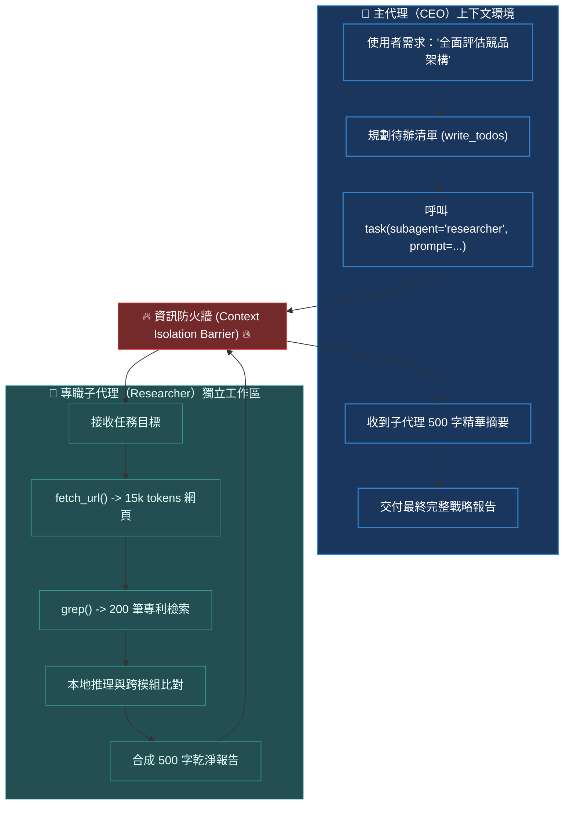

# Chapter 6: 子代理與委派 (Subagents & Delegation)

> *「單一 Agent 無法既當 CEO 又寫底層驅動程式；專業分工與嚴格的上下文隔離，是突破長任務複雜度天花板的唯一解法。」*

---

## 核心心智模型：企業組織架構與資訊防火牆

試想一家跨國企業：CEO 不會親自去資料庫爬取 10,000 筆原始 log，也不會親自閱讀每一篇技術專利。
- CEO（主代理）專注於高階戰略規劃與任務分解。
- 專職分析師（子代理）在**完全隔離的工作室（獨立上下文環境）**中處理海量原始資料，最後只向 CEO 提交一份 **500 字的精煉結論報告**。

這就是**上下文隔離（Context Quarantine）**的本質：透過為子代理建立獨立的對話歷史，子代理在探索過程中產生的數十個工具呼叫與幾萬個中間 Token，**永遠不會污染主代理的上下文視窗**！



---

## 6.1 上下文隔離原理與數學收益

在複雜任務中，若單一代理執行 $N = 30$ 個步驟，每一步產生平均 $L = 2000$ tokens 的工具輸出，累積的上下文長度為：

$$	ext{Context}_{	ext{monolithic}} = \sum_{i=1}^N i \cdot L pprox rac{N^2 \cdot L}{2} pprox 900,000 	ext{ tokens (直接 OOM 崩潰)}$$

透過將任務委派給 $K=3$ 個子代理，主代理只接收精煉後的報告 $R pprox 500$ tokens：

$$	ext{Context}_{	ext{main}} = N_{	ext{main}} \cdot L_{	ext{main}} + K \cdot R \ll 30,000 	ext{ tokens}$$

**Token 消耗與推理雜訊直接下降 95% 以上**，完全消除了「迷失在中間（Lost in the Middle）」效應。

---

## 6.2 `task` 工具與通用子代理 (General-Purpose Subagent)

Deep Agents 預設啟用通用子代理。主代理隨時可以呼叫內建的 `task` 工具，將耗費 Token 的耗時運算丟給它：

```python
from deepagents import create_deep_agent

agent = create_deep_agent(
    model="anthropic:claude-sonnet-4-6",
    # 預設自動註冊 task 工具與 general-purpose 子代理
)
```

當主代理呼叫：
```json
{
  "name": "task",
  "arguments": {
    "description": "深入檢索論文庫並整理 3 篇關於 DPO 的代表性文獻摘要"
  }
}
```
執行框架會自動建立獨立的 LangGraph 狀態分支，執行完畢後僅將結果字串回傳主迴圈。

---

## 6.3 宣告式專職子代理 (Declarative SubAgents)

針對高度專業化的領域（例如程式碼審查、法律審計、紅隊安全），我們可以宣告具備專屬模型、系統提示詞與專用工具的子代理：

```python
from deepagents import create_deep_agent

code_reviewer = {
    "name": "code_reviewer",
    "description": "專門負責靜態代碼安全審查與 PEP8 風格檢查的專家代理",
    "system_prompt": "你是一名精通資安與靜態分析的首席架構師。請嚴格依據 OWASP Top 10 進行審計。",
    "tools": [run_linter, run_bandit],
    "model": "anthropic:claude-sonnet-4-6",
}

agent = create_deep_agent(
    model="anthropic:claude-sonnet-4-6",
    subagents=[code_reviewer],
)
```

---

## 6.4 雙向檔案系統共享與狀態隔離

子代理與主代理雖然上下文（對話歷史）嚴格隔離，但共享同一個底層**虛擬檔案系統（VFS）**：
1. 主代理在 `/workspace/data.csv` 寫入原始資料。
2. 主代理呼叫子代理處理該檔案。
3. 子代理讀取 `/workspace/data.csv`，將龐大的分析矩陣寫入 `/workspace/analysis_result.json`。
4. 子代理只向主代理回傳：「分析完成，結果已寫入 `/workspace/analysis_result.json`，核心指標提升 12.4%」。

這種「**指標傳遞而非資料複製（Pass-by-Reference）**」的模式，是現代工業級 Agent 系統的標準架構範式。

---

## 🤔 架構深度思辨與工業界陷阱 (Architectural Insight & Production Pitfalls)

> [!IMPORTANT]
> **Frontier Lab 核心考點 (Cursor / Anthropic Multi-Agent MLE)**:
> - **陷阱與對策 (Failure Mode & Fix)**:
>   1. **遞迴委派死鎖與 Token 黑洞 (Delegation Cycle)**: 
>      主代理委派任務給子代理 A，A 認為任務需要進一步分析而委派給 B，B 又委派給 A，導致陷入無限委派循環並引發百萬 Token 暴增。**在子代理堆疊中嚴格拔除 `SubAgentMiddleware`，強行限制最大委派深度（Depth Limit = 1）**。
>   2. **子代理幻覺驗證缺失**: 
>      子代理產生的報告可能包含幻覺，主代理若無條件信任將導致錯誤級聯（Cascading Failure）。**主代理在收斂結論時，必須調用確定性斷言工具比對 VFS 產物的真實雜湊值與結構**。
> - **核心技術思辨 (Technical Deep Dive)**:
>   *Q: 為什麼說透過檔案系統共享狀態（Shared VFS）比透過 Prompt JSON 傳遞長資料在架構上更健全？*  
>   *A: 1. 消除 Context 消耗：在 Prompt 中傳遞巨型 JSON 會佔用寶貴的 Context Window，且模型容易在長 JSON 解析中出現括號不匹配或截斷錯誤；2. 持久化與可審計性：VFS 產物保存在磁碟或物件儲存中，具備版本快照能力，支援離線重放與人工審核；3. 類型安全：檔案可以是二進位、Parquet 或多模態格式，打破了純文本傳遞的限制。*

---

## 下一步

→ 進入 [Chapter 7: 上下文管理 (Context Management)](./07-context-management.md)，學習長文本自動卸載（>20k tokens）、動態 Skills 漸進式注入與長期記憶架構。
