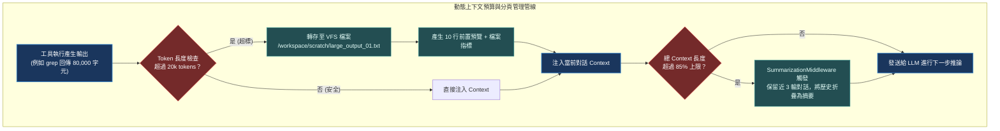

# Chapter 7: 上下文管理 (Context Management)

> *「有限的上下文視窗是 Agent 最昂貴的稀缺資源；優秀的架構師像設計虛擬記憶體分頁系統一樣管理每一枚 Token。」*

---

## 核心心智模型：虛擬記憶體分頁交換 (Swap Space & Dynamic Offloading)

在電腦作業系統中，實體記憶體（RAM）容量有限。當程式請求過多資料時，OS 會觸發**分頁交換（Paging / Swap）**：將暫時不用的記憶體區塊換出至硬碟（Swap Space），只在核心保留指標與頁表。

Deep Agents 的上下文管理採用完全對應的機制：
- **動態技能目錄（Skills）**：啟動時只向系統提示詞注入 1 行綱要（Name + Description），只有當 Agent 真正決定使用該技能時，才從 VFS 讀取完整的 `SKILL.md`（按需載入 / Lazy Loading）。
- **超大工具輸出自動卸載（Offloading）**：當任何 Tool 產出超過 20,000 tokens 時，中介軟體自動將完整內容存為 VFS 檔案，只給模型回傳 10 行文字預覽與檔案路徑。
- **對話歷史自動摘要（Summarization）**：當視窗佔滿 85% 時，自動將前半段歷史壓縮為結構化摘要，騰出空間給後續推理。



---

## 7.1 上下文的五個來源與權重分配

在 Deep Agents 中，進入模型推論的 Prompt 由五個精確維度構成：

1. **System Prompt & Profiles**：不可動搖的最高憲章（~500 tokens）。
2. **長期記憶 (`memory=["AGENTS.md"]`)**：使用者專案規範與跨會話偏好（~1,000 tokens）。
3. **動態技能綱要 (`skills=["./skills/"]`)**：精簡的技能目錄清單（每個技能約 30 tokens）。
4. **近期對話歷史 (Recent Messages)**：完整的 User/Assistant 互動（滾動保留近 3–5 輪）。
5. **歷史結構化摘要 (Summary Node)**：早期對話的高密縮影。

---

## 7.2 漸進式技能揭露 (Progressive Disclosure Skills)

千萬不要把 50 個外掛的完整說明書全塞進 Prompt！這會造成注意力稀釋並大幅增加成本。

Deep Agents 採用 **漸進式揭露（Progressive Disclosure）**：
1. **目錄階段**：啟動時，`SkillsMiddleware` 只讀取各技能目錄的 Frontmatter（`name` 與 `description`），以一行摘要注入 System Prompt。
2. **激活階段**：模型判斷當前任務需要使用 `notion-sync` 技能，模型自主呼叫 `read_file("/skills/notion-sync/SKILL.md")`。
3. **執行階段**：模型按手冊指示執行腳本，任務完成後技能正文隨對話滾動自然移出視窗，零長期負擔。

---

## 7.3 大結果自動卸載機制代碼實現

```python
from langchain.agents.middleware import wrap_tool_call

LARGE_OUTPUT_THRESHOLD = 20000  # 字元閾值

@wrap_tool_call
def auto_offload_large_output(request, handler):
    result = handler(request)
    text = str(result)
    
    if len(text) > LARGE_OUTPUT_THRESHOLD:
        file_path = f"/scratch/offload_{request.name}.txt"
        # 寫入 VFS 虛擬檔案系統
        request.state["vfs"].write(file_path, text)
        
        preview = "\n".join(text.splitlines()[:10])
        return (
            f"[自動卸載警報] 輸出長度達 {len(text)} 字元，已自動存為檔案：{file_path}。\n"
            f"以下為前 10 行預覽：\n{preview}\n"
            f"提示：請使用 grep 或 read_file(offset, limit) 針對性檢索。"
        )
    return result
```

---

## 🤔 架構深度思辨與工業界陷阱 (Architectural Insight & Production Pitfalls)

> [!IMPORTANT]
> **Frontier Lab 核心考點 (Anthropic / OpenAI Context Architecture MLE)**:
> - **陷阱與對策 (Failure Mode & Fix)**:
>   1. **Lost in the Middle 致命檢索盲區**: 
>      研究表明，當 Context 超過 32k 時，LLM 對位於文本中間（40%–70% 位置）的指令與細節檢索率會暴跌 50% 以上。**必須將高優先級系統約束置於兩端（System Prompt 頭部與 User Prompt 尾部），中間長資料必須靠 VFS 卸載保持乾淨**。
>   2. **摘要失真引發不可逆遺忘 (Lossy Compression Drift)**: 
>      對話摘要若由弱模型生成，很容易丟失精確的變數名稱、檔案路徑或關鍵錯誤訊息。**摘要生成時必須使用結構化 Pydantic Schema，明確約束提取 Entities、File Paths 與 Unresolved Tasks**。
> - **核心技術思辨 (Technical Deep Dive)**:
>   *Q: 為什麼 Anthropic 的 Prompt Caching 機制對上下文管理中介軟體的設計提出了苛刻要求？*  
>   *A: Prompt Caching 依賴完全一致的前綴 Token 序列（Exact Prefix Match）。如果在前綴中插入了動態時鐘、隨機 UUID、或非固定順序的 Tool Schema，只要有 1 個 Token 發生改變，整個後續快取全部失效。因此，上下文管理中介軟體必須確保靜態部分（System Prompt、Skills、Tools）永遠在前且位元組級凍結，動態變更（Memory、Messages）嚴格置於快取標記點（Cache Checkpoint）之後。*

---

## 下一步

→ 進入 [Chapter 8: 方向掌控：人工介入 (Human-in-the-Loop)](./08-human-in-the-loop.md)，學習如何設置中斷審批、手動狀態覆寫與 LangGraph 檢查點恢復。
