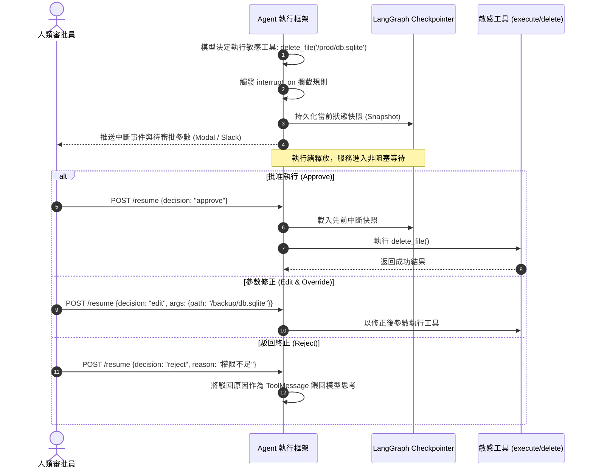

# Chapter 8: 方向掌控：人工介入 (Human-in-the-Loop)

> *「自動駕駛不是完全不管駕駛員；高風險操作時的精確中斷與授權，是自主代理走向生產落地的生命線。」*

---

## 核心心智模型：駕駛艙警報中斷與斷點續跑

想像客機自動巡航系統：平時它平穩地調整機翼與高度；但一旦雷達偵測到強烈亂流、或系統準備執行放油或緊急迫降時，自動駕駛會立即發出警報並將控制權交還給機長。

在 Deep Agents 中，人工介入（HITL, Human-in-the-Loop）並不是簡單的 `input()` 阻塞呼叫，而是建構在 **LangGraph 分布式狀態機中斷（Interrupt & Resume）** 之上：
1. **中斷暫停**：當模型試圖執行被列入高風險白名單的動作（如 `delete_database`、`send_transfer`、`push_production`）時，執行迴圈被安全掛起。
2. **快照保存**：當前的圖狀態、變數與上下文被原子化序列化至外部 Checkpointer（Redis / PostgreSQL）。
3. **非同步審批**：通知透過 Slack、Webhooks 或前端 Modal 推送給人類管理員，伺服器執行緒釋放，零資源空轉。
4. **手動覆寫與續跑**：人類可以選擇「批准」、「駁回修改參數」、甚至「直接覆寫狀態」，隨後 Agent 從精確的斷點瞬間恢復執行。



---

## 8.1 啟用中斷：`interrupt_on` 宣告式配置

在 `create_deep_agent` 中，只需宣告字典即可啟用人機協同：

```python
from deepagents import create_deep_agent

agent = create_deep_agent(
    model="anthropic:claude-sonnet-4-6",
    tools=[search, write_file, execute_sql],
    # 在執行寫檔或 SQL 前強制暫停等待人工確認
    interrupt_on={
        "write_file": True,
        "execute_sql": True,
    },
    checkpointer=memory_checkpointer,  # 必須配置檢查點以支援狀態暫停與恢復
)
```

---

## 8.2 四種人機裁決決策模式

當 Agent 中斷後，人類審查員可以發出四種裁決信號：

| 裁決指令 | 語意行為 | 適用場景 |
|---|---|---|
| **`approve`** | 原樣批准，繼續執行底層工具呼叫 | 參數安全合規，符合預期 |
| **`edit`** | 修改工具呼叫參數後再執行 | Agent 路徑寫錯或參數輕微偏離 |
| **`reject`** | 阻止工具執行，將拒絕原因餵給模型讓其重新規劃 | 動作危險或業務邏輯不符 |
| **`override`** | 跳過工具執行，直接提供假造的回傳結果 | 人類已在外部系統手動完成該操作 |

---

## 8.3 檢查點恢復程式碼實戰

```python
# 1. 執行至中斷點
config = {"configurable": {"thread_id": "thread-123"}}
for event in agent.stream({"messages": [("user", "請刪除舊的測試日誌")]}, config):
    print(event)

# 檢查當前狀態是否中斷
state = agent.get_state(config)
if state.next:
    print(f"⚠️ 代理在中斷點暫停，等待執行：{state.next}")

# 2. 人類確認後恢復執行
from langgraph.types import Command

agent.invoke(
    Command(resume={"action": "approve"}),
    config=config
)
```

---

## 🤔 架構深度思辨與工業界陷阱 (Architectural Insight & Production Pitfalls)

> [!IMPORTANT]
> **Frontier Lab 核心考點 (Enterprise Agent Systems MLE)**:
> - **陷阱與對策 (Failure Mode & Fix)**:
>   1. **中斷狀態懸空 (Hanging Thread Leak)**: 
>      使用者發起任務後觸發 HITL 中斷，但使用者關閉了瀏覽器，導致幾萬個線程長期懸掛在資料庫中。**必須在中介軟體中實施 TTL 超時自動終止（Timeout Expiry），超時自動判定為 `reject` 並清理資源**。
>   2. **重放攻擊與非冪等審批 (Idempotency Replay)**: 
>      Web 前端因網路波動重複發送兩次 `POST /resume`，導致已執行的寫檔動作被重複觸發兩次。**審批請求必須帶入先前中斷事件的唯一 `checkpoint_id`，確保狀態只消費一次**。
> - **核心技術思辨 (Technical Deep Dive)**:
>   *Q: 為什麼基於 LangGraph Command 的狀態中斷，比在 Python 程式碼中使用同步阻塞鎖（Threading Lock / Semaphore）更適合分散式微服務？*  
>   *A: 同步阻塞鎖將執行緒強行鎖定在單一伺服器記憶體中，無法水平擴展：1. 一旦伺服器重啟或崩潰，所有進行中的任務與上下文立即永久丟失；2. 長時間阻塞會耗盡 Web 伺服器的連線池（Connection Pool Starvation）。LangGraph 將中斷序列化為可跨進程存取的 Checkpoint，審批請求可以落在叢集中的任意節點上重啟執行，是雲原生分散式系統的唯一解法。*

---

## 下一步

→ 進入 [Chapter 9: 整合應用 (Putting It Together)](./09-putting-it-together.md)，串接 VFS、動態 Skills、專職子代理與 HITL，組裝具備生產級強度的深度研究代理。
