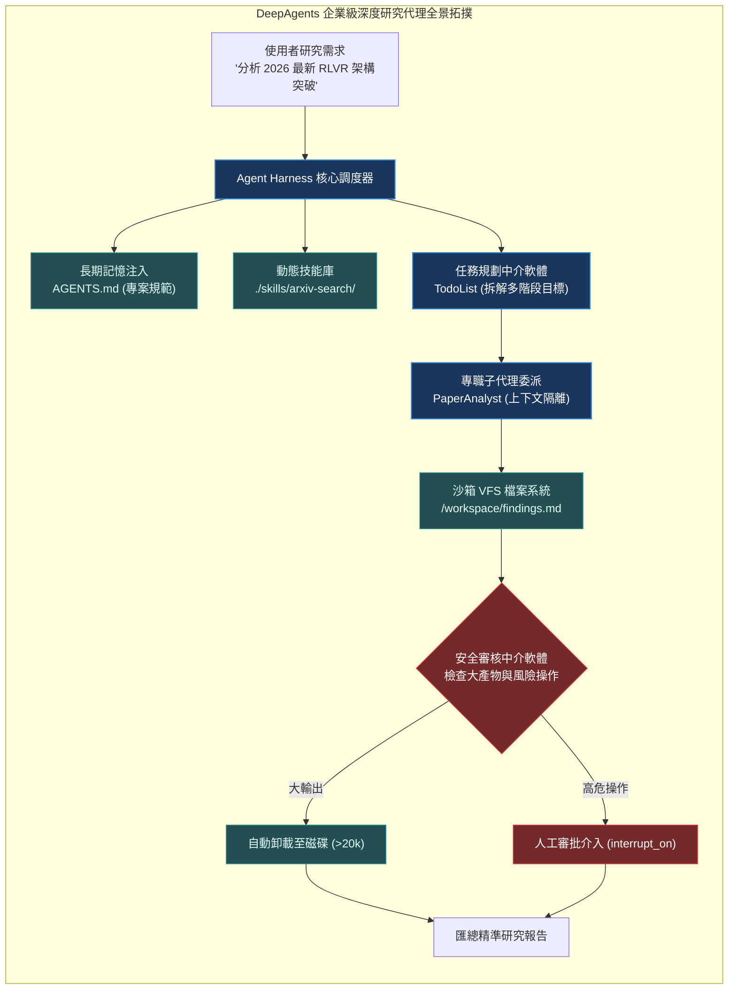

# Chapter 9: 整合應用 (Putting It Together)

> *「優秀的系統架構不是零散技術的堆疊，而是將執行框架、子代理、記憶與安全防護編排為一場嚴密的交響樂。」*

---

## 核心心智模型：交響樂團總指揮

想像一場大型交響樂演出：
- **樂譜（AGENTS.md）**：全體演奏者必須恪守的曲調規範與節奏。
- **指揮家（主代理）**：手握總譜與任務清單（`write_todos`），掌控整體節奏。
- **首席小提琴手與管樂手（宣告式子代理）**：各自精通特定領域，依指揮指示精確獨奏。
- **樂器維護師與調音師（中介軟體）**：在後台默默確保音色純淨、濾除雜音（自動卸載與安全防護）。
- **榮譽觀眾席（人工介入 HITL）**：在曲目高潮或換幕時給予審批與確認。

在本章中，我們將前八章拆解的四大支柱整合成一個具備企業級強度的**端到端深度研究代理（Deep Research Agent）**。



---

## 9.1 端到端架構規格定義

該研究代理具備以下生產級規格：
1. **多階層任務拆解**：收到題目後，先呼叫 `write_todos` 建立清晰的調研計畫。
2. **上下文隔離檢索**：呼叫 `paper_analyst` 子代理檢索並讀取多篇論文，主對話視窗永遠保持乾淨。
3. **檔案持久化產出**：所有調研表格與論文矩陣均寫入 `/workspace/research_report.md`。
4. **人工終審防線**：在將最終成果發布至外部系統或發送郵件前，觸發 `interrupt_on` 待人工核准。

---

## 9.2 完整組裝代碼

```python
from deepagents import create_deep_agent
from deepagents.backends import CompositeBackend, FilesystemBackend, StateBackend
from deepagents.permissions import FilesystemPermission
from langchain.agents.middleware import wrap_tool_call

# 1. 配置沙箱 VFS 與權限
backend = CompositeBackend(
    default=StateBackend(),
    mounts={"/workspace": FilesystemBackend(root_dir="./sandbox_research")}
)

permissions = [
    FilesystemPermission(path="/workspace", read=True, write=True),
    FilesystemPermission(path="/workspace/.git*", read=False, write=False),
]

# 2. 定義論文分析專職子代理
paper_analyst = {
    "name": "paper_analyst",
    "description": "負責下載、解析 arXiv 論文並提取實驗數據的專職子代理",
    "system_prompt": "你是一名精通機器學習論文分析的資深學者。請精煉關鍵貢獻並提取量化指標。",
    "tools": [fetch_arxiv_paper, extract_tables],
    "model": "anthropic:claude-sonnet-4-6",
}

# 3. 組裝頂層 Agent
agent = create_deep_agent(
    model="anthropic:claude-sonnet-4-6",
    system_prompt="你是首席 AI 研究總監。請調度子代理深入調查題目並撰寫 publication-grade 報告。",
    memory=["./AGENTS.md"],
    skills=["./skills/"],
    backend=backend,
    permissions=permissions,
    subagents=[paper_analyst],
    interrupt_on={"publish_report": True},
    checkpointer=disk_checkpointer,
)
```

---

## 9.3 執行驗證與全鏈路遙測

啟動任務時，觀察輸出日誌中的全生命週期事件：
- `[TodoList] Initialized 4 pending tasks`
- `[SubAgent] Spawning paper_analyst for arXiv:2501.12948`
- `[VFS] Written 14,200 bytes to /workspace/findings.md`
- `[HITL] Interrupted at step 'publish_report', waiting for human token...`

---

## 🤔 架構深度思辨與工業界陷阱 (Architectural Insight & Production Pitfalls)

> [!IMPORTANT]
> **Frontier Lab 核心考點 (Lead AI Agent Architect)**:
> - **陷阱與對策 (Failure Mode & Fix)**:
>   1. **長鏈路任務的級聯失敗 (Cascading Failure)**: 
>      當代理依序執行「搜尋 → 整理 → 代碼撰寫 → 測試 → 發布」5 個階段時，若第 1 階段的搜尋結果出現輕微偏差，該偏差在後續階段會被指數級放大。**在每個階段節點必須引入斷言驗收機制（中間檢查點驗證），不合格立即就地反思重試，嚴禁帶著未驗證假設進入下一階段**。
>   2. **沙箱檔案洩漏與競態覆寫**: 
>      兩個並行子代理同時寫入同一個 `/workspace/output.txt`，導致內容交錯損毀。**為每個子代理分配專屬子目錄 `/workspace/tasks/{task_id}/`，並由主代理負責最終合併**。
> - **核心技術思辨 (Technical Deep Dive)**:
>   *Q: 在生產架構中，如何評估一個複雜 Multi-Agent 系統是否已經具備「生產就緒（Production-Ready）」資格？*  
>   *A: 必須滿足四維硬性指標：1. 可靠性：在標準測試集上的 pass@1 穩定性超過 85%，且無委派死鎖；2. 安全性：100% 阻斷路徑穿透與注入攻擊，高風險操作具備 HITL 攔截保證；3. 可觀測性：所有 Tool 呼叫、狀態流轉與 Token 消耗均掛載 OpenTelemetry 追蹤；4. 成本延遲確定性：具備超長 Context 自動卸載與 Prompt Caching，平均單次長任務延遲與花費落在嚴格預算天花板內。*

---

## 下一步

→ 進入 [Chapter 10: 中介軟體深入探討 (Middleware Deep Dive)](./10-middleware-deep-dive.md)，掌握進階非同步事件管線、`jump_to` 狀態圖動態跳轉與底層 Command 變異。
