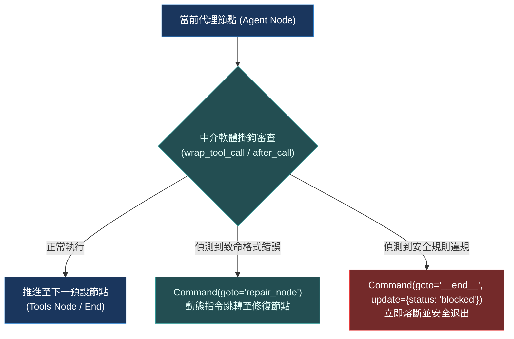

# Chapter 10: 中介軟體深入探討 (Middleware Deep Dive)

> *「真正的架構大師不滿足於黑盒子包裹；掌控執行圖的指令跳轉與狀態變異，才能駕馭最高難度的控制流。」*

---

## 核心心智模型：可程式化路由器與指令跳轉

想像一個軟體定義網路（SDN）的封包路由器：它不僅能檢查資料封包，還能根據網路擁塞動態重寫路由表、甚至將惡意封包直接轉發至蜜罐（Honeypot）隔離區。

Deep Agents 的進階中介軟體正是這樣的**可程式化路由器**：
- **編譯期包裹（Compile-time Wrapping）**：中介軟體不是鬆散的外掛匯流排，而是在 LangGraph 編譯時直接內嵌進節點邊界。
- **動態指令跳轉（`jump_to`）**：當偵測到工具呼叫嚴重偏離或執行致命錯誤時，中介軟體可以直接改寫 LangGraph 的跳轉目標，例如強行切換至 `remedy_node`（急救節點）或直接中斷。
- **Command 狀態變異**：透過返回 `Command(update={...}, goto="...")`，中介軟體能原子化修改全域圖狀態並重定向執行路徑。



---

## 10.1 中介軟體三層架構剖析

Deep Agents 的中介軟體運作在三個截然不同的抽象層：

| 層級 | 攔截目標 | 操作對象 | 典型應用 |
|---|---|---|---|
| **Layer 1: 工具層 (Tool Layer)** | 單一工具呼叫 | `ToolCall` 引數與回傳值 | 參數驗證、快取命中、模擬回傳、大結果卸載 |
| **Layer 2: 步驟層 (Step Layer)** | 單一圖節點推進 | `Messages` 列表與局部 State | 動態提示詞注入、輸出合規過濾、Token 監控 |
| **Layer 3: 圖拓撲層 (Graph Layer)** | 節點間跳轉與狀態變異 | `Command` 物件與跳轉目標 | `jump_to` 流程重定向、非同步多路分發、中斷恢復 |

---

## 10.2 `jump_to` 語意與動態流程重定向

當工具執行失敗超過 3 次時，繼續讓模型嘗試只會徒增 Token 消耗。中介軟體可主動介入：

```python
from langgraph.types import Command
from langchain.agents.middleware import AgentMiddleware

class CircuitBreakerMiddleware(AgentMiddleware):
    name = "CircuitBreakerMiddleware"

    def wrap_tool_call(self, request, handler):
        error_count = request.state.get("consecutive_errors", 0)
        
        try:
            result = handler(request)
            return result
        except Exception as e:
            error_count += 1
            if error_count >= 3:
                # 超過閾值：重定向至人工介入節點，停止盲目重試
                return Command(
                    goto="human_intervention",
                    update={"error_summary": f"連續 3 次工具執行失敗：{str(e)}"}
                )
            raise e
```

---

## 10.3 非同步管線與事件優先級調度

在處理串流或背景子代理時，中介軟體必須是非同步友好的（Async-Native）：
- 實作 `async def awrap_tool_call` 避免阻塞主事件迴圈。
- 使用非同步信號量（`asyncio.Semaphore`）限制外部 API 併發度。

---

## 🤔 架構深度思辨與工業界陷阱 (Architectural Insight & Production Pitfalls)

> [!IMPORTANT]
> **Frontier Lab 核心考點 (LangGraph / Agent Internals MLE)**:
> - **陷阱與對策 (Failure Mode & Fix)**:
>   1. **狀態合併衝突 (State Reduction Collision)**: 
>      當多個中介軟體或並發子節點同時向 `state["messages"]` 寫入內容時，若未正確配置 Reducer 函數（例如預設的 `add_messages`），會發生訊息覆蓋或 ID 重複拋錯。**必須確保所有自訂狀態欄位均定義明確的聚合語意（如 `Annotated[list, operator.add]`）**。
>   2. **無限跳轉循環 (Infinite Jump Loop)**: 
>      `jump_to` 跳轉至修復節點，修復節點再次觸發中介軟體並再次跳轉，導致呼叫棧溢出。**在中介軟體中必須維護單次請求的 Hop Count（最大跳轉跳數限制，通常 $\le 3$）**。
> - **核心技術思辨 (Technical Deep Dive)**:
>   *Q: 為什麼中介軟體在編譯期（Compile-Time）注入比執行期動態外掛（Runtime Plugins）效能高出數量級且更加安全？*  
>   *A: 編譯期注入使得 LangGraph 能夠在應用程式啟動時對整個狀態圖進行靜態拓撲分析與循環依賴檢測，提前消除潛在死鎖；此外，編譯後的呼叫鏈是直接的 Python 函式呼叫，無需在執行期維護動態事件訂閱發布佇列，延遲更低且能提供 100% 確定性的除錯堆疊追蹤。*

---

## 下一步

→ 進入 [Chapter 11: 軌跡評估 (Trajectory Evaluation)](./11-trajectory-evaluation.md)，踏入評估體系的第一站：學習黑盒子飛行記錄儀與確定性軌跡比對。
