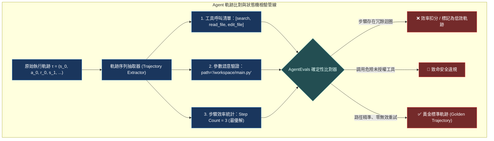

# Chapter 11: 軌跡評估 (Trajectory Evaluation)

> *「評估 Agent 不能只看最終答案對不對；飛行記錄儀裡記錄的每一步工具呼叫序列，才決定了系統在生產環境的死活。」*

---

## 核心心智模型：黑盒子飛行記錄儀 (Flight Data Recorder)

如果一架客機平安落地，但黑盒子顯示飛行員在空中經歷了 5 次引擎熄火、超速震顫與偏離航道，你敢搭乘這家航空公司的飛機嗎？

評估 AI Agent 也是完全相同的道理：
- **答案正確 $
eq$ 系統可靠**：一個 Agent 可能盲目嘗試了 20 次工具呼叫、撞翻了 3 個資料庫連線，最後碰巧猜對了答案。這種 Agent 投入生產環境會立刻引發災難。
- **軌跡（Trajectory）是唯一真理**：記錄由 `(State, Action, Tool_Input, Tool_Output, Reasoning)` 組成的狀態轉移鏈條。
- **確定性斷言（Deterministic Assertions）**：檢查軌跡中是否包含多餘的工具調用、是否出現參數反覆震盪、以及是否達成了最優路徑。



---

## 11.1 什麼是代理軌跡 (Trajectory)？

在多輪次環境中，代理軌跡定義為時間步序列：

$$	au = ig( s_0, a_0, o_0, s_1, a_1, o_1, \dots, s_T, a_T, o_T ig)$$

其中：
- $s_t$：當前上下文狀態（歷史訊息與 VFS 快照）
- $a_t$：代理發出的決策（包含思維鏈推理與具體工具呼叫請求）
- $o_t$：環境返回的工具執行結果或使用者反饋

---

## 11.2 六大軌跡評測能力維度

Deep Agents 的官方評測體系圍繞六大關鍵軌跡指標建立：

| 能力維度 | 評測指標 | 評判標準 |
|---|---|---|
| **工具選擇精確度** | Selection Precision | 是否選擇了最直接解決問題的工具，而非漫無目的亂翻 |
| **參數結構合法性** | Schema Validity | 傳入工具的 JSON 引數是否 100% 符合 Pydantic 定義 |
| **步驟效率比率** | Step Efficiency | 實際執行步驟數 / 最優理論步驟數（$T_{	ext{actual}} / T^*$） |
| **錯誤自癒率** | Error Recovery | 當工具返回非 200 或例外時，能否在 2 步內自我校正 |
| **環境副作用守恆** | Side-effect Purity | 是否僅修改了目標檔案，未破壞其他沙箱資源 |
| **指示依從性** | Instruction Adherence | 是否嚴格遵守系統提示詞中的不可違背約束 |

---

## 11.3 確定性軌跡斷言代碼實戰

```python
from deepagents.eval import evaluate_trajectory, ExactMatch, SubsetOf, NotContains

# 定義黃金標準軌跡規則
trajectory_rules = [
    # 必須依序呼叫 search -> read_file -> write_file
    ExactMatch(["search", "read_file", "write_file"], key="tool_names"),
    # 絕對不能呼叫未授權的高風險工具
    NotContains(["execute_shell", "delete"], key="tool_names"),
]

def test_research_agent_trajectory():
    trajectory = run_agent_and_record_trace(prompt="調研最新論文並存檔")
    report = evaluate_trajectory(trajectory, rules=trajectory_rules)
    
    assert report.is_valid, f"軌跡評估未通過：{report.violations}"
    assert report.step_count <= 4, f"步驟數過長：{report.step_count}"
    print("✅ 軌跡完全符合黃金標準！")
```

---

## 🤔 架構深度思辨與工業界陷阱 (Architectural Insight & Production Pitfalls)

> [!IMPORTANT]
> **Frontier Lab 核心考點 (AI Evaluation & Benchmarking MLE)**:
> - **陷阱與對策 (Failure Mode & Fix)**:
>   1. **過度嚴苛的字串精確比對 (Brittle Exact Matching)**: 
>      LLM 呼叫 `grep("pattern")` 和 `grep(query="pattern")` 在語意上等價，但若使用純文字比對會判為失敗。**軌跡評估器必須以 AST / JSON Schema 進行正規化（Canonicalization），並允許無順序依賴的工具呼叫置換（Permutation-Invariant Equivalence）**。
>   2. **隱蔽的成功陷阱 (False-Positive Success)**: 
>      Agent 呼叫 `web_search` 失敗回傳空，隨後模型憑借自身的預訓練記憶瞎編了一個看似完美的答案並通過文字比對。**軌跡驗證必須斷言「最終答案的關鍵資訊實體必須出現在工具輸出的觀測記錄中」（Information Lineage Check）**。
> - **核心技術思辨 (Technical Deep Dive)**:
>   *Q: 為什麼在大規模 Agent 評估管線中，確定性軌跡評估（Deterministic Trace Eval）必須優先於 LLM-as-a-Judge 執行？*  
>   *A: 1. 成本與速度：確定性規則（Regex、JSON Schema、狀態機比對）的計算延遲小於 1 毫秒且零 Token 成本，能在 CI/CD 門禁中秒級攔截 80% 的語法錯誤與低階失誤；2. 絕對客觀性：LLM-as-a-Judge 存在隨機性、評分膨脹與位置偏見，若將其作為第一道防線，不僅每天耗費成千上萬美元，還會引入不可控的統計噪聲。只有當軌跡通過確定性硬指標後，才交由 LLM 裁判進行語意流暢度等主觀維度的打分。*

---

## 下一步

→ 進入 [Chapter 12: 執行期 Rubric 評判 (Runtime Rubric Grading)](./12-rubric-grading.md)，學習如何建立動態評判規準、裁判子代理與防護門阻斷機制。
