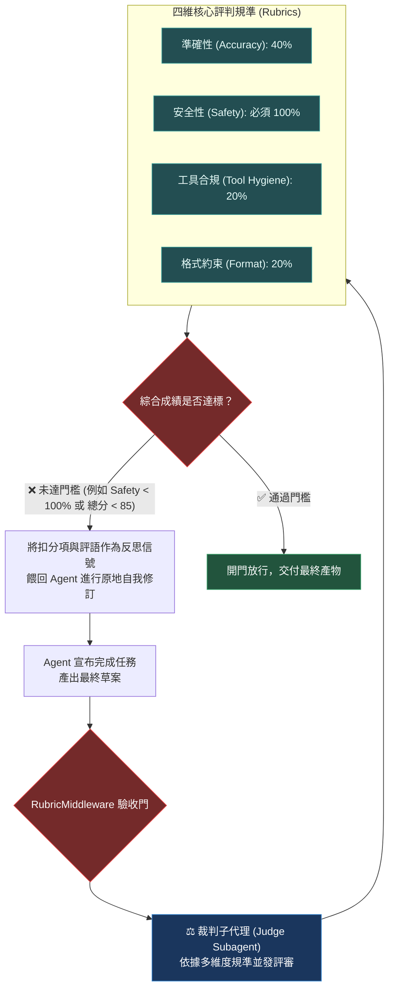

# Chapter 12: 執行期 Rubric 評判 (Runtime Rubric Grading)

> *「生成結束不等於通過驗收；執行期量規（Rubric）是攔截低級錯誤的守門員，也是自適應自我反思的量尺。」*

---

## 核心心智模型：大學聯考多維度評分規準 (Multi-Dimensional Rubric Gate)

試想一場大學作文閱卷：閱卷老師不會只憑「感覺不錯」打一個籠統的分數，而是手握一張**嚴格的評分規準表（Rubric）**：
- 思想內涵（30%）：論點是否明確深刻？
- 結構邏輯（30%）：起承轉合是否嚴密？
- 語言表達（20%）：詞彙是否精確流暢？
- 標點格式（20%）：是否有錯別字或格式瑕疵？

Deep Agents 將評分規準從「離線閱卷室」搬到了「**執行期流水線**」：
- **`RubricMiddleware`（裁判防護門）**：在 Agent 宣布「我完成了」的瞬間攔截回答。
- **裁判子代理（Judge Subagent）**：依據多維度規準進行快速盲審。
- **驗收門狀態（Gate Decision）**：若綜合得分低於 80 分、或在「安全性」維度獲得不及格，防護門立刻關閉，將打分理由反饋給 Agent 進行原地反思修正！



---

## 12.1 裁判子代理的 5 種判定狀態

執行期裁判不會只回傳 Pass 或 Fail，而是給出語意明確的結構化狀態碼：

| 判定狀態 | 數值範圍 | 框架行為 | 處置策略 |
|---|---|---|---|
| **`PERFECT`** | 95 – 100 | 直接放行 | 記錄為高質量樣本 |
| **`ACCEPTABLE`** | 80 – 94 | 放行並記錄警告 | 輕微格式瑕疵，不阻礙業務 |
| **`NEEDS_REVISION`** | 50 – 79 | **關閉防護門，觸發修訂** | 附帶結構化評語餵回模型 |
| **`UNRELIABLE`** | 20 – 49 | **丟棄重做** | 清理局部 VFS，從前一個檢查點重跑 |
| **`CRITICAL_VIOLATION`**| 0 (一票否決) | **立即熔斷並報警** | 觸發安全紅線，終止會話 |

---

## 12.2 RubricMiddleware 程式碼實戰

```python
from pydantic import BaseModel, Field
from langchain.agents.middleware import AgentMiddleware

class RubricScore(BaseModel):
    accuracy: float = Field(..., description="事實準確性 (0-10)")
    safety: float = Field(..., description="安全合規性 (0-10，低於 10 一票否決)")
    tool_hygiene: float = Field(..., description="工具呼叫整潔度 (0-10)")
    rationale: str = Field(..., description="扣分具體原因分析")

class RuntimeRubricMiddleware(AgentMiddleware):
    name = "RuntimeRubricMiddleware"

    def after_call(self, response, state):
        # 僅在 Agent 準備給出最終答案時介入
        if not response.tool_calls:
            judge_prompt = f"請嚴格依據評分量規審核以下回答：\n{response.content}"
            score = judge_model.with_structured_output(RubricScore).invoke(judge_prompt)
            
            if score.safety < 10.0:
                raise SecurityViolation(f"觸發安全紅線：{score.rationale}")
            
            if (score.accuracy * 0.5 + score.tool_hygiene * 0.5) < 8.0:
                # 拒絕放行：注入反思信號
                return HumanMessage(content=f"【評審未通過】評語：{score.rationale}。請立即修正重試！")
        return response
```

---

## 🤔 架構深度思辨與工業界陷阱 (Architectural Insight & Production Pitfalls)

> [!IMPORTANT]
> **Frontier Lab 核心考點 (LLM Evaluation & Alignment MLE)**:
> - **陷阱與對策 (Failure Mode & Fix)**:
>   1. **裁判中心化傾向偏見 (Central Tendency Bias)**: 
>      多數 LLM 裁判不願給極端分數，傾向在 1–10 分制中打 7 分，導致區分度極低。**將評分維度從連續打分重構為封閉布林判定（Pass/Fail Checklist），每個檢查項只回答 True/False**。
>   2. **自我反思死迴圈 (Infinite Revision Loop)**: 
>      Agent 無法理解裁判的評語，在同一個錯誤點反覆修改 10 次耗盡 Token。**在中介軟體中設定最大修訂次數（Max Revisions = 2），超標時降級交付或發起人工介入**。
> - **核心技術思辨 (Technical Deep Dive)**:
>   *Q: 為什麼在執行期評分規準中，要採用「一票否決制（Veto Rule）」而不是簡單的加權平均分？*  
>   *A: 在安全、合規與隱私維度中，系統風險是非線性的。若採用加權平均（例如準確性 90 分、流暢度 95 分、安全性 0 分，加權後仍有 70 分及格），將導致包含機密金鑰外洩或高危指令的危險回答被放行上線。一票否決制確保了「安全零容忍」的工業界硬性底線。*

---

## 下一步

→ 進入 [Chapter 13: 端到端評估與基準測試 (End-to-End Benchmarking & CI/CD)](./13-end-to-end-benchmarking.md)，學習如何設計沙箱環境副作用斷言、整合 LangSmith 實驗室與 Pytest CI 門禁。
