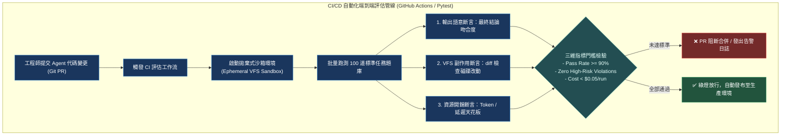

# Chapter 13: 端到端評估與基準測試 (End-to-End Benchmarking & CI/CD)

> *「軟體工程如果沒有單元測試寸步難行；Agent 工程若沒有端到端沙箱基準與副作用斷言，就是把定時炸彈部署上線。」*

---

## 核心心智模型：汽車實體碰撞測試 (Crash Test & Sandbox Assertions)

在汽車出廠前，工程師不能只在電腦上模擬氣囊充氣，必須把整輛真車推上軌道進行**實體碰撞測試**：
- 假人（模擬環境）是否受到致命衝擊？
- 車體結構變形是否符合預期？
- 煞車痕跡與撞擊散落物（環境副作用）是否與計算吻合？

端到端 Agent 基準測試（E2E Benchmarking）就是 AI 系統的碰撞試驗場：
- **環境副作用斷言（Side-Effect Assertions）**：不只檢查 LLM 嘴上說了什麼，更要直接檢查磁碟上的檔案是否被正確修改、資料庫記錄是否一致。
- **沙箱絕對隔離**：每一次測試執行在一個完全獨立的拋棄式 Docker / VFS 沙箱中，嚴防測試間狀態殘留。
- **CI/CD 自動化阻斷門檻**：PR 合併前必須自動跑過 100 道標準 Benchmark，成功率（Pass@1）未達 90% 嚴禁上線。



---

## 13.1 環境副作用與狀態斷言全景

對 Agent 而言，「說了什麼」是廉價的，「做了什麼」才是關鍵：

| 斷言類型 | 檢驗標的 | 斷言實作方式 | 典型反面教材 |
|---|---|---|---|
| **檔案系統副作用** | VFS 檔案存在、內容雜湊值、結構語法 | `assert hash(vfs.read('/file')) == EXPECTED` | 模型說「已修復 Bug」，但檔案根本沒動 |
| **資料庫副作用** | 欄位資料變更、關聯鍵約束 | `SELECT COUNT(*) FROM orders WHERE status='paid'` | 模型印出扣款成功，但資料庫沒寫入訂單 |
| **API 請求副作用** | 外部 HTTP 呼叫次數與 Payload | WireMock / Responses 攔截驗證 | 模型反覆呼叫了 50 次付費第三方 API |
| **狀態殘留隔離** | 測試結束後沙箱清理狀態 | 檢驗目錄無殘留臨時檔案 | 上一個測試建立的檔案影響了下一個測試 |

---

## 13.2 Pytest + LangSmith 整合測試代碼

```python
import pytest
from deepagents import create_deep_agent
from deepagents.backends import StateBackend

@pytest.fixture
def clean_sandbox():
    """為每個測試案例提供獨立無污染的 VFS 沙箱。"""
    vfs = StateBackend()
    vfs.write("/workspace/input.py", "def add(a, b): return a - b  # Buggy")
    return vfs

def test_agent_bug_fixing_e2e(clean_sandbox):
    agent = create_deep_agent(
        model="anthropic:claude-sonnet-4-6",
        backend=clean_sandbox,
    )
    
    # 執行任務
    response = agent.invoke({"messages": [("user", "修復 /workspace/input.py 中的加法 Bug")]})
    
    # 1. 斷言文字回覆
    assert "修復完成" in response["messages"][-1].content
    
    # 2. 斷言磁碟真實副作用 (Ground-Truth Side Effect)
    fixed_code = clean_sandbox.read("/workspace/input.py")
    assert "return a + b" in fixed_code, "檔案內容未真正被正確修復！"
    
    # 3. 執行單元測試驗證修復後的程式碼
    exec_scope = {}
    exec(fixed_code, exec_scope)
    assert exec_scope["add"](2, 3) == 5
    print("✅ 端到端實體副作用驗證 100% 通過！")
```

---

## 🤔 架構深度思辨與工業界陷阱 (Architectural Insight & Production Pitfalls)

> [!IMPORTANT]
> **Frontier Lab 核心考點 (SWE-Bench / Production Agent Benchmarking MLE)**:
> - **陷阱與對策 (Failure Mode & Fix)**:
>   1. **測試洩漏與環境交叉污染 (Flaky Cross-Contamination)**: 
>      測試案例 A 在共享環境中寫入 `/tmp/cache.dat`，導致測試案例 B 意外命中快取而產生假陽性通過。**必須使用沙箱工廠模式（Sandbox Factory），每個測試案例在容器啟動時分配專屬 UUID 與掛載空間，測試完成後立即強制 GC**。
>   2. **外部 Mock 偏離真機行為 (Mock Drift)**: 
>      使用 Mock 物件模擬 GitHub API，但真實 API 升級了版本導致生產環境故障。**採用 Contract Testing（契約測試），每週在隔離夜間任務中針對外部真實 API 執行一次全量真機驗證**。
> - **核心技術思辨 (Technical Deep Dive)**:
>   *Q: 為什麼在評估代碼修復類 Agent（如 SWE-Bench）時，只比對 `git diff` 是危險的，必須執行單元測試？*  
>   *A: 相同的功能實現可以有無窮多種寫法（不同的變數命名、邏輯分支重構、輔助函式封裝）。若僅與人類工程師的 Gold Patch 比對 diff，會誤殺大量創新且正確的解法；唯有直接在沙箱中執行編譯與 `pytest` 回歸套件，才能無偏判定代碼是否具備真值功能正確性。*

---

## 下一步

→ 進入 [Chapter 14: 即時事件串流與可觀測性 (Event Streaming & Observability)](./14-event-streaming.md)，學習如何透過 Typed Projections 與 Server-Sent Events (SSE) 打造極致流暢的實時遙測體驗。
