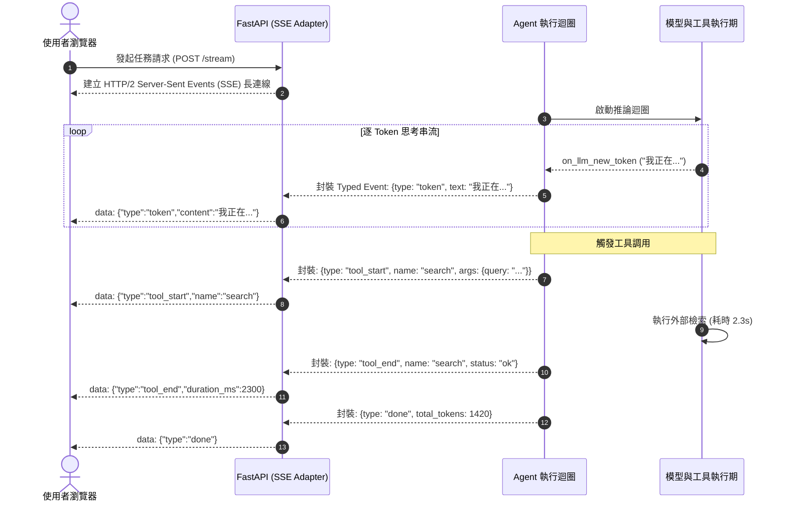

# Chapter 14: 即時事件串流與可觀測性 (Event Streaming & Observability)

> *「使用者無法忍受盯著旋轉加載符號等待 30 秒；流暢的事件串流不僅是 UI 體驗，更是對 Agent 內心世界的即時遙測。」*

---

## 核心心智模型：即時心電圖追蹤 (Real-time ECG & Typed Streaming Projections)

在加護病房中，醫生不能等病人休克了才去查看半小時前列印的厚厚報告；螢幕上的心電圖儀（ECG）每毫秒都在繪製微小電波與脈搏。

在生產環境中，一個 Agent 處理複雜任務可能耗時 10 到 60 秒。如果使用傳統的同步阻塞呼叫 `invoke()`：
- 使用者面臨漫長死寂的白畫面。
- 前端無法知道 Agent 是在思考、是在爬網頁、還是早已崩潰。
- 無法及時中斷失控的瘋狂輸出。

**事件串流架構（Streaming Architecture）** 將執行期變為即時心電圖：
- **Token 級文字推流**：思考與字元逐字呈現（TTFT 首字延遲降至 500ms 內）。
- **工具生命週期事件（Tool Lifecycle Spans）**：`tool_start`、`tool_progress`、`tool_end` 清晰可見。
- **Typed Projections**：將後端底層訊息結構安全過濾，僅投影出前端關注的視圖模型。



---

## 14.1 `invoke()` vs. `stream()` 體驗與架構對比

| 特性維度 | 同步阻塞式 `invoke()` | 即時事件串流 `stream()` |
|---|---|---|
| **首字延遲 (TTFT)** | 等同整體任務耗時（10s – 60s） | **毫秒級（< 800ms）** |
| **可觀測透明度** | 完全黑盒子，中間狀態不可知 | 工具調用、思考鏈即時可見 |
| **網路中斷容錯** | 連線斷開直接丟失所有結果 | 支援客戶端依據 Event ID 斷點續傳 |
| **使用者取消能力** | 難以中途打斷，浪費後續 Token | 關閉連線瞬間中斷後台執行 |

---

## 14.2 Typed Projection API 架構設計

千萬不要直接將 LangGraph 的原始內部狀態直接 dump 給前端！這會洩漏敏感中繼資料或導致前端 JSON 解析崩潰。

生產環境採用 **Typed Projections** 投影轉換器：

```python
from fastapi import FastAPI
from fastapi.responses import StreamingResponse
import json

app = FastAPI()

async def event_generator(agent, prompt, thread_id):
    config = {"configurable": {"thread_id": thread_id}}
    
    # 監聽 LangGraph 粒度事件
    async for event in agent.astream_events({"messages": [("user", prompt)]}, config, version="v2"):
        kind = event["event"]
        
        # 1. 投影模型文字 Token
        if kind == "on_chat_model_stream":
            content = event["data"]["chunk"].content
            if content:
                yield f"data: {json.dumps({'type': 'token', 'text': content})}\n\n"
                
        # 2. 投影工具啟動
        elif kind == "on_tool_start":
            yield f"data: {json.dumps({'type': 'tool_start', 'tool': event['name'], 'inputs': event['data'].get('input')})}\n\n"
            
        # 3. 投影工具結束
        elif kind == "on_tool_end":
            yield f"data: {json.dumps({'type': 'tool_end', 'tool': event['name']})}\n\n"

@app.post("/api/agent/chat")
async def chat_stream(prompt: str, thread_id: str):
    return StreamingResponse(
        event_generator(agent, prompt, thread_id),
        media_type="text/event-stream"
    )
```

---

## 🤔 架構深度思辨與工業界陷阱 (Architectural Insight & Production Pitfalls)

> [!IMPORTANT]
> **Frontier Lab 核心考點 (High-Throughput GenAI Systems MLE)**:
> - **陷阱與對策 (Failure Mode & Fix)**:
>   1. **背壓失衡導致記憶體洩漏 (Backpressure Overflow)**: 
>      模型每秒產生 100 個 token，而客戶端行動裝置網路慢，導致伺服器緩衝區堆積數十萬個未發送的 SSE 事件引發 OOM。**必須在非同步佇列中實施背壓機制（Backpressure Throttle），當佇列滿載時主動暫停模型生成**。
>   2. **多模態大產物阻塞文字串流**: 
>      工具產出了一個 10MB 的截圖，若直接放進 SSE JSON 中推送，會造成前端介面凍結。**大二進位產物必須非同步上傳 CDN，SSE 僅推送圖片 URL**。
> - **核心技術思辨 (Technical Deep Dive)**:
>   *Q: 為什麼在生產環境中，Server-Sent Events (SSE) 通常比雙向 WebSocket 更適合作為 Agent 的串流協議？*  
>   *A: 1. 協議簡潔性：Agent 輸出本質上是單向的長串流（伺服器向客戶端推流），SSE 完全基於標準 HTTP/1.1 與 HTTP/2，無需維護複雜的 WebSocket 雙向握手；2. 基礎設施親和力：企業防火牆、Nginx 負載均衡器與 Cloudflare CDN 對 SSE 支援極佳，天生支援原生 HTTP 標頭認證、自動重連（Auto-reconnect）與 Event ID 追蹤，而 WebSocket 容易遭遇長連線被中間代理掐斷的問題。*

---

## 下一步

→ 進入 [Chapter 15: 多代理故障分類學與統計評估 (MAST & Statistical Reliability)](./15-multi-agent-failure-taxonomy.md)，剖析多代理系統崩潰的 14 種致命模式與 pass@k 統計衛生學。
