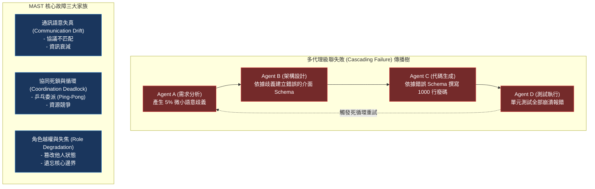

# Chapter 15: 多代理故障分類學與統計評估 (MAST & Statistical Reliability)

> *「幸福的家庭都是相似的，不幸的家庭各有各的不幸；單一 Agent 失敗通常只是幻覺，而多代理系統崩潰則會演化為一場精密的連鎖雪崩。」*

---

## 核心心智模型：流行病傳播與系統故障樹 (Epidemic Cascade & Fault Tree)

在流行病學中，一個微小病毒在人群中傳播，會因為人際接觸網被放大為席捲全城的疫情。

多代理系統（Multi-Agent System, MAS）具有完全相同的複雜系統動力學特性：
- **級聯失敗（Cascading Failure）**：Agent A 產生了 10% 的微小數值幻覺，傳給 Agent B 變成錯誤假設，再傳給 Agent C 演變為災難性代碼刪除。
- **委派死鎖（Delegation Deadlock）**：Agent A 等待 Agent B 的審查，Agent B 認為缺少背景而呼叫 Agent A，兩者陷入無限死循環。
- **MAST（Multi-Agent System Taxonomy）**：工業界定義的 14 類多代理致命失效模式。
- **可靠度指數坍縮**：若單一 Agent 可靠度為 90%，5 個串行 Agent 的整體可靠度僅為 $0.9^5 pprox 59\%$！



---

## 15.1 MAST 14 種致命失效模式全景

根據 Frontier Lab 對多代理系統的故障分類研究，最致命的失誤集中在以下三大家族：

| 故障家族 | 失效模式編號與名稱 | 現象與破壞力 |
|---|---|---|
| **協同與拓撲** | **M01: Ping-Pong Loop** | 兩代理相互反覆委派，瞬間耗盡 100 萬 Token |
| **協同與拓撲** | **M02: Split-Brain Goal** | 多個代理對頂層目標理解分裂，朝相反方向修改檔案 |
| **資訊傳遞** | **M05: Hallucination Cascade** | 上游輕微幻覺被下游視為不可置疑的事實無情放大 |
| **資訊傳遞** | **M06: Context Oblivion** | 委派過程未傳遞必要背景，下游盲目猜測 |
| **角色與控制** | **M09: Role Hijacking** | 子代理反客為主，主動接管主代理的協調權 |
| **角色與控制** | **M12: Premature Convergence**| 在未完成充分檢索前，過早終止探索並交出殘缺產物 |

---

## 15.2 統計衛生學：`pass@k` vs. `pass^k` 的巨大鴻溝

在評估多代理系統時，必須嚴格區分兩種截然不同的統計指標：

1. **獨立採樣指標 $	ext{Pass@}k$（抽樣覆蓋率）**：  
   生成 $k$ 個獨立解答，至少有 1 個正確的機率。由 Chen et al. 無偏組合公式計算：
   $$	ext{Pass@}k = 1 - rac{inom{N-c}{k}}{inom{N}{k}}$$
2. **串行管線指標 $	ext{Pass}^{\Pi}$（串聯可靠度）**：  
   多代理管線依序執行 $M$ 步，每一步的成功率為 $p_i$。整體任務成功率為乘積：
   $$	ext{Pass}^{\Pi} = \prod_{i=1}^M p_i$$
   如果 $p_i = 0.9$ 且 $M = 10$，整體成功率直接跌破 **$35\%$**！

---

## 15.3 循環委派檢測器代碼實戰

```python
from collections import Counter
from typing import List, Dict

class MASTDeadlockDetector:
    def __init__(self, max_cycle_len: int = 3, max_repeats: int = 2):
        self.call_history: List[str] = []
        self.max_cycle_len = max_cycle_len
        self.max_repeats = max_repeats

    def record_delegation(self, from_agent: str, to_agent: str) -> None:
        edge = f"{from_agent}->{to_agent}"
        self.call_history.append(edge)
        
        # 檢測是否有 Ping-Pong 循環 (A->B->A->B)
        if len(self.call_history) >= 4:
            recent_edges = self.call_history[-4:]
            if recent_edges[0] == recent_edges[2] and recent_edges[1] == recent_edges[3]:
                raise RuntimeError(f"🚨 偵測到 MAST M01 致命委派死鎖：{recent_edges}")
```

---

## 🤔 架構深度思辨與工業界陷阱 (Architectural Insight & Production Pitfalls)

> [!IMPORTANT]
> **Frontier Lab 核心考點 (Multi-Agent System Reliability MLE)**:
> - **陷阱與對策 (Failure Mode & Fix)**:
>   1. **傳話遊戲效應 (Chinese Whispers Drift)**: 
>      資訊在 4 個 Agent 之間傳遞後，關鍵限制條件（例如「必須相容 Python 3.9」）被遺忘。**嚴禁透過自然語言口口相傳！所有核心規格必須以結構化 JSON 或不可變檔案指標（File Pointer）作為不可修改的共享錨點**。
>   2. **偽高成功率的假象 (Pass@k Vanity Metric)**: 
>      團隊宣稱系統 Pass@10 達到 95%，但上線後使用者體驗極差。**在實際生產環境中，使用者只會等待一次執行（Pass@1）。若 Pass@1 低於 70%，哪怕 Pass@10 達 99% 也毫無商業價值**。
> - **核心技術思辨 (Technical Deep Dive)**:
>   *Q: 為什麼增加子代理數量（More Agents）往往不會線性提升系統表現，反而常導致效能倒退？*  
>   *A: 這是複雜系統的通信熵增定律。1. 通信開銷與雜訊：每增加一個 Agent，潛在通訊通道呈 $O(N^2)$ 增長，語意傳遞失真機率成倍上升；2. 責任分散（Diffusion of Responsibility）：多個代理容易對邊界模糊的任務相互推諉或重疊工作；3. 串行可靠度連乘懲罰：只要其中一個子代理出現幻覺，整條價值鏈瞬間中斷。工業界最佳實踐是「極小化必要架構（Minimal Viable Multi-Agent）」，絕不為了多代理而多代理。*

---

## 下一步

→ 進入 [Chapter 16: 安全紅隊與對抗性評估 (Agent Red-Teaming & Safety Evals)](./16-security-red-teaming.md)，深入提示詞注入、工具毒化防禦與雙層隔離審查架構。
